## 02 application
### autosar之前
各个模块嵌套在一起，对模块化分离都不是很友好
底层标准化
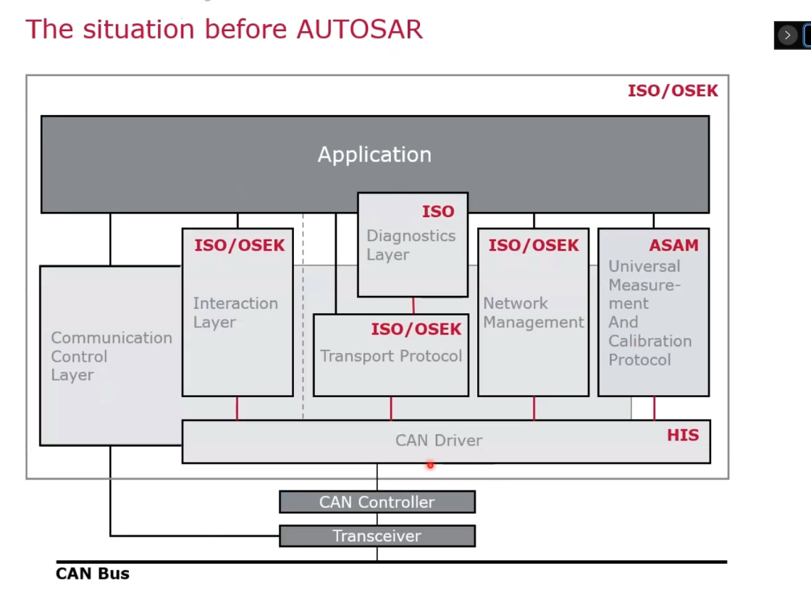
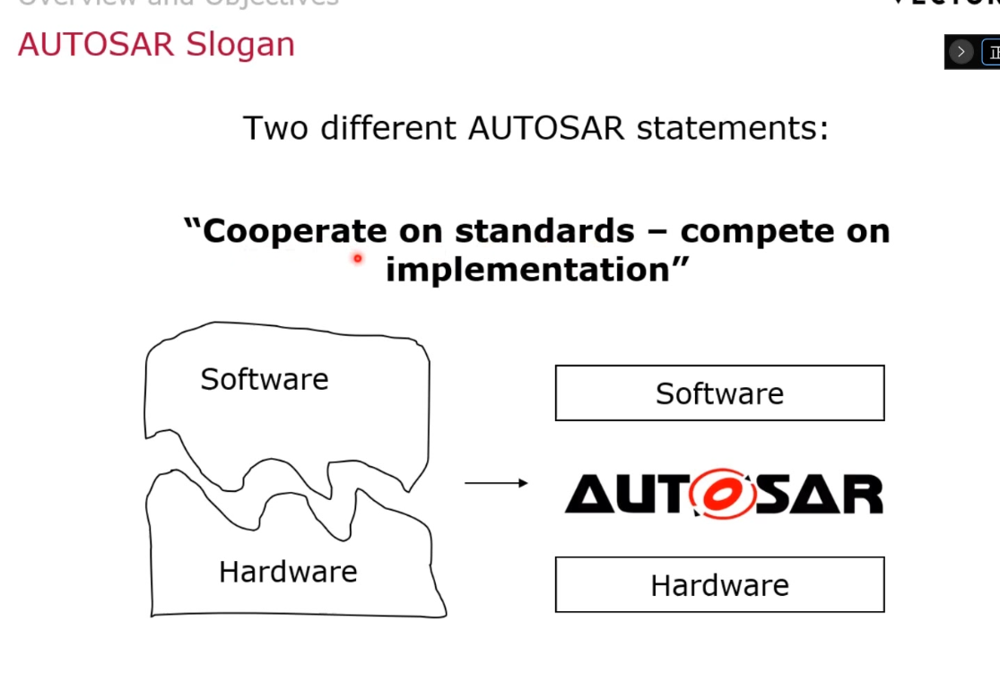
### autosar
核心标准化 arxml 方法论
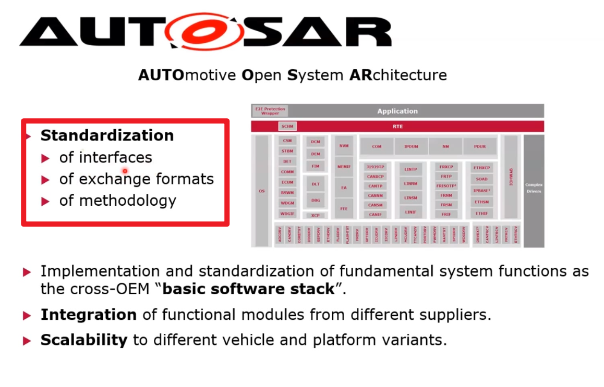
### 可复用性
> 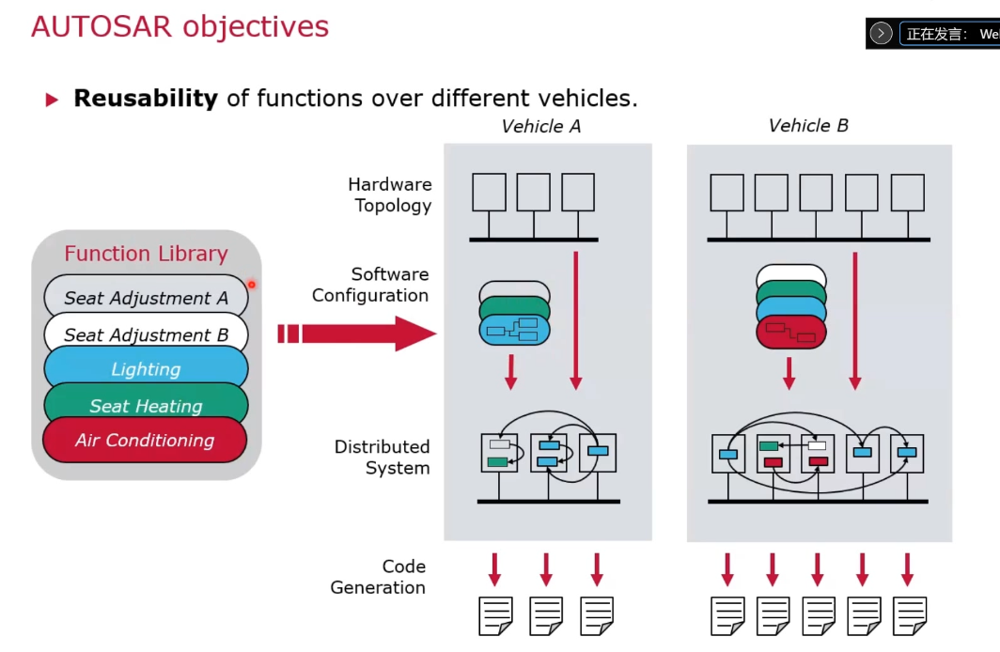

### 应用层
> 车灯示例
> 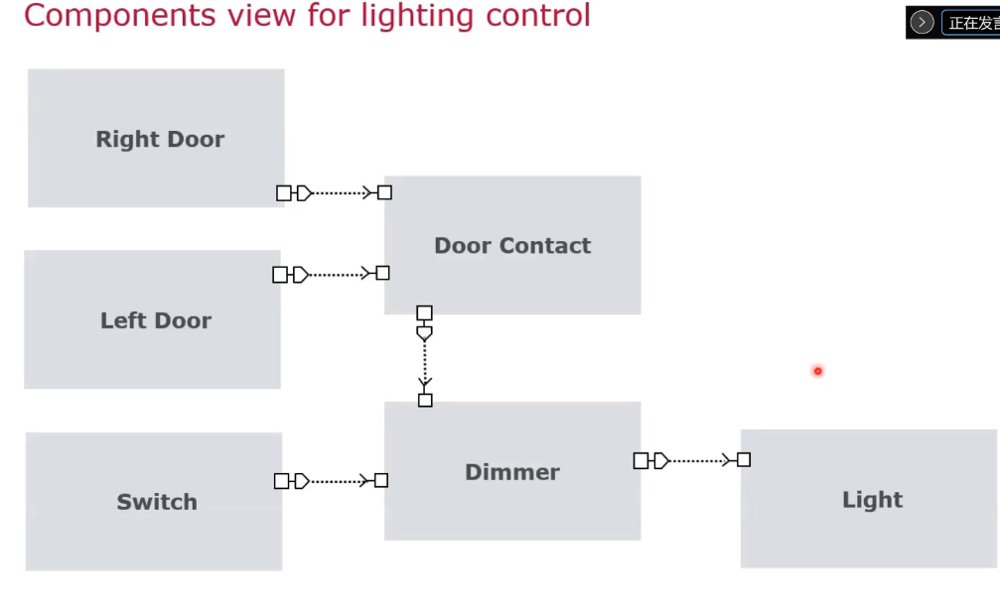
> 通信 virtual function bus 是所有port口和connector的集合
> 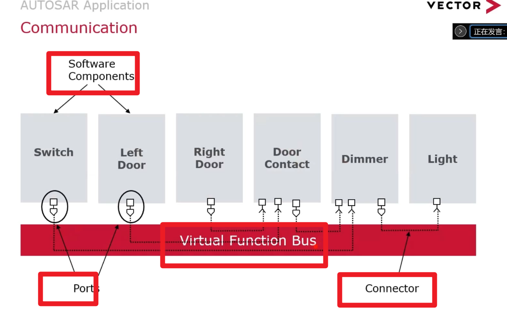
> rte 是ecu virtual function bus的代表
> 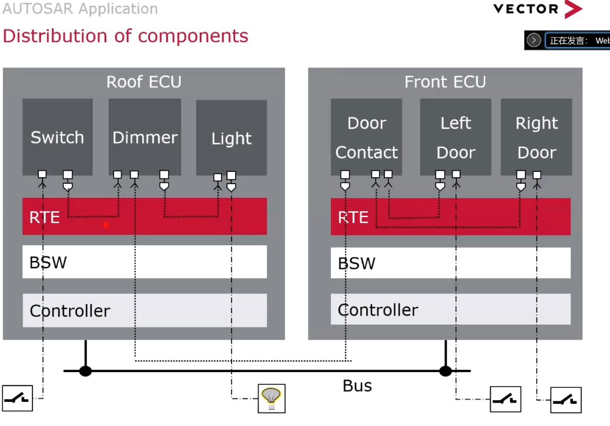

### swc的类型
> atomic component 原子类型
> 又有两种划分 application sensor/actuator
> 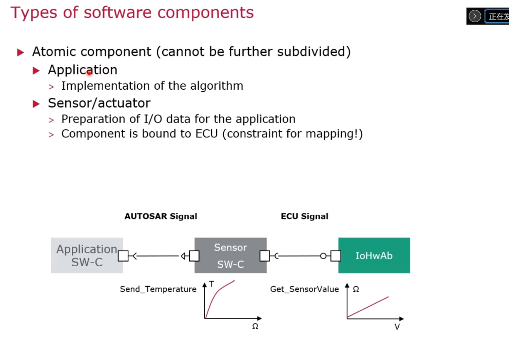
> composition 部分， 把原子类型组合起来
> 逻辑架构 复合类型 不会生成代码
> 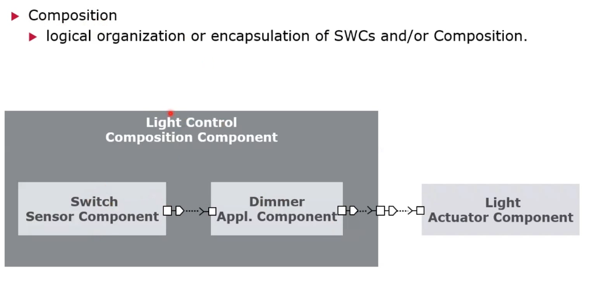

### port 类型
> RS CS
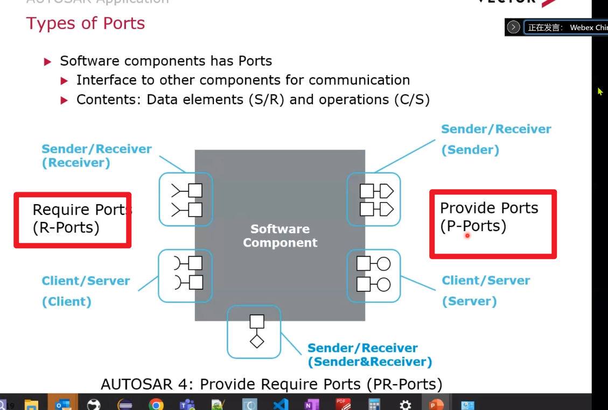
> Sender Receiver 类型 主要进行数据的传输
> rte_read_xxx
> 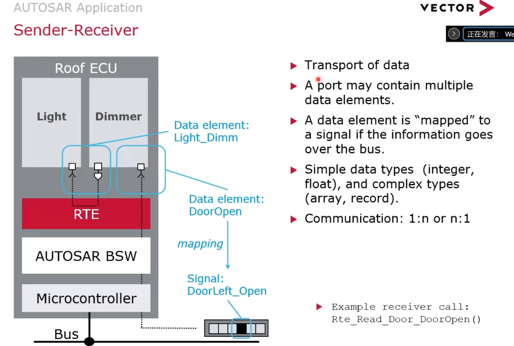
> CS client server类型
> 不是通过swc决定的，通过接口决定
> 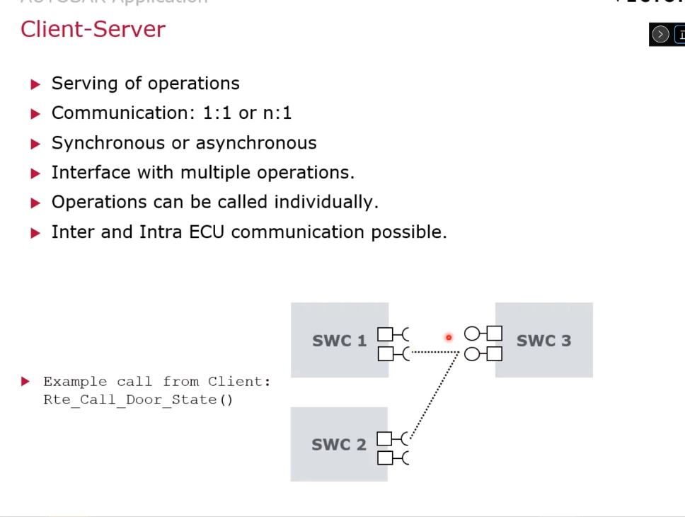

### runnables
> 可执行实体 需要实现
> 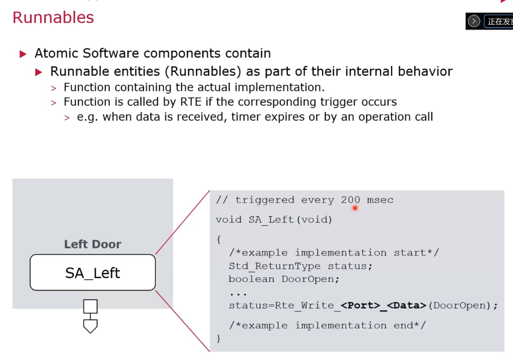

### 例子
> 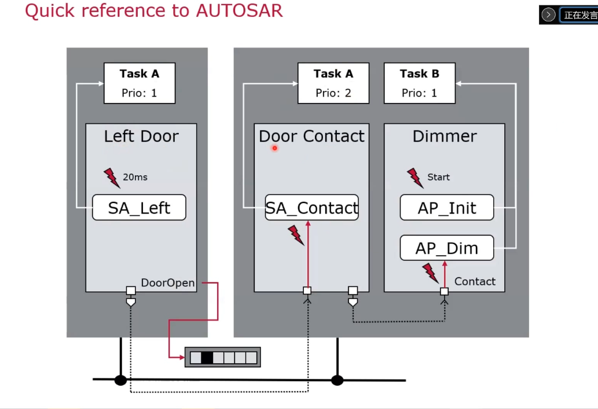