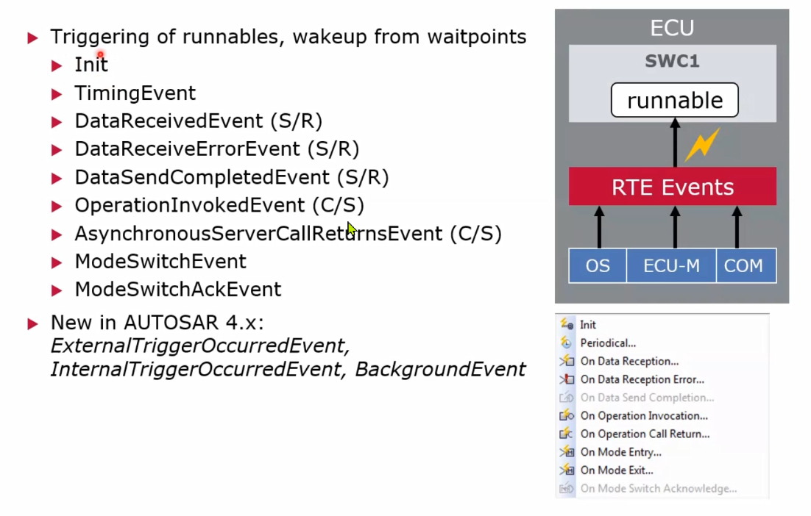

## RTE
### rte
应用层和软件层之间 

rte 在swc和bsw 之间

### 架构

### rte功能 
> 类似vfb virtural funciont bus
> 数据传输
> 
> 可执行实体的运行环境
> 把runable 配置到os、 配置触发方式 、调度配置项
> 完全是生成的
> 
> rte可以调度的接口 （os,ecu-m,swc,com）
> 
> rte触发runables的形式，初始化，timing,event
> 
> rte作为通信接口
> 
### inter ecu sender/receiver 通信
> 
> 几种传输模式 direct 直接地址
> 
> buffered ,last is best
> 
> queued 队列
> 
> data invalidation 数据失效形式
> 
### client server communication
> 远程服务 同步调用 异步调用
> 
> 同步调用 时序
> 
> 异步调用 时序
> 
### rte保护机制 intra-swc communication
> 保护数据一致性（原子操作）
> 1）专属区域保护 2）保护变量
> 
### 三种接口定义
> 三种接口
> 
> standardized interface(rte与bsw之间)
> 
> autosar interface (rte和asw之间 用户自己定义的接口)
> port 和 runnable 描述
> 
> standardized autosar interface(提供服务 services之间)
> 
>  接口定义 
> 
> 
### rte生成代码过程
> 