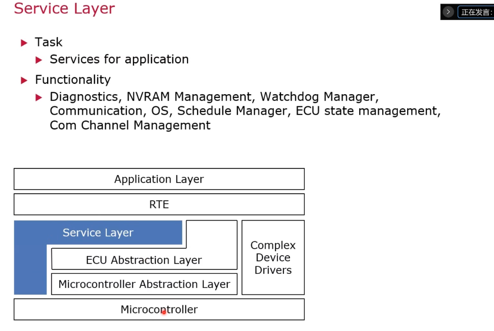

## BSW
> BSW部分
> 包括service layer\ ecu abstraction \ microcontroller abstraction layer
> 
### service layer
> L型，一部分直接与mic相连(os,诊断，comm,nvm...)
> 
### ecu abstraction layer
> driver
> 
### microcontroller abstraction layer
> 硬件厂商提供
> 
### cdd 
> 自定义， 复杂驱动，复杂执行器
> 
### 模块细节定义
> system memory comm
> 
> osek 软件架构 can ecu
> 
> autosar架构
> 
### bsw各个模块的功能
> 1 通信 communication 内部通信
> 
> 说明
> 
> 具体例子
> 