## 05 methodology 
### overview
> 传输标准文件
> 

### current workflow(non-autosar) 
> 传统部件根据dbc fibex ldf 三个文件
> 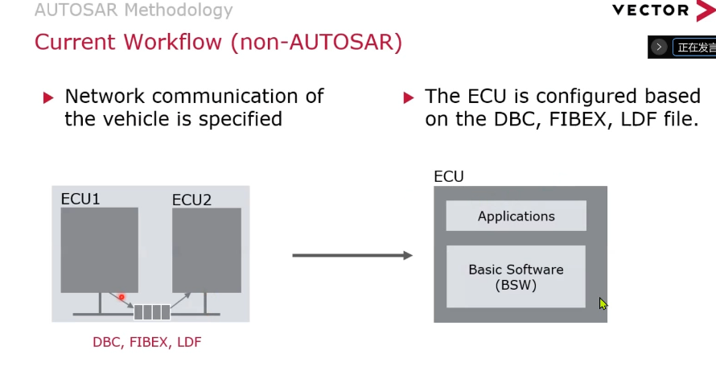

### autosar workflow (标准流程)
> 分为四个文件（software component description\ system description\extract of system description\ ecu configuration description）
> 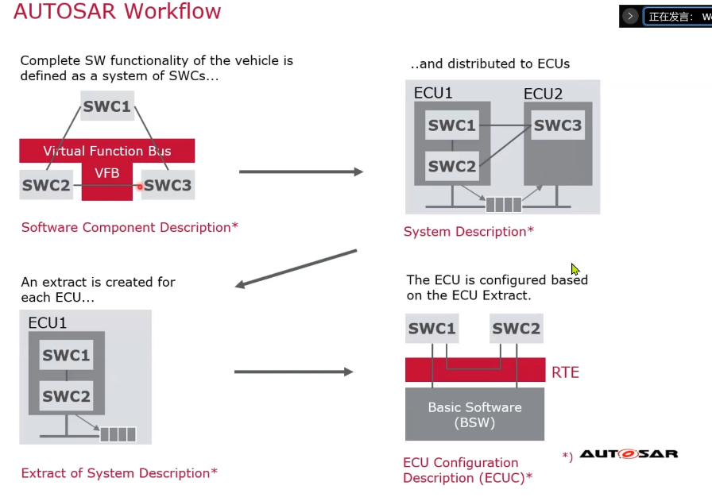

### 描述文件生成过程
> 从software component、系统输入、ecu资源描述为输入 生成系统配置文件
> 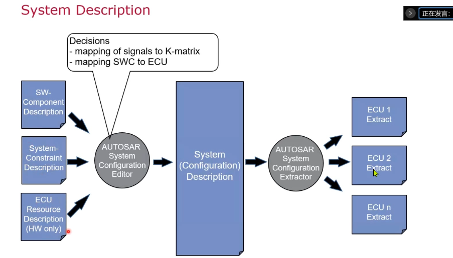

### swc swc描述文件
> 包括资源需求 接口适配 数据与操作
> 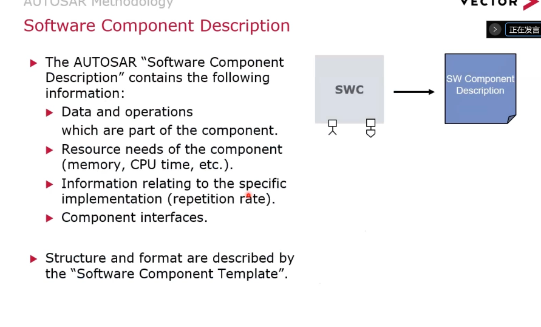

### ecu描述文件
> 传感器 执行器 外设
> 

### system description
> 协议 波特率 等
> 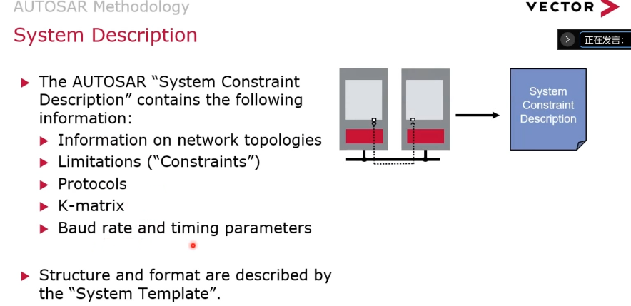

### autosar oem与tier1 之间数据传输定义
> 通过ecuex文件进行接口描述
> 
>
> ecuex 文件
> ecu性能描述 id 网络信号 pdu swc 端口配置
> 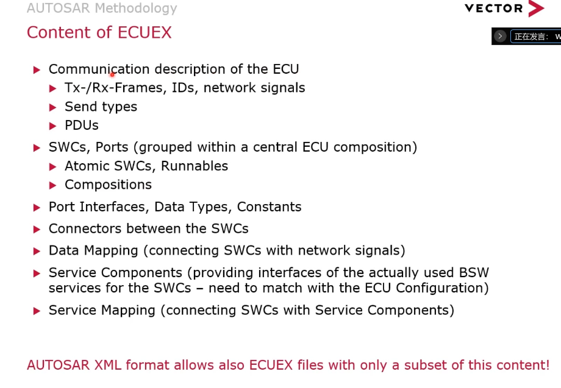
> 
> 
>  t1和oem的几种分工模式
>  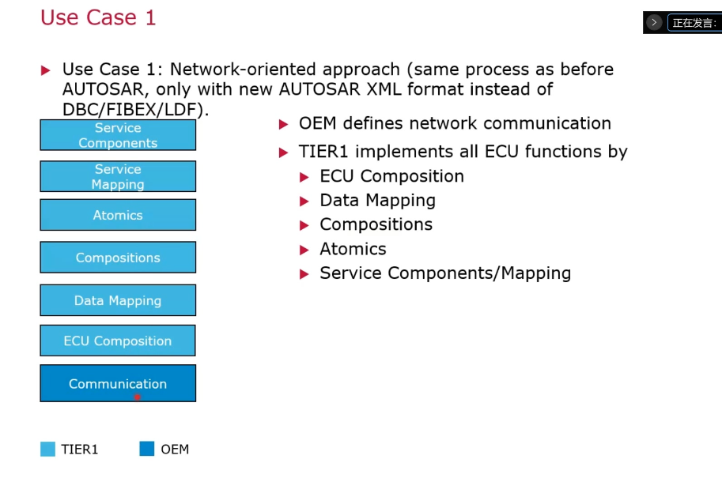
>  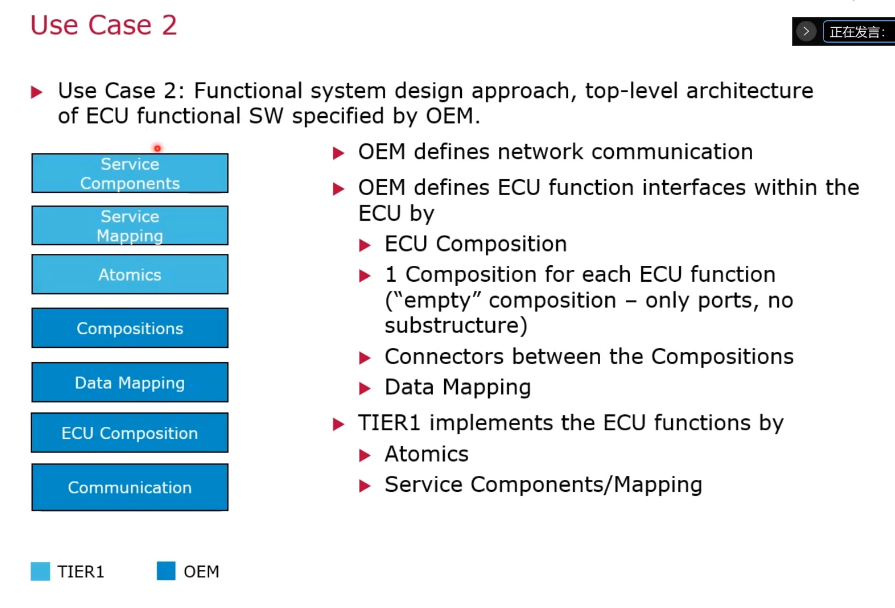
>  

### ecu configuration
> ecu 的配置
> 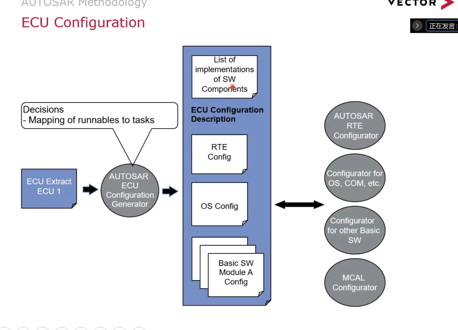
> 

### 实现流程
> 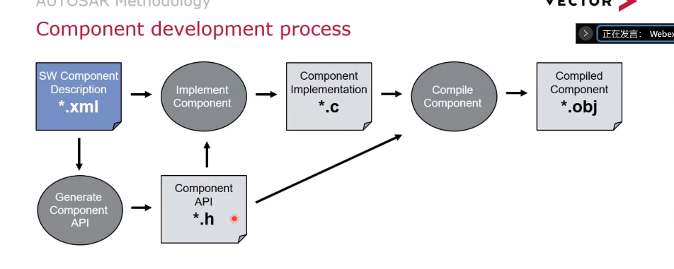

### autosar 解决方案
> 一些额外的文件
> 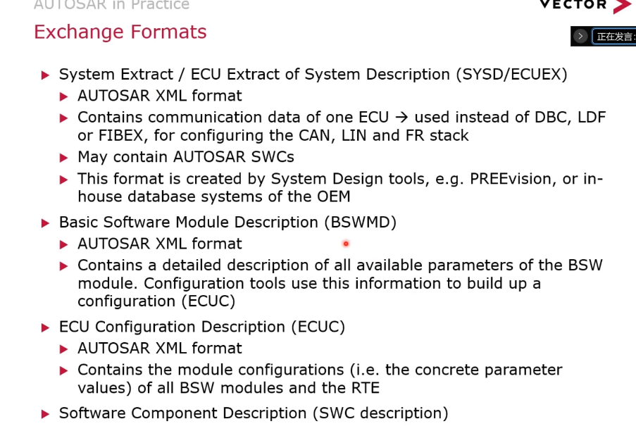
> vector 开发工具链
> vVIRTUALtarget 仿真
> 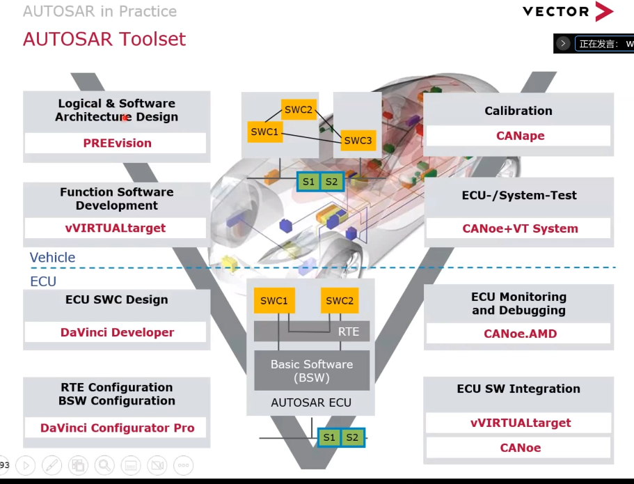
> preevision system design
> 软件架构设计
> 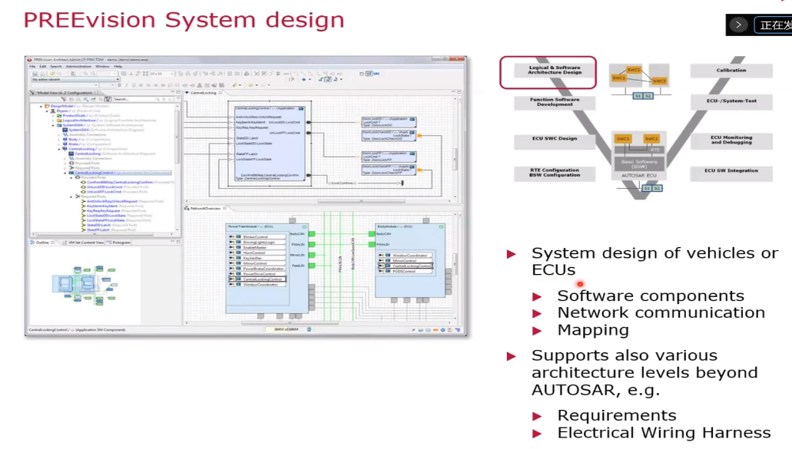
> 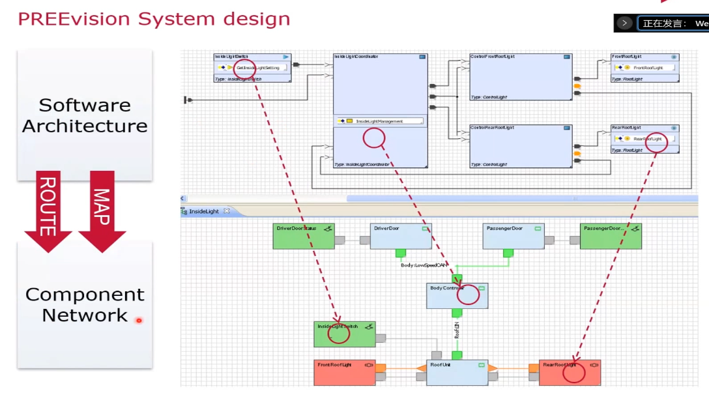
> vtt canoe 仿真测试
> 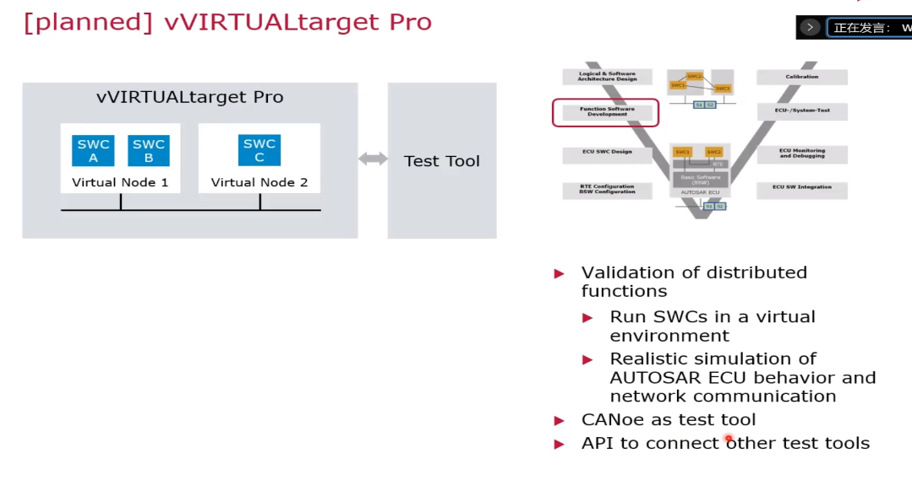
> davinci developer
> swc设计
> 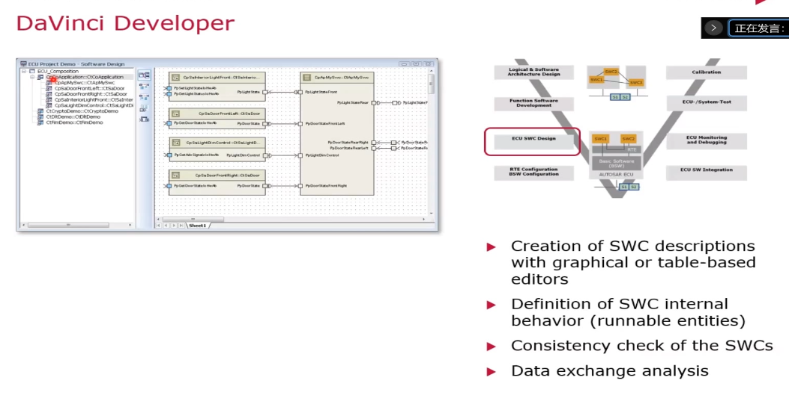
> davinci configurator pro
> 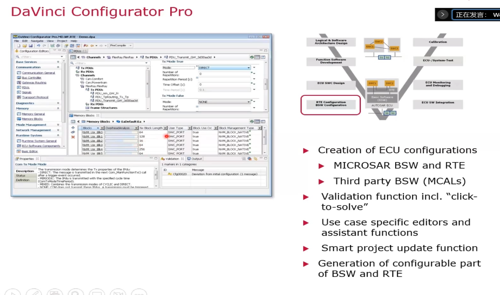
> 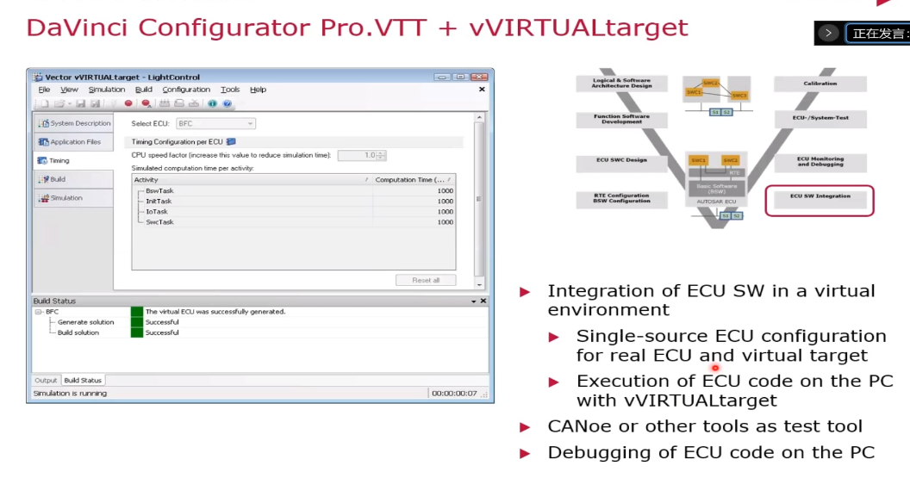
> 附录
> 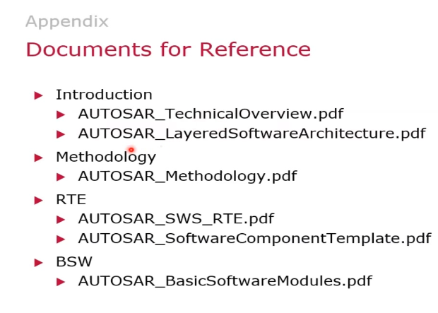
> 多核
> 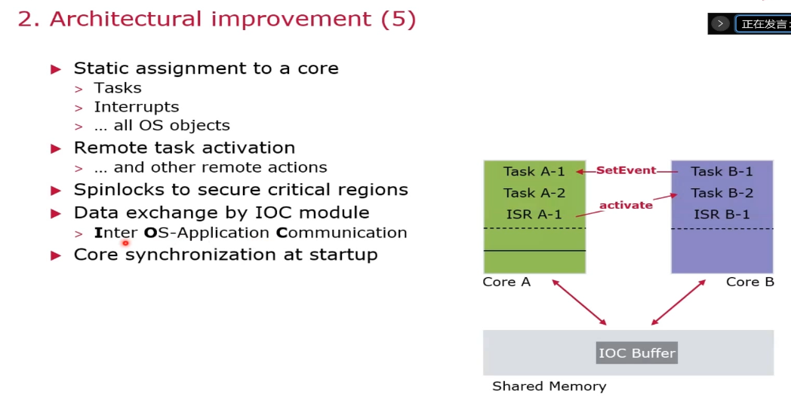