## 配置can邮箱
> 背景：多条can报文只对应一条can邮箱
> 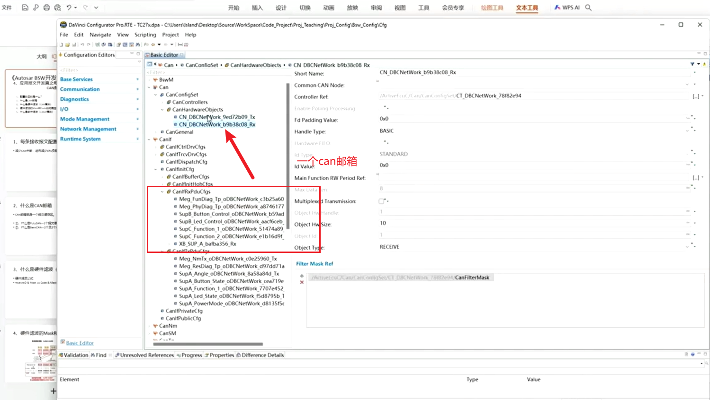
> 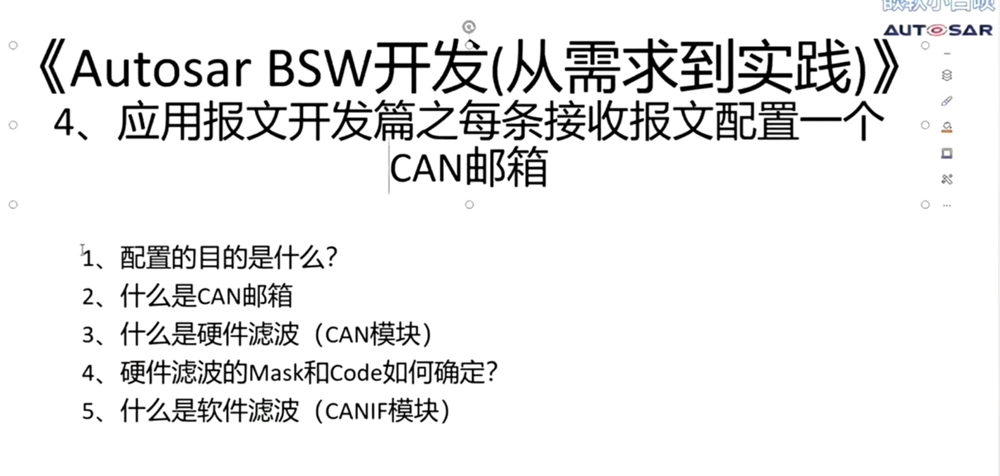
> **配置的目的**
> 减少can中断，减少cpu负载
> **配置过程**
> 增加can hardware
> 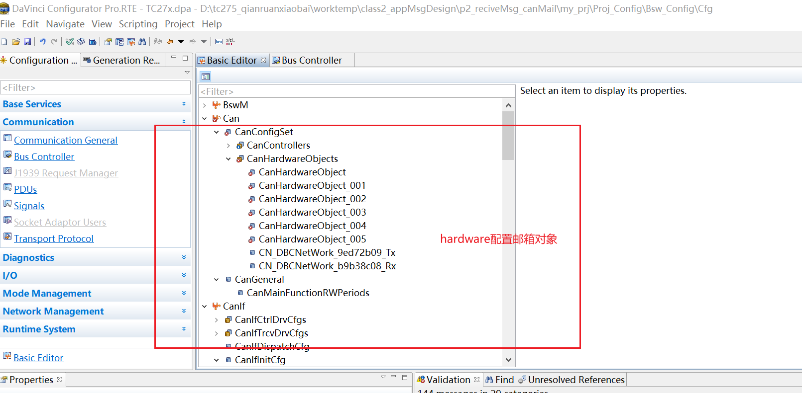
> can邮箱相当于一个缓冲区
> 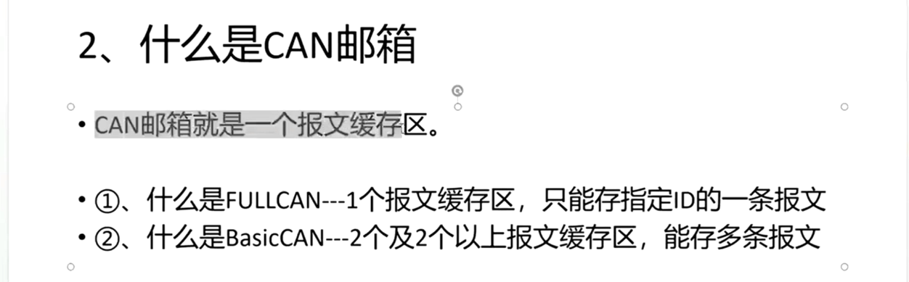
> 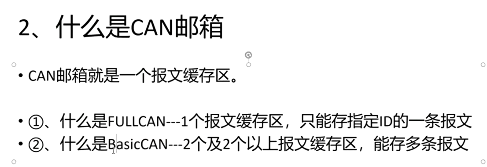
> can模块底层驱动配置 basic full
> 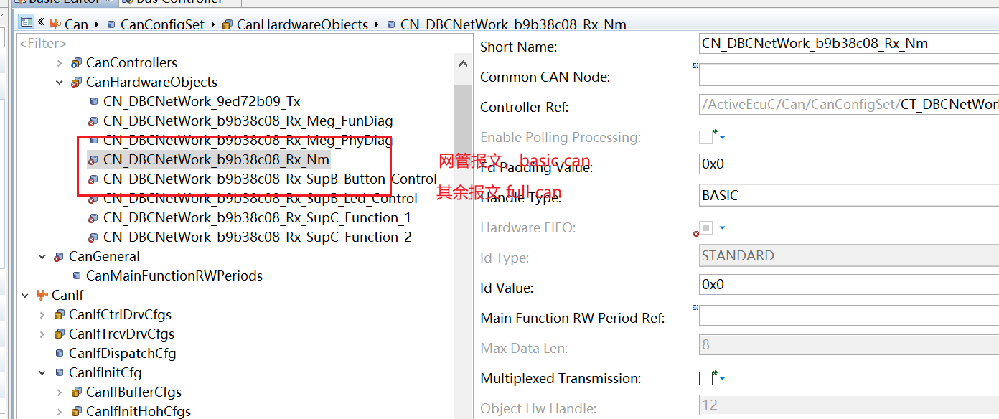
> full can 不需要配置滤波器
> 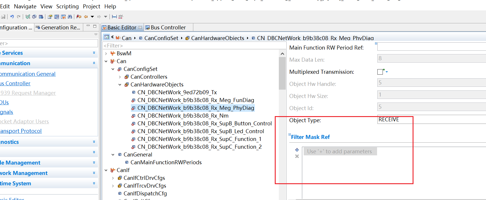
> canif 配置索引
> 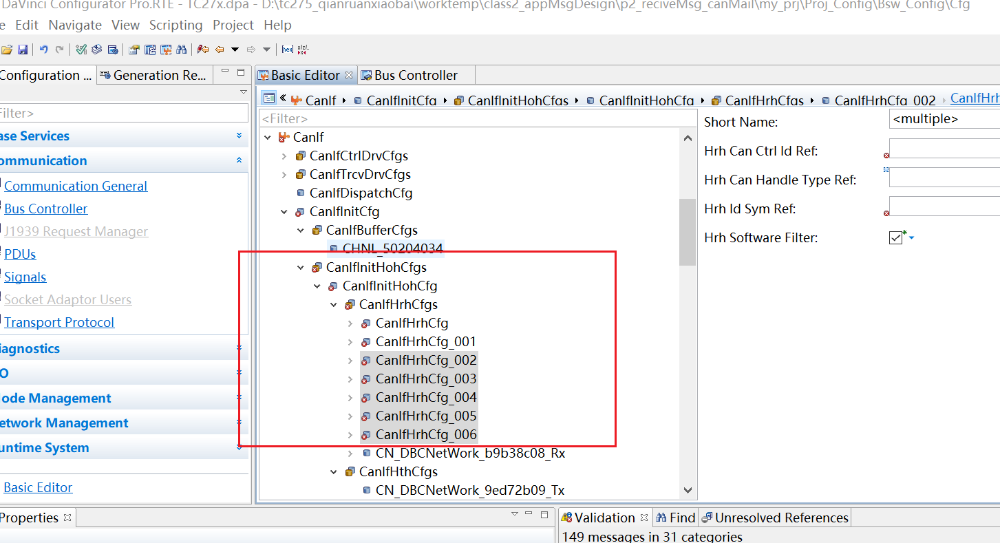
> 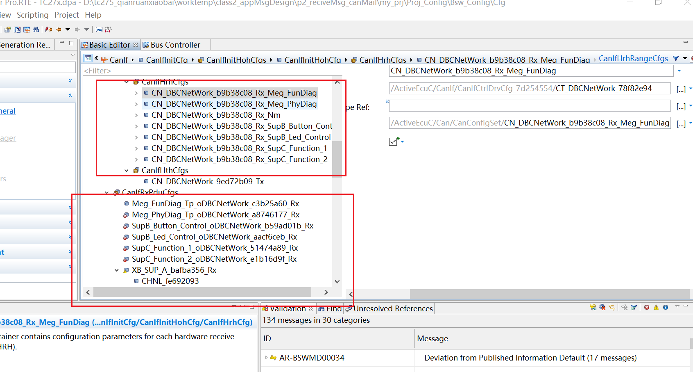
> basic can object hw size 至少为2才会开启功能
> 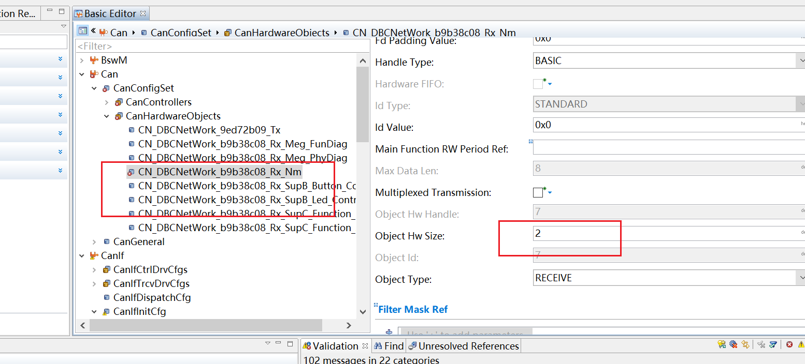
> 给basic can 配置滤波
> mask相当于关心位，提取位
> code相当于关心位，提取位的目标值
> 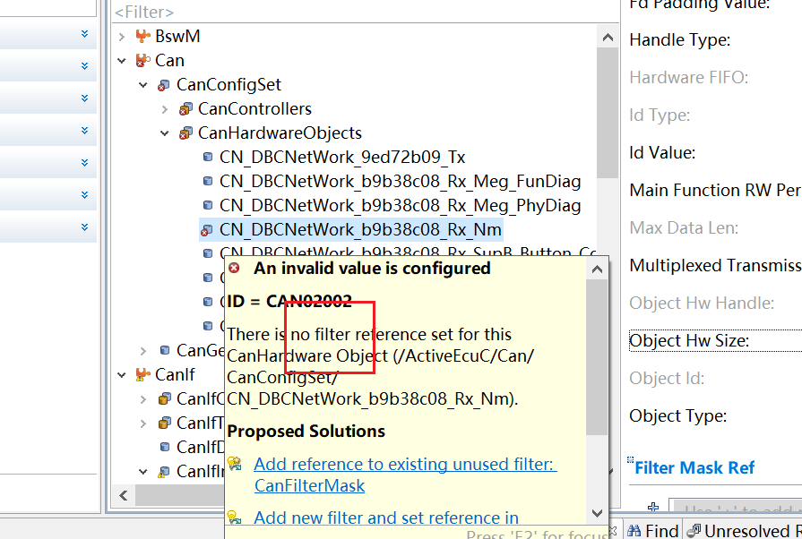
> 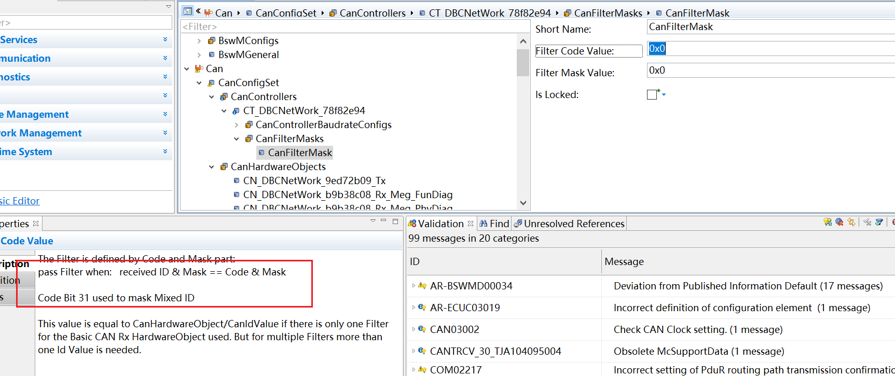
> 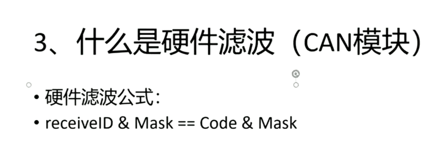
> 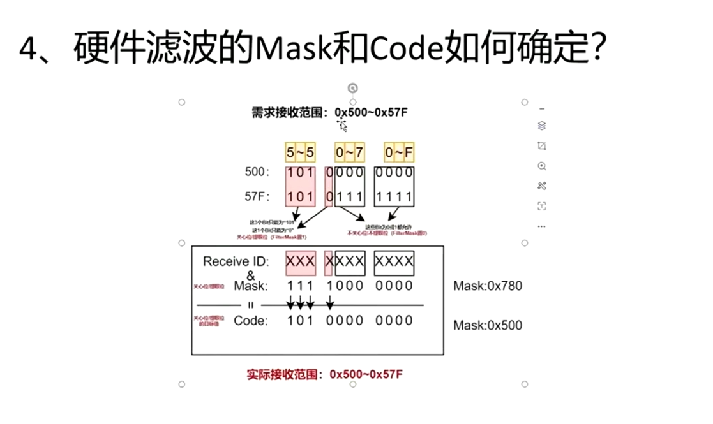
> 测试验证结果
> 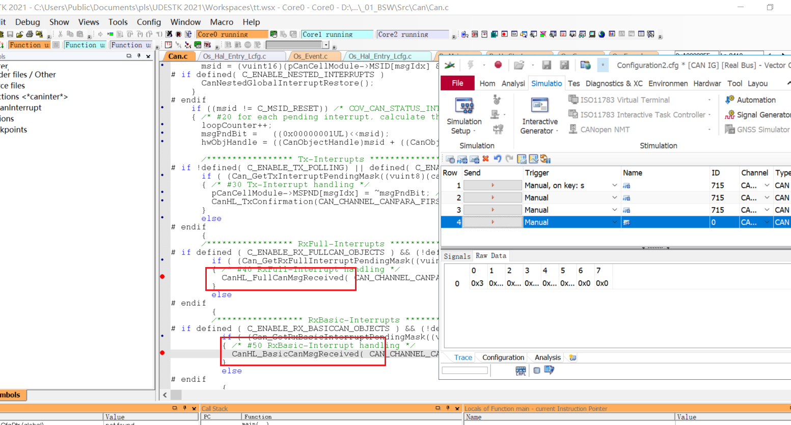
> **软件滤波**
> canif模块的滤波
> dlc check.. 
> 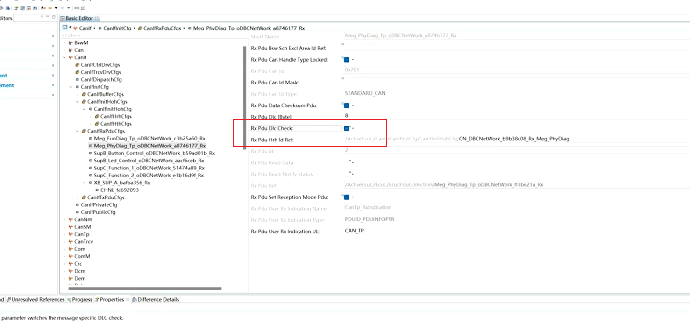