> ### 3 认识can通信需求
> 新项目（can通信需求 can矩阵）
> 
> **需求阅读**
> 前面一些硬件需求
> 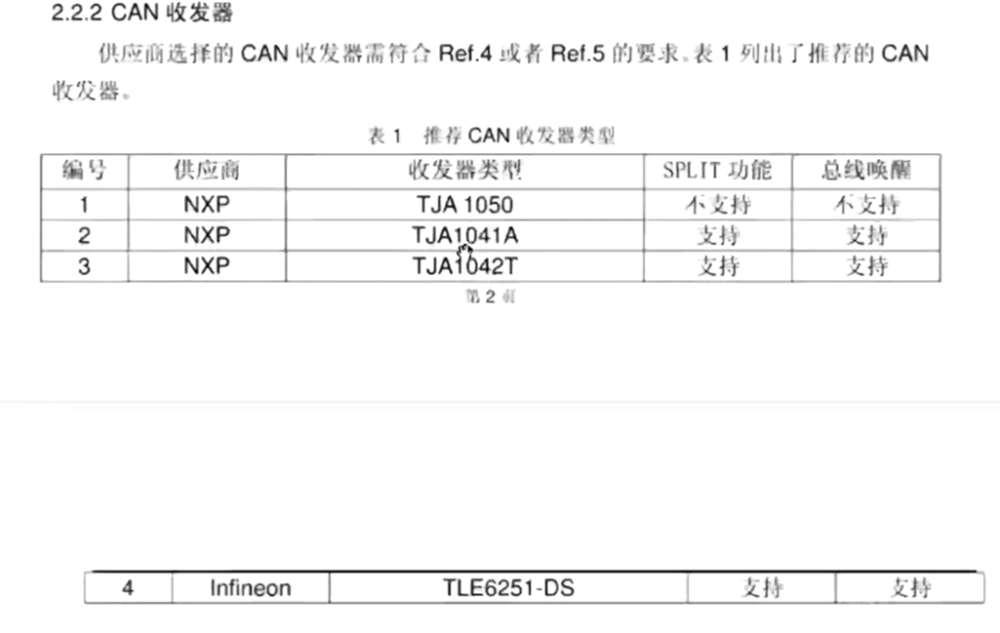
> 
> 事件周期型报文 等等
> 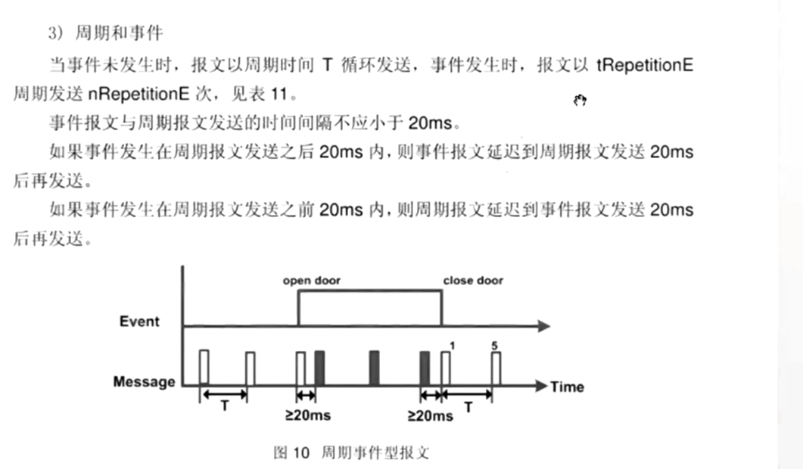
> ### 4 导入全新dbc至配置工程
> 新的dbc
> 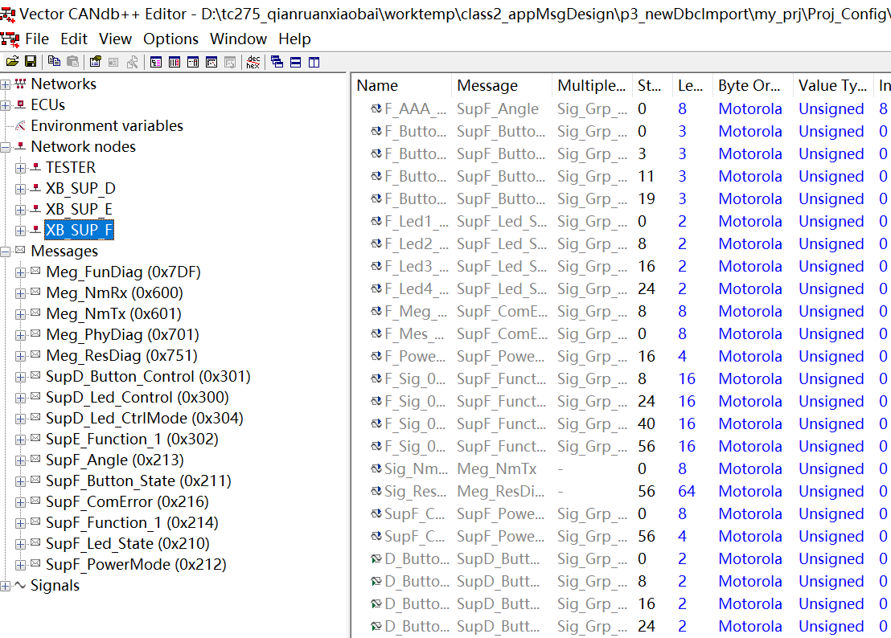
> 导入dbc 并且update
> 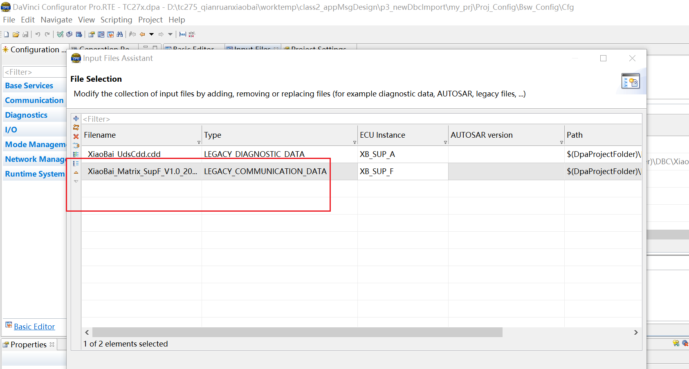
> 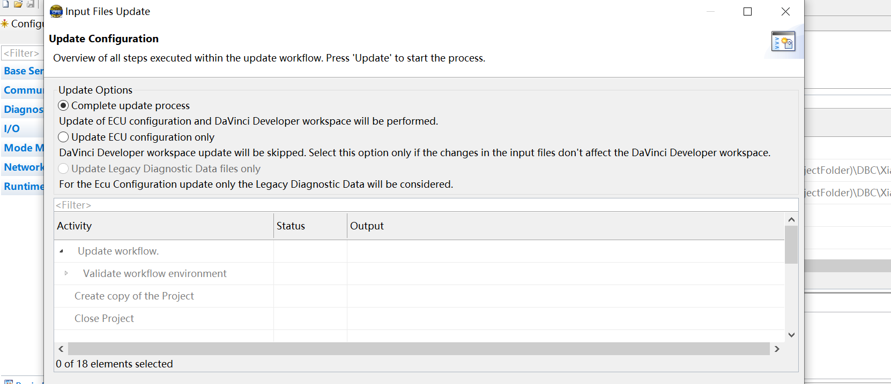
> 配置can driver 的 时钟，分频系数，采样率
> 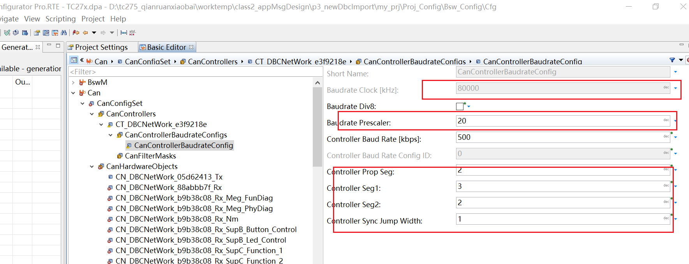
> 配置can hardwareobject
> 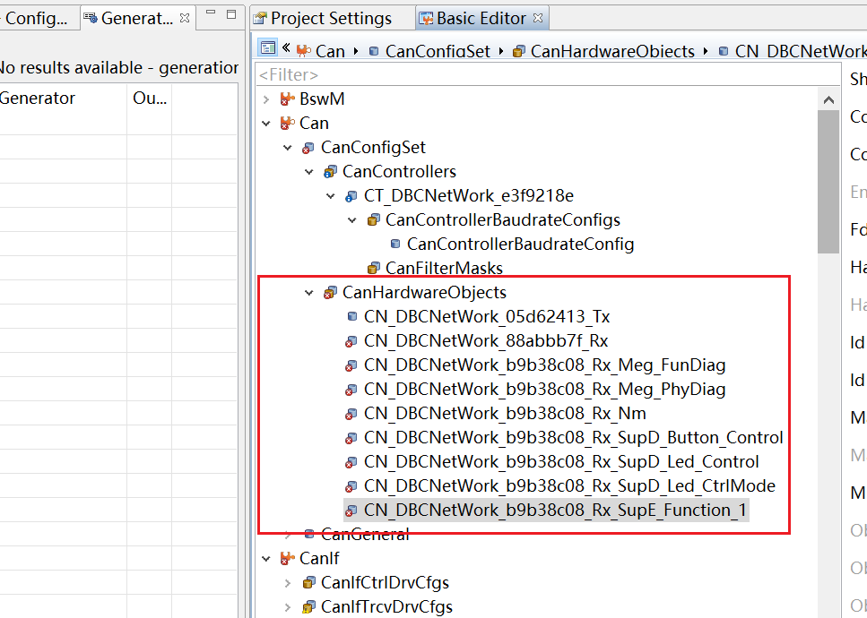
> 配置canif harewareobject 缓存
> canif pdu指向canifhob缓存，hob指向can模块缓存
> 
> 配置pdur层 tx confirmation和immediate模式
> immediate和deffer模式区别，在mainfunc和中断中汇报上层
> 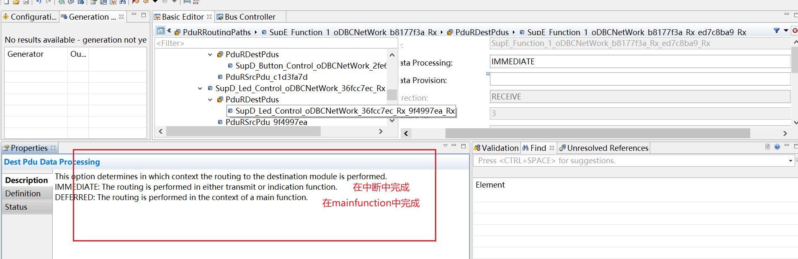
> 配置bsw模块 使能通道 修改comm名称
> 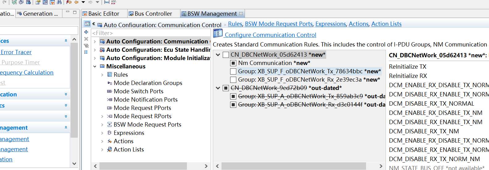
> 
> ### 5 配置swc工程
> 报文全部删掉
> 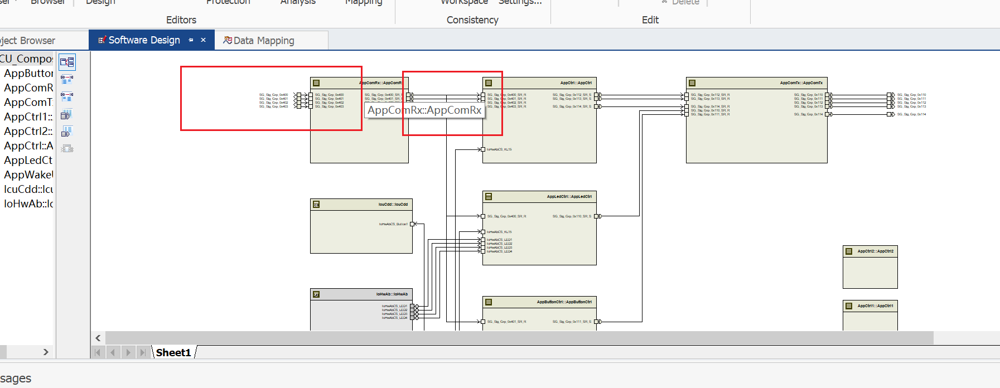
> mapping 信号组
> mapping就是把bsw的信号映射到swc中
> 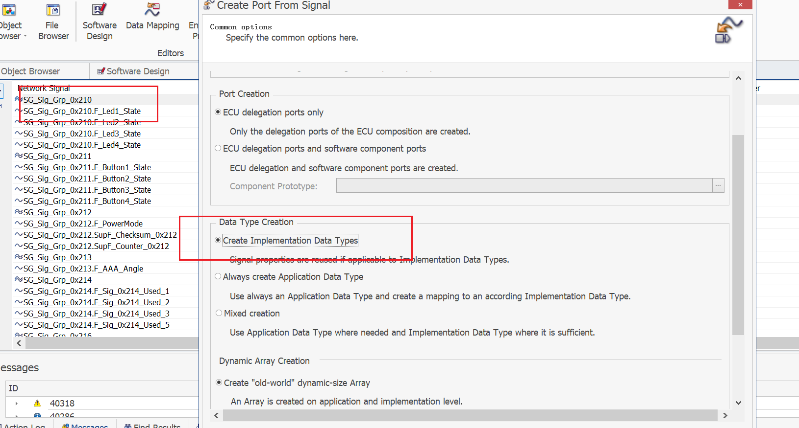
> 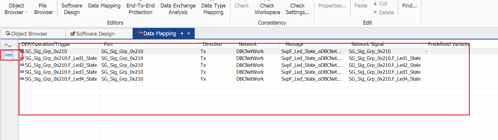
> 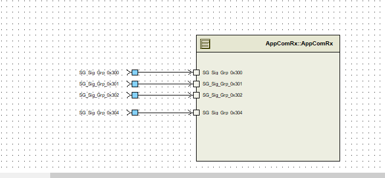
> 配置收发信号access point 
> 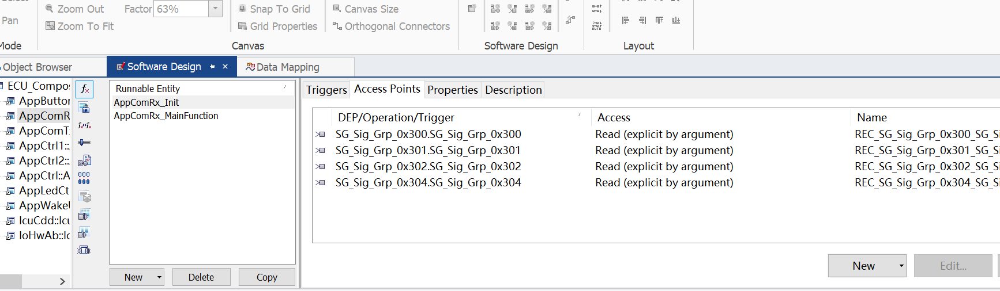
> 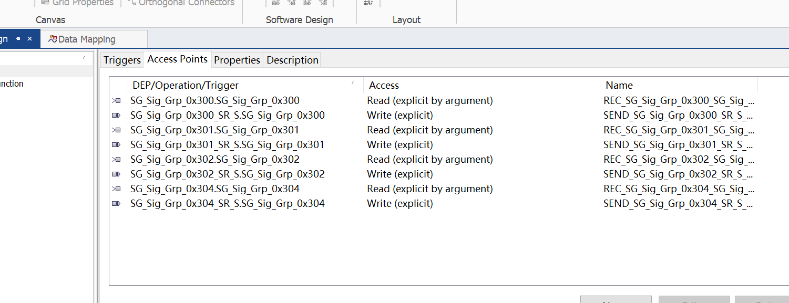
> 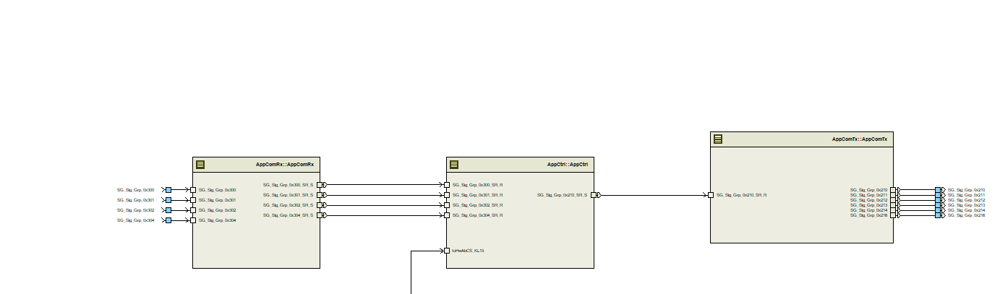
> ### 6 工程验证
> 通过在线仿真调试发现cansm切换收发器模式时，无法索引can收发器，导致无法切换收发器模式
> 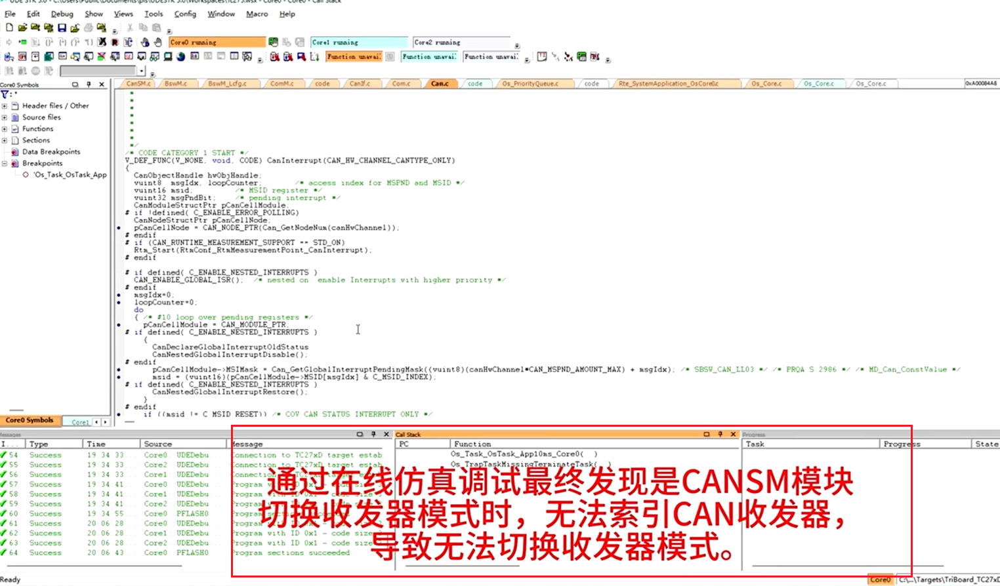
> 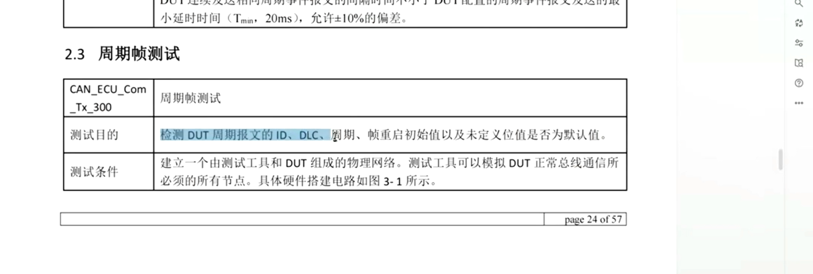
> 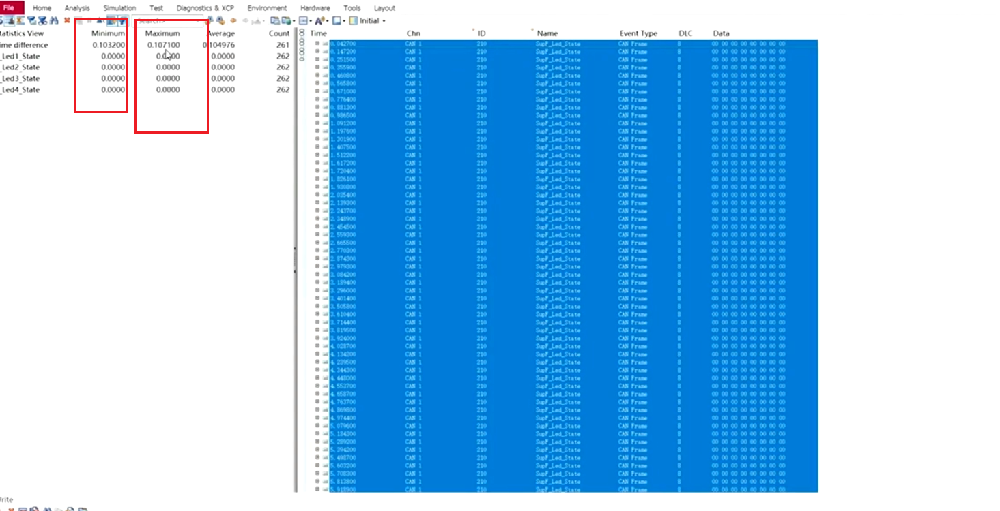