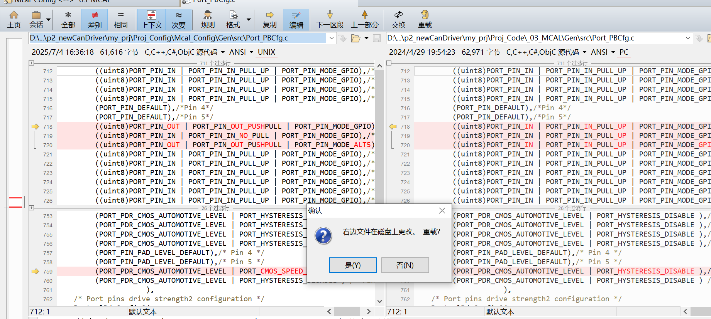
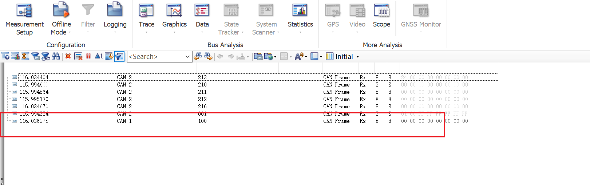

## 新增一路can通道
> 需求描述
> 
> 配置dbc,若是ilsupport选择no,则在com层不会生成配置
> 
> 多个dbc需要选择相同的节点名字，否则无法next
> 
> 配置can控制器 删除NM（不需要网络管理）
> 
> comm 整车can配置成full 内部can配置成none
> nm 去掉passive mode
> 
> 
> 
> 由于没有ilsupport，因此canif不会与com交互
> 
> 上层模块选择cdd (自定义)
> 
> 在cdd模块中关联ecuc的缓存
> 
> 配置新通道的task mapping 
> 
> bswm配置，allow comm
> 
> 
> **额外，通过kl15控制comm状态，full com,no com**
> 
> 让内部can一直处于保持通讯的状态
> 新增一个从wakeupToRun下的full com 请求
> 
> 
> **硬件EB配置**
> davinci工具中没有tcan1042,因此需要在eb中配置port口，对于整车can,cantrcv有1043收发器模块，可以在davinci中配置
> 
> 
> 配置port 口
> 
> 
> **cdd 文件添加cbk**
> 
> **测试过程**
> 配置下canif的接收范围
> 
> 
> 
> 配置后可以正常接收
> 
> **发送一路配置**
> 在canif_cfg中找到对应的canid
> 
> 调用canif模块发送出去
> 
> 