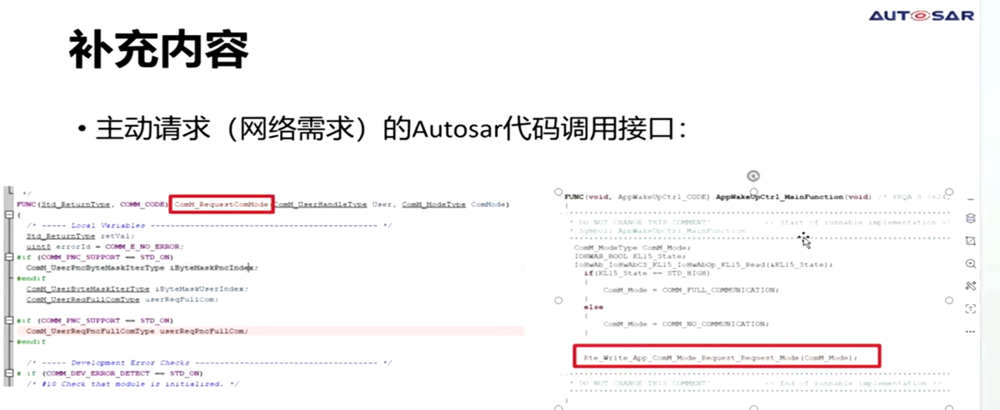
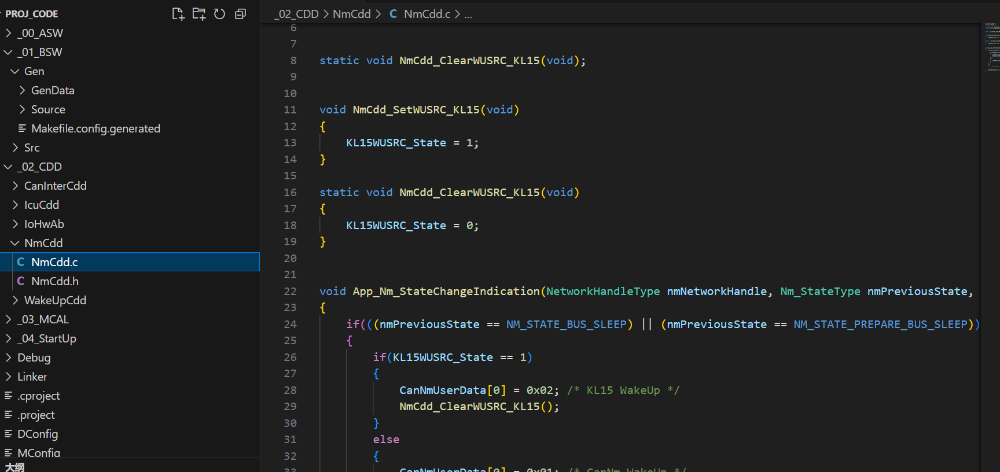
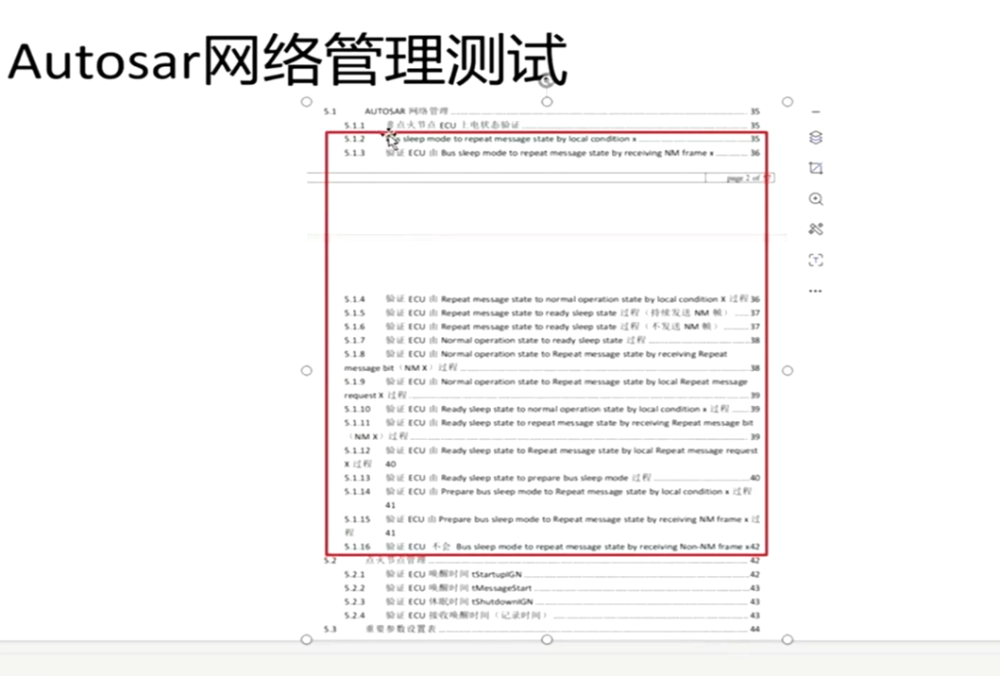
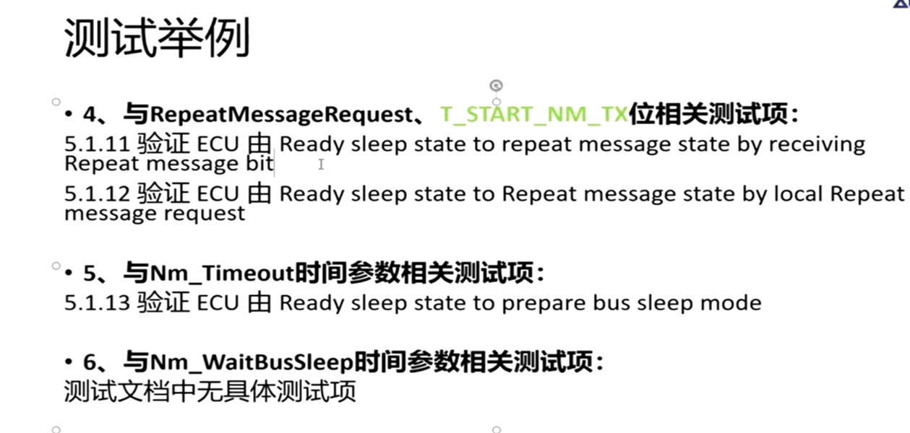

## 1 认识Autosar网络管理状态机
> 目录
> 状态详解(bussleep /repeat msg state/normal ope state/ ready sleep state/ prepare bus sleep)
> repeat message
> 诊断请求
> 
> **1 状态管理详解**
> 一共五个状态
> 
> autosar 网络管理详细的规范
> 
> 
> **bus sleep Mode**
> 
> **repeat Msg state**
> 蓝色是非主流的路线
> 
> 休眠到repeat
> 条件1 （网络需求：主动唤醒 网管报文：被动唤醒）
> action1,2 启动repeat_msg定时器
> action4 启动传送网络管理报文
> 
> repeat 到 work
> 主动请求（网络请求）且定时器超时：
> action:发送网管报文
> 
> 主动请求路线
> 
> repeat -> 准备休眠
> 定时器超时
> action 停止发送网络报文管理
> 
> 网络释放过程
> 
> **Normal Operation State**
> 正常工作状态的跳转
> 
> 正常到准备休眠
> 条件：网络释放（kl15）
> aciton5:节点停止发送报文
> 
> 准备休眠到正常
> 
> **ready sleep state**
> 
> 准备休眠状态，到总线预休眠
> 
> 接收到报文时就会刷新状态
> 
> 主动唤醒，断开唤醒流程
> 
> **prepare bus-sleep mode**
> 
> 预休眠到休眠
> 
> 预休眠到repeat
> 
> ### 2 repeat Messag request
> 网管报文
> 
> 网络管理帧
> 主要用到的是bit0和bit4
> 
> 
> 
> 
> 注意网络管理的状态
> 当收到重复消息请求位置为1时，都要往重复消息状态跳转，网络管理重复消息需求
> 在重复消息状态时ecu就会向外发网管报文，也会收到外部的网络管理帧，用来检测总线当前的网络节点
> 
> ### 3 诊断请求
> 诊断请求可以理解为主动请求，但不是主动唤醒源
> 
> **autosar 接口**
> 应用侧来检测，请求com_mode释放网络
> 
> ### 4 网络管理需求规范
> 关键条件
> 
> user data 0  填写唤醒源
> 
> 
> 
> **正常操作状态和休眠**
> 
> **各个状态的报文收发**
> 
> **网络需求和网络释放**
> 
> ### 5 实际开发配置
> 配置can filter
> 
> dbc更改报文属性
> 
> 
> 配置参数
> 
> 配置使能参数
> 
> 
> 
> 初始化需求
> 再callout函数中完成
> 
> 
> 
> 新的需求
> 
> 
> nm配置节点ID
> 
> 
> ### 6 网络管理测试
> 关注这个测试规范
> 
> 测试举例
> 
> 
> 注意测试方法和验收标准
> 
> 测试举例
> 
> 