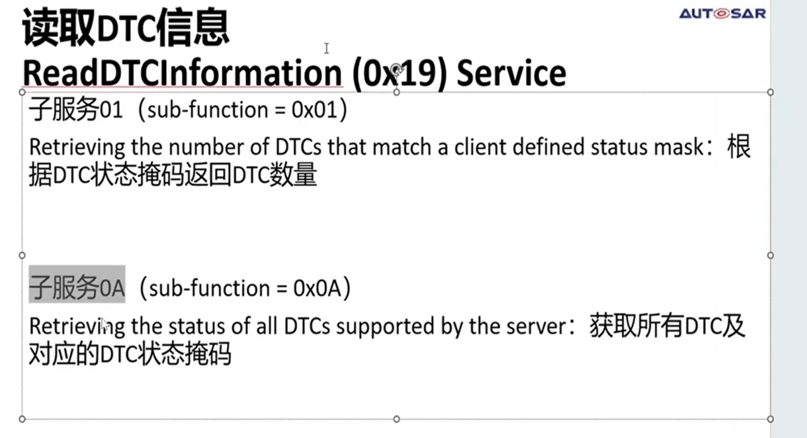

## UDS开发基础
### 1 基础
> 目录
> 
> 基本概念，university diagnostics system
> 
> 
> 诊断报文 （物理请求报文、功能请求报文、响应报文）
> 功能请求报文不支持多帧、NRC11\12\31\73\7F不反馈
> 
> 
> 
> UDS on Can(也可以用于以太网和lin)
> 
> 
> 
> UDS服务
> 
> UDS需求
> 需要车企提供，有很多定制化需求（比如车速<10km，才能reset）
> 
> 
> ### 2 配置CAN诊断报文链路
> 需求
> 
> 首先更新dbc，注意属性 diagRequest 物理诊断报文
> ISO-TP对应15765
> 
> 
> 先配置can canif
> 
> CANTP 参数配置（偏大无影响，偏小容易超时）
> 
> **配置链路注意点**
> CANIF indication UL->CANTP
> 
> 
> 对于周期应用报文，下一个周期会继续发送报文，与当前发送是否成功无关，因此不需要 TX Confirm
> 
> 对于诊断报文，涉及到多帧传输，需要诊断报文TxConfirm获取发送状态
> 
> 对于事件型报文，也需要Tx confirm
> 
> DCMdslbuffer（dem处理好后，填到dcm中），通过dcm发送出去
> 
> 
> 正常响应（物理请求 功能请求）
> 
> ### 3 诊断传输协议详解
> 以一个服务为例子 19服务 DTC （子服务01 子服务0a）
> **请求格式**
> 01:根据dtc掩码返回dtc数量
> 
> **响应格式**
> 
> 
> 第二个字节请求01返回也是01
> 第三个字节是dtc状态掩码，也是DTC的状态位
> 第四个字节是dtc形式 01(14229)
> 第五第六表示支持DTC的数量
> 
> DTC的状态掩码实际上是DTC的状态位，第一位和第三位是强制的
> 
> **请求响应示例**
> 19 01 01 返回第一位是1的dtc码的数量
> 
> 有两个置位的dtc
> 
> **0A子服务**
> 0A服务获取所有dtc及dtc对应的状态掩码
> 
> 返回了全部的DTC
> 
> 
> **15765-2 tp层协议**
> 单帧
> 
> 
> 首帧 连续帧 流控帧
> 
> 流控帧 FC
> 
> 
> 将bs值设置为1后的现象
> 
> stmin表示发送的事件
> 连续帧
> 
> **一些配置项**
> padding pattern
> 
> **注意事项 canfd和can的tp协议是不同的**
> 普通can协议和canfd协议的tp协议是不同的
> 如果是canfd发03 190101的话
> 则要发 00 03 19 01 01 头一个字节需要是00
> 
