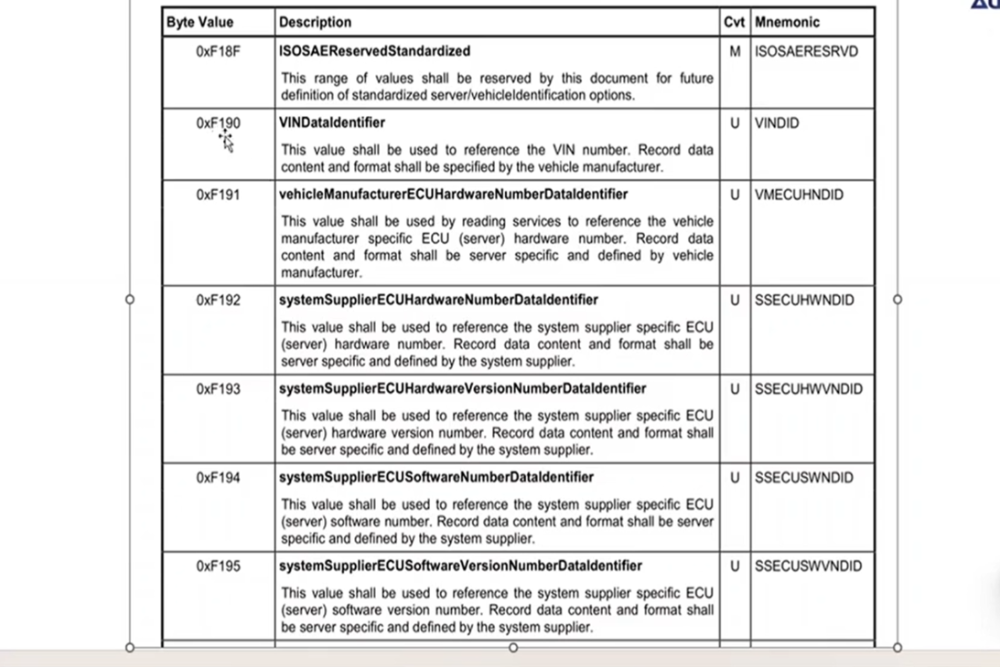

## 19服务 故障快照 扩展数据
> 目录
> 认识1904 故障快照 1906 扩展数据
> 
> ### 1 1904 故障快照
> 子服务04
> 根据DTC故障快照记录号返回该DTC的故障快照
> 故障快照记录号举例：0x01 第一次故障 0x02第二次故障
> 
> 故障瞬间记录数据，记录车速，电压...
> 
> **DID data identifier数据标识符**
> 举例：did 0107 kl30电压
> did 2001 当前车速
> 
> 涉及DID的常用UDS服务：22 2e 19 2f服务  
> 在14229中截到的一些固定did定义（vin码 f190）
> f195 ecu 版本号
> 
> **1904故障快照请求响应**
> 请求格式 1904 + dtc + recordNumber
> recordNumber 为0xff时会返回所有的快照记录
> 
> 响应格式 
> 头八个字节最后一位是记录did的数量
> 
> 具体的did did名字+did内容
> 
> 后面会跟着几次记录号+did数据
> 
> **示例**
> 1902 01 查看当前dtc
> 
> 选择401003 故障码读取故障快照
>  1904 401003 01
> 
> 响应如下
> 
> 
> 返回了两个did id
> 
> **cdd文件查看did配置**
> cdd文件会配置快照记录号，以及每一个快照记录号对应的DID
> 
> 具体的did配置在did overview中
> 
> 比如轮速的定义有八个byte
> 
> ### 2 1906 扩展数据
> 子服务06 reportDTCExtDataRecordByDTCNumber:
> 根据DTC扩展数据记录号返回该DTC的扩展数据
> 
> 扩展数据主要用于记录计数类的值
> **只会记录最后一次故障的内容，只有一组**
> 扩展数据记录 故障发生次数 DTC老化次数 ...
> 
> 扩展数据记录号：0x0a只代表故障发生次数 0b 老化次数
> 不像快照记录号01-04
> 
> **请求响应报文**
> 请求报文
> 
> 响应报文（如果发0xff则会返回所有的扩展数据）
> 
> **cdd文件设置**
> 支持 0a 0b 0c 的扩展数据记录号
> 00是保留位，14229中定义，不能被使用，被保留给obd使用
> 
> 14229定义
> 
> **响应示例**
> 1906 401003 0A
> 
>  1906 401003 FF 返回了三个扩展数据记录号
> 
> **故障快照和扩展数据的异同点**
> 
> ### 3 具体开发
> **故障快照需求**
> 0x01代表首次故障发生
> 0x02代表最后一次故障发生
> 
> **扩展数据需求**
> 两个扩展数据记录号0x01故障发生次数 0x02故障已老化次数
> 
> **开发过程-1 新建swc**
> 1.在开发之前需要建立一个swc来存放诊断相关的代码
> 在developer中建立swc,complex driver app layer
> 
> 
> 
> 2.配置swc init runable 和 周期runable
> 这样才会在bsw中调用
> 
> 3.bsw中添加 tasking mapping 
> 
> 
> **开发过程-2 诊断cdd配置故障快照**
> 1.修改原有的故障快照记录号为需求的0x01 0x02
> 这部分改的是总表，新增需要的did
> 
> 2.修改base variant，项目中使用的表
> 配置成需求自定义
> 
> 
> 3.添加did 0x123
> 由于不需要放到22 23服务中，diagnostic class 先选择none
> 
> 
> 
> 4.新建 did 下的数据内容
> 对应的数据类型是在Data type下的 off/on
> 
> 
> 
> 
> 数据类型的定义，类似于dbc
> 
> 也可以有物理值的转换
> 
> 
> 
> 5.将新增的did添加到故障快照总表中
> 
> 
> 6.check consistency 检查一致性
> 
> 7.在dtc中查看冻结did
> 
> **开发过程-3 bsw配置**
> 新增的故障快照 
> 
> 
> enablecondition dtc前置条件
> 一般不用，在应用层自己配置
> 
> 扩展数据的索引
> 
> 故障快照的索引 freezeFrame
> 
> DemNvRamBlock NVM保存dtc状态
> 
> deM operationCycles 老化周期
> 
> **开发过程-4 通过代码实现__function call形式**
> 当通过dem_setEventStatus设置dtc状态位后，autosar静态代码会去读取did快照内容
> 实现did数据内容，callout函数生成的形式
> cs接口生成，function_call,senderRecieve接口(不常用)
> 
> 1.先采用function call 实现did数据
> 
> 生成的代码多了两个接口，一个是RTE cs接口，另一个是function call接口
> 
> 2.生成的接口中实现数据
> function call接口
> 
> 3.在bsw中将自定义的header文件include进来
> 
> 
> **开发过程-5 通过代码实现__cs接口**
> 需要通过develop配置
> 1.新建一个server接口（代码实现，数据提供方）
> 
> 
> 
> 2.新建service runnable
> 
> 3.新建的cs接口如下
> 
> 4.ecu 中配置server port 连接到swc
> bsw与swc连接
> 
> 5.swc中配置代码
> 
> 结果正常
> 
> **开发过程-6 故障开发记录号**
> 故障开发记录号可以配置成两种类型
> calculated和configured 
> 
> calculated 类型递增，每次递增
> 
> configured 可配置的
> 在 class ref 配置（触发条件，update）
> 
> 
> 
> 
> **开发过程-7 扩展数据开发**
> 需求0x01 0x02
> 
> 1.cdd 配置需求
> 
> bsw已经更新
> 
> 2.bsw 配置，不同于did，扩展数据可以使用bsw 静态代码的接口
> aged counter 和occ counter 数据接口
> 
> 
> 
> 3.nvm配置，由于aged 需要保存在nvm中
> 需要在nvm中再配置一个block
> 快照数据也会存到nvm中
> 
> 
> 
> 4.结果正常
> 