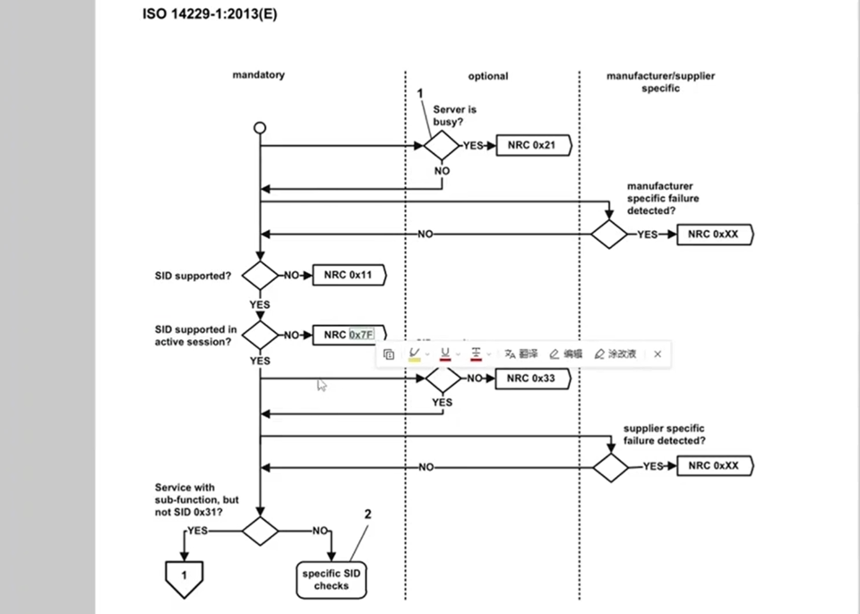

## UDS通用知识点 dcm
> 传统的uds服务
> 
> 通用知识点
> 
> **诊断请求**
> 
> 诊断请求格式（有无子服务）
> 
> 
> 肯定响应
> 
> si 服务id
> 
> 否定响应
> 
> 
> 
> 抑制肯定响应位（不需要肯定响应）
> 属于子服务参数的内容 （类似 19 01-> 19 81）,既没有肯定响应，也没有否定响应
> 没有子服务的不涉及
> 
> 
> 否定响应的NRC
> 0X12 子服务不支持 0x13 长度不正确  
> 
> 不同服务要支持不同的NRC
> 
> **nrc如何开发**
> 
> nrc优先级
> 
> 在判断nrc前后会有callout
> 
> 
> **dcm的一些概念 诊断通讯管理**
> 三个子模块
> dsd 诊断服务调度
> dsl 会话层
> dsp 处理层
> 
> dcm autosar标准
> dsl->dsd->dsp
> 