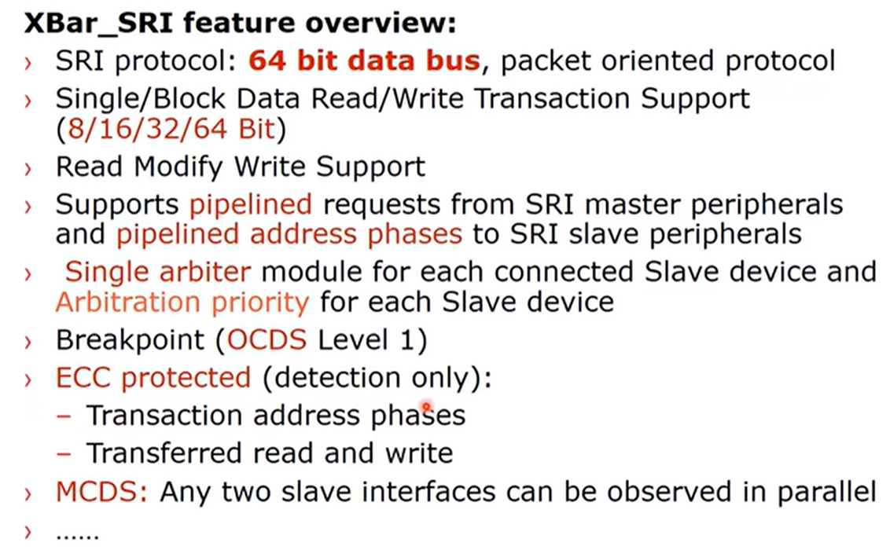
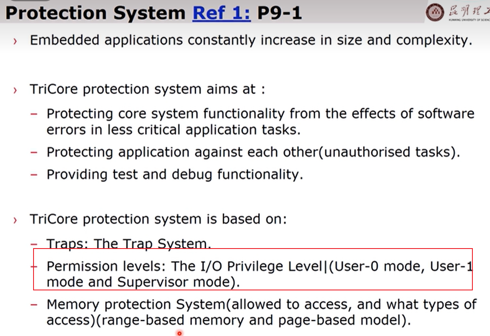
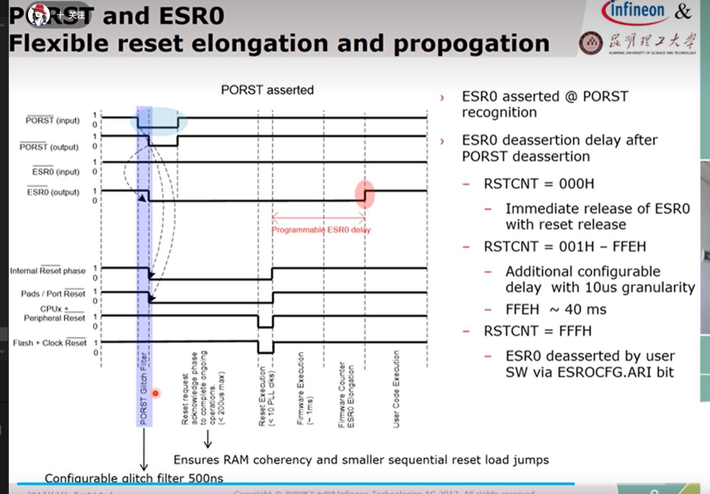
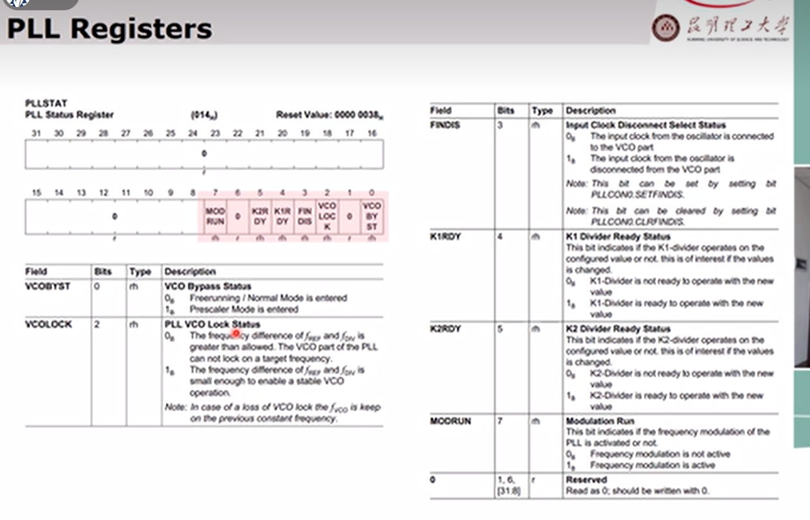

## TC275 架构
> ### 1 概述
> 整体架构
> 
> 安全相关
> 
> 参考资料
> 
> 
> ### 2 TC1.6E/1.6P 内核结构
> 内核发展
> 
> 内核主要结构
> 
> TC275内核
> 共享资源互联 SRI
> 
> 单核与多核之间的对比
> 
> SRI总线特点
> 
> 
> 主要的主机是行， 主要从机为列
> 
> 内核子系统
> 
> 四级流水线和六级流水线
> 
> 
> 
> 
> 主要寄存器
> 16个地址寄存器和16个数据寄存器
> 还有程序状态字 PC等寄存器
> 
> 各个寄存器 低级高级上下文
> 
> 其他寄存器
> 
> 程序状态字
> 
> #### 3 上下文保护
> 上下文分为高级上下文和低级上下文
> 高级上下文是针对任务的，包含当前上下文信息PCXI和程序状态字
> 低级上下文针对参数传递
> 
> 
> 
> 高级低级分类，不同的保护保存在不同的izhi
> 
> 上下文保护Areas
> 端地址和16位偏移 用来产生链接地址 linked CSA
> 64Bytes边界
> 
> 
> 链接字的产生
> 
> 上下文的保护过程
> 
> 
> 上下文的恢复
> 
> 
> #### 4 保护系统
> 
> 保护系统目标
> 防止内核受到软件错误的影响
> 避免多个app访问同一资源冲突
> 提供测试和调试功能 
> 主要机制：陷阱系统、访问权限、存储器保护系统
> 
> 
> 三种mode
> 
> user-0
> 
> user-1
> 
> Supervisor
> 
> 存储器保护 四个set
> 
> 
> 
> 代码保护执行使能
> 
> 
> 代码保护范围寄存器
> 
> 存储器保护案例
> 
> 
> 案例2
> 
> 
> 
> 
> 
> 临时保护系统
> 用于保护系统避免超时运行
> 
> 
> #### 5 存储器 （PMI DMI SRAM Cache PMU Flash）
> 所有存储器分为16个区，每个区256M
> 扇区0-7 用于cpu 程序快速访问SRAM
> 扇区8 用于缓存扇区 包含pflash boot rom ebu的访问
> 扇区9 LMU SRAM EMEM
> 扇区10  PFLASH DFLASH BOOTROM
> 扇区15 寄存器
> 
> 支持8个多核处理器 扇区0-7
> 每个核都有自己全局的扇区
> 每个核都可以访问扇区C核扇区D
> 
> 局部存储器
> 
> LMU
> 
> FLASH
> 
> PMI和DMI 概述
> 
> PMI 两种联动的缓存方式 受到ECC保护
> PSPR 通过SRI接口享有全局资源
> 
> 
> 
> 
> DMI 数据存储接口
> 
> 
> 
> PMU 通过XBAR_SRI总线访问PFLASH
> 
> 
> 
> PF0
> 
> Aurix EEPROM
> 
> #### 6 复位系统与启动系统
> 四种复位 复位系统
> 
> 三个引脚
> 
> 复位类型
> 
> 复位引脚
> 
> 复位过程
> 
> 启动系统
> 
> 
> 
> BMI启动校验头
> 
> 
> 
> 启动引导程序
> 
> 
> 
> #### 7 中断系统
> 中断系统框图
> 五个独立的中断服务提供者 3个cpu 1个DMA 1个SDMA
> ICU 中断控制单元
> SRN+Arbitration Bus+ICU 称为Interrupt Router
> 
> 
> 
> 处理中断请求的是服务提供者
> 
> 中断路由器
> 
> 
> 各个寄存器
> 
> 
> 
> 
> 仲裁系统
> 
> 使用例程
> 
> 
> #### 8 时钟系统
> 
> 概述
> 
> 支持独立的时钟
> 
> 
> 
> 
> 三种模式
> 
> 
> prescaler mode b不稳定
> 
> 
> free running
> 
> 
> 时钟输出
> 
> 时钟源选择
> 
> 
> 示例
> 
> 
> 时钟监控
> 利用备用100mHZ监控
> 
> #### 9 供电系统
> 概述
> 
> 
> 
> 
> 
> 电源管理
> 