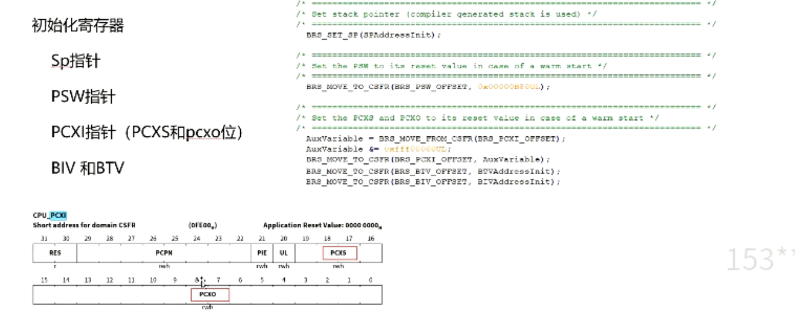

## 03 启动代码与链接文件
> 
> ### 3.1 基础知识
> 代码组成
> data段，初始化时会把初始值从rom复制到ram中
> 有时ota升级时，会把一些rom程序放在ram中
> 
> 内核寄存器
> 一般来说上下文信息是保存在栈中的，但在tricore芯片中保存在cxi中， 靠pcxi链接起来
> D15也很重要，trap时记录TIN
> A0,A1,A8,A9 全局寄存器
> 
> CSA (上下文保存区域) tricore特有
> 现场保护，硬件支持
> 
> 上下文内容
> 
> BMHD(BOOT MODE Header)
> tricore芯片中自带了BROM，这段flash中存储了一段固化的启动代码，称为startup software(ssw),这部分区域无法被覆盖，发生reset的时候就会自动执行这段代码
> ssw会读取ucb区域的bmhd的内容，bmhd包含了启动代码的地址
> 大部分芯片中断向量表是在地址位为0的位置，tricore拥有bmhd可以放在任意位置
> 
> TRAP与中断的区别
> 也可以称作不可屏蔽中断和可屏蔽中断
> 异常向量表（BTV）,中断向量表（BIV）
> 都在os_hal_entry_lcfg.c中
> 
> trap系统，分为了8个类，每个trap都有一个二级类号，称为TIN(Trap Identification Number)
> 
> trap发生后，查找具体的原因
> 先通过断点查看 trapclass,d15查看Tin号，a11是引起异常的地址
> 
> 查看core手册，查看异常原因
> 
> ### 3.2 启动代码
> 获取csa stack 异常表 中断表地址
> 
> 初始化寄存器 （sp psw pcxi biv和btv）
> 
> CSA 初始化（for循环生成空闲链表，然后在链接pcxi）
> 
> 关键：初始化ram
> 
> 通过 brs_memoryzeroinit 将memory初始化为0
> 
> 通过brs_memoryinit将数据从rom copy到ram中
> 
> ### 示例，代码 brsHwStartup.c中
> 通过宏来链接到bmhd中的地址
> 
> 
> 多核代码 ，get核id
> 
> 获取链接脚本中的地址
> 
> zero init(有两个位置，memory block ,area)
> 
> 对寄存器初始化
> 
> csa初始化，创建空闲链表，分配fcx指针
> 
> 异常向量表和中断向量表
> 
> 进入brs_premainstartup
> zero init ，memroy初始化
> 
> 进入到main函数
> 
> 链接脚本文件，把代码放在具体的位置
> reset,start地址都是这个
> 
> 
> 
> ### 3.3 链接脚本
> 通过一个例子说明 链接脚本文件
> 定义bmiFileld0放到 bmhd0位置中
> 通过.c文件和链接脚本的配合，就可以把常量bmiField0放在固定的位置0xAF400000
> 通过memmap可以把所有的#progma放在一起
> 
> 
> 
> ### 代码示例
> 
> memmap示例，通过memmap来统一管理#progma
> 
> 
> ### 链接 lsl 文件 通过vlinkgen生成
> 最开始定义的一些tricore相关
> 定义了一些内存，硬件地址空间
> 
> 
> 
> BMHD
> 
> ### 链接总结
> 
> 
> 上电后，ssw从ucb中读取启动代码位置
> bmhd的第二个位置
> 
> 
> ### 3.4 vlinkgen配置
> vlinkgen的配置
> 初始化数组地址的产生
> 
> 配置过程
> vlinkgenMemoryRegions是对整个区域的划分，
> 里面的区域数据可以选择在不同启动阶段初始化
> 
> 选择copy to ram后才能选择再哪个阶段初始化
> 都是在brs_appEntry调用brs_memoryInit初始化text和rodata
> 
> davinci中的区域定义
> 
> 
> 链接宏的定义与使用，在LinkerSectionGroup中使用（user,var,const）
> 使用memoryRegion中的区域
> 
> 
> user手动定义
> 
> 至少三个部分使用
> 1，memregion定义范围
> 2，在linkerSectionGroup中包含该部分区域
> 3，在linkerSection中具体定义内容（code section决定）
> ### 3.5 示例验证
> 目标
> 自定义一个区域
> 
> c文件中定义数组
> 
> memregion区域定义
> 
> 在groups中包含该区域
> 
> 
> code section中定义
> 
> 结果查看
> 多了定义的testConst
> 
> 编译后文件
> 
> 