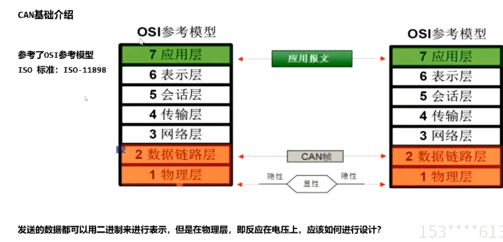

## 06 CAN基础
> ### 目录
> 
> ### 1 基础介绍
> 传输速率最高1M,距离与传输速率成反比
> 120欧姆电阻，提高干扰能力，吸收反射信号
> 
> 
> ISO-11898
> 
> 物理层
> 
> 优先级仲裁，ID越小，优先级越高
> 
> 帧格式
> 
> 数据帧的两种帧格式
> 
> 错误检测
> （发送方bit monitoring和Ack check）
> 
> BUSoff状态(在后续状态管理的内容中介绍)
> tec指的是发送错误的counter,32帧错误就会导致busoff
> rec指的是接收方的错误，
> tec和rec都是硬件中自己处理的，参考11898
> 
> ### 2 CAN同步
> 同步的基础知识
> 注意4个段 同步段 传播段 相位缓冲段1 相位缓冲段2 
> 
> 同步过程
> 利用缓冲段来进行缓冲同步
> 
> 
> 同步的分类：硬同步与重同步
> 硬同步发生在sof起始位，所有接收节点开始同步
> 重同步发生在硬同步的其他位置，调整seg1或seg2
> 
> davinci中的配置表格
> 
> 
> ### 3 CANFD基础介绍
> canfd 优势
> 
> canfd 帧结构
> 
> 
> ### 4 收发器 TLE9251
> 三个状态受到stb 引脚影响，拉低状态
> 
> TJA1043 收发器
> 
> ### 5 can硬件配置流程
> 配置Port口
> 
> port口找到复用关系
> 
> 配置复用寄存器
> 
> 
> 查找中断号
> 
> 在CAN技术手册中找到CAN00在davinci_cfg所对应的名字
> 
> 
> ### 6 调试流程
> 检查收发器
> 
> 看看tx rx引脚 配置是否正常
> 
> 根据上位机报的错误分析
> 位填充错误，看看是否加了120欧电阻
> 
> ### 7 创建使用DBC
> 参考dbc rules文档
> 
> 定义信号，定义报文，定义网络节点
> 定义报文分配信号，网络结点分配报文
> 
> 
> com与dbc之间的关系
> 
> attribute属性（诊断报文，普通报文）
> 可以用于CAN interaction Layer交互层
> Network Management 网络管理等方面实现
> 
> Davinci cfg使用DBC文件
> 
> DBC配置如下：
> 
> ### 8 davinci 配置
> 首先把dbc input进来
> 
> 后续有更改的话，update 配置文件
> 会加上 pdur can canif com
> 