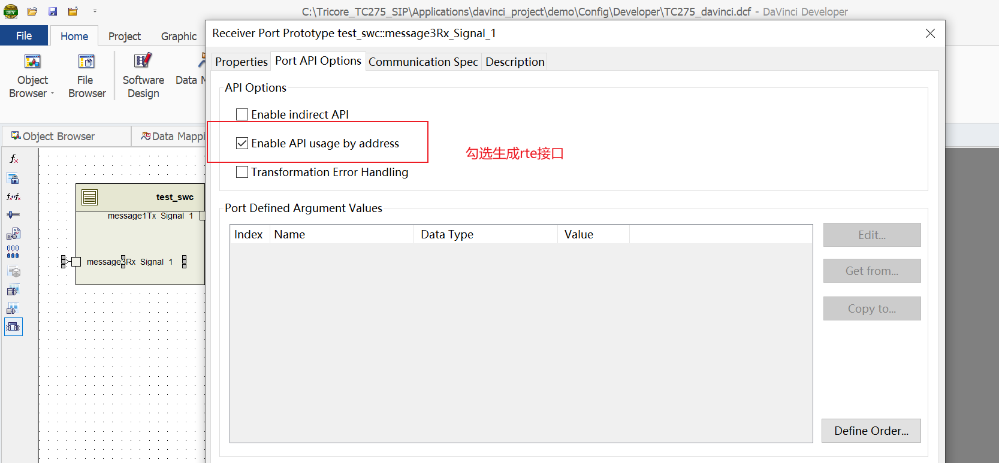
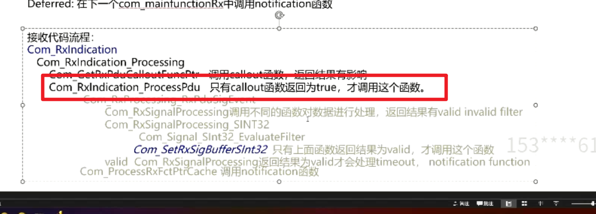

## 10 swc到com
> **10.1 com 模块介绍**
> 总共三个阶段
> 1）调用rte接口，将信号值存到buffer中，并且设置发送请求
> 2）com_mainfunctiontx检测到发送请求，调用下层接口，将报文发送出去
> 3）收到tx comfirmation
> 
> **10.2 com 模块 实操**
> **发送第一阶段 swc和bsw配置**
> 进行data mapping，把data element和signal进行关联
> 
> swc中关联dbc中的signal
> 
> 创建port口（tx和rx）
> 
> 
> 
> 在swc中创建 port interface 
> 
> 
> 在swc中指明runnable使用者
> 
> 
> 对port口配置（初始值，enable api用于生成rte接口）
> 
> 
> 在bsw层关联 （com层和swc层）
> 
> 
> swc代码中调用rte接口
> 
> 还需要在bsw中配置com层ipdu发送模式
> 配置成direct模式
> 信号配置成triggered 模式
> 
> 
> **10.3操作讲解**
> 注释，delegation port就是在ecu composition层面的port
> 
> 显式调用与隐式调用
> 显式调用，rte直接调用com_send
> 隐式调用是先存到buffer中，在task中调用com_sendsignal
> 
> 配置选项，transfer property:
> triggered 是调用了com接口的话就会触发消息传输
> 配置决定是否会设置发送请求
> 
> 
> **10.4 tx filter实操**
> 分成两种发送模式 txModeTrue txModeFalse
> filter决定发送的模式（true mode false mode）具体是否发送，是由模式里配置的内容决定的
> 只要有一个signal为ture,message就是true的发送模式，signal全是false，则message才是false
> 因此每个signal发送都会有true和false
> 
> 
> 
> com filter设置在0-2000之间
> 
> 为了让false工况下也能发送出报文，因此修改txModeFalse
> 
> 
> 总结：第一阶段流程
> 调用rte服务函数，在rte里面调用com_sendsignal,评估filter,设置发送请求
> 
> **10.5 com tx发送第二阶段**
> 发送第二阶段，主要是配置发送的mode
> direct,在下一次com_mainfuntiontx中传输消息，和number of repetitions搭配使用。表示trigger events触发后，又发了几次报文，
> 
> periodic 周期性，在mainfunction中设置，time_offset和time period应为mainfunction 的整数倍
> 
> 
> 发送第二阶段总结
> 
> 在调用pdur_comtransmit前调用callout函数，传入参数为pdu id和info,返回结果是true的情况下，才会调用pdur_comtransmit,很重要，可以自定义实现
> 
> 
> **10.6 com发送第三阶段**
> 每个signal都有一个notification,收到tx confirmation的时候就会调用这个notification函数
> 参数决定了在什么位置被调用
> 
> **10.7 Com Rx阶段**
> com接收分为两个阶段
> 通过com_rxindication把数据存到buffer中
> swc通过rte接口读取信号值
> 
> 接收第一阶段
> 调用com_rxindication后，先调用 ipdu allout函数，如果返回true，才进行后面的处理 
> 
> Rx filter
> 用于确定接收事件是否转发给应用程序
> 只有满足filter，才把数据发送buffer中
> 
> notification (deferred、immediate)
> 
> 接收代码流程
> 
> 接收第二阶段
> 有三种读取signal的方式，显性写，隐性写
> 默认选择explicit by argument
> 
> 