## com 进阶
> ### 1 可配置功能
> **Update Bit 功能**
> 一般在通讯矩阵中就已经定义好了，针对signal的功能
> 当signal没有更新的时候，不想进行响应
> 
> 在某个signal进行更新后，那么将这个signal对应的updatebit置上，在发送第二阶段或是第三阶段清除ub,取决于配置，
> 接收过程中，如果ub没有置上，则不对signal进行处理
> 
> 
> **Deadline monitoring**
> 由于有updatebit 存在，就可以知道message和signal多久没更新过了
> 对于rx还可以配置额外的replace的操作
> 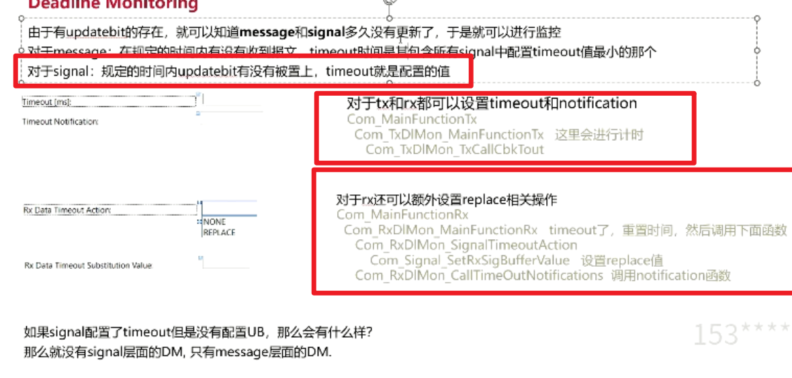
> 每个signal都有timeout参数
> 对于message，timeout时间是所有signal中最小的
> 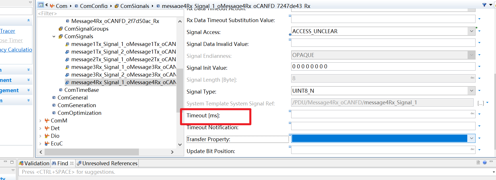
> **signal group**
> 一些signal之间需要保持一致性，先存到shadow buffer中，只有调用send signal group时候，才把所有的signal值一起copy
> 
> 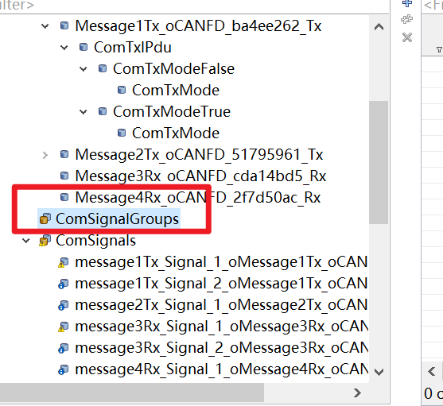
> 发送
> 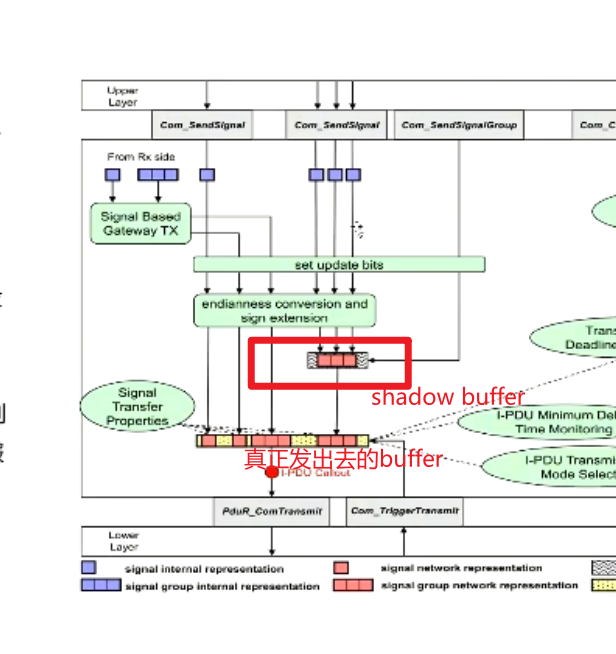
> 接收
> 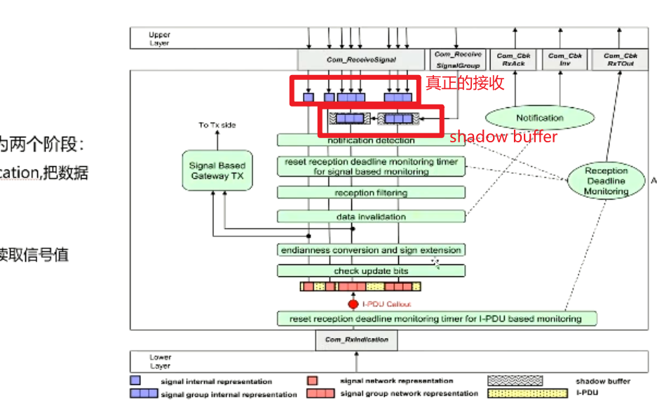
> 注意事项
> 所有的signal都要在一个ipdu中
> 先调用com_sendsignal再调用com_sendsignalgroup
> 
> 
> rx与此相反
> 
> **minimum delay time**
> 对于单个tx ipdu,连续发送两次ipdu的最小间隔
> 需要是tx time base的整数倍
> 比较容易出错
> 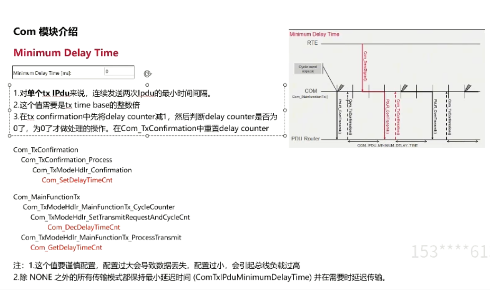
> 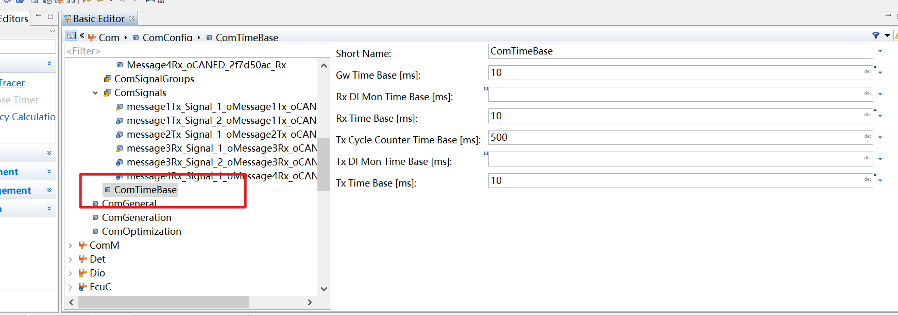
> ### 2 gateway 实操
> **com gateway**
> pdur的gateway是报文的转发
> com gateway是信号的转发
> 一共四个阶段
> 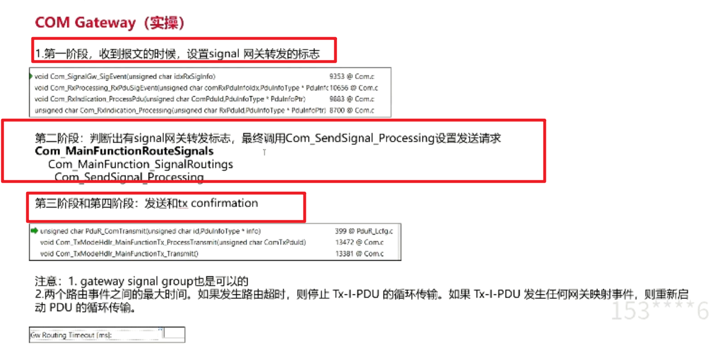
> **实操过程**
> gateway mapping 
> 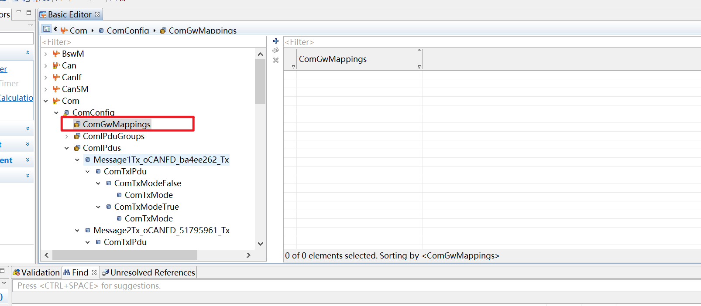
> 配置 comgwsource (只能有一个)
> 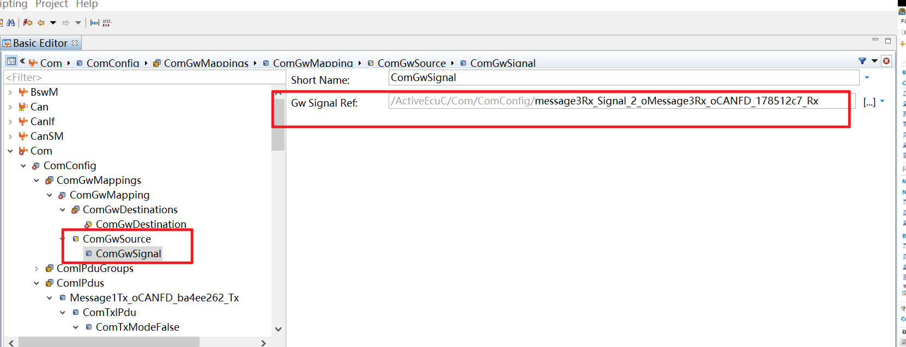
> 配置 comgwdestination（可以有多个）
> 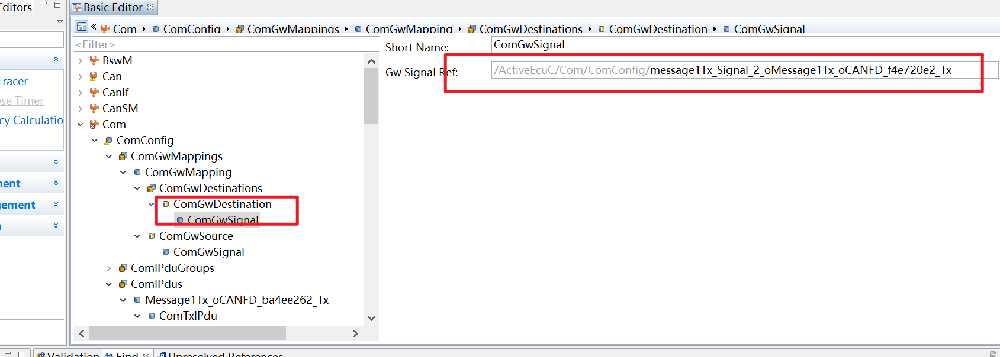
> 打开signal gateway
> 
> 把信号配置成trigger模式
> 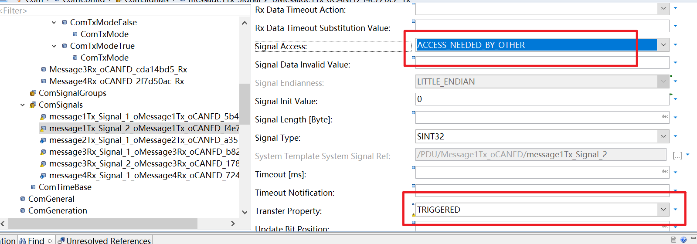
> 信号传输
> 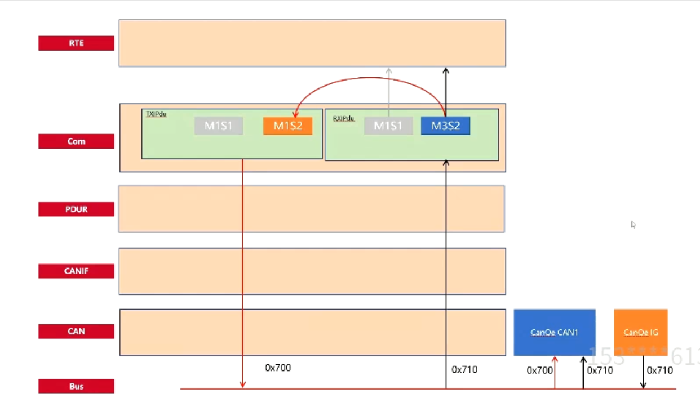
> 发生问题后先判断第一部分状态
> 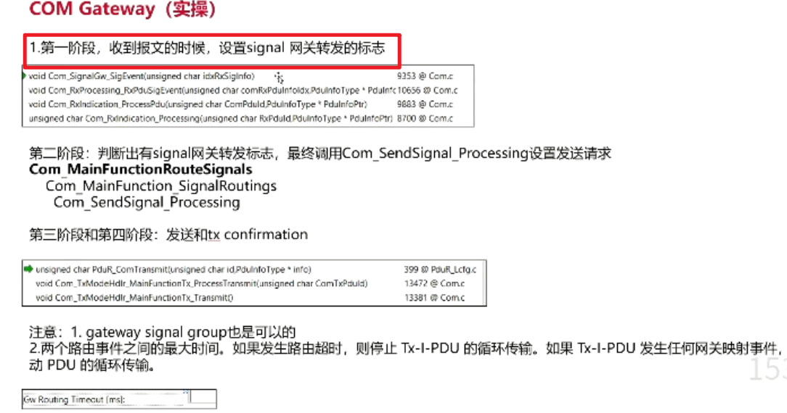
> 
> 没有调用 routeSignals
> 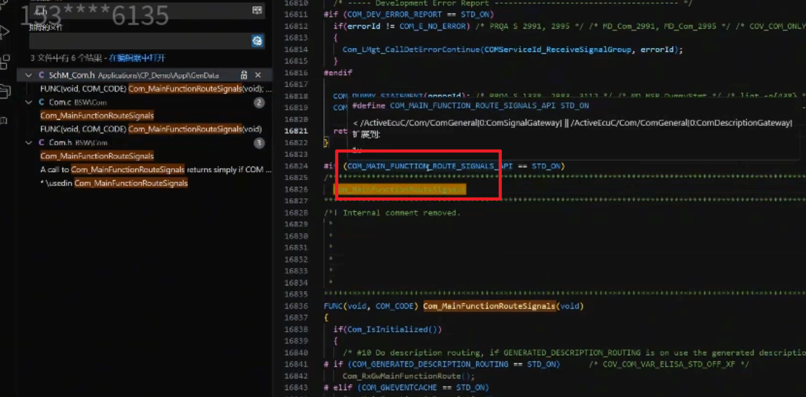
> 手动添加代码 routesignals
> 
> 结果正常
>  
> ### 3 其他功能
> **IPDU group**
> ipdu类似message
> 一般是发送和接收两个组，可以达到只接收不发送的行为
> 
> 案例分析，周期不准可以通过设置offset来避免某个时间段集中发送
> 
> ### 4 can协议栈总结
> com 模块架构
> tx 发送三个阶段
> 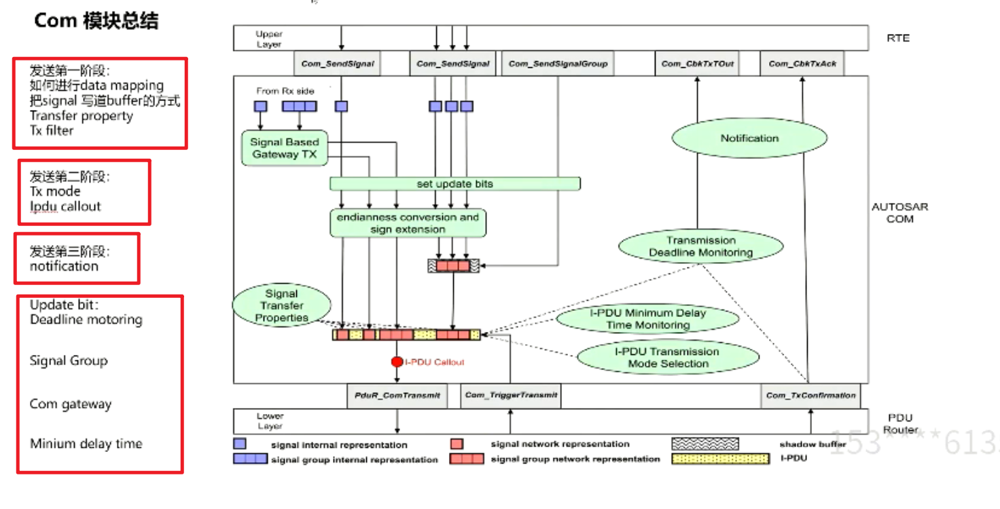
> rx 接收两个阶段
> 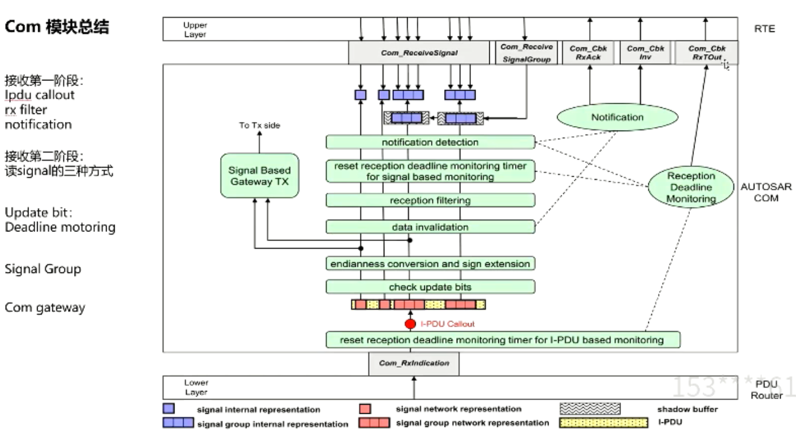
> 黑色部分数据流 黄色部分控制流
> 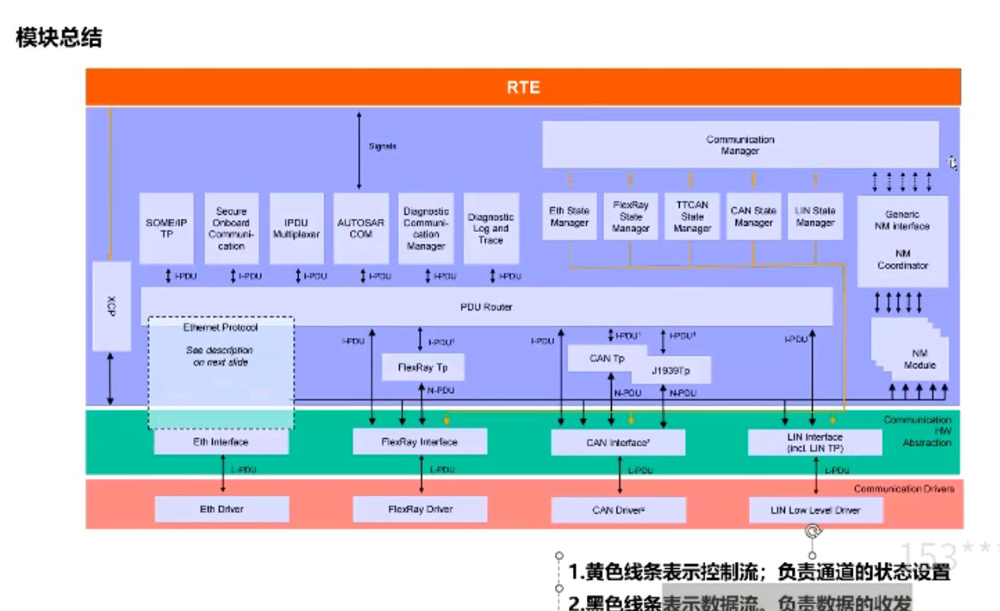