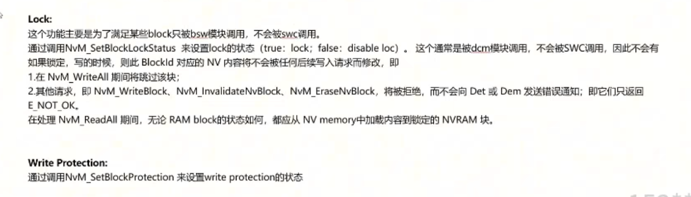
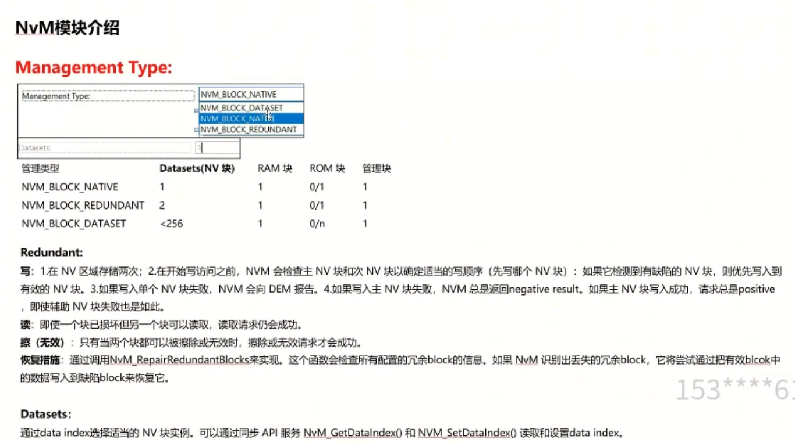
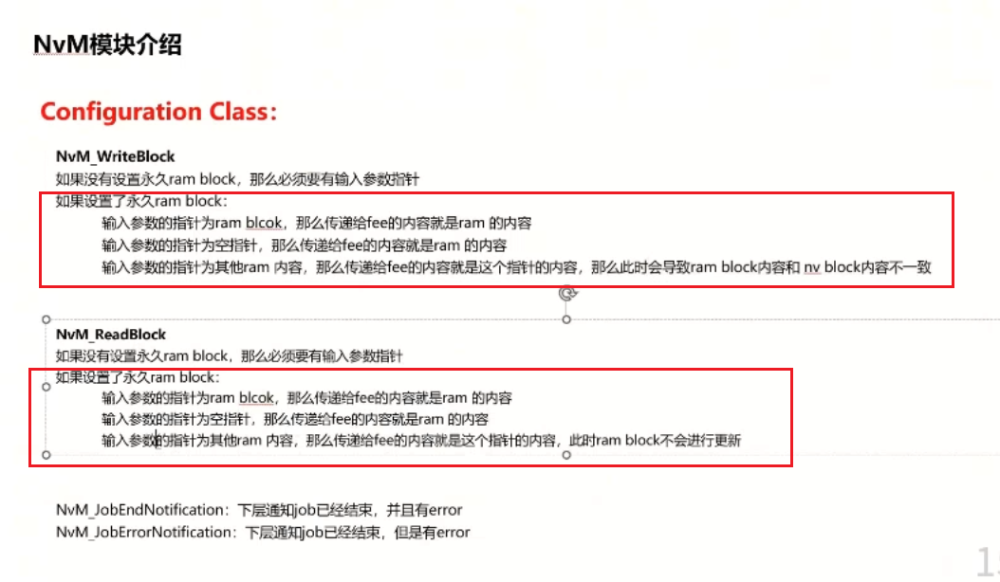
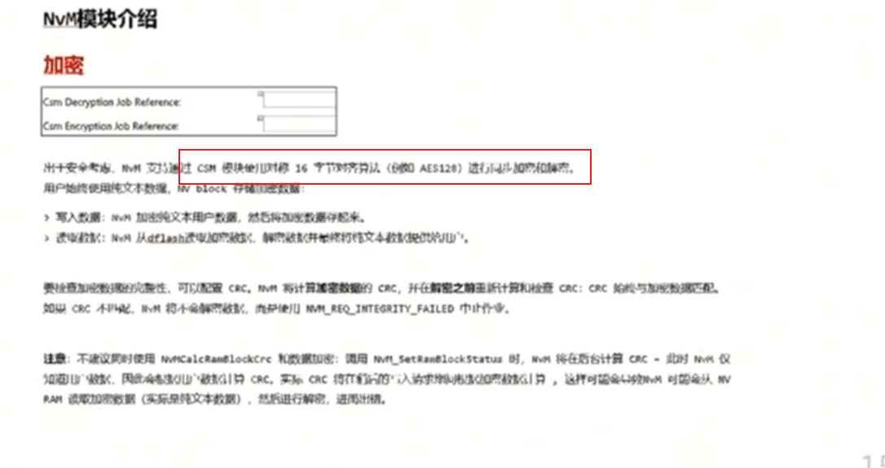
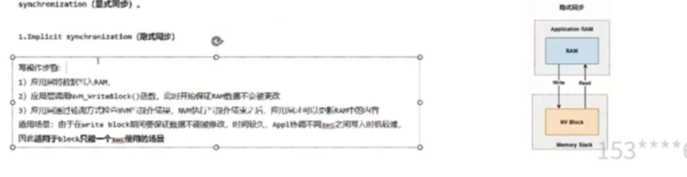
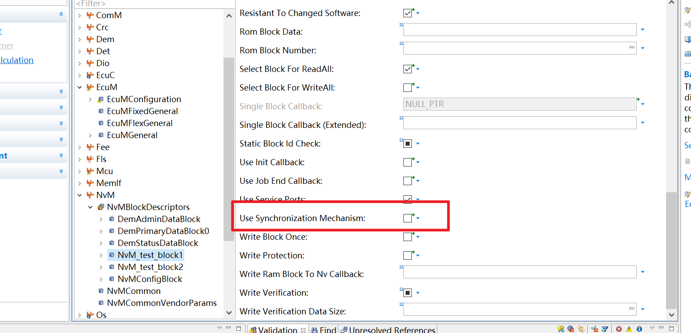
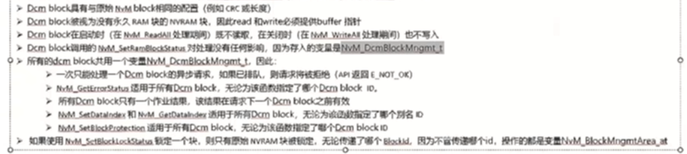

## NVM详解 
> ### 1 NVM模块理论介绍
> 四种block：
> nv block 要存到nvm中的block,通过fee的flash
> \ram block 存到ram中的block，是app和nvm block共享的数据
> \ rom block 存在flash中，用于恢复
> \ admin block 包含nvram bloxk 所必须的ram数据
> 
> **block状态跳转**
> nvm_blockmngmtarea nvramattributes
> bit0代表是否valid
> bit1代表是否changed
> bit4代表是否lock
> 
> valid和change状态（只是ram block的状态）
> read block后，状态从Invalid转为valid,(保证了ram block和nv block一致)
> 也可以通过api手动更新
> 
> 
> lock状态
> 通常被dcm模块调用，防止被swc调用
> 如果锁定，写的时候，则此block id对应的nv内容不会被后续写入请求修改
> wrIteall会跳过这个块
> read all期间，无论状态如何，都会从nv memory中加载内容到锁定的nvram
> 通过setblock protection 设置写保护
> 
> **management type**
> native,redundant(冗余)，需要fee中再加一个nvblock块,dataset
> 
> 
> **configuration class**
> 可以被调用的api接口，一般都采用class 3
> geterrorstatus:重要的信息，获取block的信息状态
> eraseNvBlock 只有优先级为0的block可以被擦除
> 
> 重要的api
> Nvm_setramblockstatus，设置ram block的valid和changed状态 ，true表示ram已经更改，并计算ram的crc,在writeall期间写入。
> repairredundantblocks，检查冗余block，尝试通过有效block写入缺陷block
> 
> writeBlock\readBlock 注意有没有ram block的配置
> 设置ram block后，传递空指针后，也是更新ram中的内容
> 
> **优先级**
> 没打开优先级的话，是通过队列的形式，先进先出
> 多块请求优先级很低的job
> 对相同block id的读写操作，算一个job
> 
> 
> 
> 
> **同步请求**
> 调用时立即执行
> 
> **异步请求**
> 有mainfunction参与,最主要区别
> polling方式的异步调用
> write_block只是写一些标志
> 在nvm_mainfunction中进行任务处理
> 
> callback方式的异步调用
> 
> **cancel流程**
> 
> **readall流程**
> 会在初始化阶段调用一次
> 
> 
> block id为1的block ,（自动配置的block） nvm configure
> 代表 nvm memory layout的编号，自动配置，必须打开crc
> 
> **nvm配置更新问题**
> 改变compiled configuration id 的值，启用动态配置信息，不抵制配置更改,readall后再进行writeall 尽量发生切页动作
> 
> **writeall**
> 下电过程中调用writeall，把所有的值写入
> 确保id为1的block是最后处理的block
> 注意cancel writeall和kill writeall
> 
> **cancel wirteall 时间过长的问题**
> 在cancel中配置超时时间，时间到了自动kill writeall
> 
> 
> 进行计时
> 
> **nvm crc**
> 可以配置crc16和crc32
> nvm将数据和crc一起传给fee
> fee中的data数据是nvm的data和crc的结合
> mainfunction的crc计算 异步完成
> 
> 
> 
> **crc 放的位置**
> 配置项为false的情况下需要流出crc内存的量
> 建议这个配置项一定要打开
> 
> 
> **crc处理的能力**
> 可以处理的最大字节数
> 
> **crc compare mechanism**
> 打开功能后，nvm会保存成功读写操作的crc值并存到变量blockname_compcrc中
> 可以根据crc的值判断是否发生变化，是否需要执行存操作
> 减少不必要的写
> 
> 
> **calculate ram block crc**
> 比较各个位置的crc，减少readall期间的时间
> 减少不必要的读
> 
> **数据加密**
> 使用csm数据加密与解密
> 
> **NV RAM 数据处理**
> 某些情况下需要对nvram的数据进行一定的处理（比如实现自己的crc）
> 通过callback进行处理
> 
> 对csm job结果的处理
> 
> **写保护**
> 不能再进行写
> write block once 是允许写一次
> 
> read all 对写保护的影响
> 注意这两个数据的选项
> 
> **block id check**
> crc还会计算block id
> 
> **block length check**
> 最好是要打开这个选项
> 有永久的ram和永久的rom
> 会在编译阶段check length
> 建议打开block length check strict，这样永久的ram可以大于nvm block的长度
> 
> ### 2 NVM与其他模块之间的关系
> **nvm 与swc之间的交互**
> 1 使用 use service ports
> 2 bsw中connect port
> 3 swc中创建service ports
> 4 runnable 添加access point
> 
> **同步机制**
> 同步背景 多个swc访问一个nv block
> 
> 隐性同步 (单个swc调用)
> 通过轮询的形式访问nvm block
> 
> 显性同步
> 会多了一个ram mirror （读写ram）
> 只是copy ram mirror的时候不可被更改
> 
> 
> 
> **NVM和DCM之间的交互**
> dcm有专门的dcm  block
> 
> 区别如下：
> dcm:有专门的 block mng area
> 
> 
> id 也不一致
> 
> 其他区别（没有 永久ram）
> 所有dcm block 共用一个变量 dcmblockmngmt_t
> 因此一次只能处理一个dcm block的异步请求
> 
> **nvm和dcm之间的交互**
> dcm block的锁定状态
> 
> 扩展
> 
> **nvm和bswm之间的交互**
> 有个block status information选项
> 有个port可以反馈block状态
> 
> readall和writeall也是在bsw之间交互
> 
>  **readall wirteall实操**
> readall
> 
> 
> 手动创建readall代码
> 
> 
> 
> 在单个block中选择readall选项
> 
> 观察readall代码
> 
> **nvm与bsw之间的交互**
> 流程图
> 
> multi block  
> 
> ### 3 nvm进阶功能
> **polling mode**
> 通过polling 来确认状态，不需要end callback
> nvm和fee 都有polling mode
> 
> 
> **init callback**
> 提供灵活的功能，实现恢复默认值
> 
> **notification**
> 状态信息回调、job end callback，两个信息的回调
> dcm block 不会触发notification
> 
> **mode switch**
> fast mode(fls 读写)
> 
> **底层的关系 memif和nvm**
> 
> nvm job result（可能出现的问题）
> 
> **memmory 时间优化**
> 通用方案
> 
> **常见的问题**
> memif_uninit
> 
> shutdown 数据损坏
> 
> **nvm 的default value**
> 