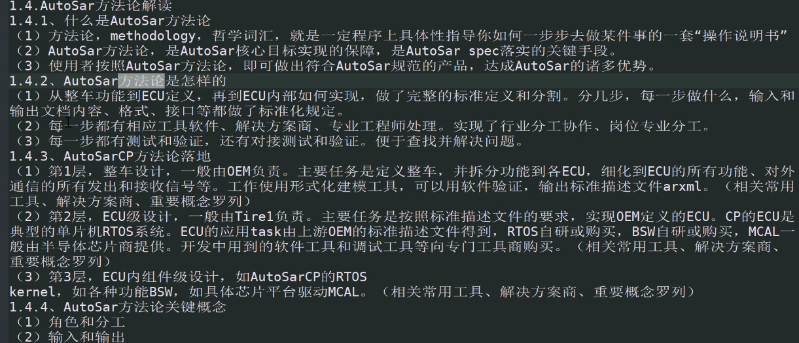

## 方法论
> 操作说明书
> 从整车功能到ECU定义
> 第一层 整车设计，OEM负责，定义整车
> 第二层 ECU设计，Tire1负责 (相关常用工具)
> 第三层 ECU内组件级设计，如AutosarCP的RTOS

### 相关岗位
> 整车级开发
> swc description\ECU resource description\system constrict description
> ji

### 如何学习
> 两篇博客
> arctic_core 工程代码
> 

### 学习指导点播
> 