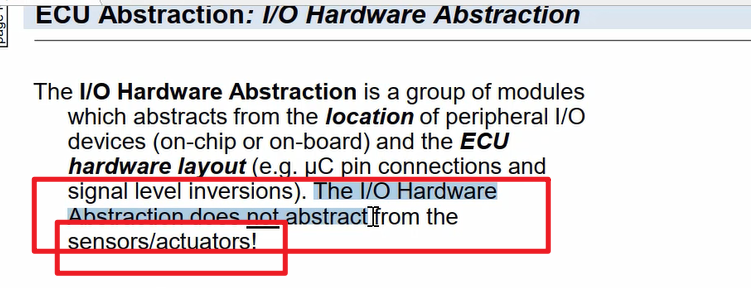
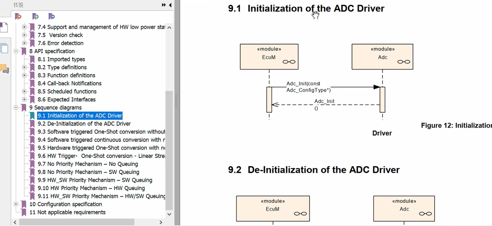

## 2.2 iohwab 模块解读
> 三大学习资料 (software architecture\ artic core源码、 iohwab文档)
> 
> 
> 
### abstraction 
> 没有服务层，直接就是ECU抽象层
> 关心的是外设，不关心sensor和actuators
> 只是实现驱动
> 不同的IO设备，可能都通过同一个IO service访问
> 
> 
> 
> 性质： mcu 独立 依赖ECU
> 任务：向更高层隐藏ECU板端性质
> 
> #### .h文件
> DET: default error trace 开发时错误追踪
> 
> #### .c文件
> 
### IO文档
> IO中的Abstraction
> 
> 目的：哪些swc与其相关，如何定义一个通用的port
> 不提供capi，不去管具体的功能域
> 
> 简写
> 
> 约束
> 
> 可能用到的其他模块 （mcal \ comm(external..) \os也要具备能控制IO的能力）
> 
> 
> ECUM（init）\DET\BSW sche
> 
> DCM （类似UDS）
> 
> 7 功能描述
> API0 内部接口（不同厂家可能不一样）
> API2 autosar interface , api2是autosar规定的名字（不同厂家API2相互兼容）
> 
> 
> 案例
> 
> 
> 
8 API 定义
> 
> 
> 
> function
> 
> callback notify
> 
> 时序图
> 首先ECUM 发出ADCinit请求，经过IOHWAB,然后IOHWAB初始化，请求adc group notify 使能 
> 
> 通知获取电压值
> 
> 
> 读取电压值
> 

### io模块文档 sws
> 5 与其他模块的关联 mcu(内部时钟) port
> 
> 7 function specification 错误定义
> 
> 
> 8 API specification API定义
> 
> sequence diagram (各个函数定义的流程) 11种模式
> 
> 
> 