## 2.1 autosar 细节学习资源
> 学习资源
> 官网很重要，重点是starndards下的几种autosar标准
> 两篇博客
> 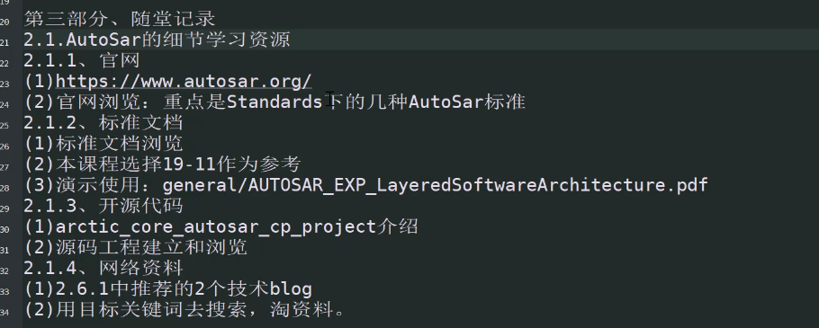
## 2.2 AutosarCp分层和分模块解读
> Autosar标准起的名字和概念
> 三个粒度分层：App\RTE\BSW
> 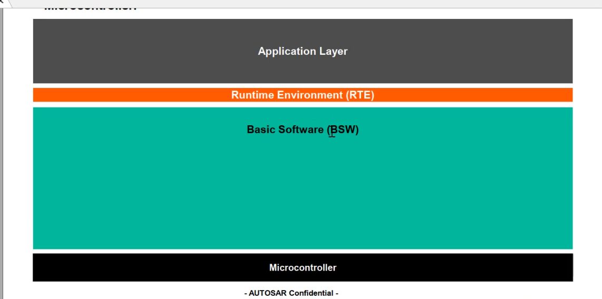
> 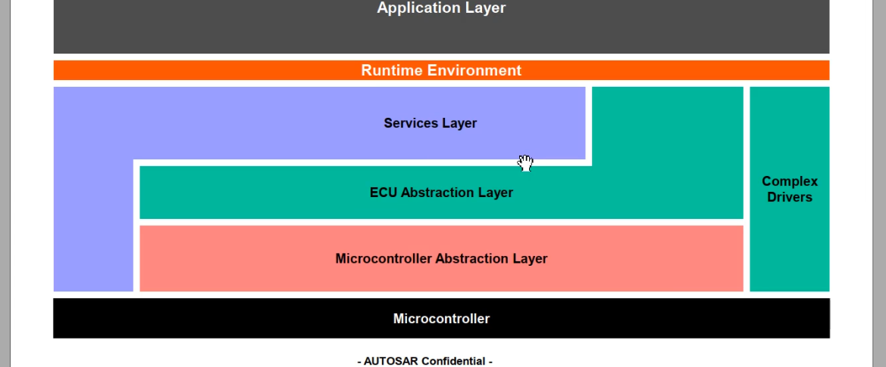
> detail view
> 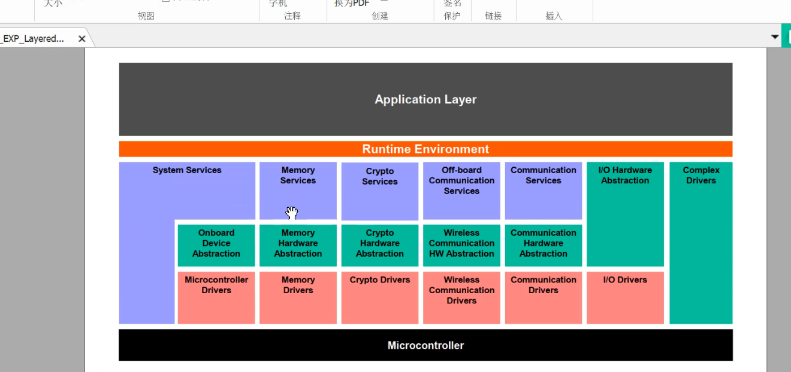
> BSW分为三层4部分：service层、ECU抽象层、MCAL微控制器抽象层
> 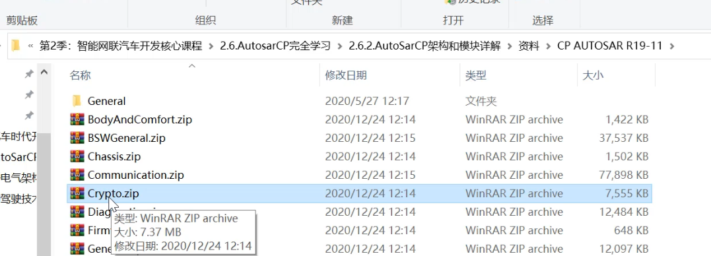
> 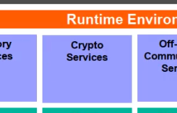
> BSW纵向分模块

## 2.4 autosarCP各软件分层解读
> ### BSW各模块分层
> 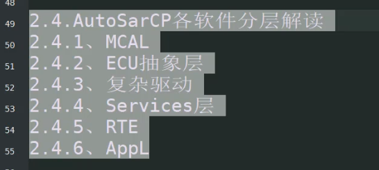
> 2.4.1 MCAL
> 内部驱动（外部驱动在ECU层） MCU级别抽象、芯片无关
> 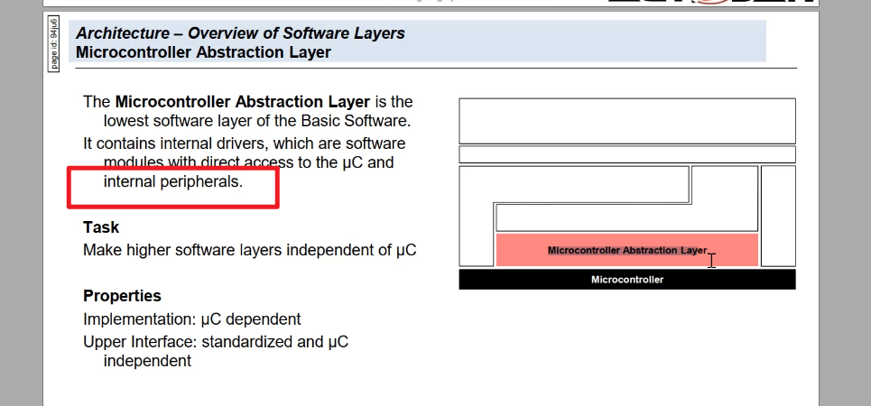 
> ECU 抽象层 （外部设备驱动） 板卡级别抽象、真正的硬件无关
> 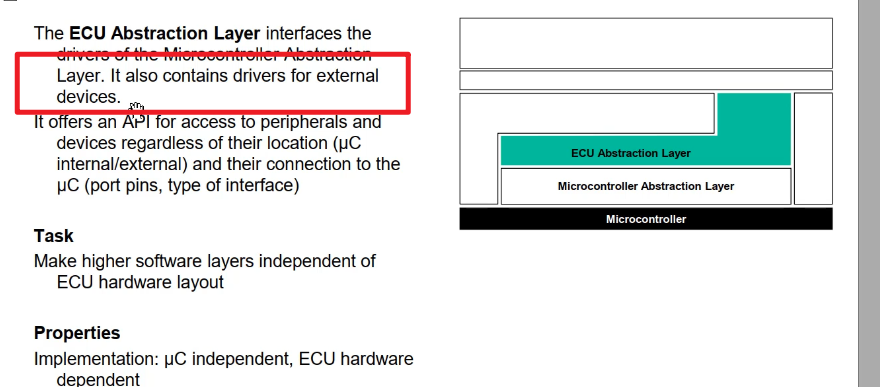
> CDD 复杂驱动（非标准设备）
> 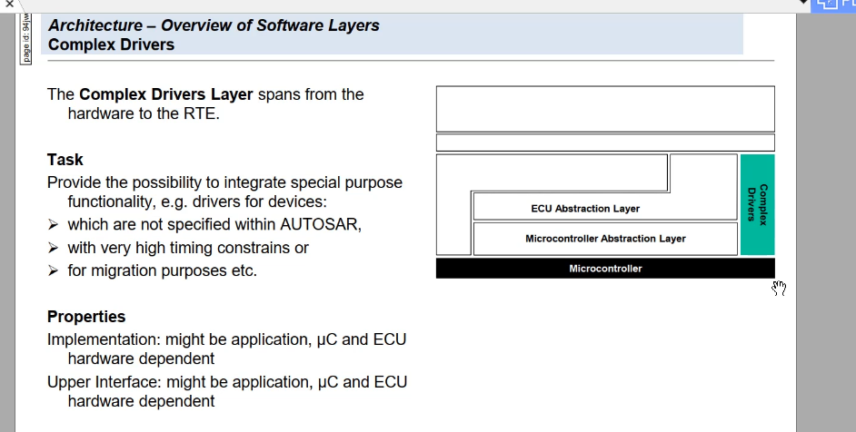
> services layer 服务层（逻辑层面 OS 程序流监控 与APP存在相关性），IO的服务层和ECU抽象层放在一起
> TASK 提供APPL基本服务支持、RTE、bsw
> 实现，大部分mcu ecu无关,有一部分os相关
> 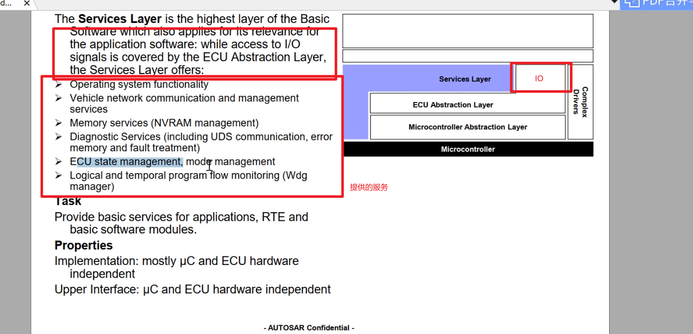
> RTE层 runtime env运行时环境 （汽车是一个大的网络，对各个节点抽象，操作可能会跨ECU (RTE会区分两个SWC是否在一个ECU内部)）
> 提供通信服务（app和sensor传感器\actuator执行器） APPL可以不考虑是否要跨ECU,RTE去处理
> 上层不再分层，只会分components(swc),多个SWC通信依赖RTE、对下依赖RTE
>##### 任务：让swc无关具体的ECU
> 实现： 与ECU和APP相关 对上： 与ECU无关
> 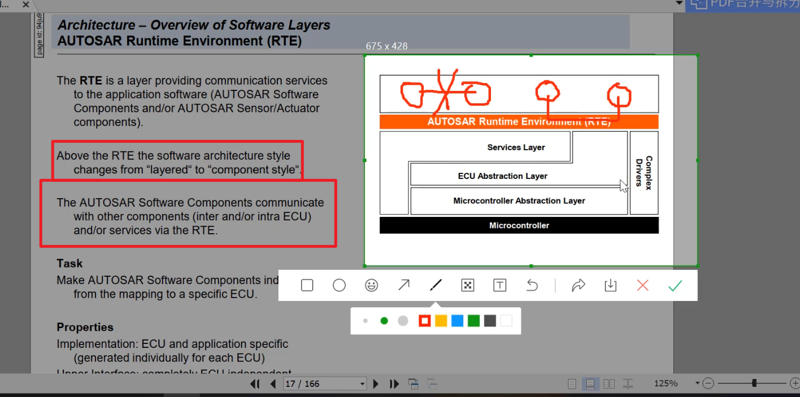
