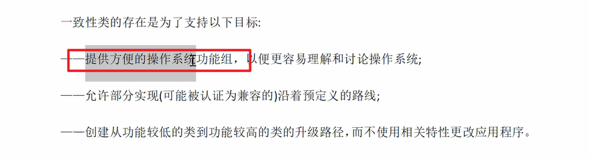
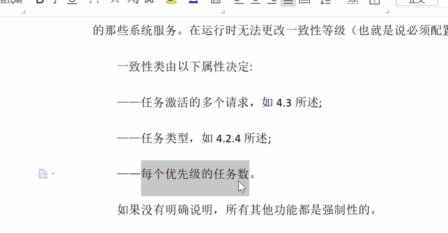
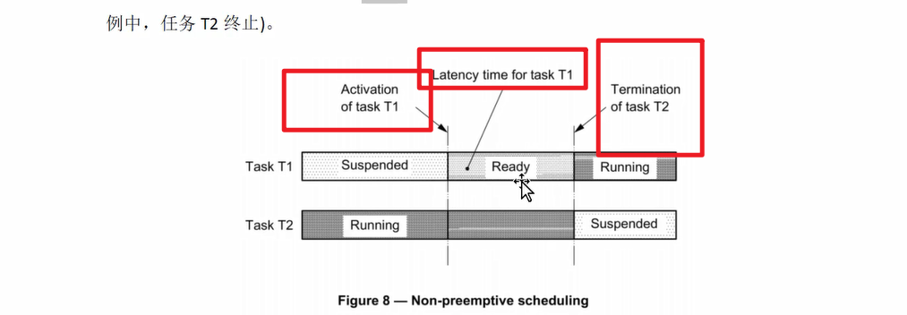

## OS学习概述
> 基本点
> osekOs 约等于 80%的autosar
> 学习规定的特性与行为
> 
> OS实现价值
> 
> 课程目标
> 理解方法论
> 
> 学习资料
> 

### 1 标准文档解读
> 静态分配对象
> 
> 上报错误
> 
> 系统服务api 类似cmsis
> 标准接口 可移植性 可伸缩性
> 
> 
> 
> osek 架构
> 
> 每一个一致性类的接口是相同的，不同的类别可能不同
> 

### 2 任务管理
> 类似RTOS
> 
> 同步
> 
> 警报上报
> 
> 优先级配置
> 优先级数字越大，级别越高
> 
> 
> 
> 一致性类
> 
> 
> 四个一致性类 划分
> 根据以下类型划分
> 
> 1和2区别是是否支持多重激活
> 
> 一致性之间的区别图（res ）
> 
> os 与osektimeos
> 
### 任务
> 并发和异步执行
> 
> 基本任务（类似空闲任务，处于活动状态的机制）和扩展任务
> 基本任务终止条件
> 
> 扩展任务 可以wait event,处于waiting 状态
> 
> 
> 基本与扩展区别
> 
> 激活的概念 挂起态转为运行态，运行一次称为一次激活
> 确定从第一行代码执行
> 
> 挂起与freertos中的挂起不太一致，更像是任务自我结束时的一种等待态,任务结束后需要掉用terminate(),主动结束
> waiting状态主要用于同步
> 
> 
> 
> #### 基本任务 与扩展任务比较
> 
> #### 激活一个任务
> 启动不能通过传参
>  
> 任务激活的多个请求 (bcc2 ecc2)
> 处于激活状态下再进行一次激活
> 
>  
> 
> #### 任务切换
> 比较不同的是 要把调度器看成一种资源
> 哪个任务再运行,哪个任务就占有了这个资源
> 
> 可以通过某种手段,保留调度程序,避免程序切换,直到被释放
> 
> #### 任务优先级
> 数字越大优先级越高
> 
> 
> 
> 
> 调度原理
> 
> ####  4 调度策略
> 完全抢占式调度
> 核心在于只要有更高优先级的任务在就会立即一次调度
> 
> 注意同步，任意时间都会被打断
> 
> 
> 暂时关闭操作时，类似关中断的方式，getresource 
> 阻塞调度
> 
> 重调度
> 任务级别激活任务 其他任务中activation
> 显示wait调用
> release resource
> 中断返回
> 
> 
> 最好不要手动写sche,因为很多情况都会自动sche
> 
> #### 非抢占式调度
> 仅仅通过显示调用sche程序
> 
> 非抢占式需要等到下一个重调度点
> 
> t2给了t1一个ready信号
> 
> 重调度点
> chaintask 类似自动终止
> 
> waitevent可能不会导致重调度
> 
> #### 设置任务组
> 
> 任务组可以结合抢占式和非抢占式
> 
> 用内部资源实现非抢占式
> #### 混合抢占式
> 如果运行的任务是非抢占式的，则执行非抢占调度器
> 
> 非抢占任务意义
> 
> 任务调度策略的一些参考
> 
> #### 选择调度策略
> 设置任务优先级和可抢占属性
> 
> 任务类型与调度策略无关
> 
> #### 任务的终止
> 任务只能自行终止，（terminate task/ chain task）
> 