## 03_2 OS
##### 应用程序模式 （很多套应用程序）
> general 一般性描述
> 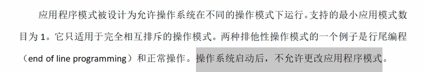
> 应用程序模式范围 （ECU内部烧录了很多bin文件，比如工厂测试模式，flash编程或正常运行）
> 各自模式互相独立
> 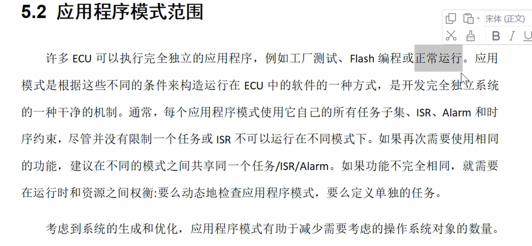
#### 启动性能
> 安全关键问题，启动时间必须非常短
> 调用系统服务前就应该确定参数
> 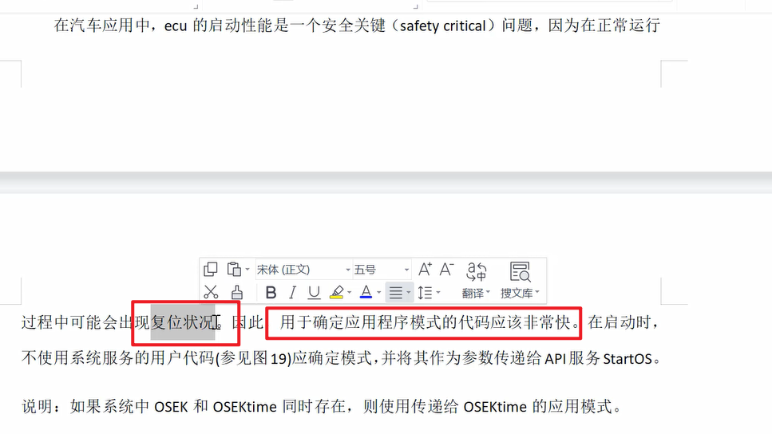
> 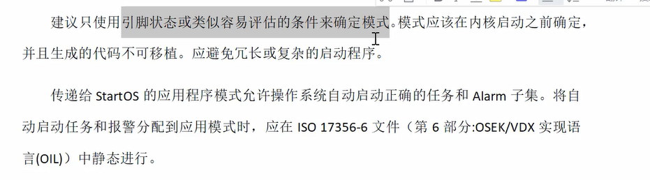
#### 应用程序模式支持
> 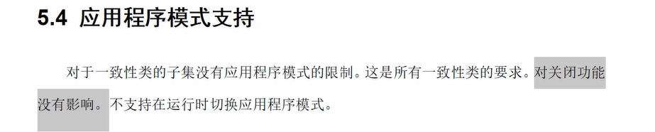
> 不支持运行时切换应用程序模式
#### 中断模式
> 中断处理 两类中断（挂载/不挂载 操作系统）
> 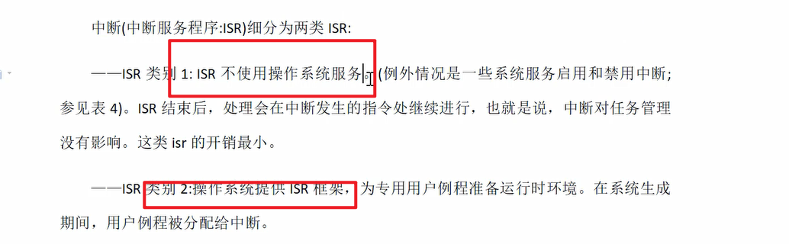
> 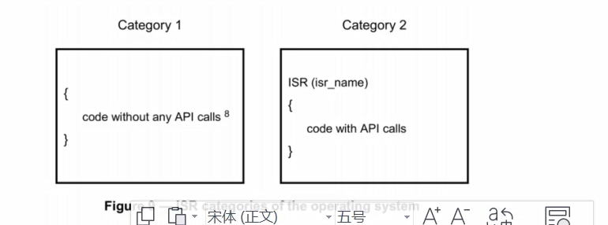
> ISR1 不使用服务，对任务管理没有影响，返回中断发生的指令处继续执行
> ISR2 系统提供ISR框架，为专用用户准备运行时环境。可以activateTask其他任务
> 在中断中调用的系统函数,ISR2是可以调用系统服务的
> ISR1不能acticateTask 
> 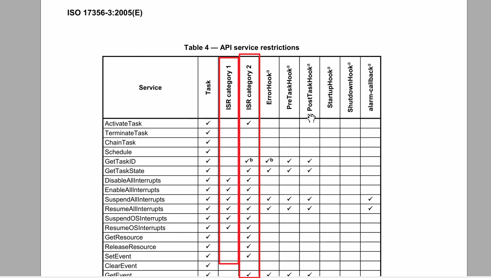
> 在ISR内部不能进行重调度，如果一个可抢占的任务被中断，并且没有其他中断是活动的，则重调度发生在ISR类2终止时
> 中断数量取决于控制器，中断由硬件调度，任务由调度器调度
> 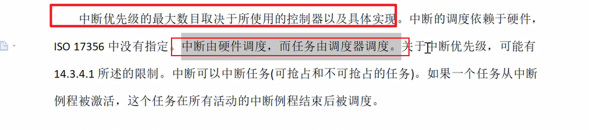
#### 快速禁用/启用API函数
> 保护短的临界区，关中断
> 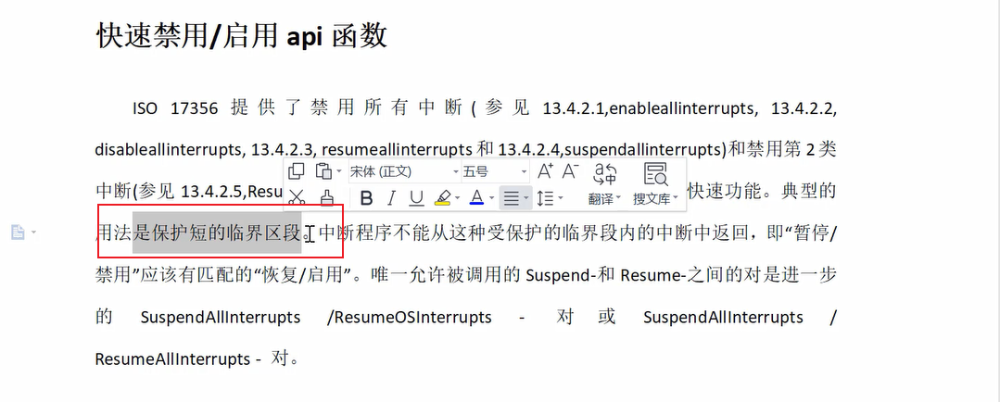
#### Event机制
> 异步机制，一种同步的手段
> 只提供给扩展任务，
> 启动从waiting状态的转换
> 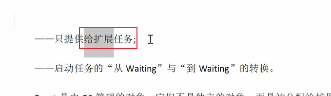
> 是OS管理的对象，已经分配给扩展任务，这个任务称为这些事件的所有者
> 激活扩展任务时，这些事件会被操作系统清楚
> 
> 任何任务都可以set，但只有所有者才能清除其事件并等待其事件的接收
> 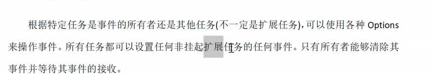
> event是扩展任务从waiting状态转换到ready状态的准则，设置 查询 等待 清除
> 
> 任何任务或ISR Category2 都可以为未挂起的扩展任务设置一个事件，从而通过该事件通知扩展任务任何状态的变化
> event的接收者总是一个扩展任务，因此中断服务程序或基本任务不可能等待事件，事件只能由拥有该事件的任务清除，基础任务不能使用OS服务清除事件。
> 注意，任务可能等待多个event，如果至少一个已经发生，则处于waiting状态的扩展任务将被释放到ready状态
> 
> 示例：扩展任务的同步
> 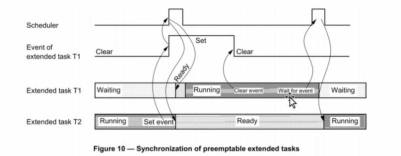
> 示例2：非抢占式的同步
> 只有在rescheduling点才会调度
> 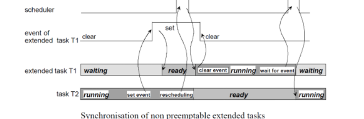
#### 资源管理
> 资源管理用于协调多个任务对共享资源的不同优先级的并发访问，例如管理entities(调度器)、程序sequences、内存或硬件区域。
> 对于一致性类都是强制性的（ecc,bcc）
> 也可以有选择的拓展，协调任务和中断服务的并发访问
> 资源管理确保（内部确保，不是用户确保）
> 对资源访问不会导致任务自身进入waiting状态，保证实时性
> 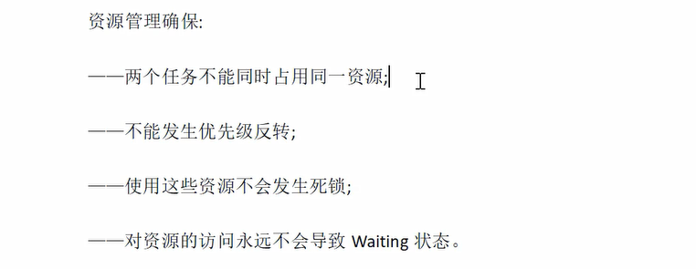
> 以下情况有用
> 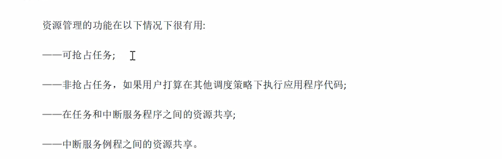
> 可以通过关中断防止并发
> 
#### 访问被占用资源时的行为
> 
> 规定了优先级天花板机制，不会发生任务或中断访问已占用资源
> 应保证所有资源释放后，中断服务程序才会被处理
> 禁止嵌套访问
> 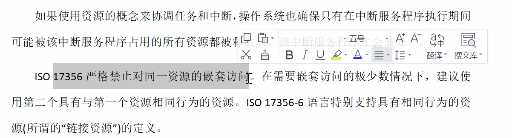
#### 使用资源的限制
> 当任务持有资源时，Terminate task waitEvent不能被调用，中断服务程序不能再资源被占用的情况下完成
> 后进先出释放资源
> 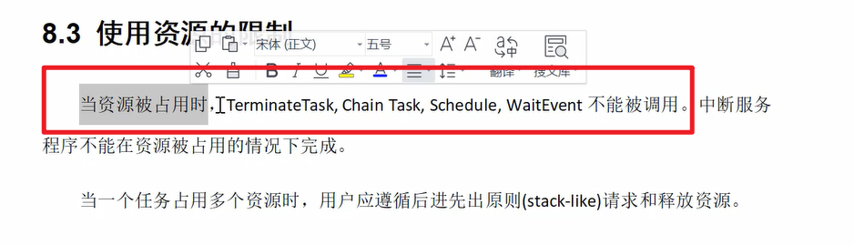
#### 调度器作为资源（cpu运行能力）
> 所有任务都可以访问的资源
> 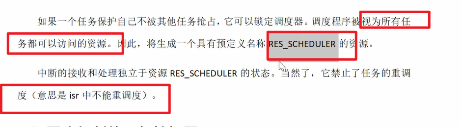
#### 同步的一般性问题
> 优先级翻转 （强制使用优先级天花板）
> 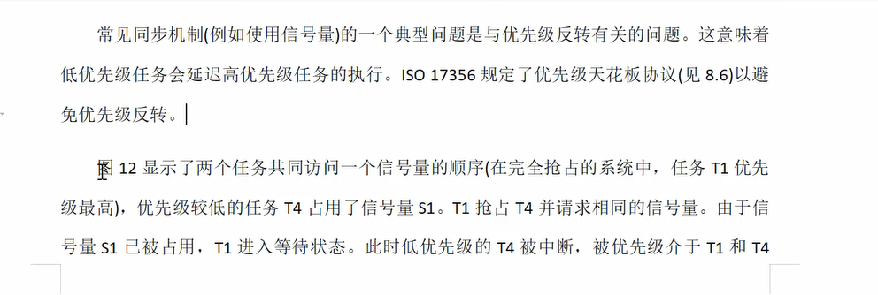