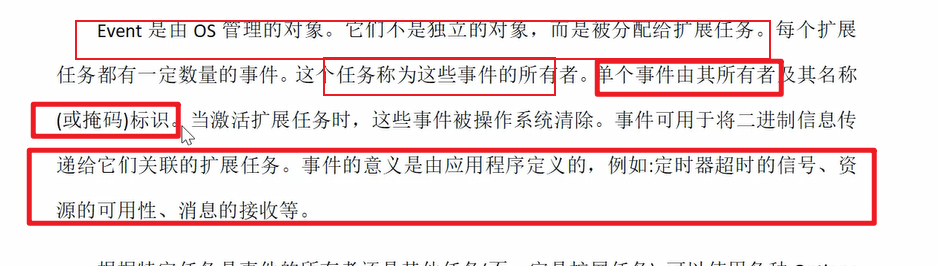
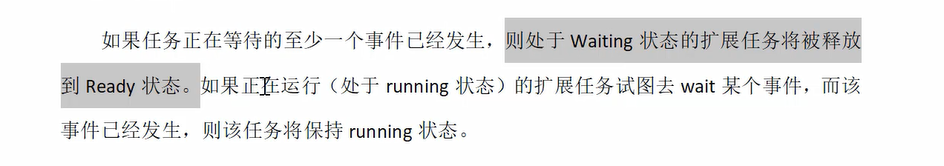

## 03_2 OS
##### 5 应用程序模式 （很多套应用程序）
> general 一般性描述
> 
> 应用程序模式范围 （ECU内部烧录了很多bin文件，比如工厂测试模式，flash编程或正常运行）
> 各自模式互相独立
> 
#### 启动性能
> 安全关键问题，启动时间必须非常短
> 调用系统服务前就应该确定参数
> 
> 
#### 应用程序模式支持
> 
> 不支持运行时切换应用程序模式
####  6 中断模式
> 中断处理 两类中断（挂载/不挂载 操作系统）
> 
> 
> ISR1 不使用服务，对任务管理没有影响，返回中断发生的指令处继续执行
> ISR2 系统提供ISR框架，为专用用户准备运行时环境。可以activateTask其他任务
> 在中断中调用的系统函数,ISR2是可以调用系统服务的
> ISR1不能acticateTask 
> 
> 在ISR内部不能进行重调度，如果一个可抢占的任务被中断，并且没有其他中断是活动的，则重调度发生在ISR类2终止时
> 中断数量取决于控制器，中断由硬件调度，任务由调度器调度
> 
#### 快速禁用/启用API函数
> 保护短的临界区，关中断
> 
#### 7 Event机制
> 异步机制，一种同步的手段
> 只提供给扩展任务，
> 启动从waiting状态的转换
> 
> 是OS管理的对象，已经分配给扩展任务，这个任务称为这些事件的所有者
> 激活扩展任务时，这些事件会被操作系统清楚
> 
> 任何任务都可以set，但只有所有者才能清除其事件并等待其事件的接收
> 
> event是扩展任务从waiting状态转换到ready状态的准则，设置 查询 等待 清除
> 
> 任何任务或ISR Category2 都可以为未挂起的扩展任务设置一个事件，从而通过该事件通知扩展任务任何状态的变化
> event的接收者总是一个扩展任务，因此中断服务程序或基本任务不可能等待事件，事件只能由拥有该事件的任务清除，基础任务不能使用OS服务清除事件。
> 注意，任务可能等待多个event，如果至少一个已经发生，则处于waiting状态的扩展任务将被释放到ready状态
> 
> 示例：扩展任务的同步
> 
> 示例2：非抢占式的同步
> 只有在rescheduling点才会调度
> 
####  8 资源管理
> 资源管理用于协调多个任务对共享资源的不同优先级的并发访问，例如管理entities(调度器)、程序sequences、内存或硬件区域。
> 对于一致性类都是强制性的（ecc,bcc）
> 也可以有选择的拓展，协调任务和中断服务的并发访问
> 资源管理确保（内部确保，不是用户确保）
> 对资源访问不会导致任务自身进入waiting状态，保证实时性
> 
> 以下情况有用
> 
> 可以通过关中断防止并发
> 
#### 访问被占用资源时的行为
> 
> 规定了优先级天花板机制，不会发生任务或中断访问已占用资源
> 应保证所有资源释放后，中断服务程序才会被处理
> 禁止嵌套访问
> 
#### 使用资源的限制
> 当任务持有资源时，Terminate task waitEvent不能被调用，中断服务程序不能再资源被占用的情况下完成
> 后进先出释放资源
> 
#### 调度器作为资源（cpu运行能力）
> 所有任务都可以访问的资源
> 
#### 同步的一般性问题
> 优先级翻转 （强制使用优先级天花板）
> 
> 翻转情况
> 
> 天花板机制
> 再有等待的时间，临时提升t4优先级至t1，避免t2 t3抢占
> 死锁机制
> 
#### 优先级翻转机制
> 每个资源静态分配自己的最高优先级
> 资源和任务都有自身的优先级
> 
> 临时提升
> 
> 
> 低优先级任务占有资源会有最大时间限制，（最先占用资源的t4 ）
> 
> 释放资源的时候会重调度
> 
> 临时优先级 ceiling priority
> 临时优先级被抢占时会被链表插在头部，这样会优先运行
> 
#### 中断级别扩展的优先级天花板协议
> 资源管理扩展到中断级别是可选的
> 应该给中断分配高于所有任务优先级的虚拟优先级
> 
> 
> ISR INT1 被pending住了
> 关掉了中断，不是中断没了，只是中断不能被响应
> 
> 
#### 内部资源
> 内部资源是用户不可见的资源，不能通过get release 寻址，用户task不可见，可用于实现避免不可抢占任务的多次重调度
> 
> 仅限于任务
> 该资源进入运行状态时自动获取，某些重调度点自动释放，类似sche调度器
> 
> 任务被抢占时，内部资源不会释放 
> 当内部资源分配给了多个任务时，不可抢占任务是一个特殊的组，其内部资源与分配的res_sche具有相同优先级，
> 为了避免不必要的重调度，可以采用内部资源形式实现
> 使用内部资源具有一定的优先级范围
> 
> 
#### 9 ALARM
### 概述
> 定时器警告，处理重复事件的服务 
> OS提供了两个阶段的概念处理此类事件
> 第一个阶段，重复发生的事件由具体实现特定的计数器记录 （计数）
> 第二个阶段，操作系统软件通过计数器向应用软件提供Alarm机制 （报警）
> 
> #### 计数器
> ticks度量
> 操作系统没有标准api直接操作计数器
> 操作系统负责再计数器溢出时管理Alarm的必要操作，以及如何溢出
> OS提供至少一个来自计时器的计数器
> 
#### ALARM管理
> OS提供激活任务、设置事件、告警超时回调等服务（ALARM触发后）。报警回调例程是应用程序提供的一个短函数
> 
> 可以相对值警告，也可以绝对值警告
> 
> 可以定义为单个告警，也可以定义为循环告警，提供告警取消，告警当前状态获取
> 一个计数器可以连接多个警报
> 
> ALARM 静态产生： 1个计数器 和一个任务或一个报警回调
> 
> 运行回调例程应该禁用2类中断（可能避免重调度，黑人问号）
> 
> 计数器值可以动态定义
> 
> 
#### 告警回调例程
> 既不能有参数也不能有返回值
> 三个级别中的（被调度，ISR使用级别）
> 
#### 10 Messages
> 类似autosar的com,内部通信的消息处理
> 
#### 11 错误处理、追踪和调试
#### 11.1 钩子例程（回调）
> 
> 由OS调用，在特定上下文中实现
> 优先级高于所有任务
> 不能被二类中断程序中断
> 操作系统规定一部分，内容由用户定义
> 
> 应用
> 系统启动（startupHook），系统关闭(shutdownHook)，调试、错误处理等
> 
> 注意hook中是否允许系统api函数，避免没定义行为
> 
> 大多数操作系统服务不允许使用钩子例程
> 
#### 11.2 错误处理
> 总论
> OS提供错误服务来处理临时和永久发生的错误，其框架是预定义的，可以集中或分散处理错误
> 区分两种不同类型错误
> 1 应用程序错误：数据正常，os无法正确执行，返回错误码
> 2 致命错误:数据异常，调用集中式的服务广济
> 
> 所有错误服务都分配了一个指定错误的参数（标准状态和扩展状态）扩展有额外信息
> 运行时可以把扩展信息关闭
> 
#### 错误钩子例程
> statusType不为OK，则调用错误钩子例程
> 不会递归调用
> 
#### 错误管理
> 在ErrorHook中实现有效的错误管理，用户可以访问附加信息 
> 
> 一些系统API
> 
> 命名规则
> 
#### 系统startup
> 处理器复位后的初始化取决于具体实现，但OS提供了对标准初始化方式的支持，明确硬件，OS和app的初始化接口
> 
> 
> 操作系统初始化完成，但调度程序没有运行的时间点，调用钩子函数
> 
> 用户在此放置与操作系统相关的初始化代码
> 
> 系统启动包括以下步骤
> 
#### 系统shutup
> 致命错误后，请求此服务
> 
#### 调试
> pretaskhook ,postTaskHook
> 用于调试和时间测量
> getTaskId,会正常返回
> 
> shutdownos 可能调用也可能不调用
> 