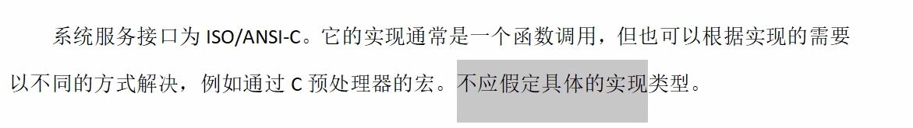
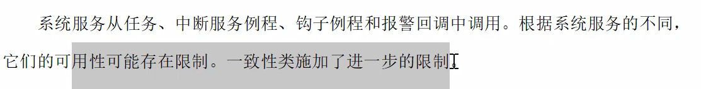

## 12 系统服务描述
#### 12.1 系统对象的定义
> 系统对象都由用户静态确定
> 
> 
#### 12.2 约定
> 调用类型
> 
> 调用合法性
> 
> 
> 错误特征
> 在不该调用的时候，操作系统不会报警，如果系统识别到异常限制了系统服务的执行，则会返回不同的状态
> 有一些警告并不认为是错误
> 
> 
> 会有一个全局变量 定义最后发生的错误
> 
> 
#### 13 操作系统服务规范
> 描述结构
> 
> 结构化元素
> 
> 
> 通用数据类型
> statusType 为E开口
> 
> 内部定义的错误码
> 
> 13.3任务管理
> 
> 结构化元素
> DeclareTask TaskId
> 
> ### 13.3.3 系统服务
> activateTask
> 
> 