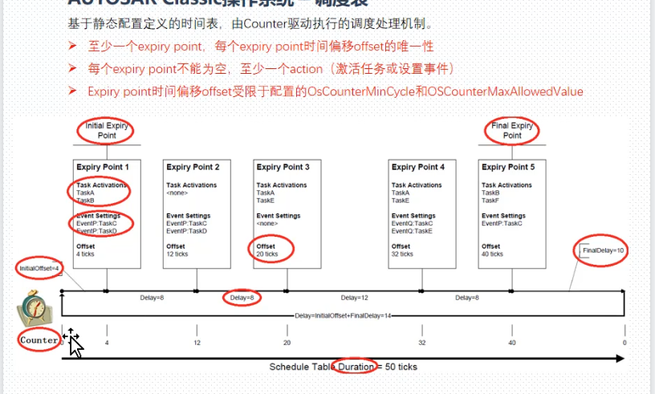
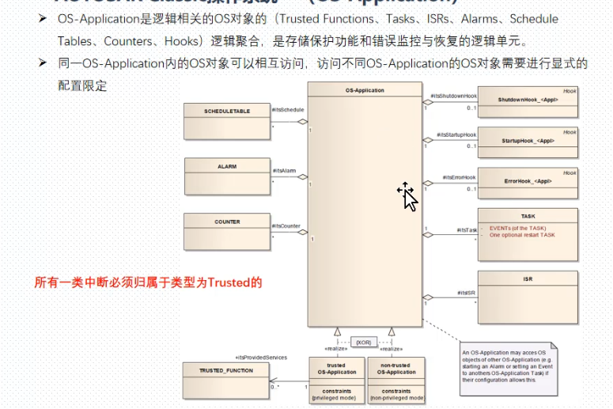
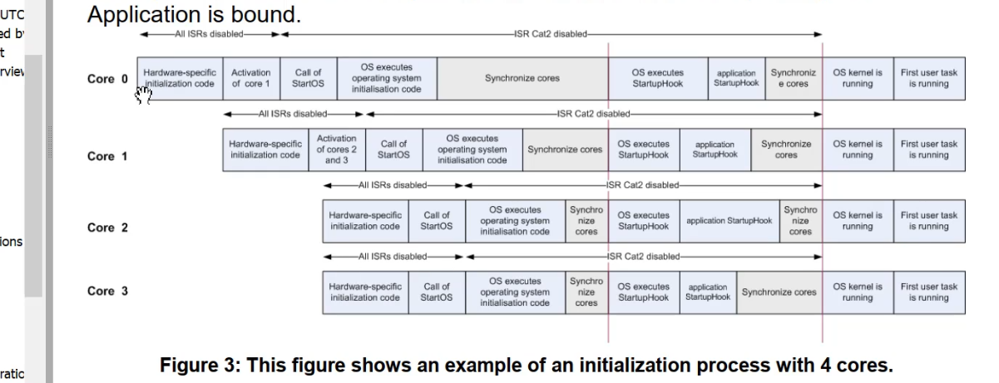
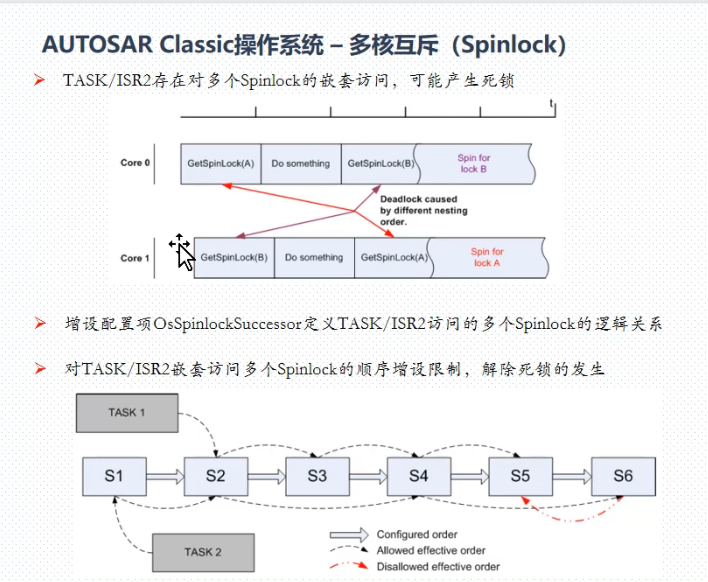

## AutoSar Os
### 1 从OsekOS到AutoSarOS
> OSEKos 重新过一遍
> 任务管理 同步（event res） 中断管理 \alarm \err\ intra Msg
> 
> 三个处理层级
> 
> 四个一致性类
> 
> 任务状态
> 扩展状态多了event
> 
> 基于优先级的调度
> 
> 三种调度策略 调度点
> 
> 两类中断
> 
> Event 同步机制1
> 
> resource资源管理  同步机制2
> 
> Alarm机制 counter和alarm (setEvent,ActivateTask,callback)
> 
> OsekTime Os 时间触发
> time trigger 的任务
> 
> 应用保护 多个应用中的隔离，错误发现的机制
> 应用分类 Trusted Non-trusted 
> 实现依赖于硬件：中断优先级 存储保护 特权模式
> 
> 
### 2 Autosar Os 额外设计
> 额外的一些概念 多核 调度表 IOC 保护 Counter接口
> 
#### 2.1 调度表 参考7.3和7.4
> 
> 操作系统 调度表
> 静态配置定义的时间表，counter驱动执行调度机制
> expiry point时间偏移offset固定，taskactivation和EventSetting
> 
> 调度表的调度
> 两种启动调度的方式：单次调度和重复调度
> 
> 调度表API接口
> 
> 
> 
> 调度表 的同步（显示同步 隐示同步（通过硬件counter同步））
> 
> 隐式同步，让counter和 duration相同
> 
> 显式同步 通过额外接口实现外部counter和驱动counter的调度表同步
> 两个counter同步，调度表duration和外部同步counter具有相同的tick粒度和绝对值范围
> 
> 显示同步过程
> 
#### 2.2 栈监控和OS-application
> 栈监控 辅助调试功能
> 没有mpu支持或存储保护功能，在任务或二类中断进行上下文切换时，检查是否之前发生了对对应的栈空间访问超出了配置的特定边界。
>  
> OS-Application 类似容器，逻辑聚合,存储保护功能和错误监控与回复的逻辑单元
> 同一OS-App内的OS对象可以互相访问，访问不同的OS对象需要显示配置限定
> 一般划为trusted和Non-trusted
> 
> 
> trusted组内可以在运行时关闭监控机制
> 
#### 2.3 保护机制 7.7节
> iso26262 四种功能安全机制
> 
> 
> 存储保护MPU MMU 需要处理器硬件的支持
> 被保护空间区域的划分受限于硬件MPU的可配置区域数量
>  
> 时间保护
> deadline monitor
> 时间分为exec time\blocking time\inter-arrival rate触发执行频率
> 分别做了保护
> 
> 
> 
> 
> ISR中的保护
> 
> service protection
> API出问题了，大部分是开发时错误，需要扩展错误支持，部分错误可通过服务保护由OS在运行时弥补
> 
> OS核心系统硬件的保护
> 至少分为特权模式和非特权模式
> 
> 通过read write 接口提供 application对外设的访问
> non-trusted仅能运行在非特权模式
> 同app组不能抢占caller
> 
#### 2.4 多核支持
> 不改变大的软件架构和方法学前提下实现多核MCU支持
> 多核并行能力
> 应用swc功能便于在单核多核硬件切换，保持硬件透明
> 同一套OS配置，ID在所有核间唯一
> 通过OS-APP实现swc,bsw与核的静态关联
> 相应服务通过扩展或增加限制其处理逻辑，提供多核支持
> 增加相应多核系统特有的服务接口
> 
> 多核的调度
> 
> 多核的启动
> autosar 按照master-slave的启动关系
> 
> 
> 多核的停止 shutdownAllCores
> 严重错误需要全部关闭
> 
> 多核的核标识符 物理ID映射到逻辑ID
> 
> 多核下的counter alarm schedule table
> 跨核访问
> 
> 多核互斥 Spinlock
> 多核系统，实现核间互斥，增加自旋锁（spinlock）机制
> spinlock 类似resource 需进行静态配置
> 与mutex 互斥锁不同，自旋锁不会挂起，会循环查询，占用cpu资源，直到锁释放
> 
> 互斥锁保护同核资源，自旋锁保护核间资源
> 
> 自旋锁不能用在同核上，可能会发生死锁
> 
> 嵌套访问也可能导致死锁
> 
#### 2.5 通信 IOC
> IOC实现os app之间的通信，特别用于跨核通信和不同存储保护属性间的通信
> 通过RTE进行通信
> 执行是原子的，不能被中断
> 
> 多核应用案例
> 
> 
#### 2.6 课程总结
> OS是autosar运行的载体，BSW和app都是以runnable形式映射到task/ISR
> 