## chapter 4 感知
### 目录
> 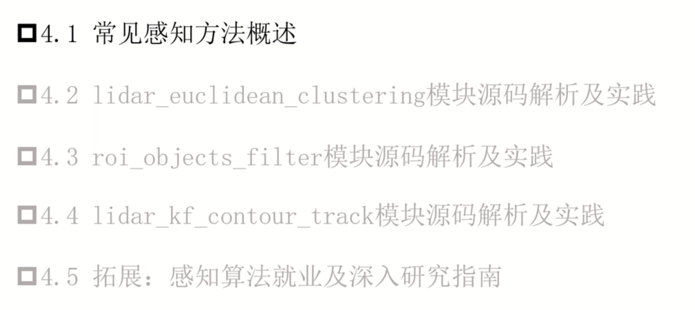
### 4.1 常见感知方法概述
> 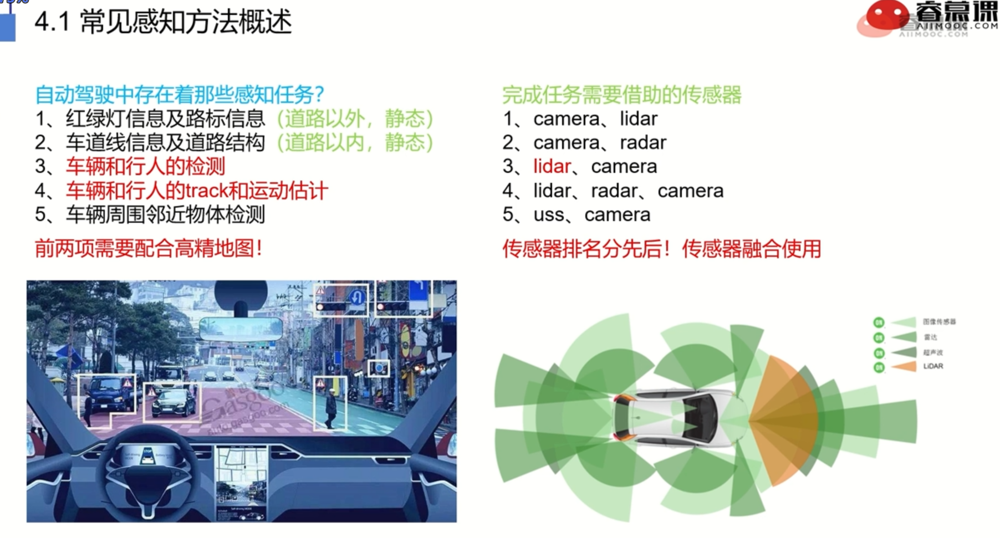
> 常见感知方法概述
> 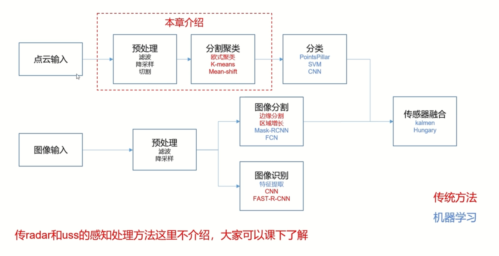

### 4.2 lidar_euclidean_clustering模块
> 欧式聚类框图
> 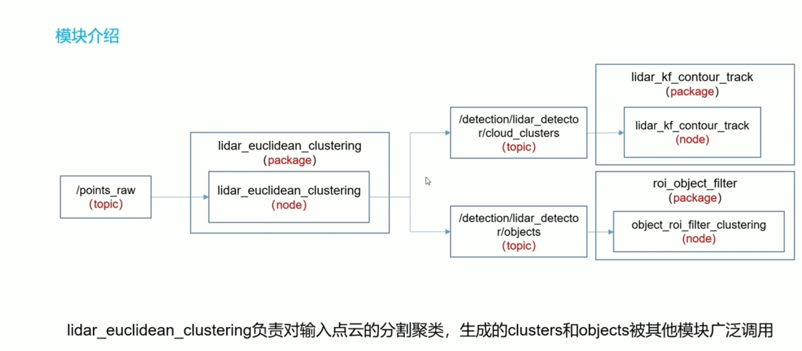
> 欧式聚类原理
> 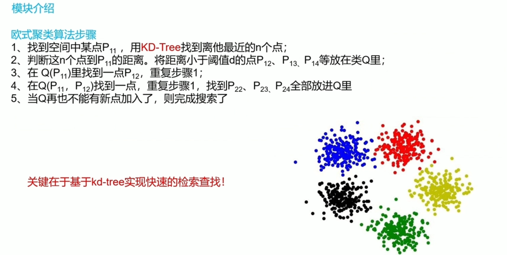
> kd树
> 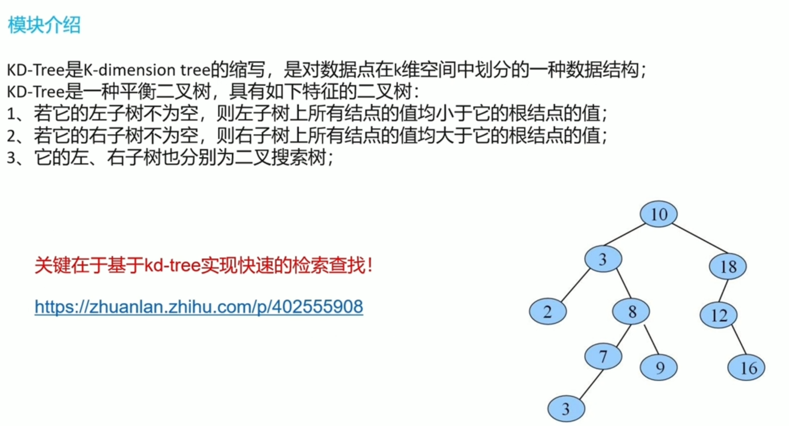
> 关键func
> 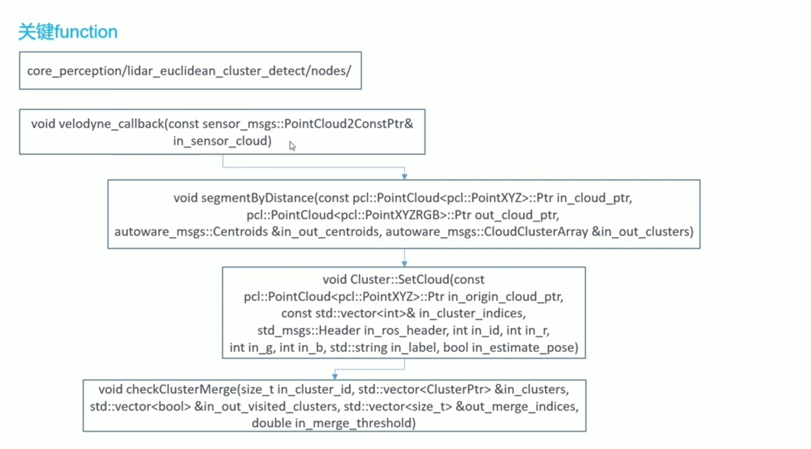
> 实践仿真
> 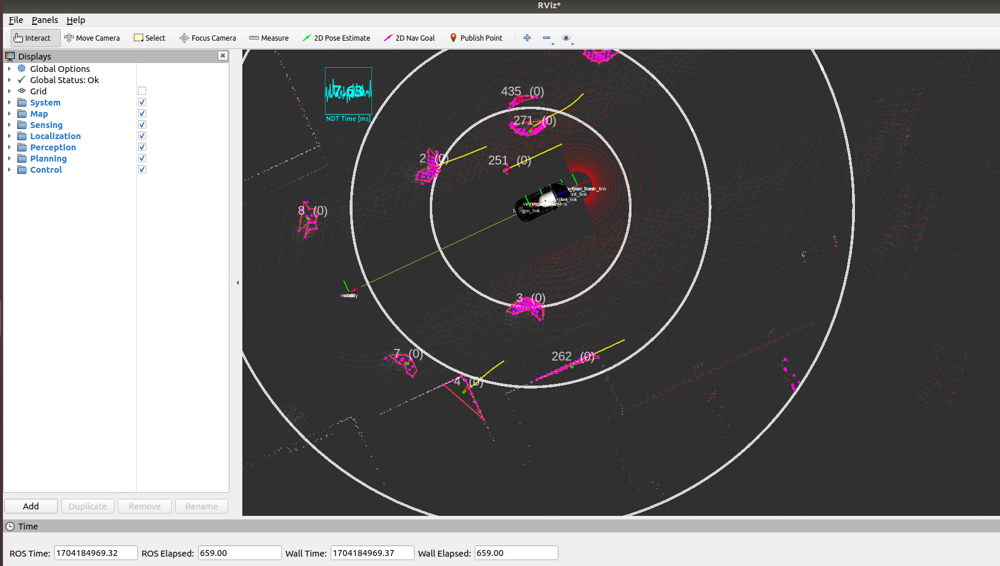

### 4.3 roi_object_filter模块
> 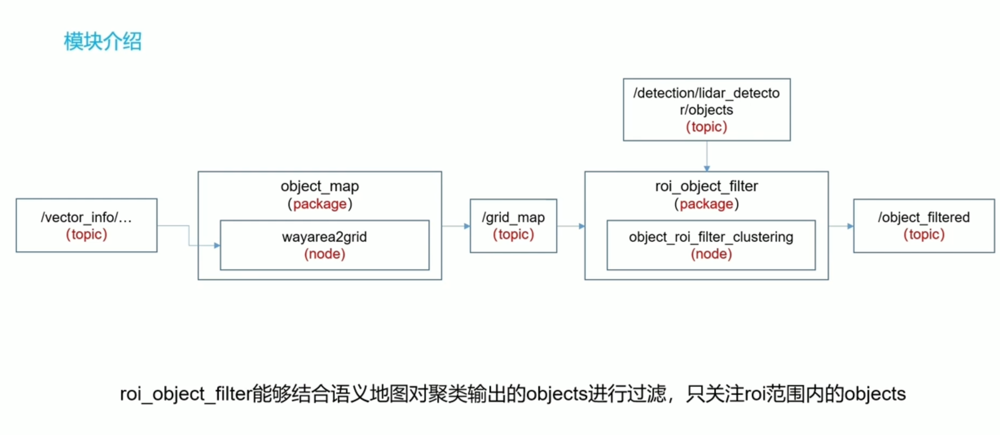
> 关键func
> 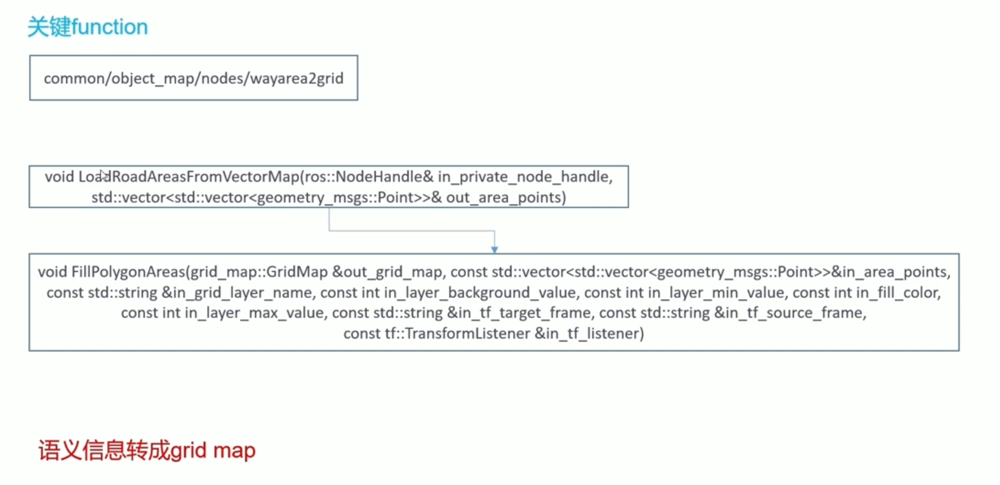

### 4.4 lidar _kf_contour_track模块
> 模块
> 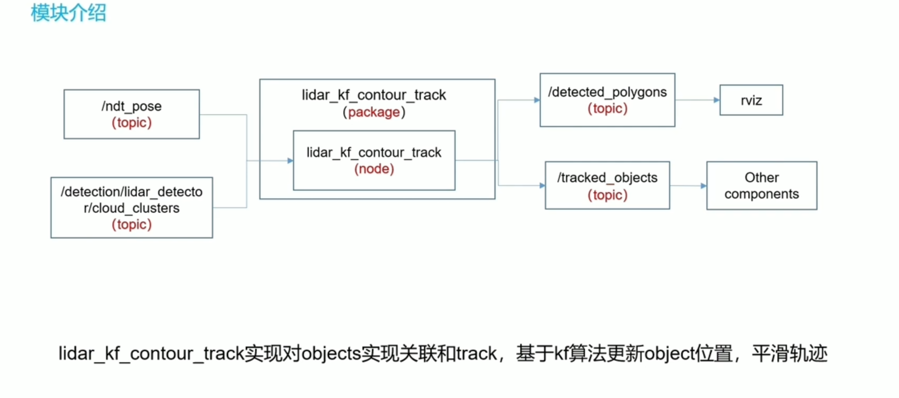
> 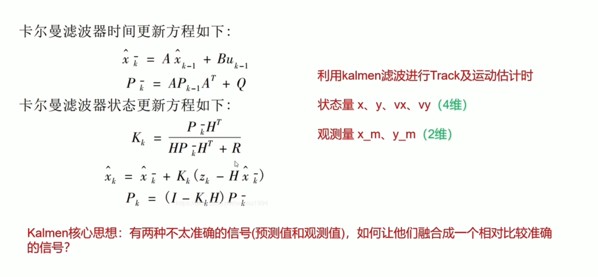
> 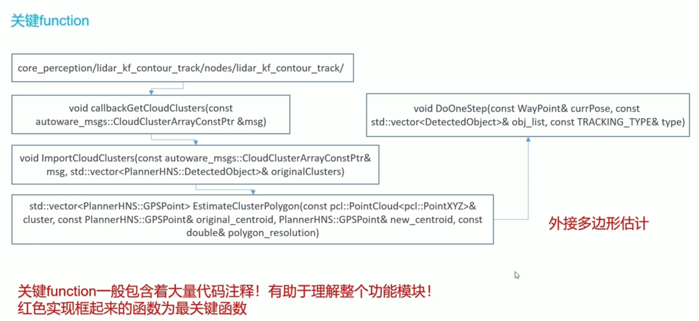
> 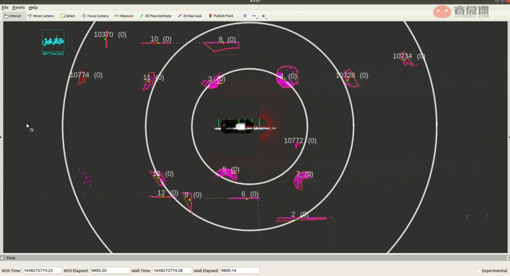
> 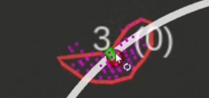