## chapter6 规划
### 目录
> 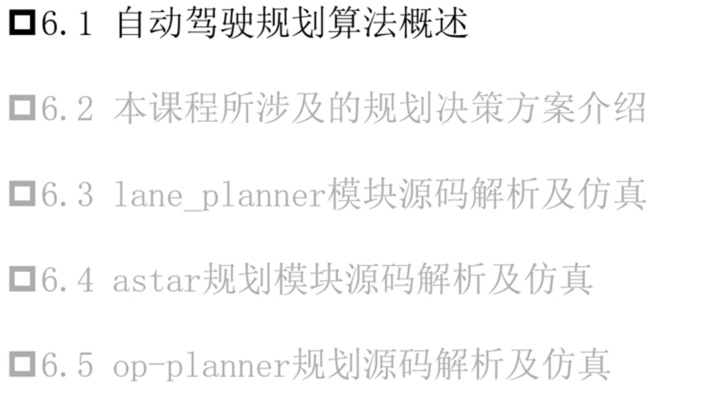

### 6.1 自动驾驶规划算法概述
> 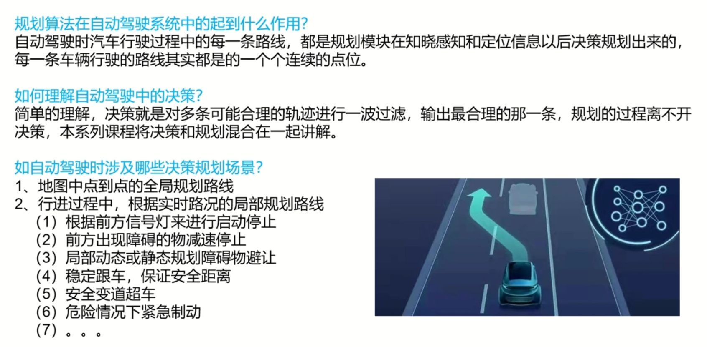
> 比较全面的综述论文
> 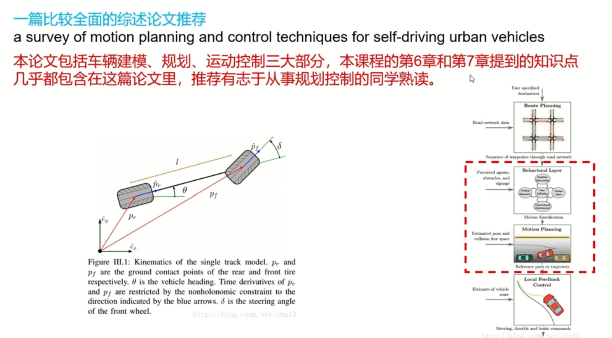
> 规划算法
> 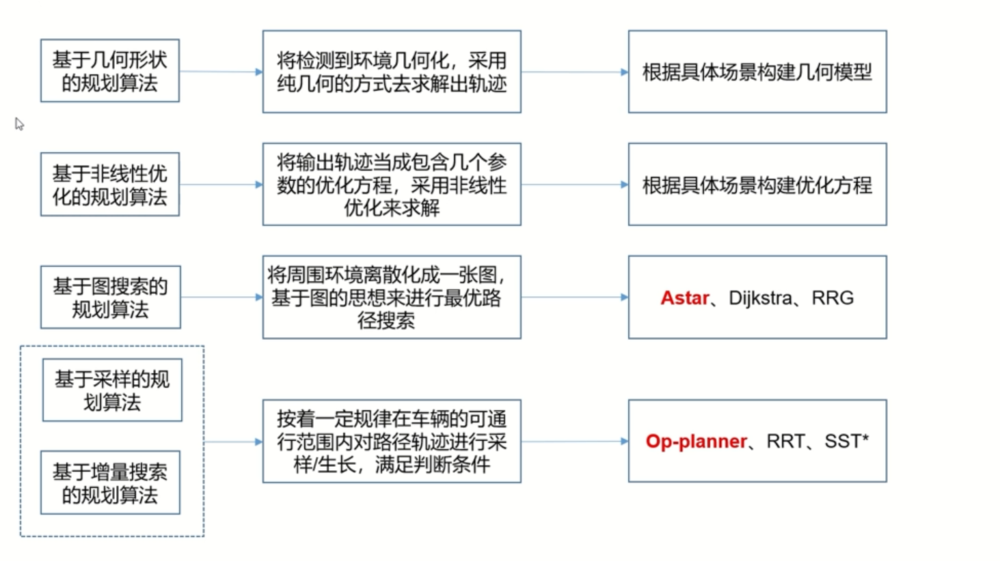

### 6.2 涉及的规划决策方案介绍
> 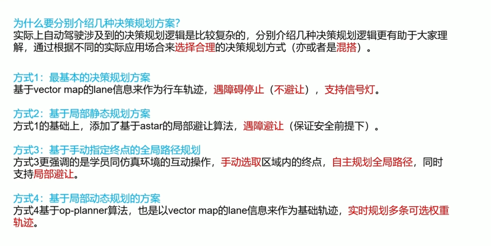
> 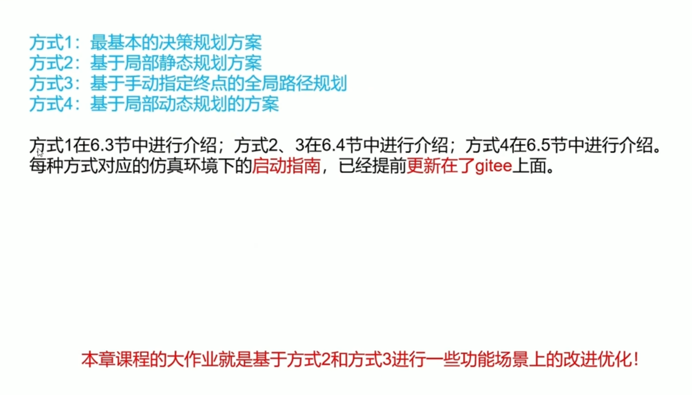
> 演示
> 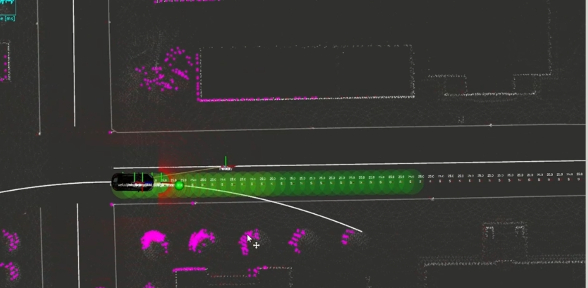
> 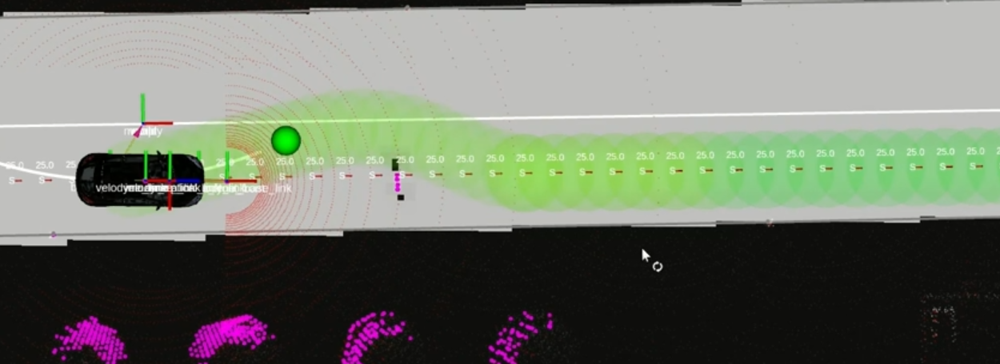
> 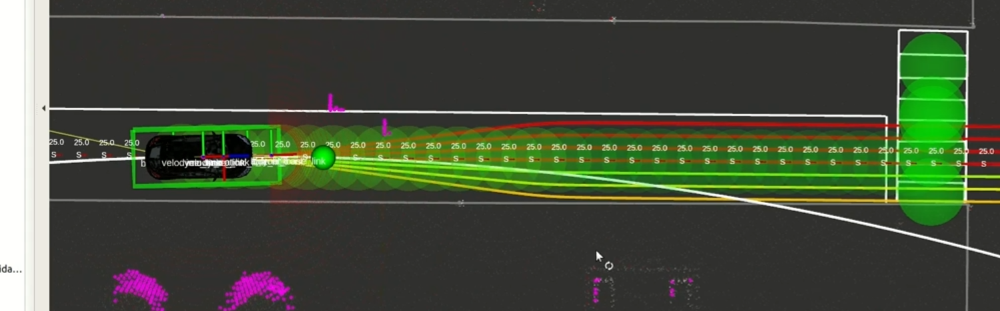

### 6.3 lane_planner规划
> 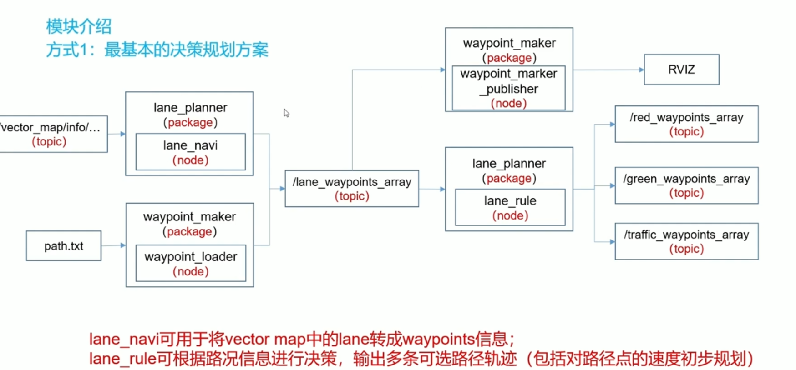
>  最基本的决策规划方案
> 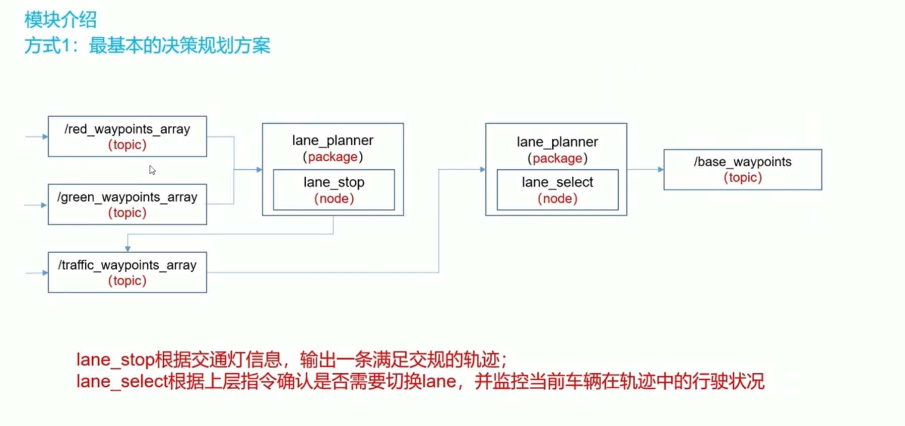

### 6.4 astar规划模块源码仿真
> 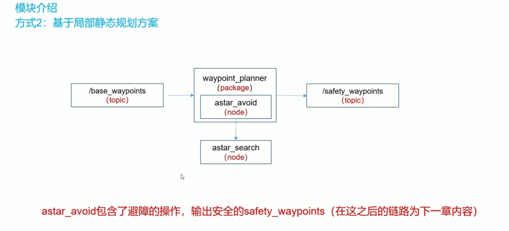
> 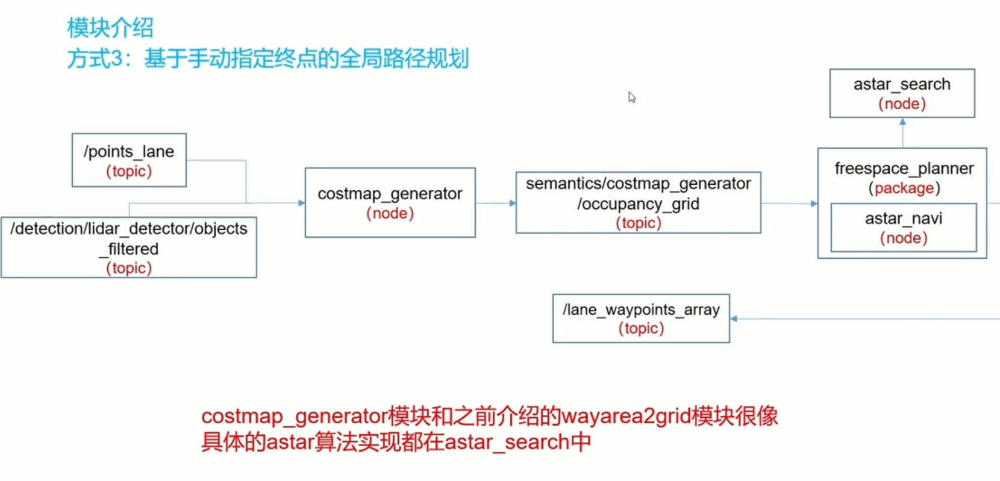
> astar算法
> 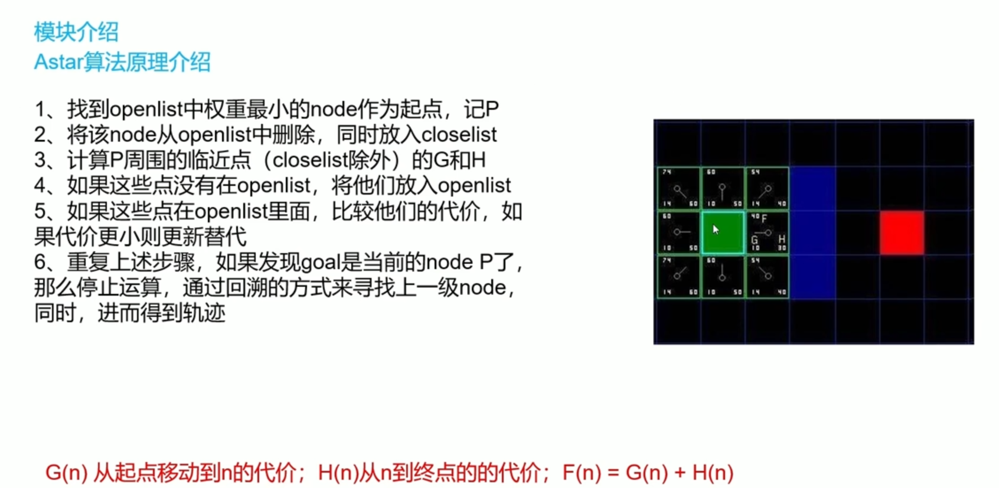
> 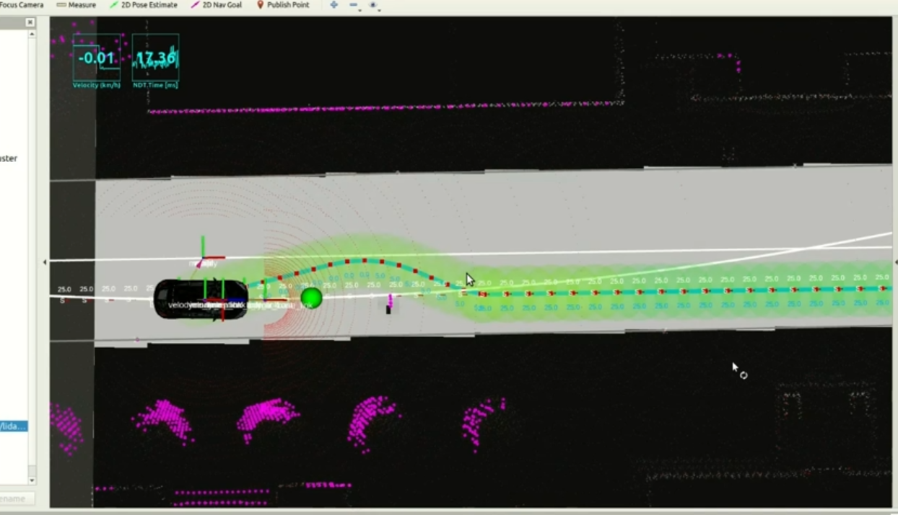

### 6.5 op-planner规划模块
> 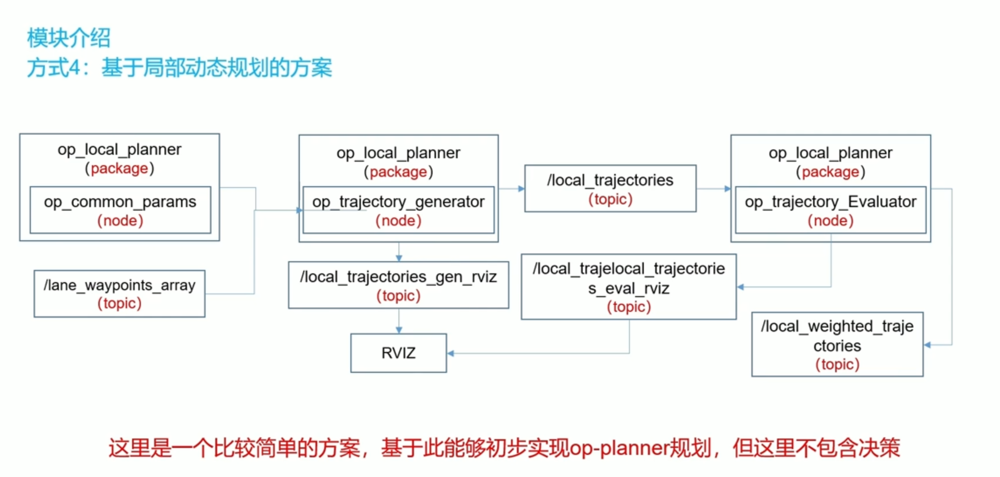