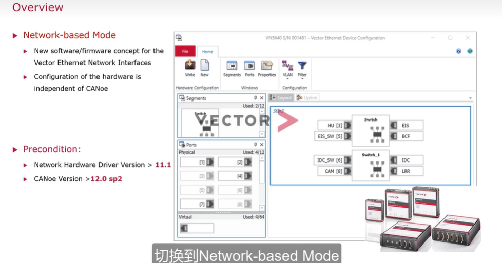
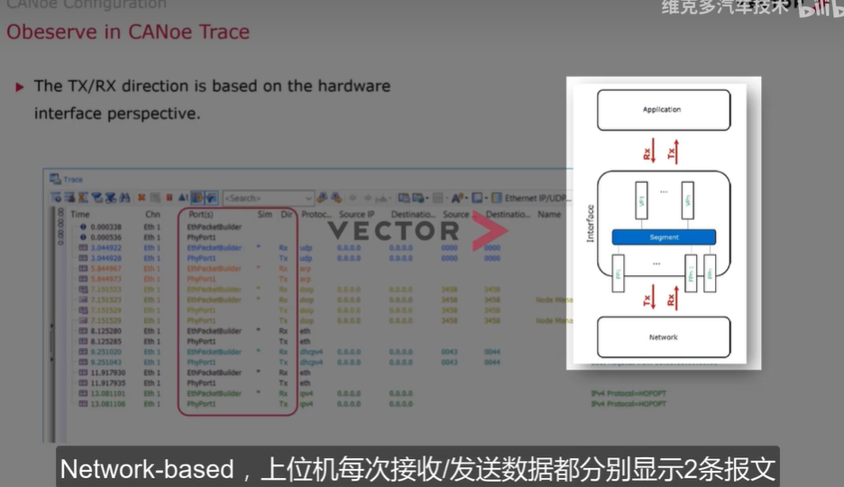

## canoe eth configure
> 目录
> 
> 1 classical bus system
> 仿真与真实数据数据一同流进measurement setup
> 
> 以太网 不一样的拓补 点对点拓补结构
> node 节点
> link用于连接两个Phy
> switch 转发
> 一个以太网网络需要匹配到canoe中的一个ethernet channel
> 
> 2 basic concepts 基本概念
> uplink 上位机与硬件之间的连接可以是 usb/以太网
> 
> port 包括物理端口和虚拟端口
> pp 物理端口与canoe上的通道一一对应，vn5000几个物理通道就有几个pp,配置通信速率和master slave
> vp 仿真端口 不需要用户手动添加，根据用户创建的模块（IG CAPL节点）与segment绑定情况自动添加
> 
> segment 是link和switch的总称
> 分成link segment 、 switch segment
> link segment 分为2种场景
> 直连（1pp 1vp）和旁通TAP(2 pp)
> 直连用于真实节点和canoe仿真节点通信
> TAP用于数据监控，需要断开
> 
> swich segment 可以连接多个pp vp，但其中一个必须是pp
> \
> network
> 可以包含多个network,每一个单独的network可以包含多个segment
> 
> 在canoe软件中，network和一个ethchanel对应
> 通过channel mapping 映射
> 
## 软硬件网络配置
> 
> network-based mode 支持更为灵活的segment配置
> 支持给switch segment 配置vlan 属性
> 也可以配置以太网端口作为VN5000设备与上位机的连接端口
> 
> 硬件设备配置
> 
> 软件设备配置
> 
> 使用实例 对switch和两个节点仿真
> 
> port config
> 
> pp 默认是measure port
> 注意发送顺序
> 
### Ethernet Packet Builder(未集成TCP IP) 、 Ethernet IG(集成TCPIP)
> 