## filters 滤波 下采样

### 基础理论
> 采样原因
> 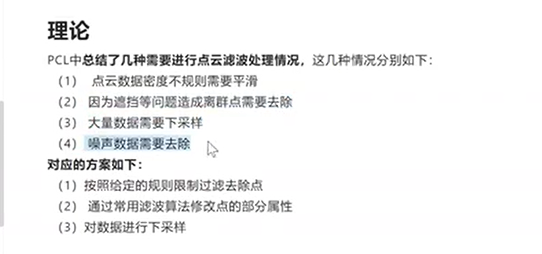
> 采样方法
> 激光雷达采集的为无序点云，深度相机采集的一般为有序点云。
> 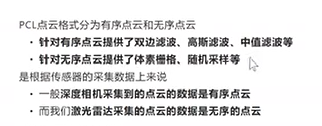
> 一些官方教程
> 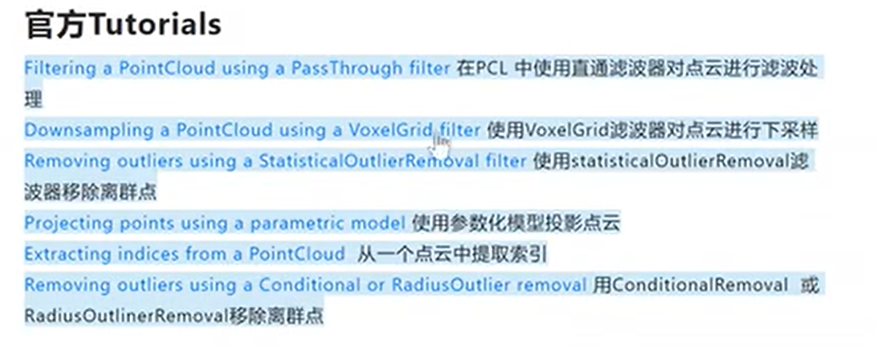
> 直通滤波器 （范围滤波）
> 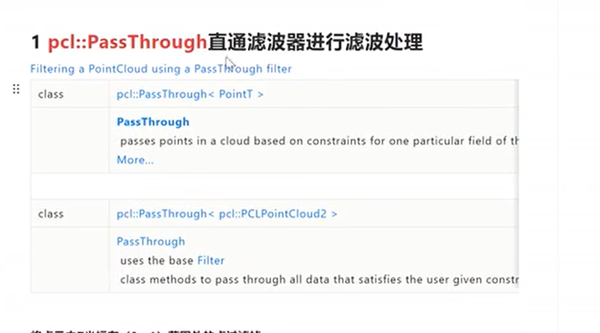
> 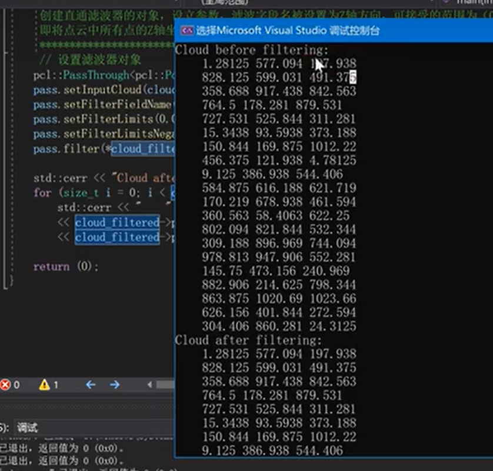
> 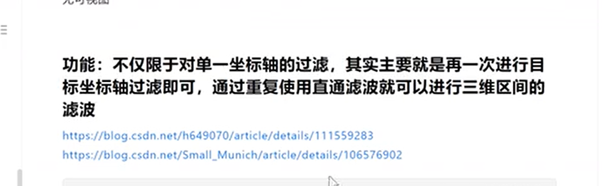
> 体素栅格下采样 voxelgrid
> 减少点的数量，同时保留点云形状
> 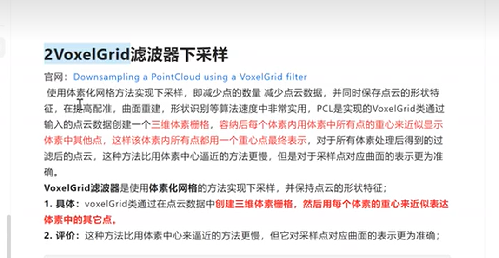
> 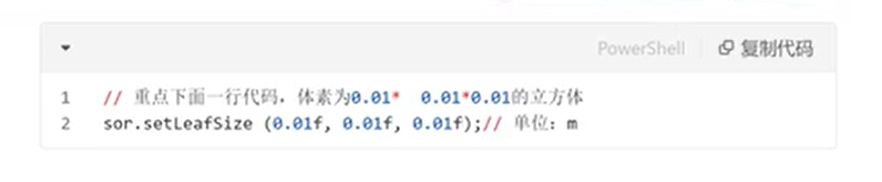
> 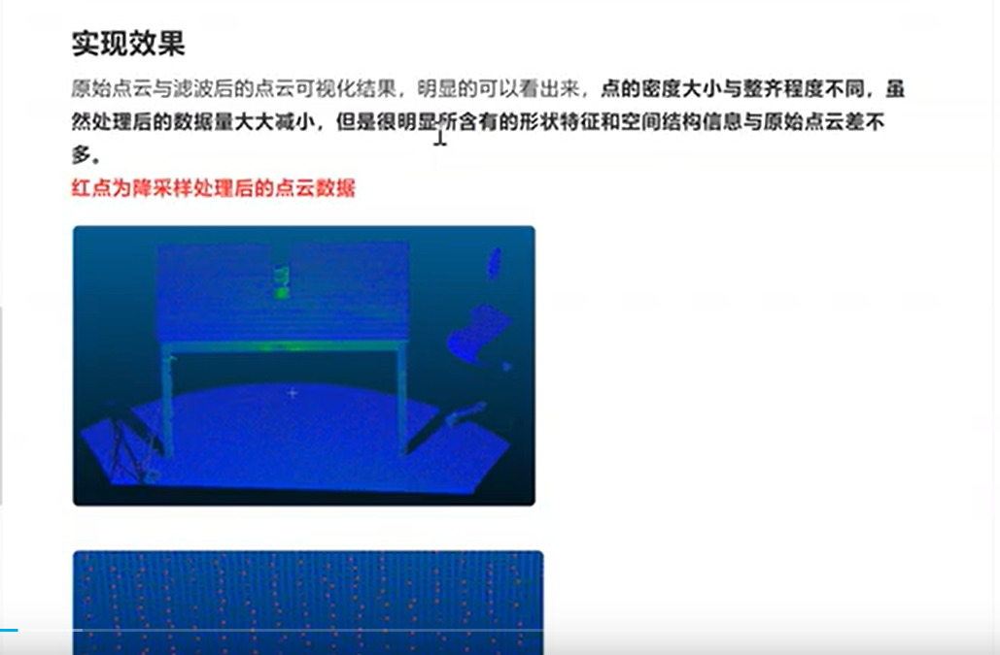
> statisticalOutlierRemoval滤波器移除离群点
> 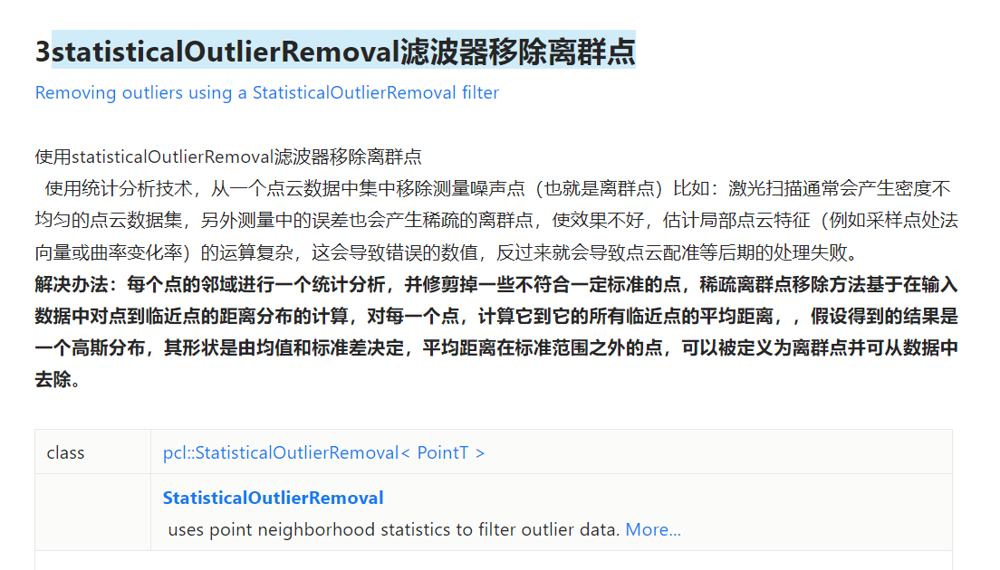
> 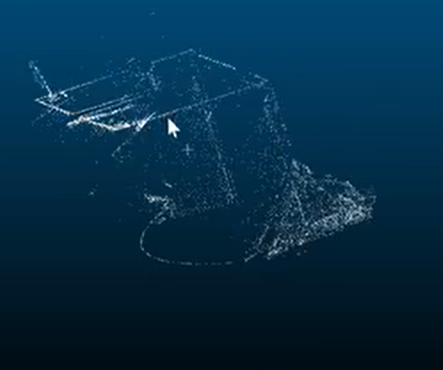
> 参数化模型投影点云
> 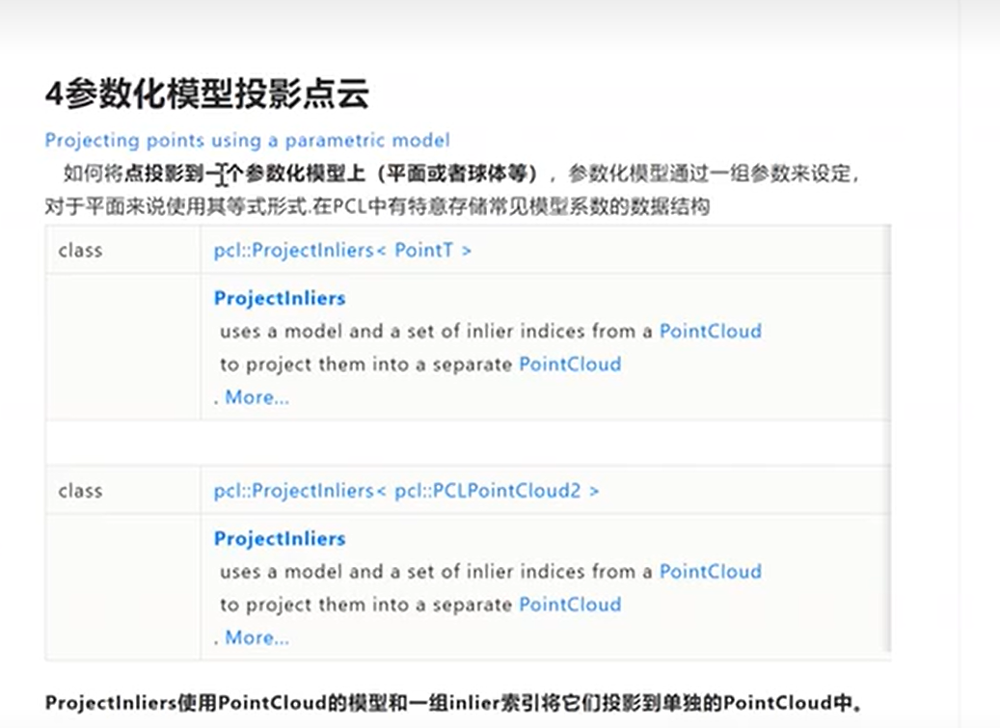
> 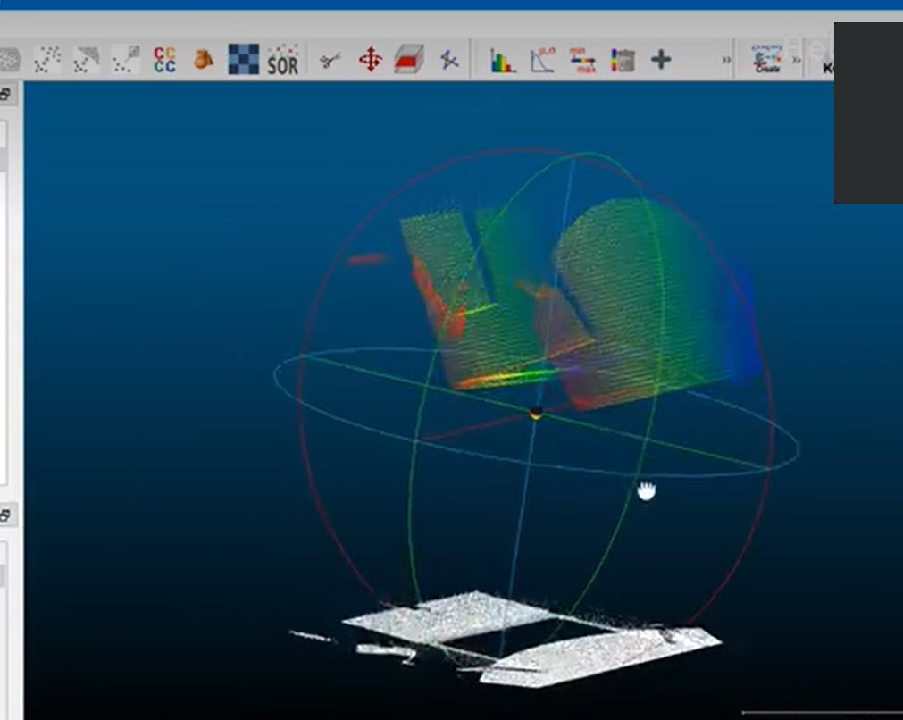
> 从点云中提取索引
> 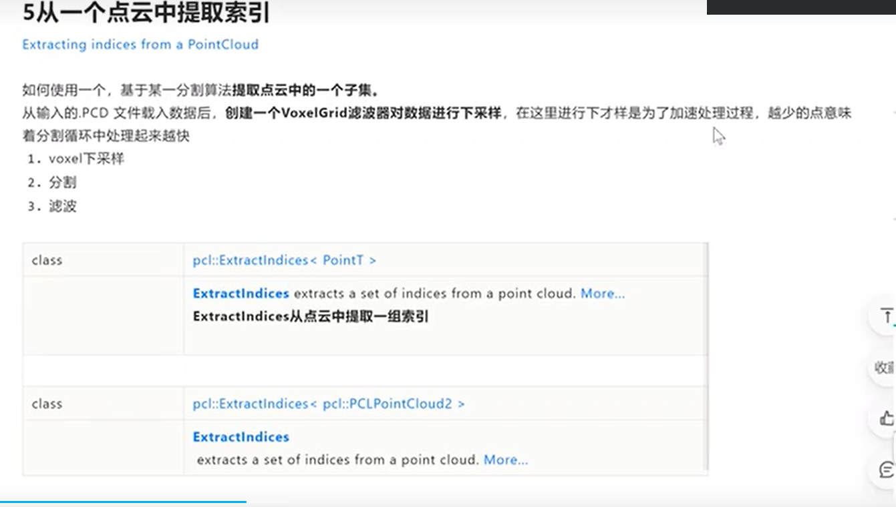
> 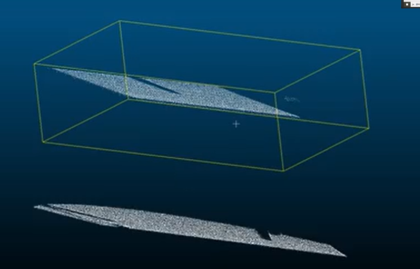
> 使用ConditionalRemoval或RadiusOutlinerRemoval移除离群点
> 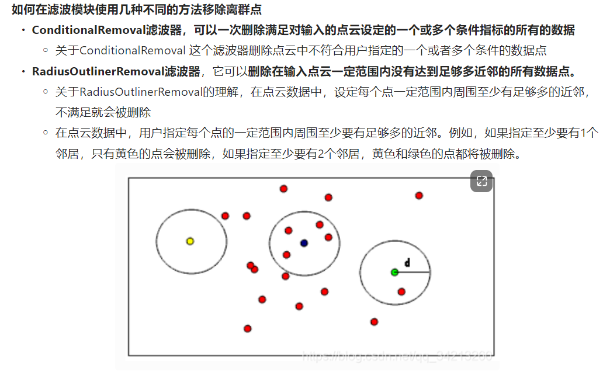
> 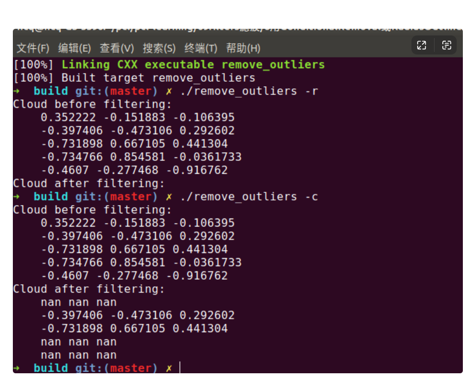
> 双边滤波算法
> 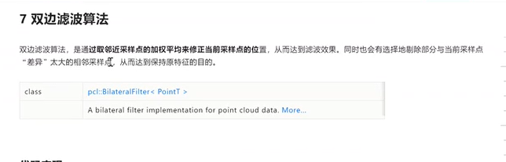
> 均匀取样
> 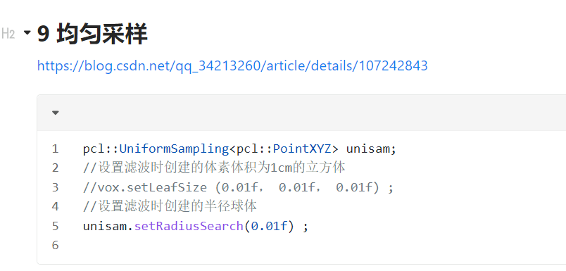