## registration配准

### 配准基本概念
> 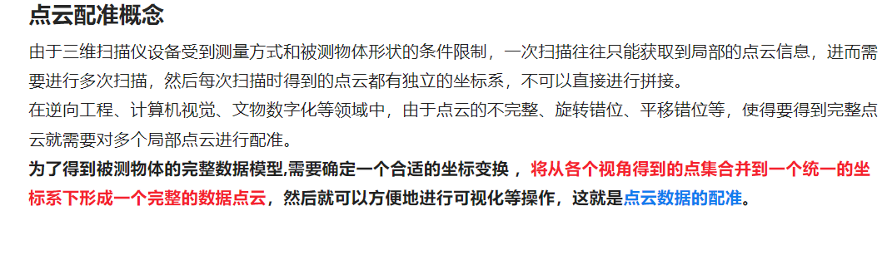

### 基本配准方法
> 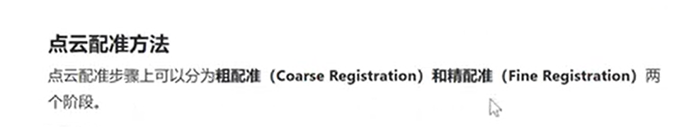
> 粗配准
> 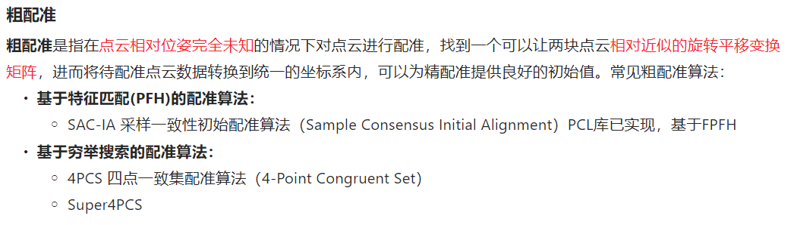
> 精配准
> 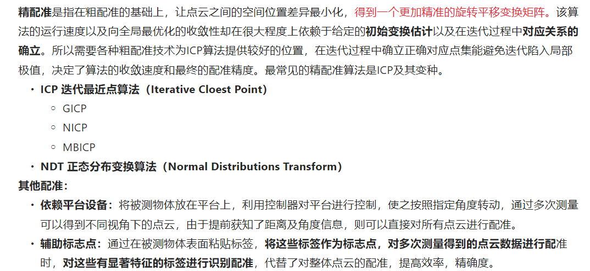
> 粗配准
> 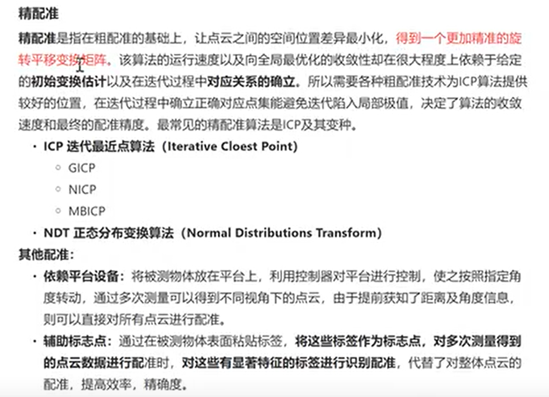
> 自动配准
> 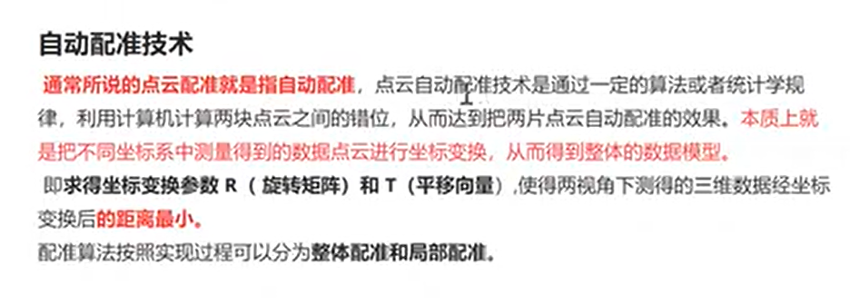
> pcl中的配准
> 
> 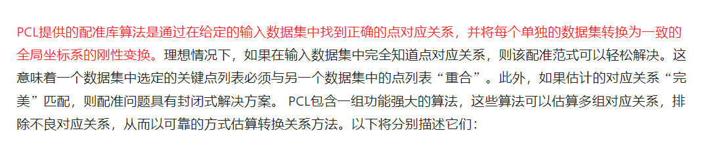

### 两两配准步骤
> 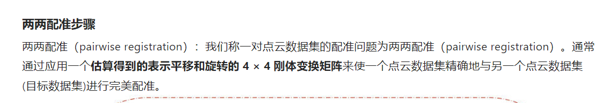
> 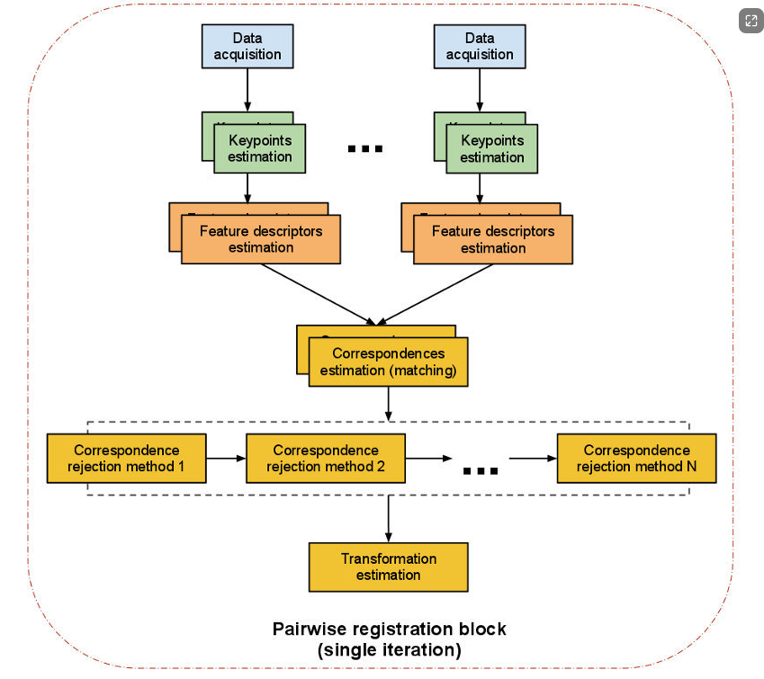
> 具体步骤
> 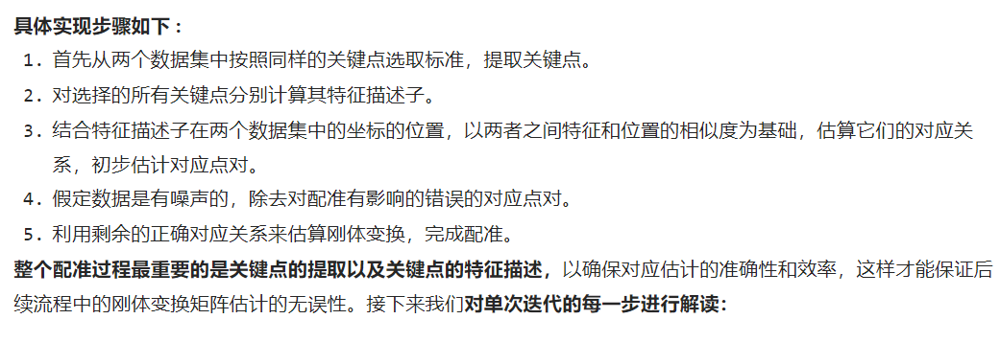
> 特征点提取
> 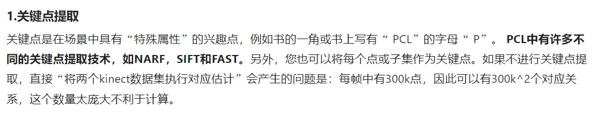
> 特征描述子
> 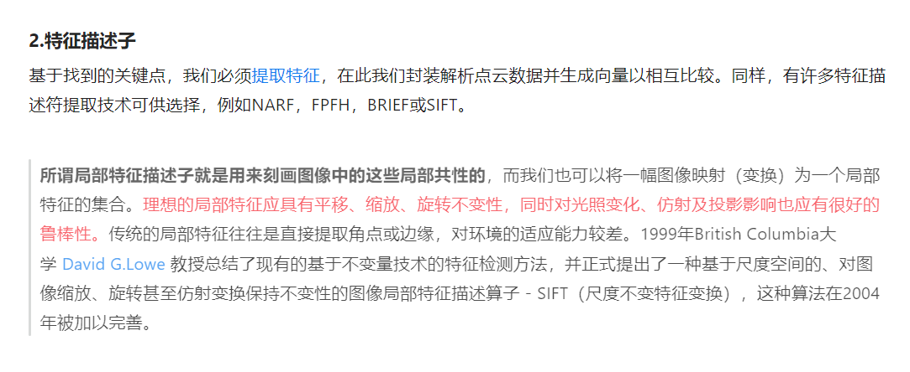
> 对应关系估计（确定重叠部分）
> 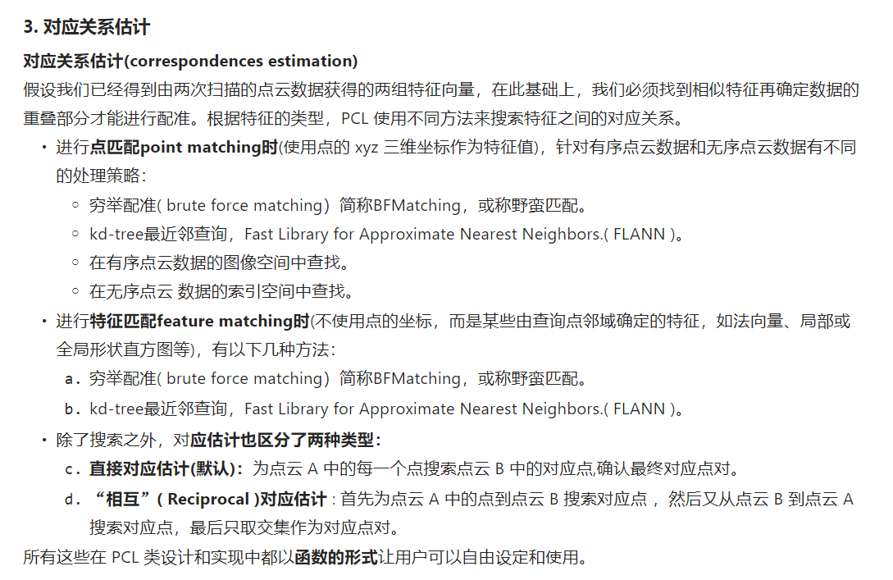
> 对应关系去除
> 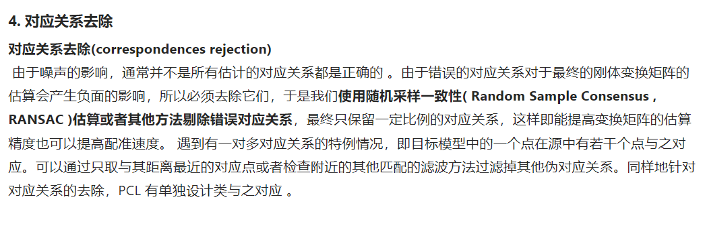
> 变换矩阵估算
> 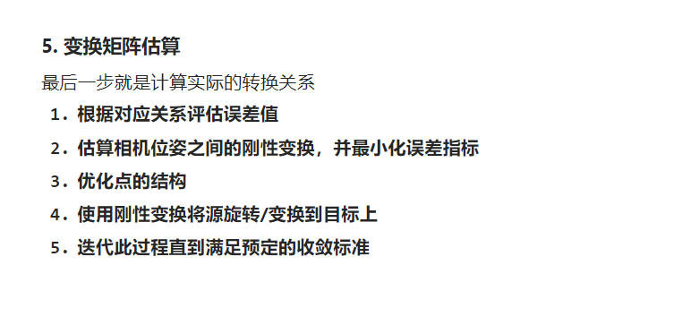

### 代码实践部分
> ICP算法
> 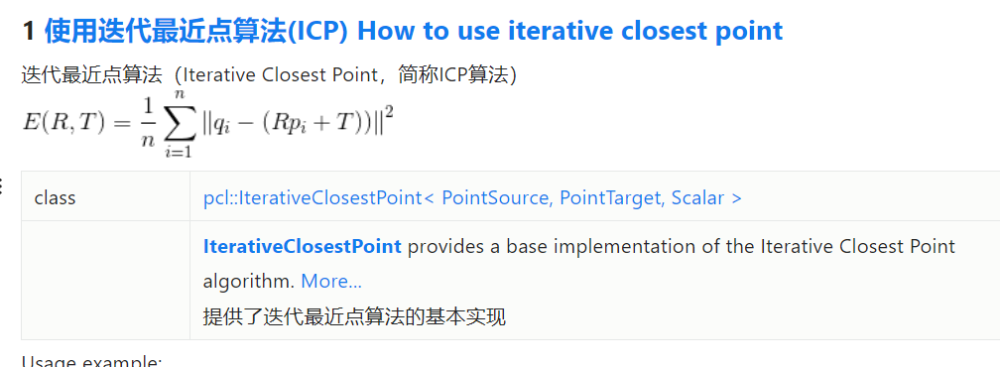
> 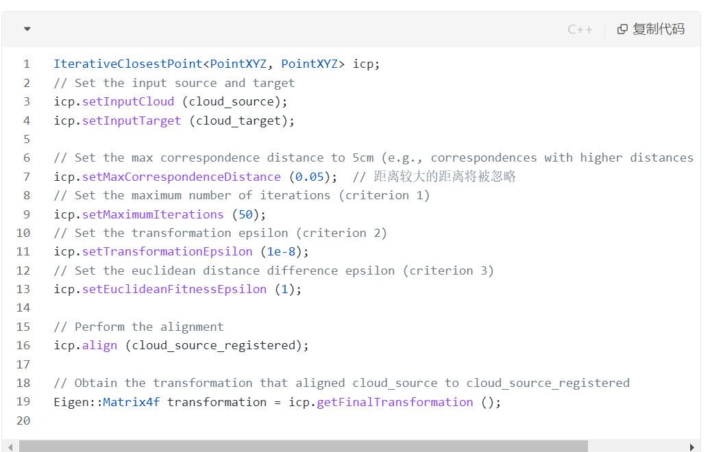
> 结果
> 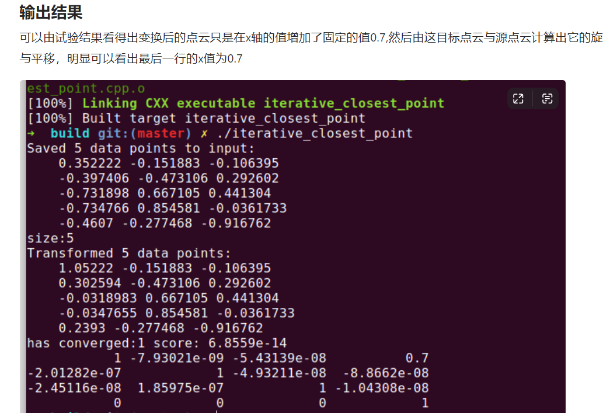