## xacro 语言

更加方便的生成urdf文件

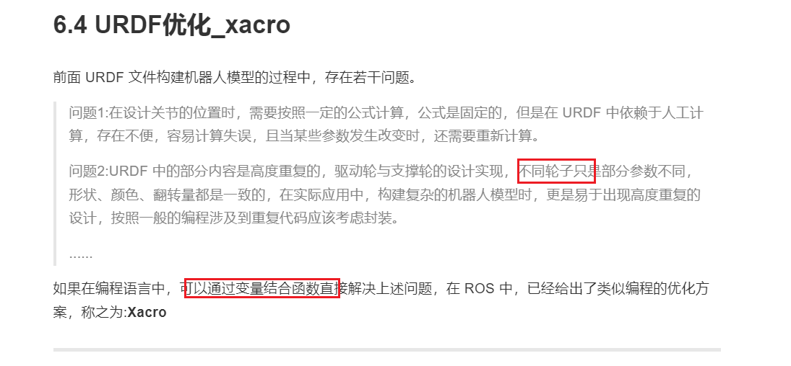

可以编程的xml文件

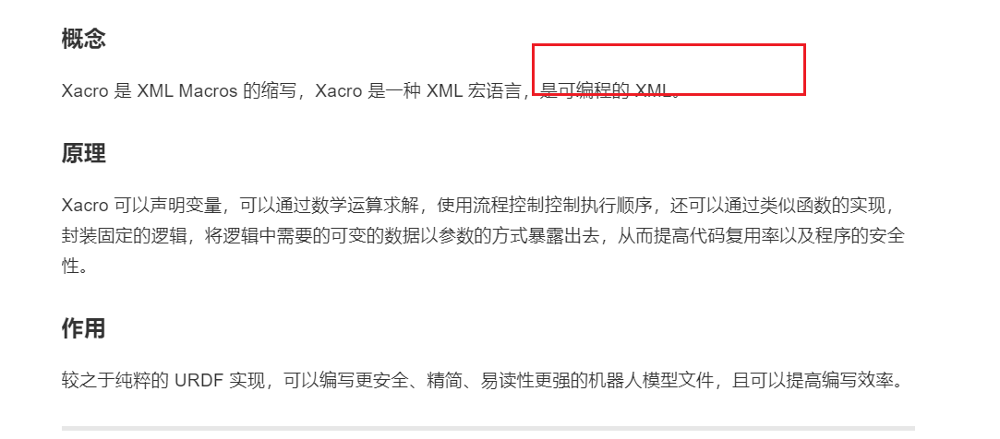

----

## xacro文件快速入门

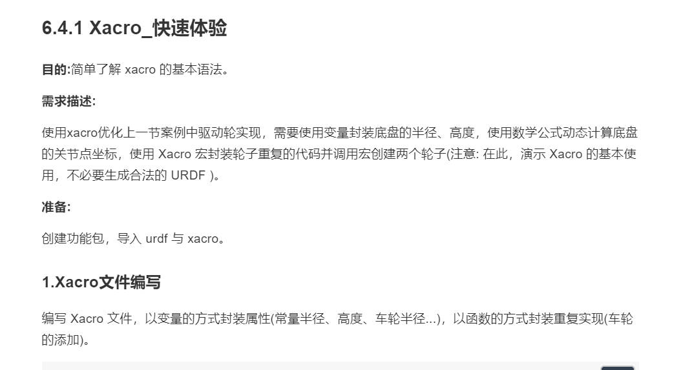
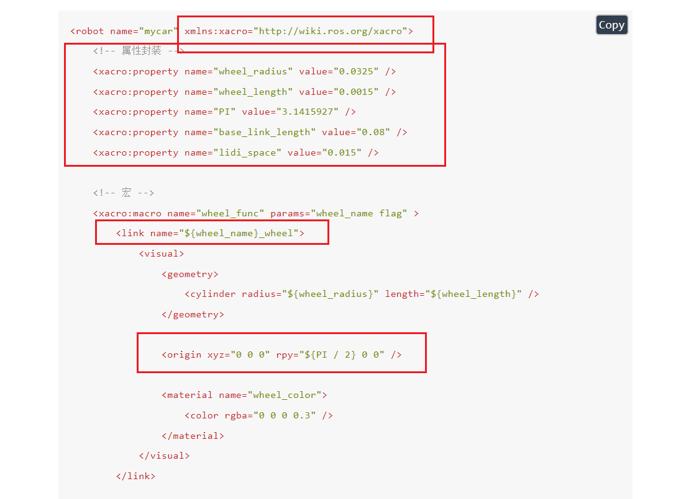
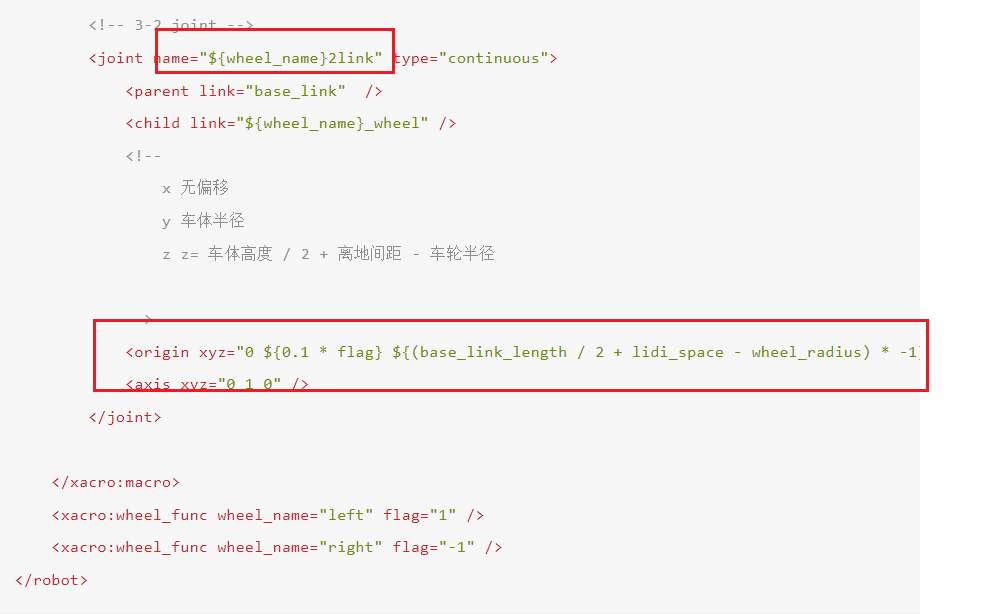

> xacro文件转为urdf文件
 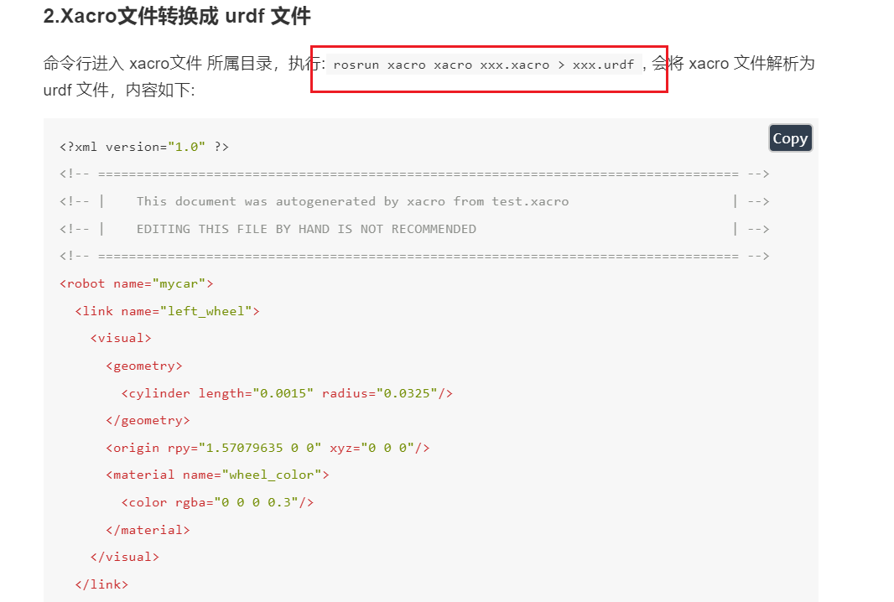

 ----

 ## xacro语法详解
 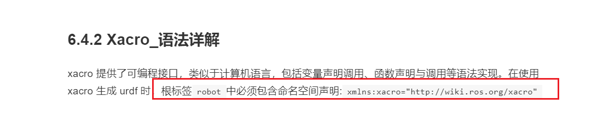

 > 属性与算术运算
 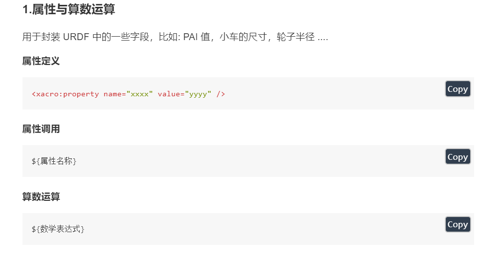

 > 宏调用
 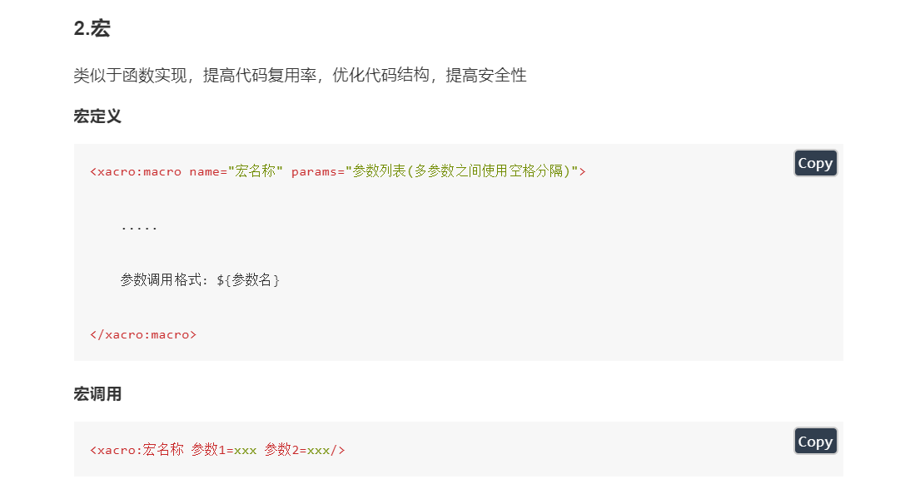

 > 文件包含
 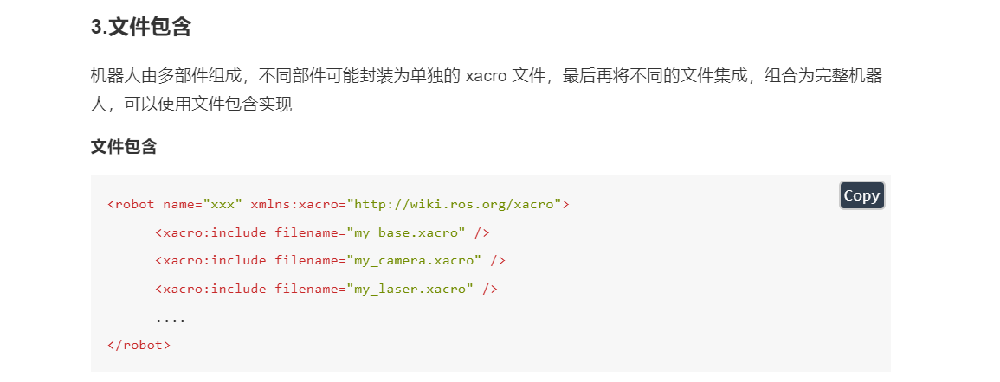

 ----

 ## xacro完整使用流程
 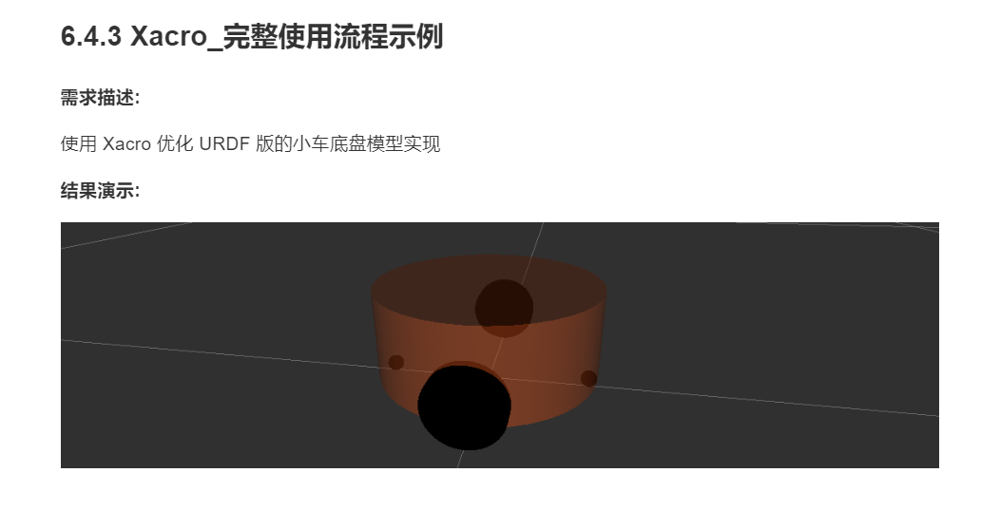
 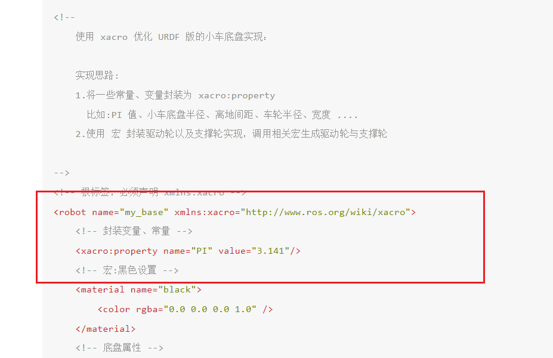
 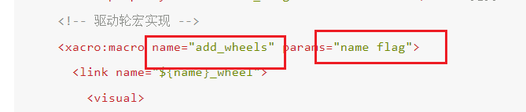
 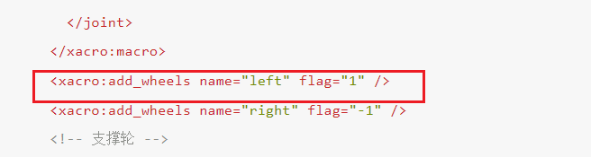

 > 集成launch文件
 > 转为urdf文件
 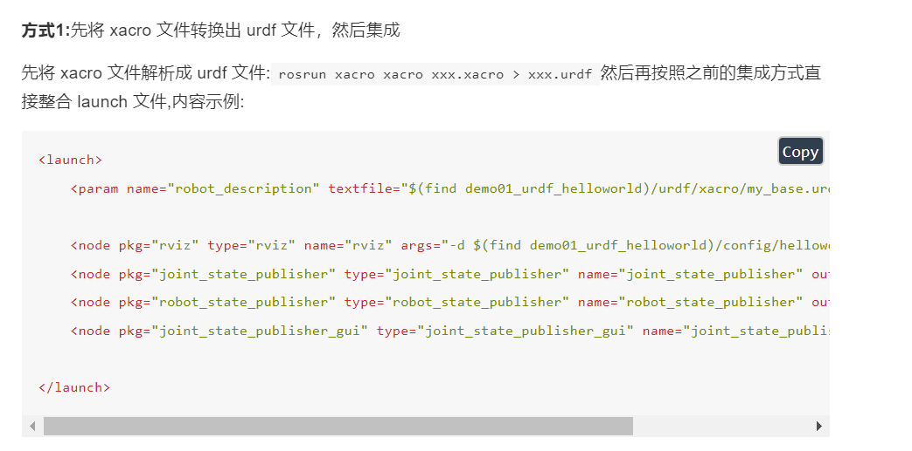
 > 直接使用xacro文件
 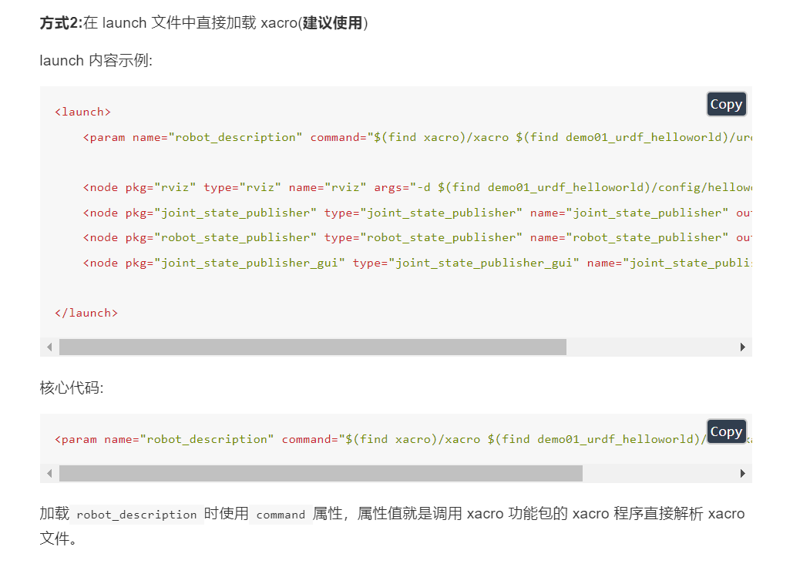

 ----

 ## xacro实操
 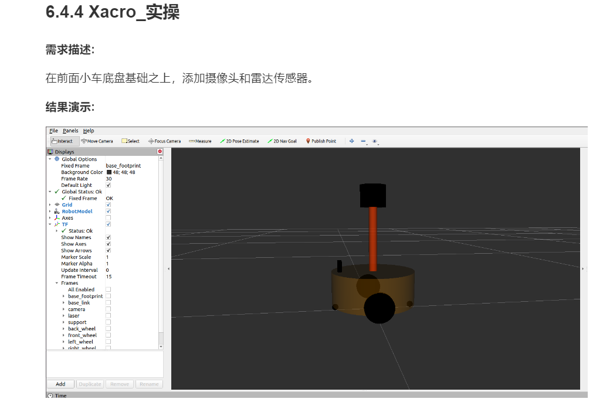
 > 实现分析
 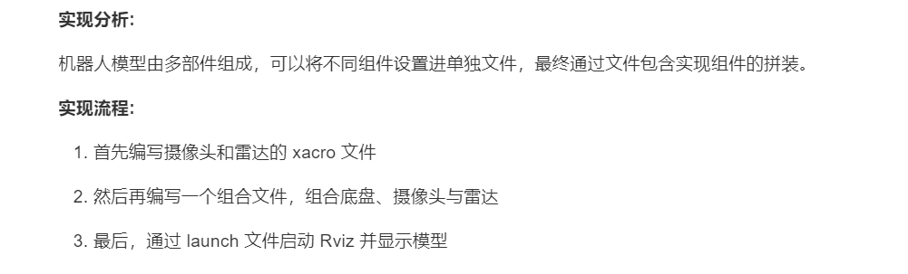

 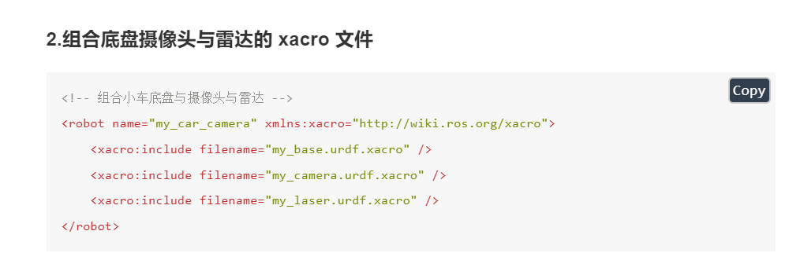
 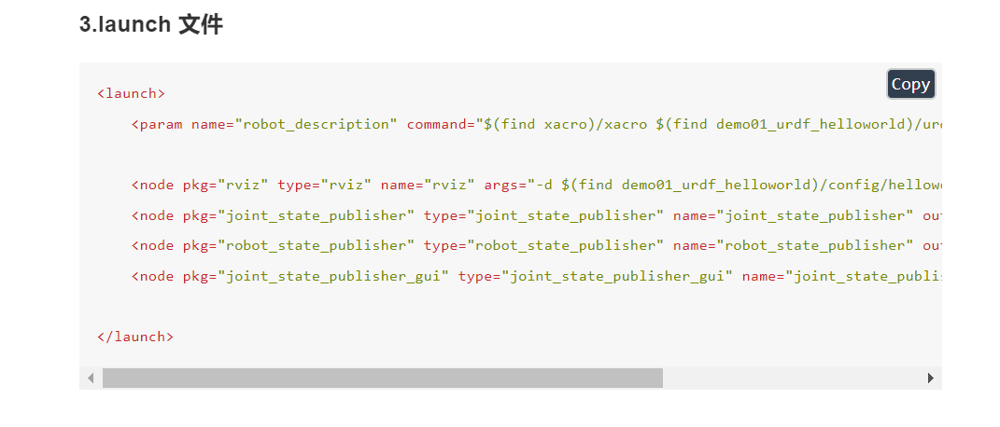