## 6.6 gazebo 集成 urdf
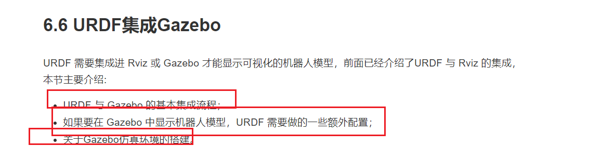

----
## 1 gazebo集成urdf
> 集成基本流程
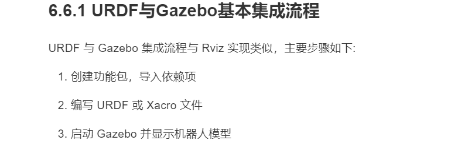
> 创建功能包

> 编写urdf文件
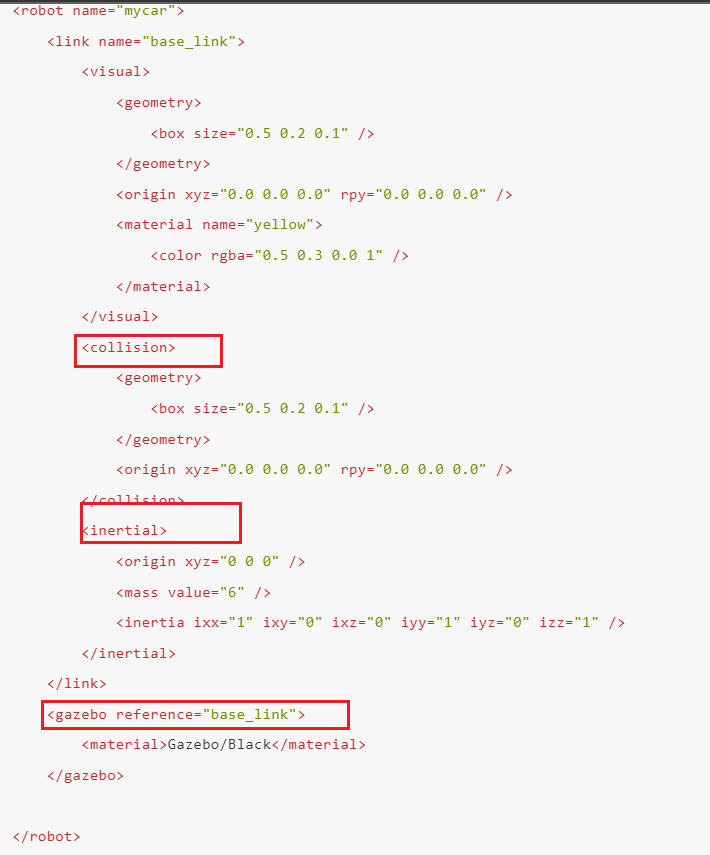
> 注意urdf标签
 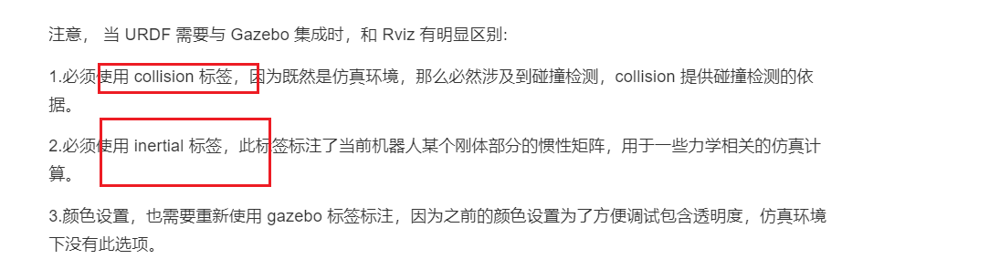
> 启动gazebo
 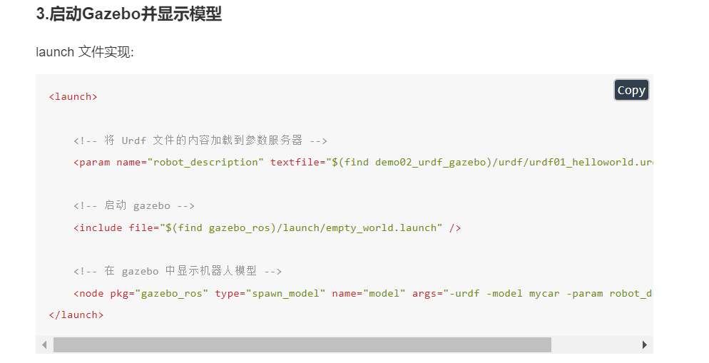
 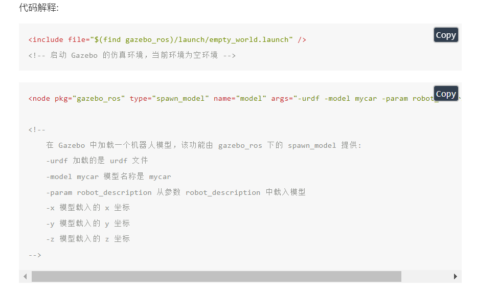

 ## urdf集成gazebo相关设置

注意collision和inertial 、颜色属性配置
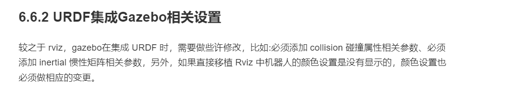
>

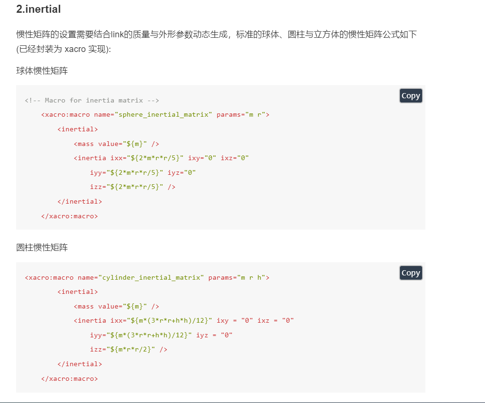
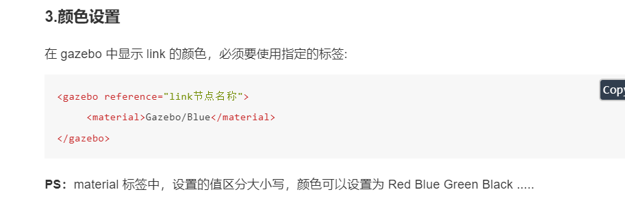

## 3 urdf集成实操
 需求描述
 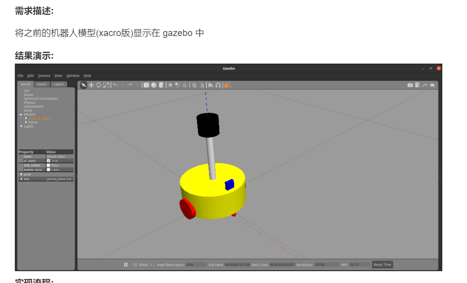
 实现流程
 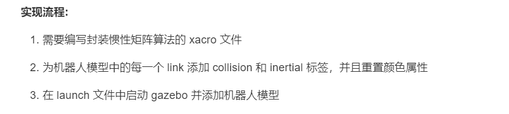
> 01 实现惯性宏
> 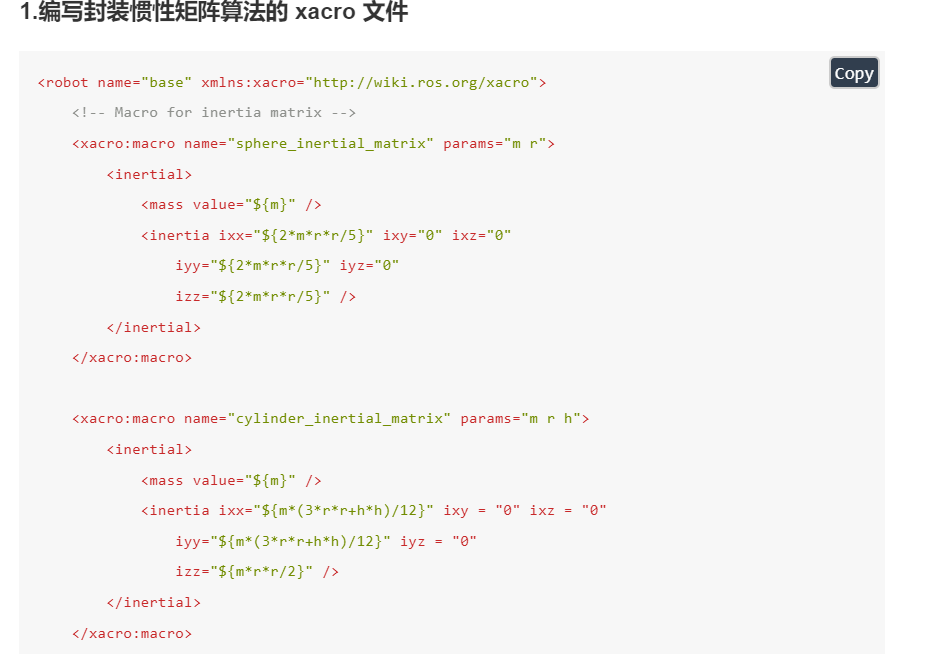
> 02  复制相关xacro文件 并添加属性
> 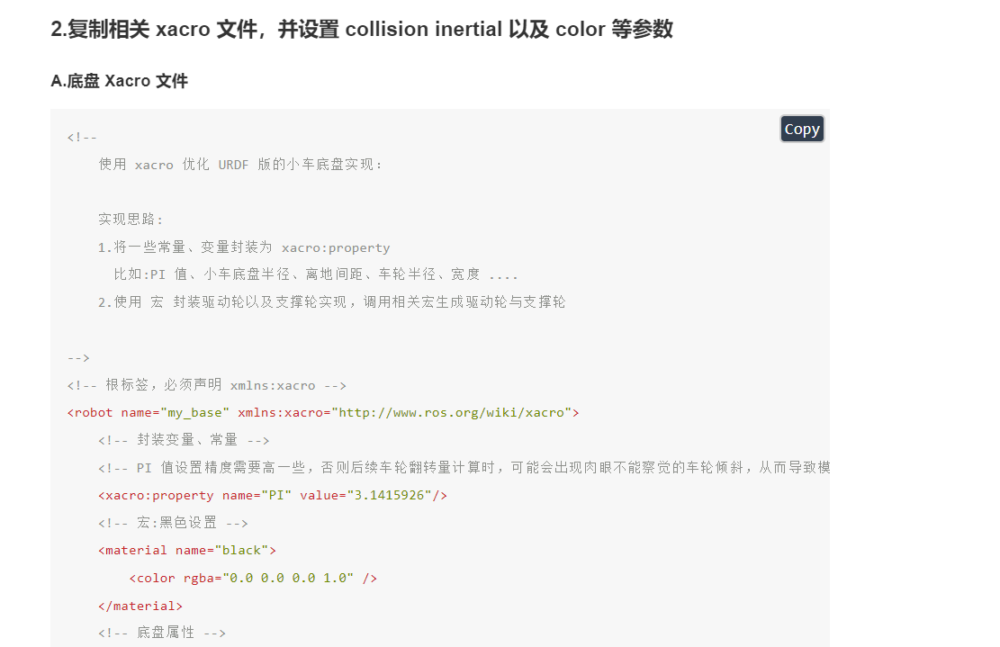
> 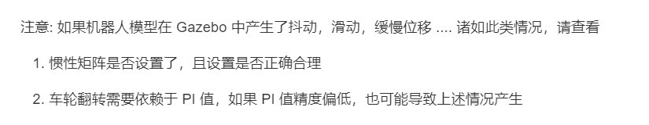
> 03 gazebo启动
> 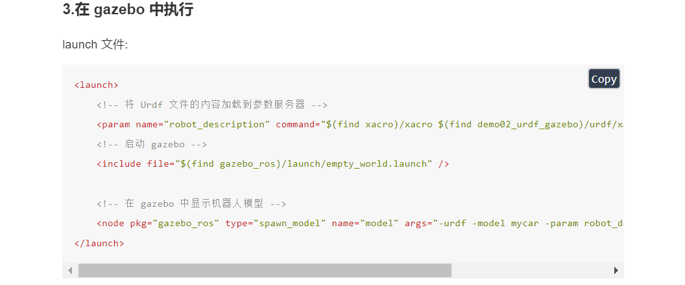
>
##  4 gazebo仿真
 两种常用的仿真环境搭建
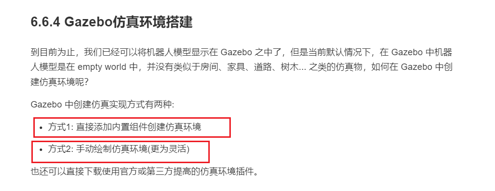
> 1 添加内置组件配置仿真环境
> 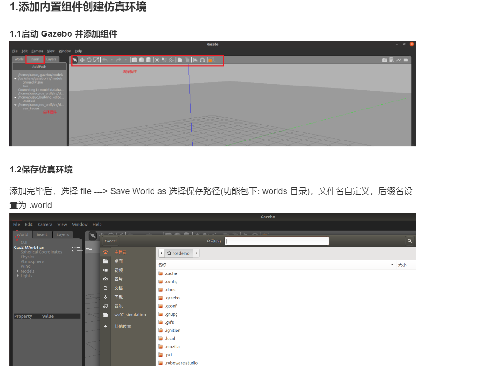
> 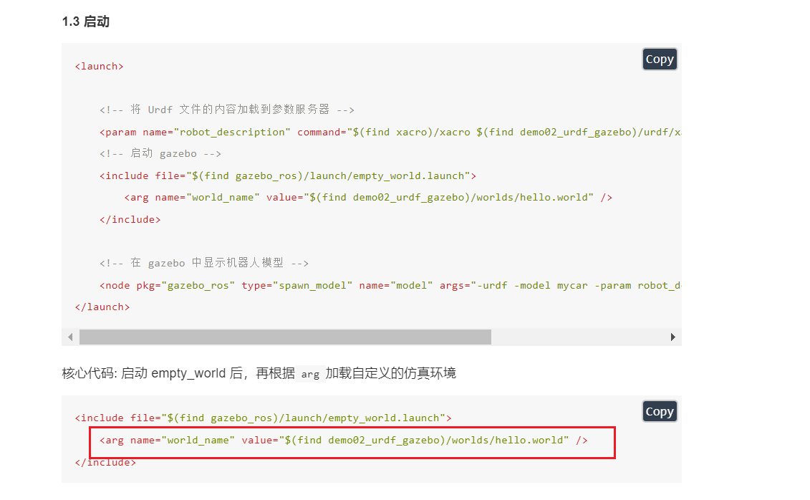
> 2 自定义仿真环境
> 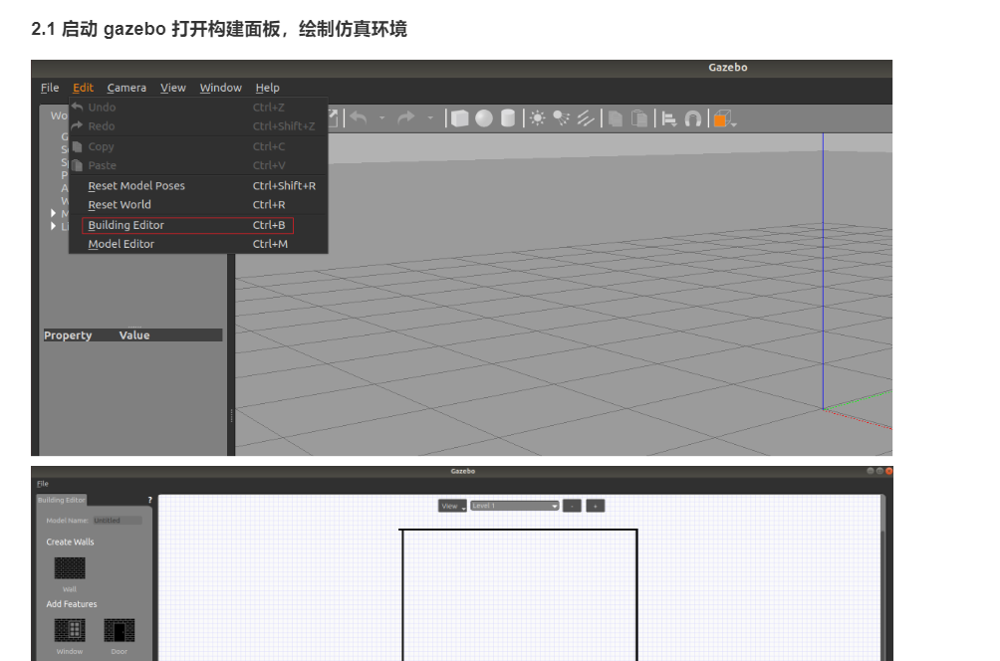
> 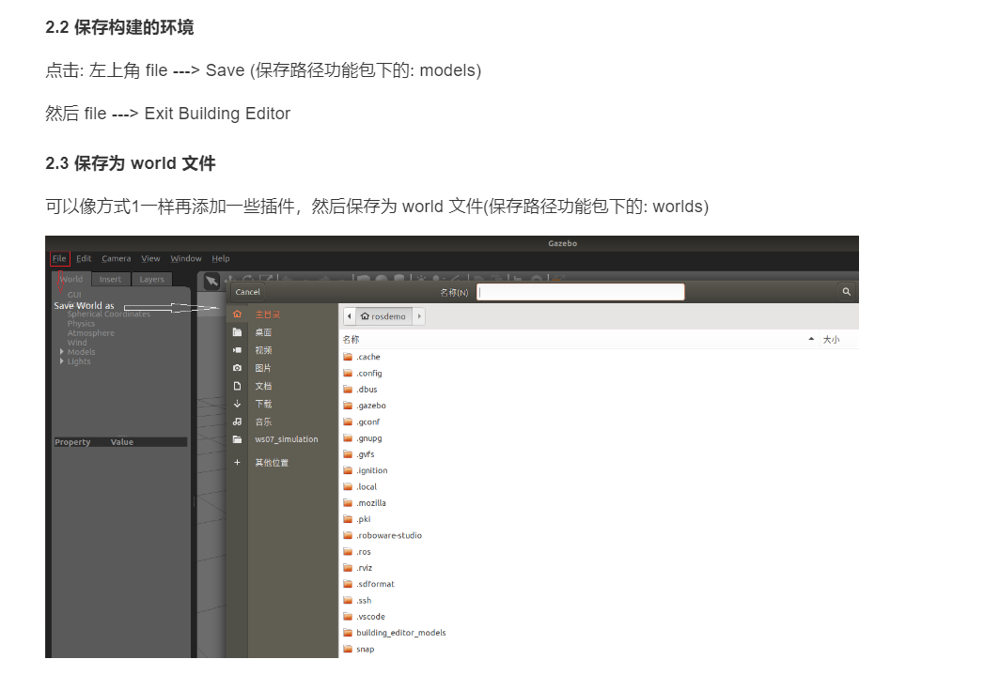
> 
> 3 使用官方提供的插件
> 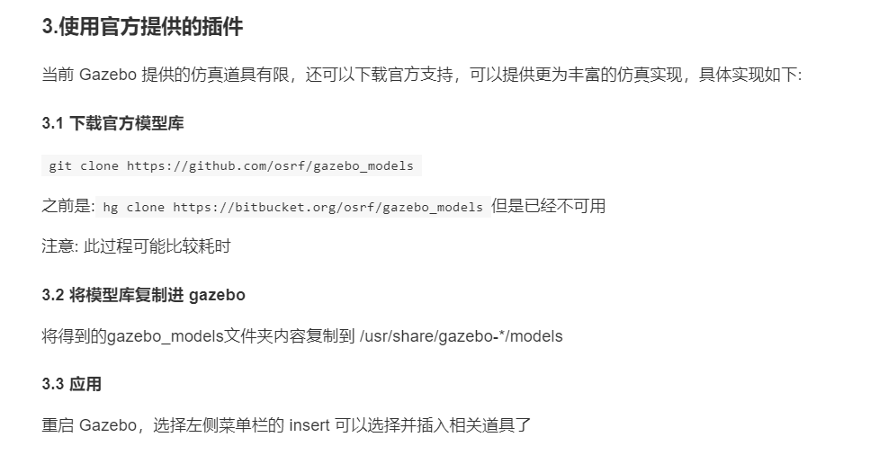