## 开发板入门
### 01 硬件介绍
> 
### 02 常见问题
> 配置生成二进制文件 bin s19
> 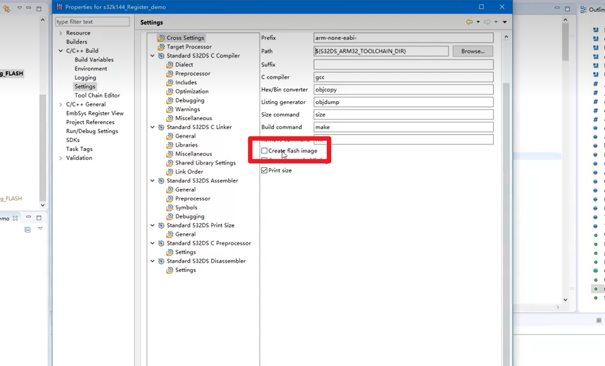
> 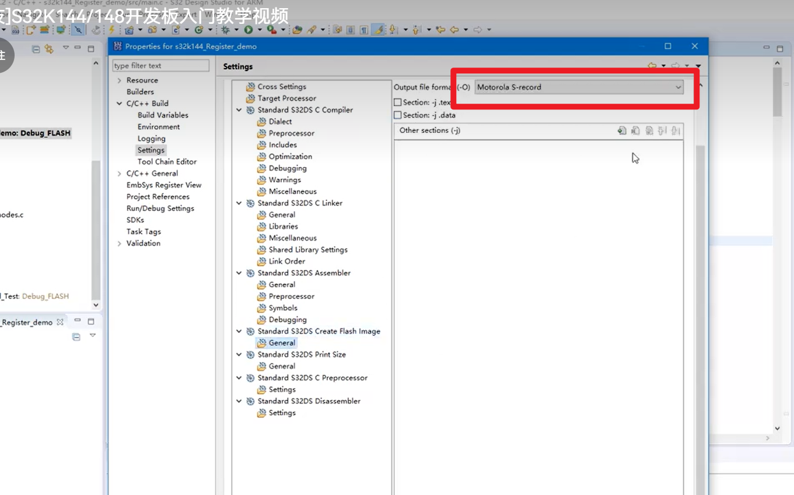
> 优化等级修改
> 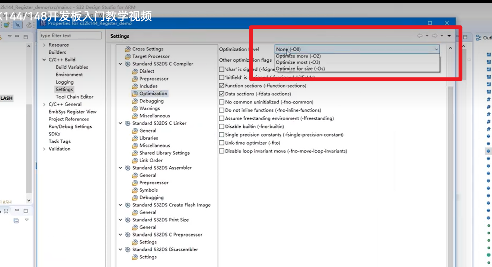
> printf浮点数输出
> 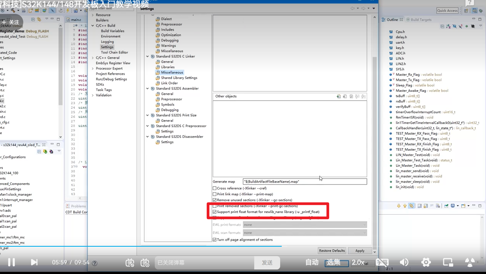
> 字体调整
> 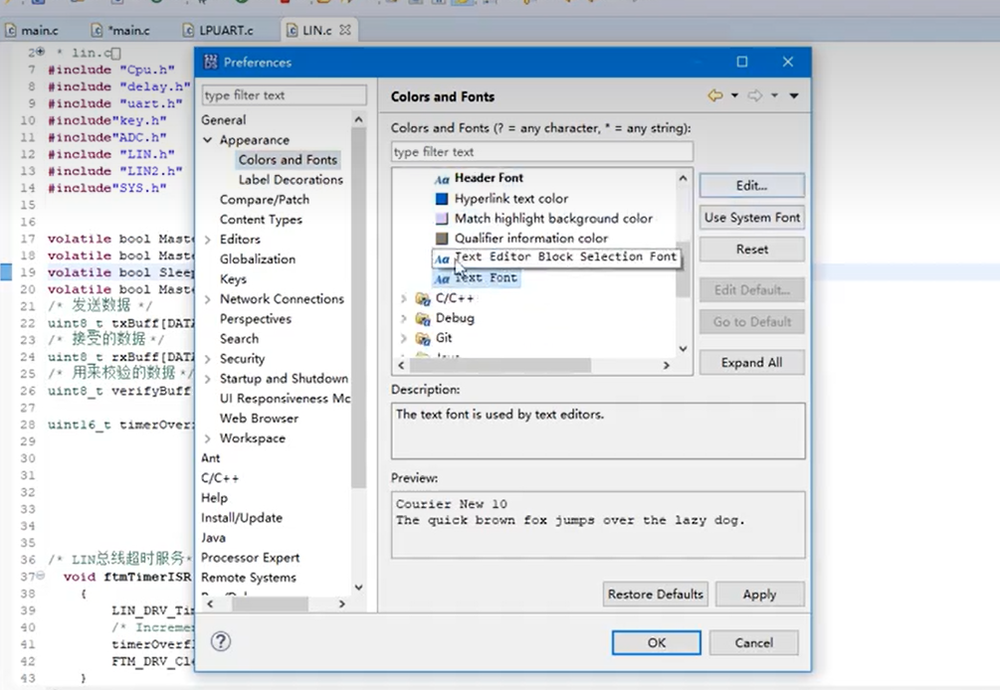
> 调试文件不生成
> 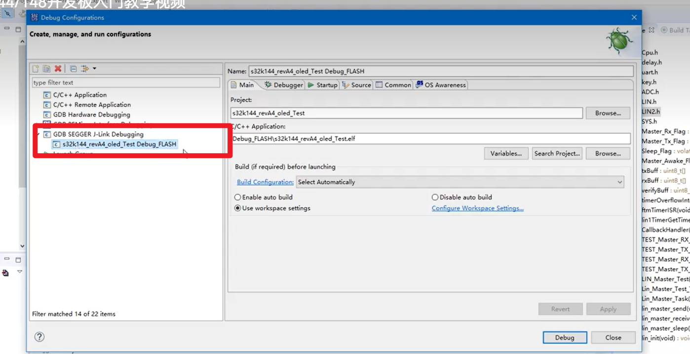
> 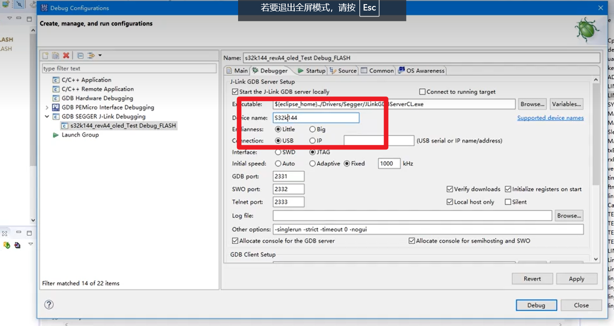
### 03 新建导入工程
> 新建工程
> 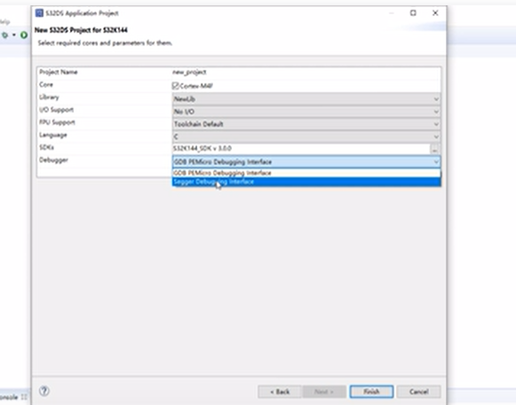
### 04 芯片锁死
> 危险操作，电压导致复位失败
> 打开jlink
> 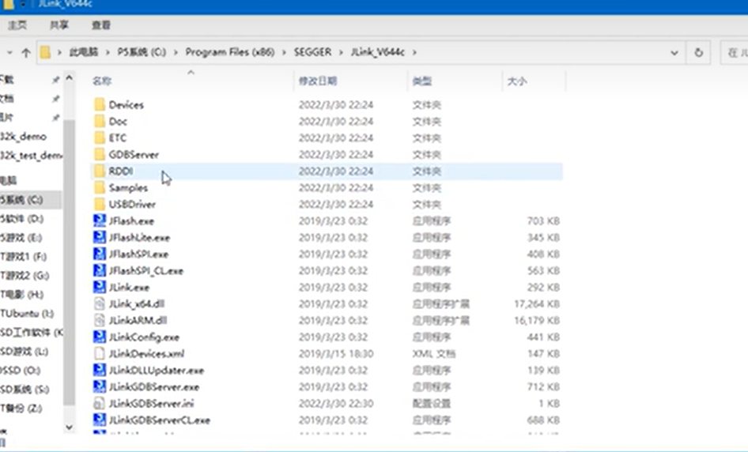
> 连接 搜索芯片内核
> 
> 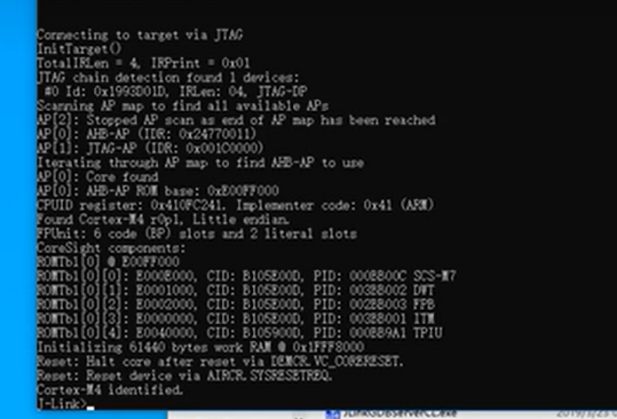
> 擦除
> 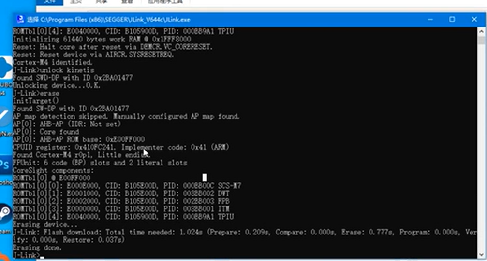
> 或者直接unlock之后擦除
> 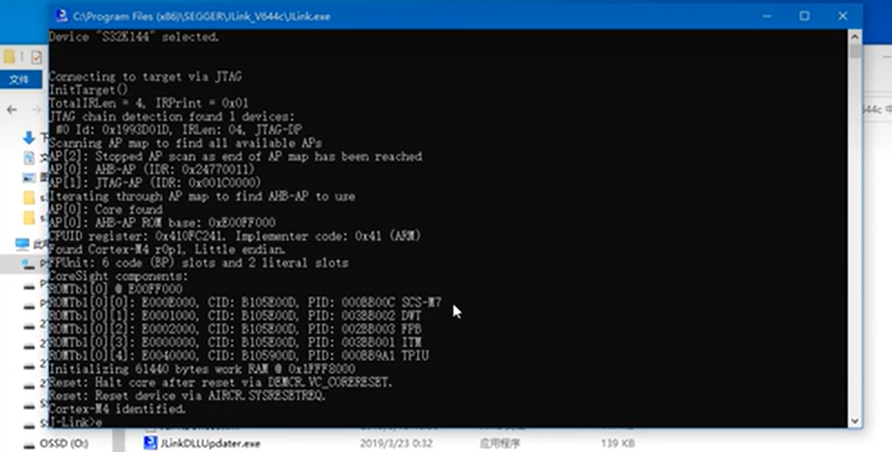
> 用jlink自带的jflash操作
> 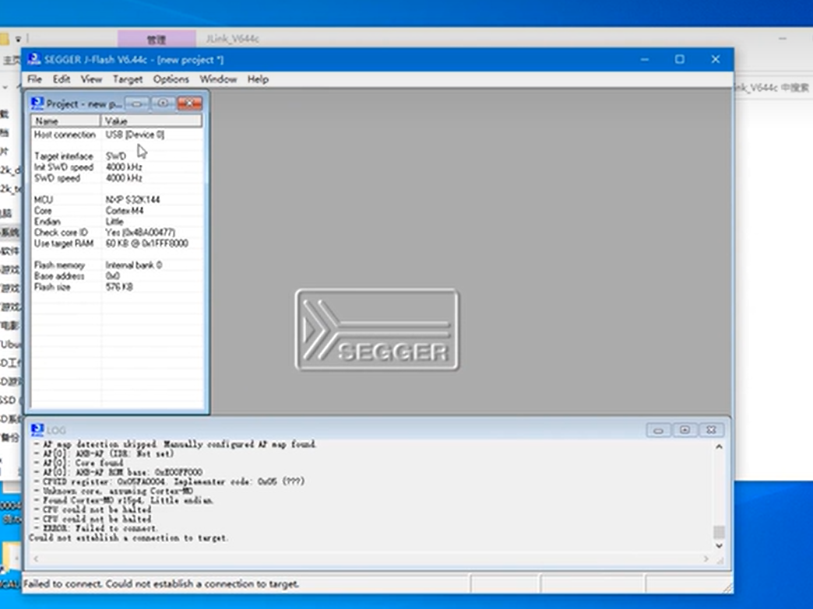