## 开发板外设
### 1 gpio
> gpio配置
> gpio生成
> 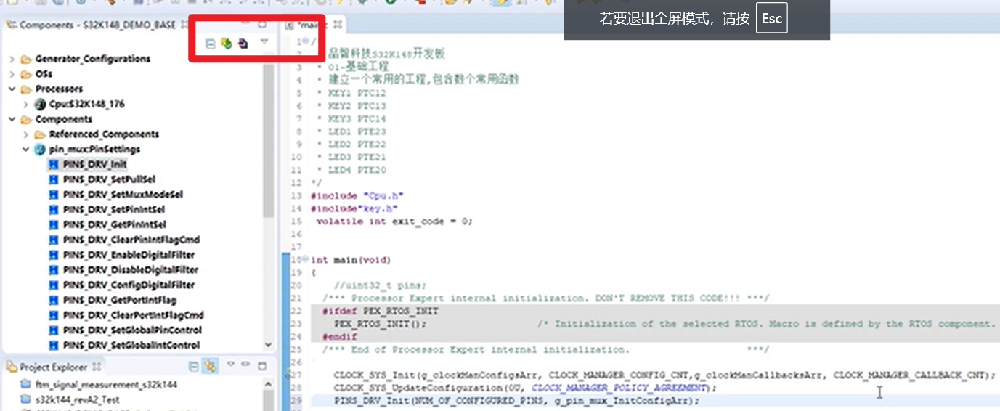
> 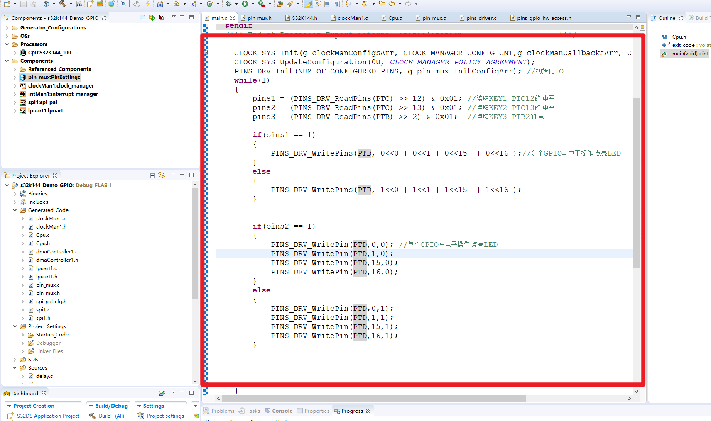

### 2 adc
> 添加adc外设
> 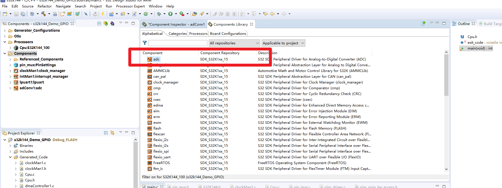
> adc配置
> 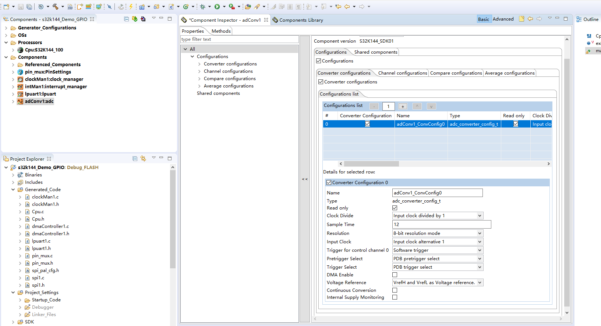
> 引脚
> 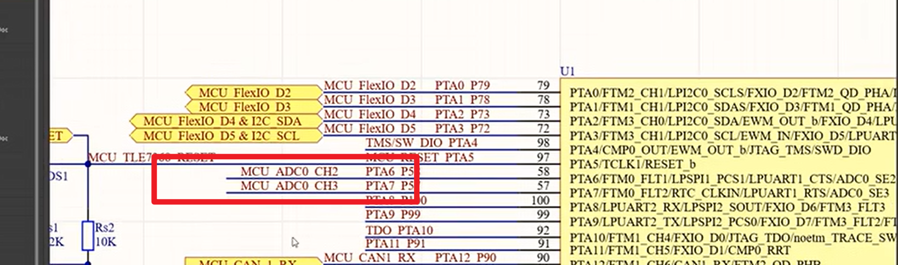
> 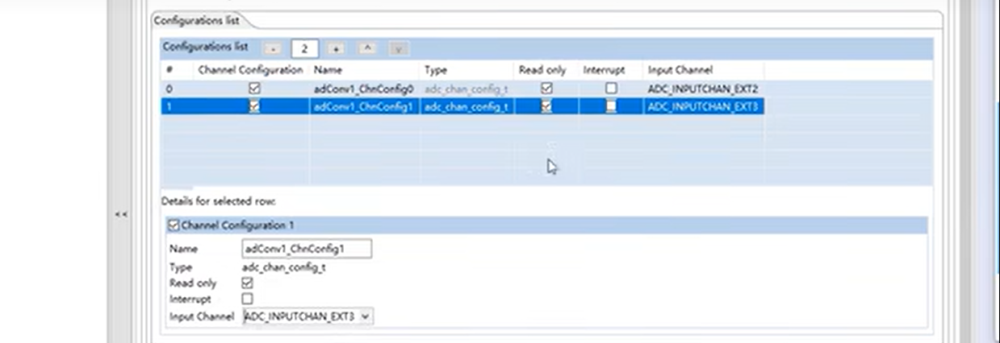
> 配置通道
> 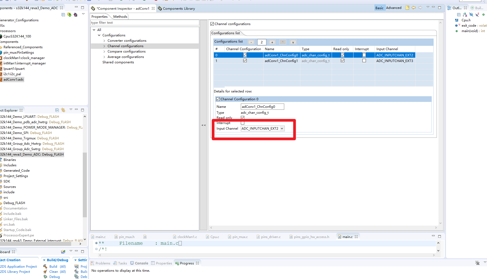
> 应用编程
> 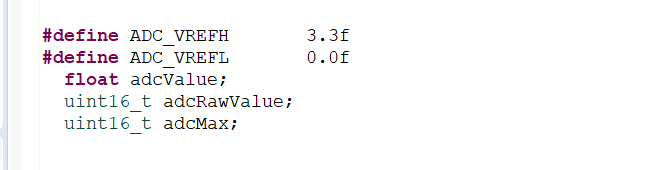
> 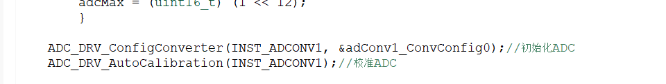
> 读取adc
> 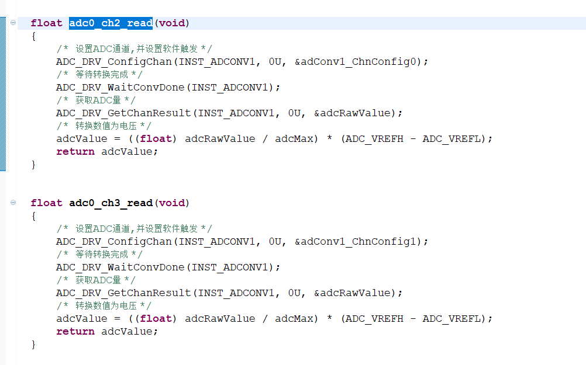

### 3 FTM定时器中断
> 添加定时器中断外设
> 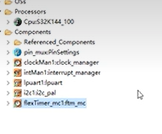
> 定时器配置
> 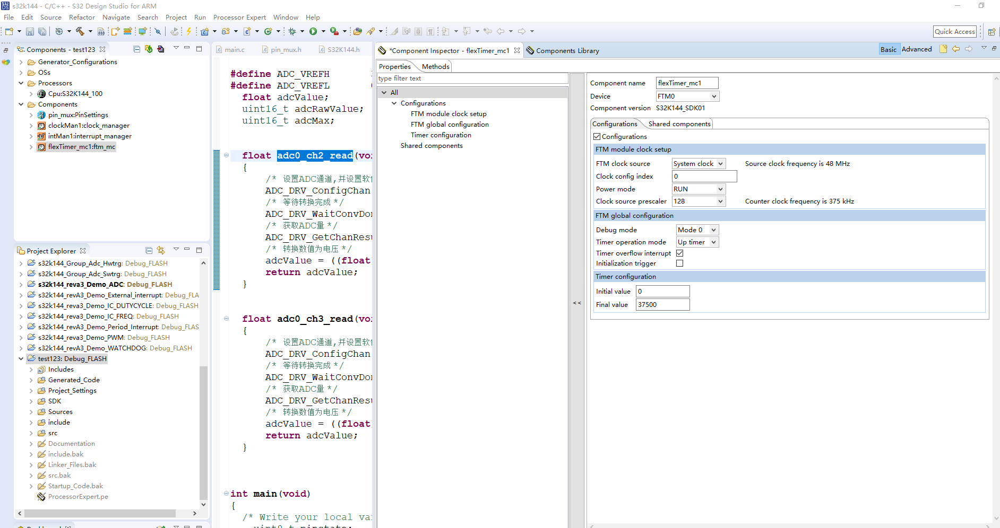
> 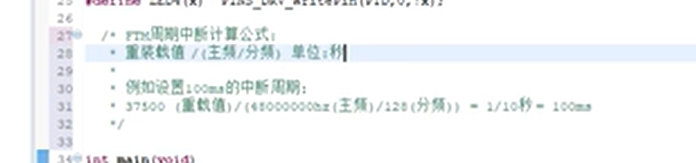
> 初始化定时器 中断配置
> 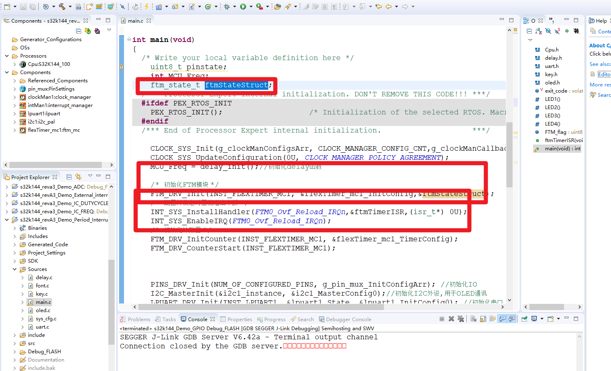

### 4 外部中断
> 外部中断
> 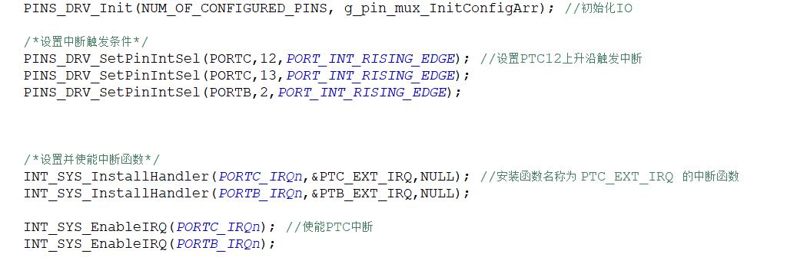
> 中断函数
> 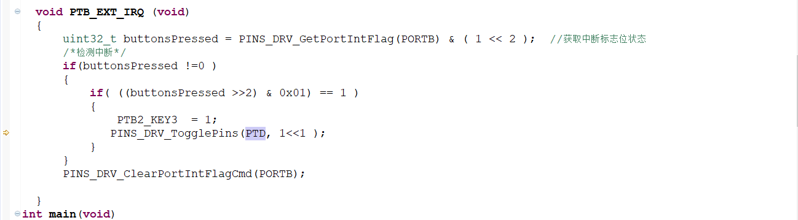

### 5 看门狗
> 看门狗和定时器配置
> 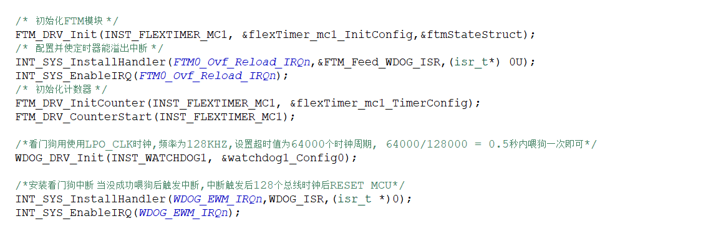
> 中断函数
> 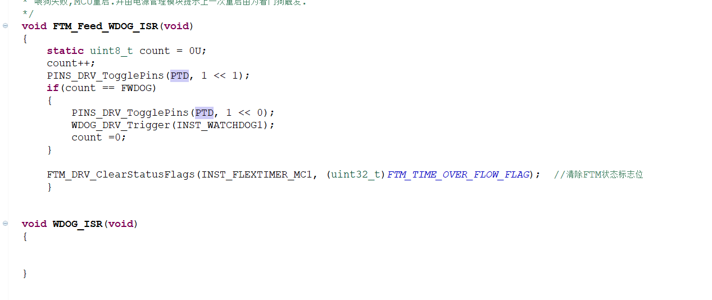

### 6 uart触发
> 串口配置
> 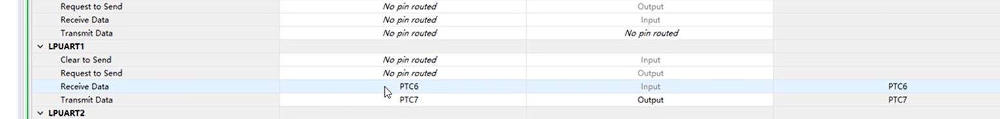
> 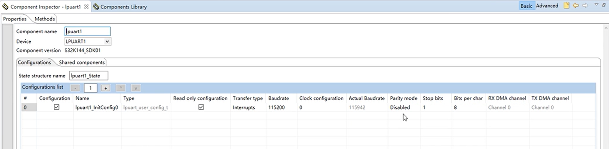
> 串口初始化
> 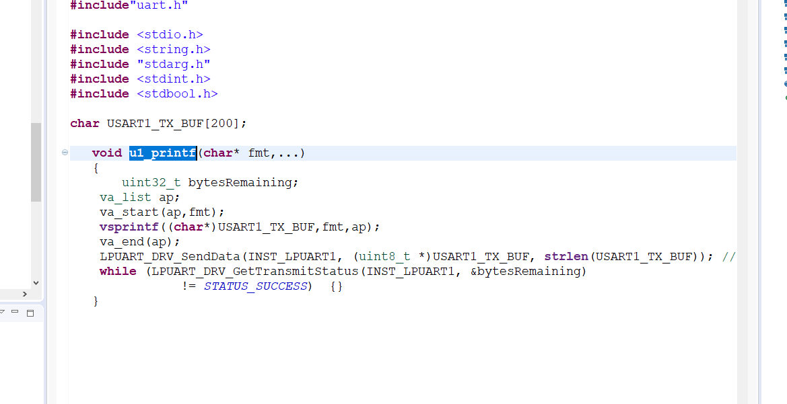
> 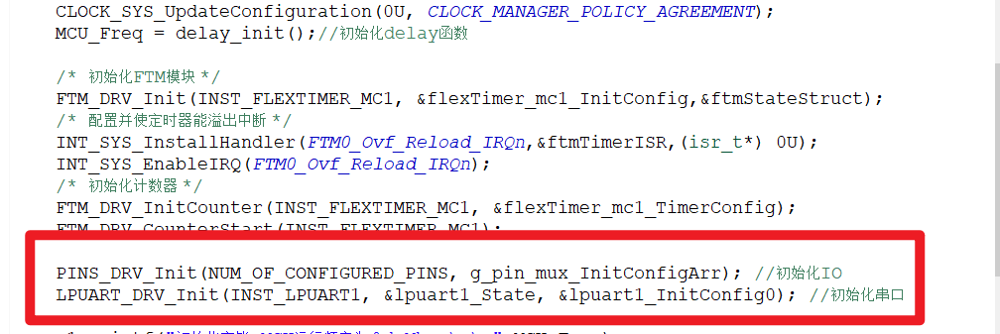

### 7 can触发