## 基于已知位姿的构图算法

### 建图算法
> 地图概念 三类地图
> 语义地图 slam的未来
> 

### 覆盖栅格建图算法
> octmap 八叉树地图 自适应分辨率
> 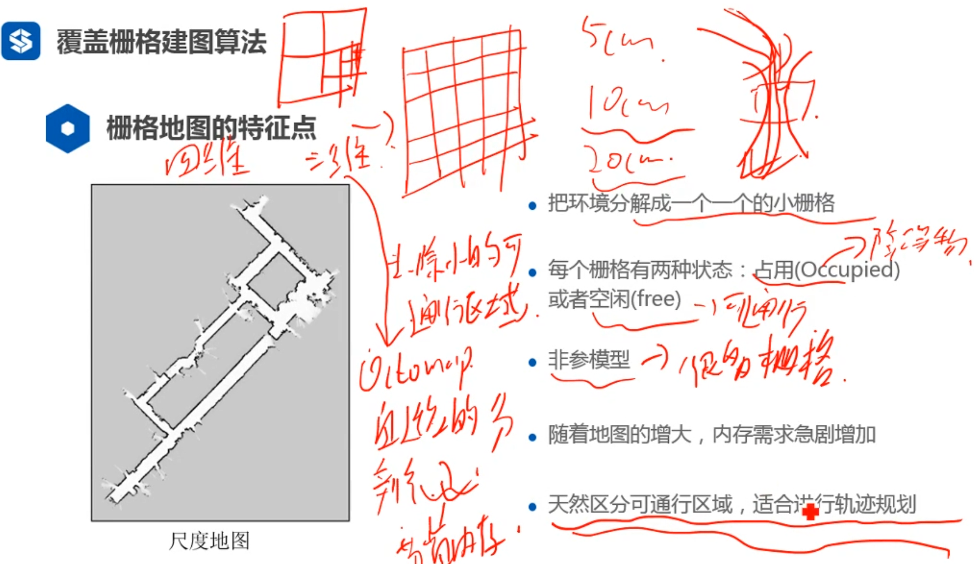
> 构建栅格地图
> 已知1-t时刻的位姿和1-t时刻的观测，让map的可能性最大（极大似然估计）
> 
> 对每一个独立的栅格估计
> 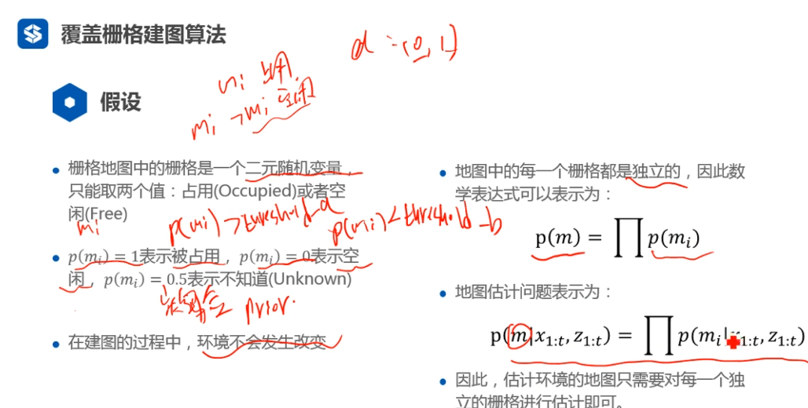
> 地图估计
> 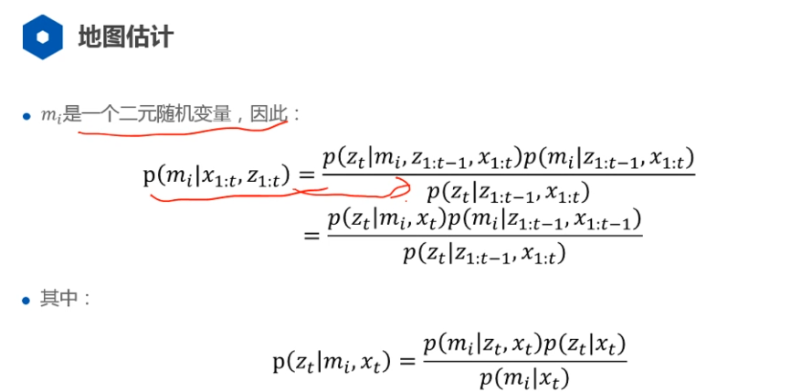
> 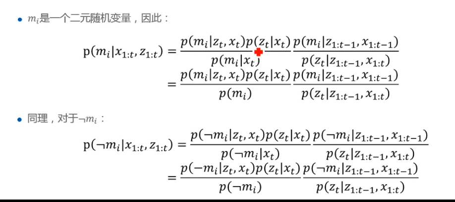
> 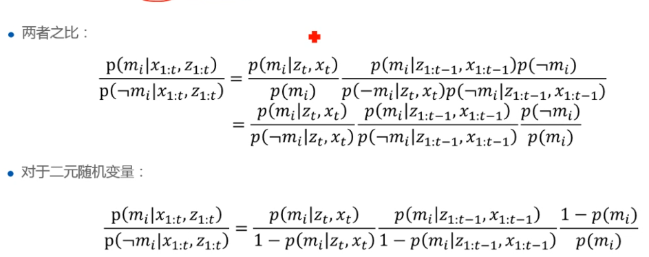
> 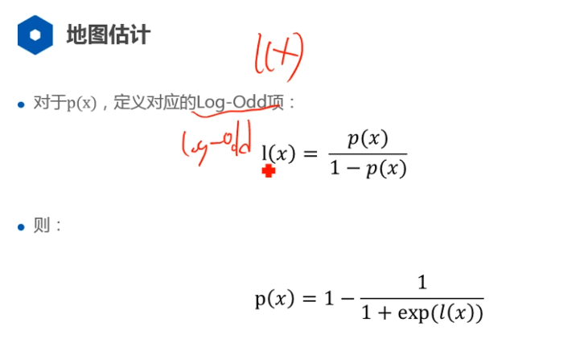
> 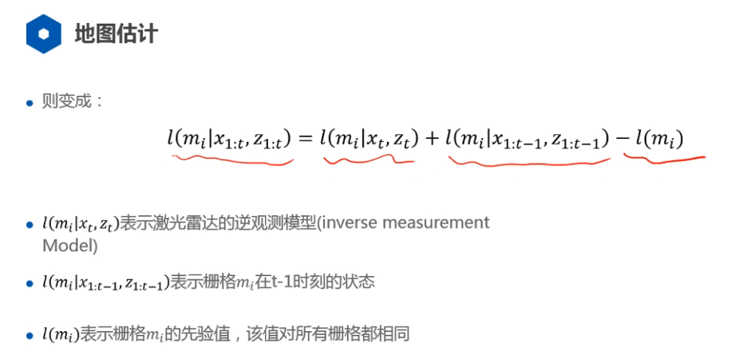
> 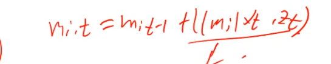
> 算法流程
> 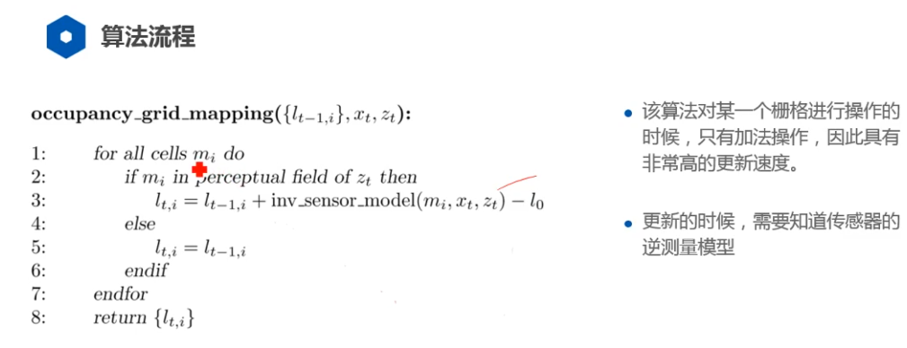
> 激光雷达的逆观测模型
> 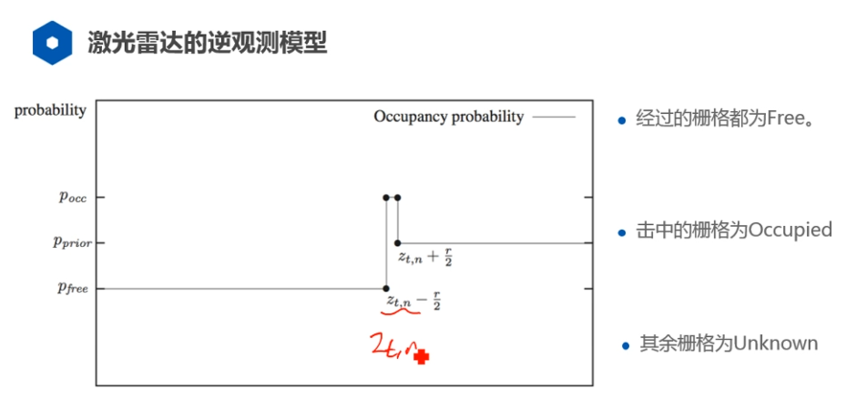

### 计数建图模型
> 概念
> 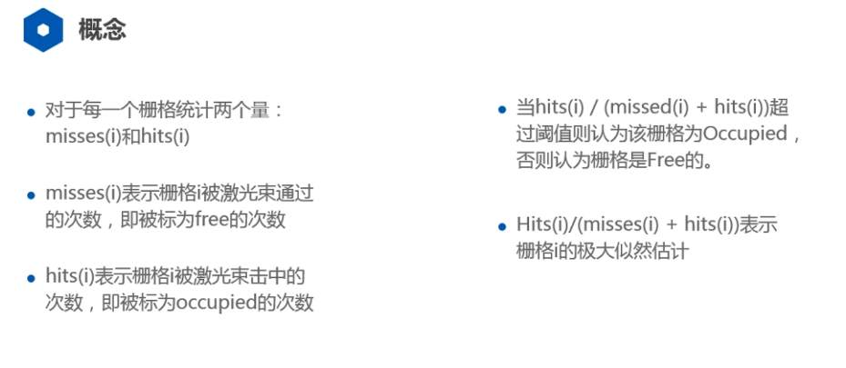
> 数学描述
> 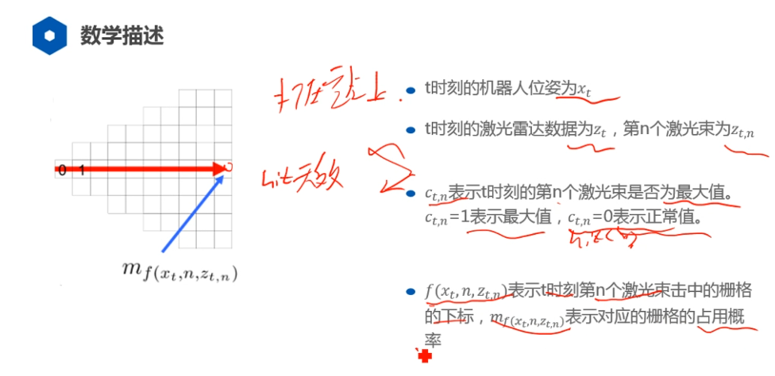
> 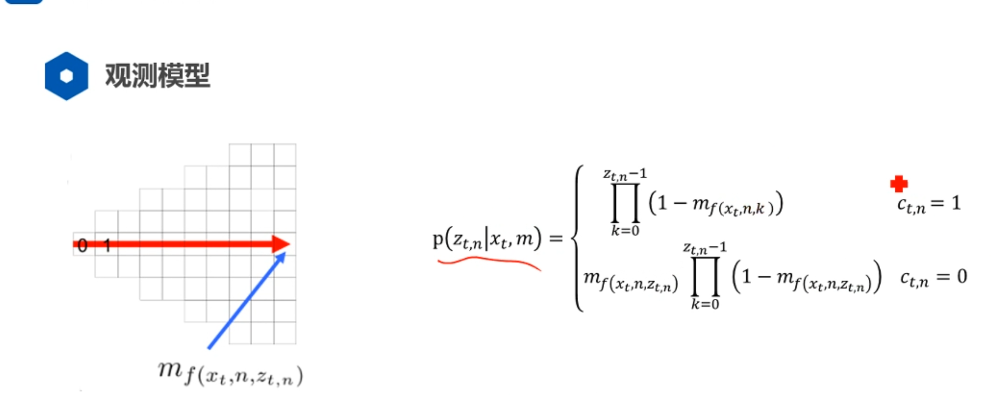
> 地图估计
> 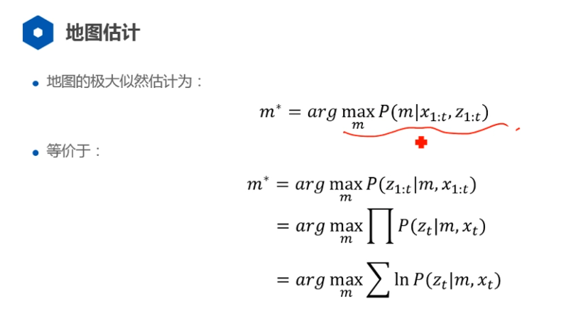