## 06 惯性导航解算及误差分析
### 1 三维运动描述基础知识
> #### 概述
> 姿态最为复杂，也最为核心
> 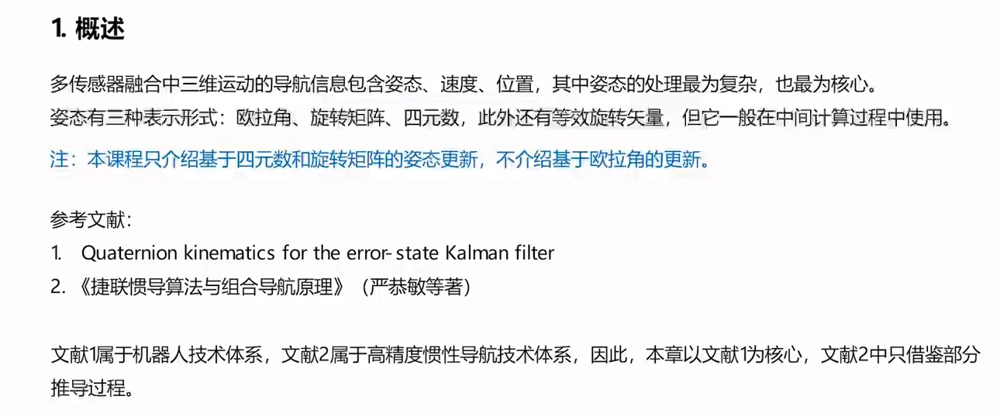
> #### 姿态描述方法
>  1 欧拉角 存在万向锁
> 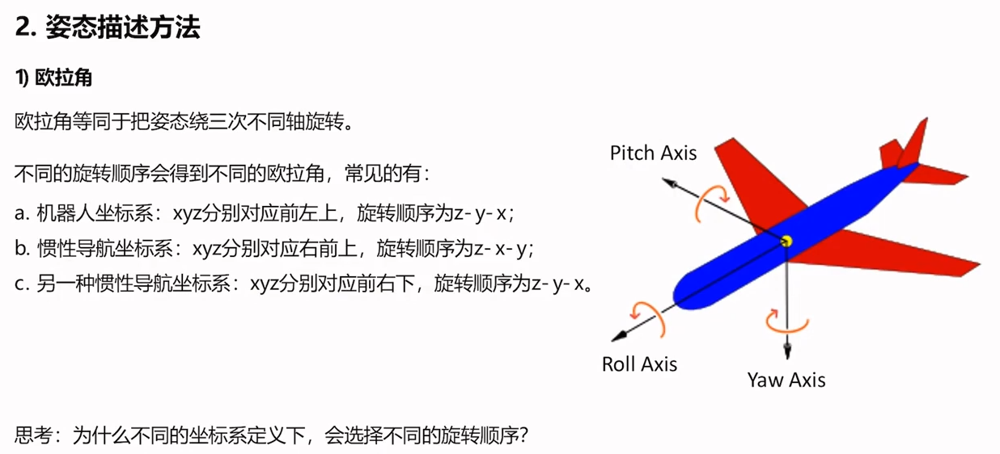
> 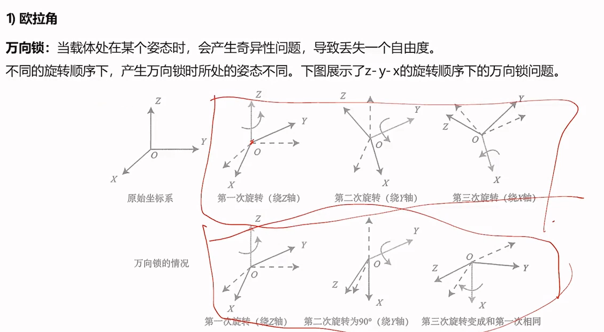
> 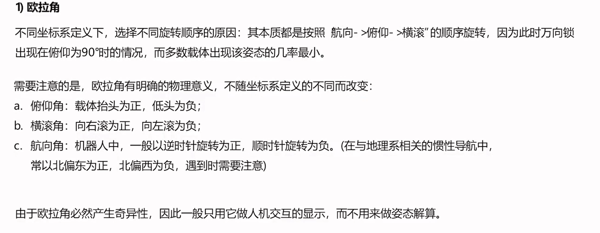
>  2 旋转矩阵 无奇异性 重新做单位正交化
> 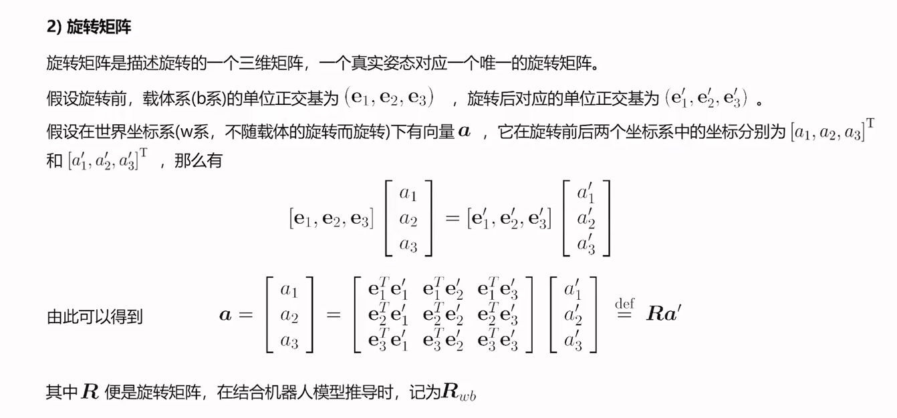
> 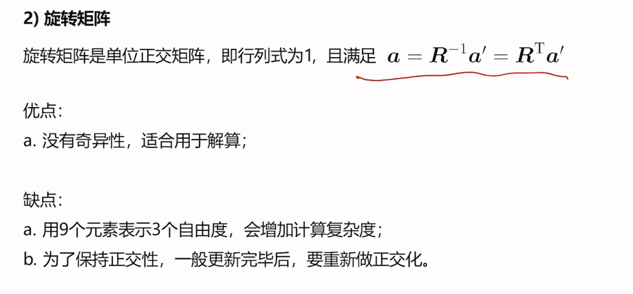
> 
> 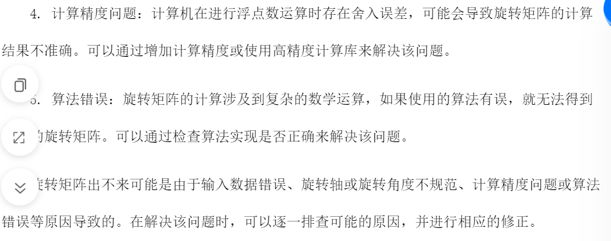
> 3 四元数
> 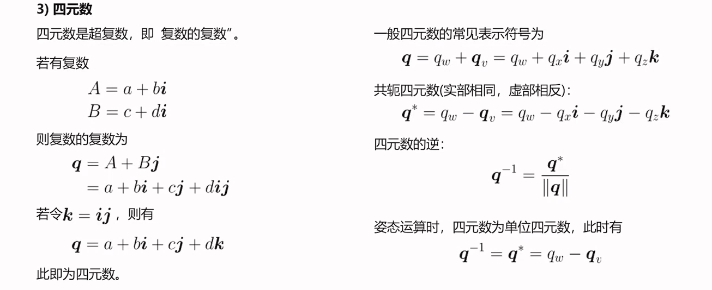
> 四元数乘法
> 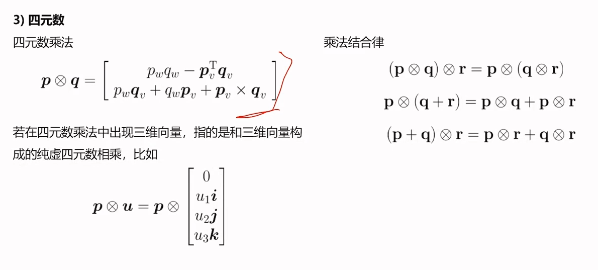
> 四元数 重要的性质 
> 展开成矩阵与向量相乘的形式
> 左乘与右乘
> 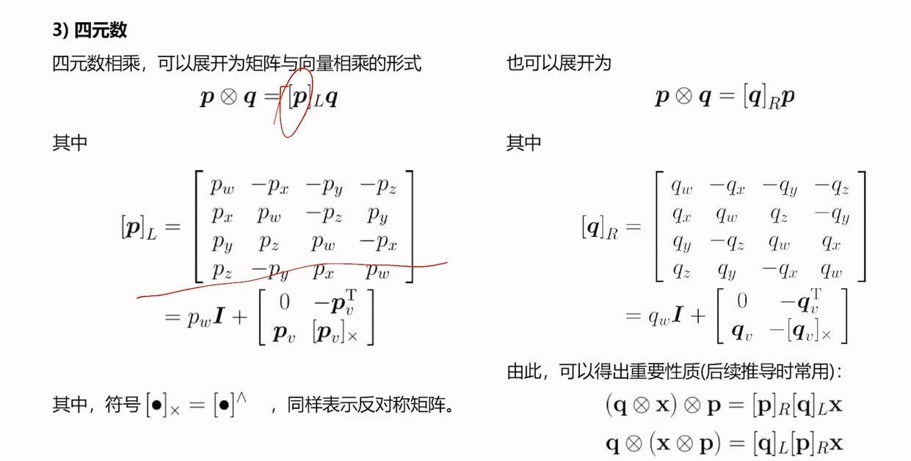
> 4 等效旋转矢量
> 有长度 非单位的轴 可以只用三个数来表示
> 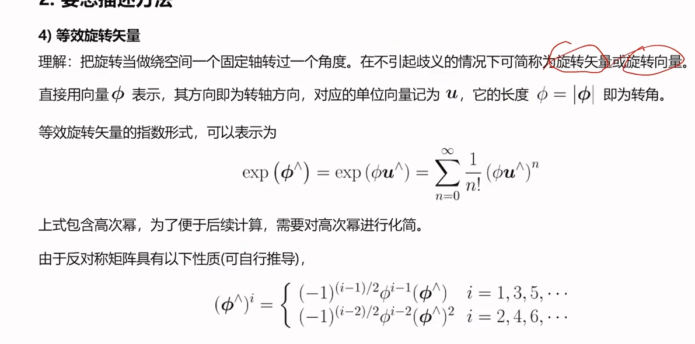
> 旋转矢量的指数函数形式 重要公式
> 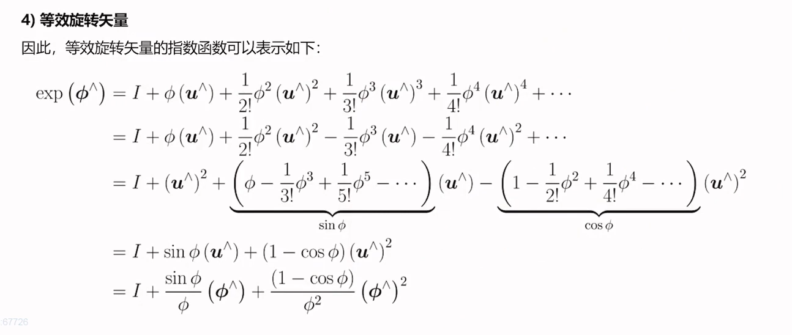
> #### 各个描述方法之前的关系
> 欧拉角和旋转矩阵
> 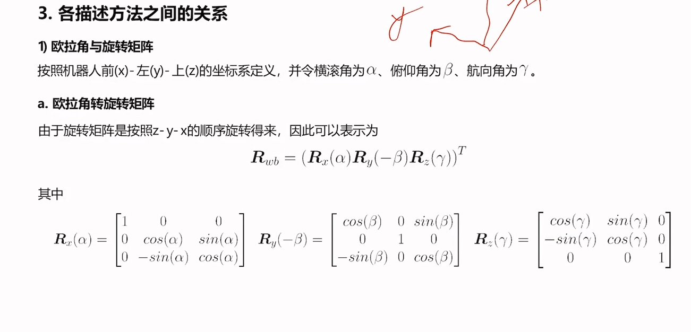
> 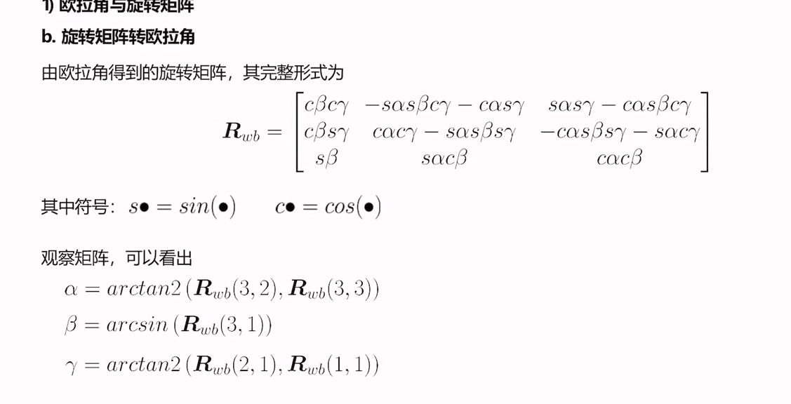
> 四元数与旋转矩阵
> 旋转矩阵转四元数 比较复杂，且有两个前置条件 不常用
> 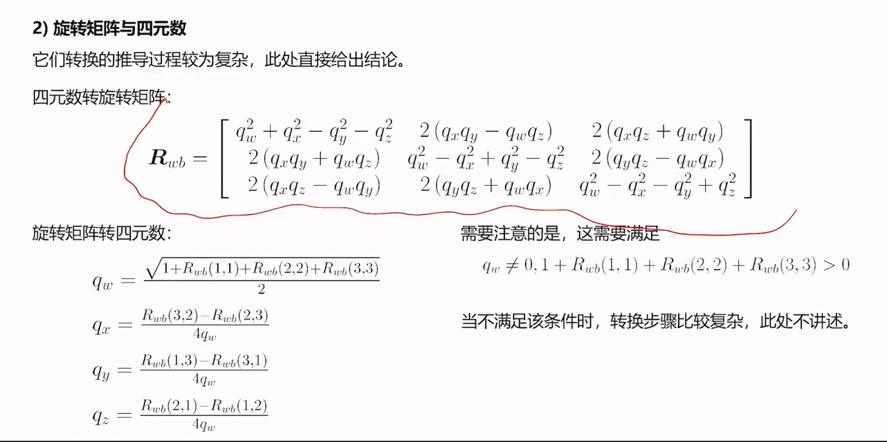
> 旋转矩阵与旋转矢量
> 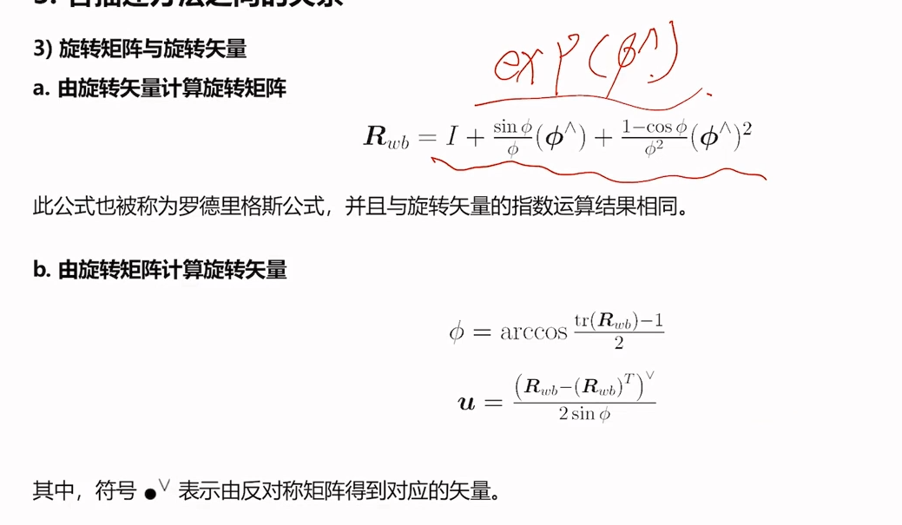
> 四元数与旋转矢量
> 三维->四维->三维
> 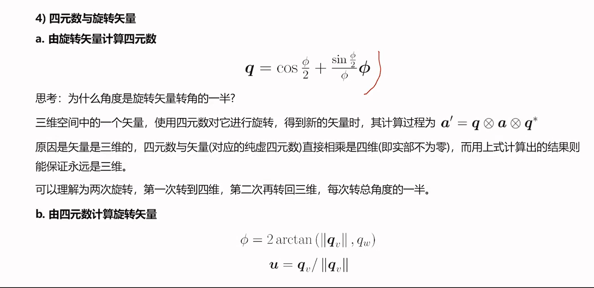

### 2 三维运动的微分性质
> 描述的是四元数或是旋转矩阵与角速度的关系
> #### 旋转矩阵的微分性质
> 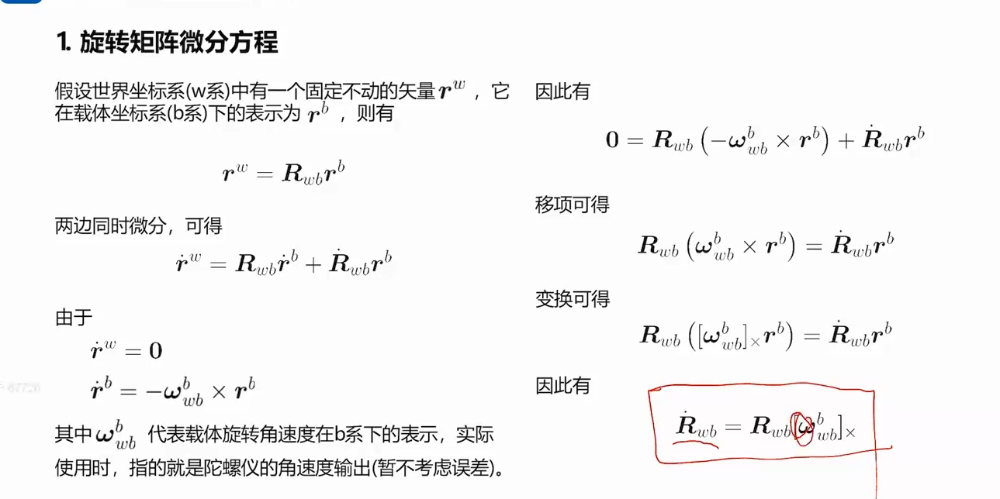
> #### 四元数微分方程
> 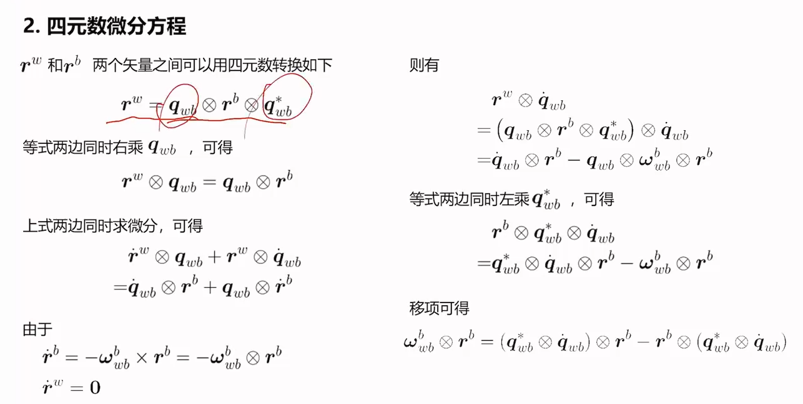