## 基于滤波的融合方法
### 目录
> 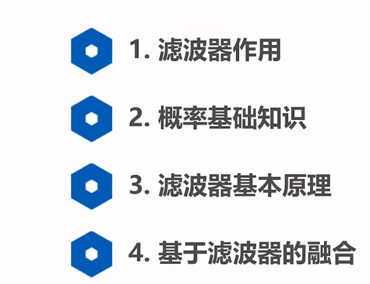

> ### 1 滤波器作用
> 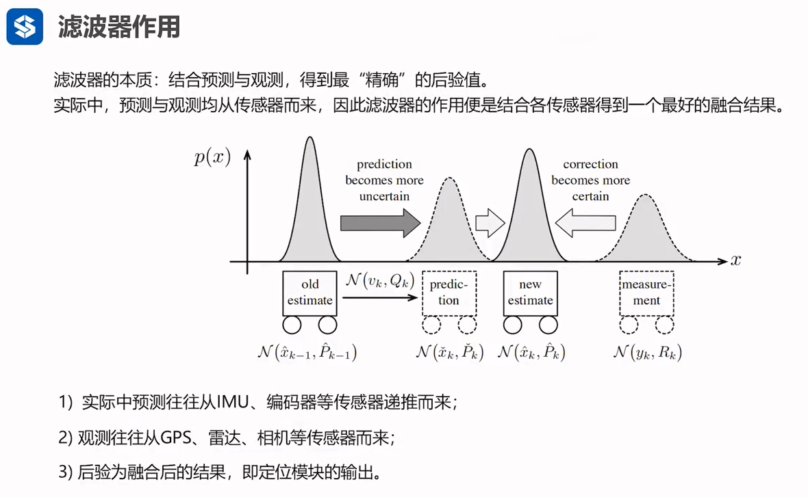

> ### 2 概率基础知识
> 1 概率 概率密度
> 概率是概率密度的积分
> 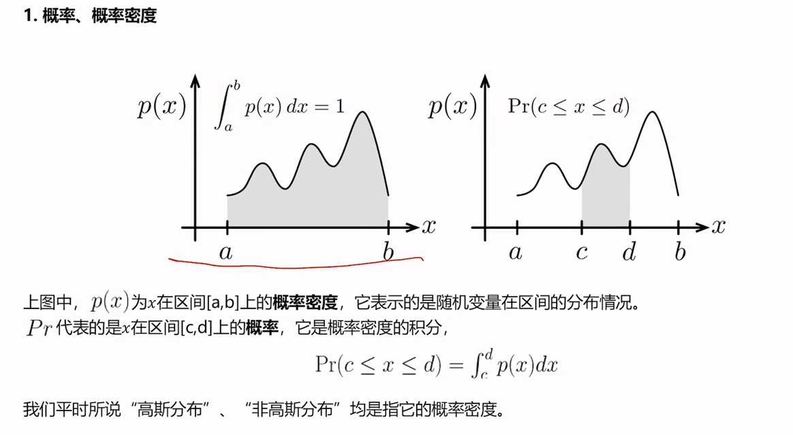
> 2 联合概率
> 同时处在某个区间的概率
> 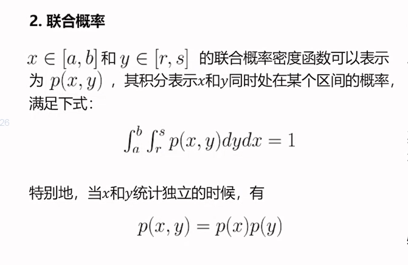
> 3 条件概率密度
> 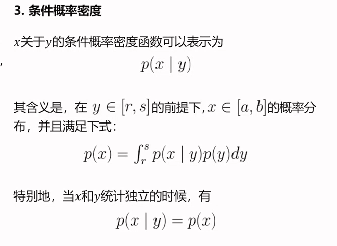
> 4 贝叶斯公式 
> 5 贝叶斯推断
> 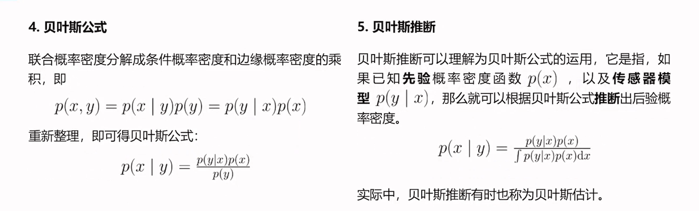
> 6 高斯概率密度函数
> 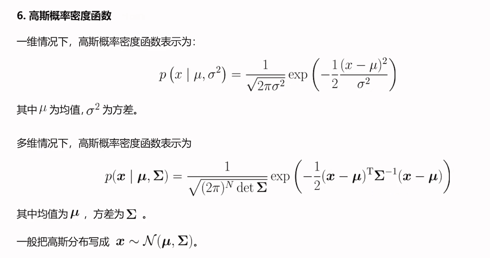
> 7 联合高斯概率密度函数 （求逆）
> 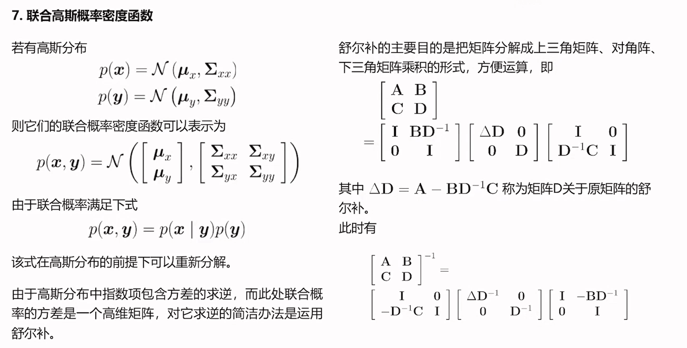
> 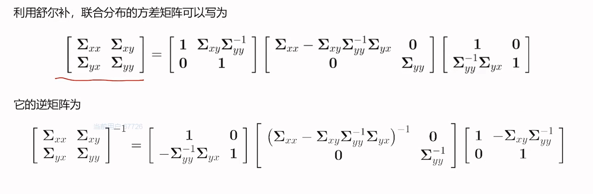
> 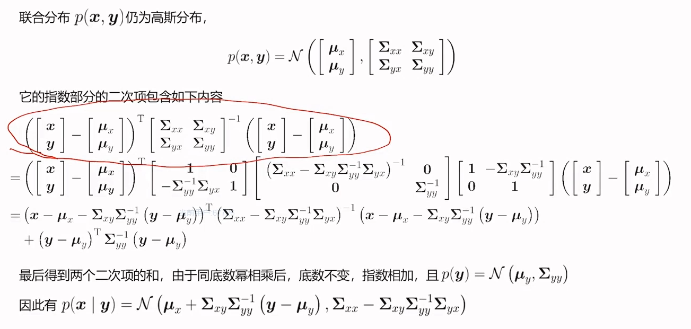
> 高斯随机变量的线性分布
> 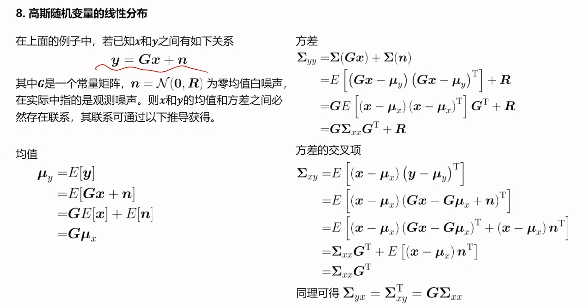
> ### 3 滤波器基本原理
> 1 状态估计模型
> 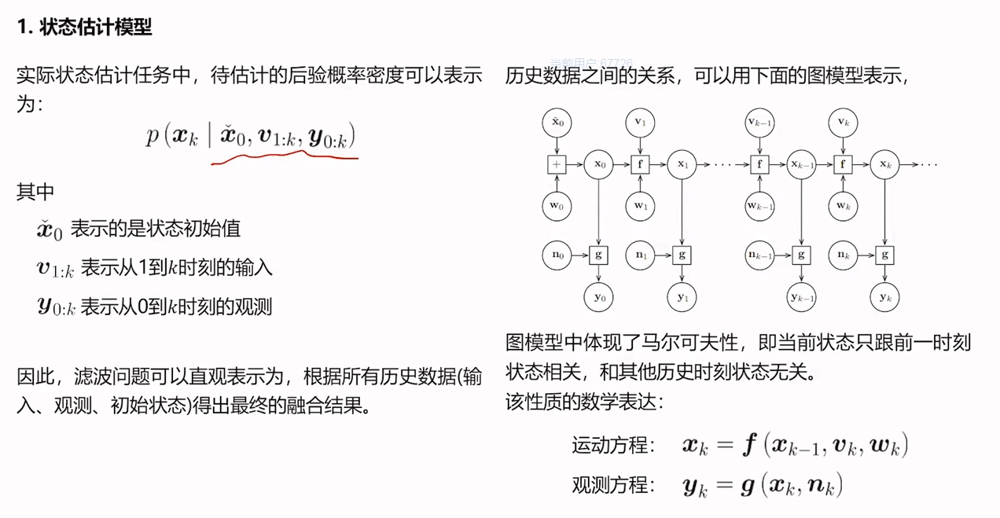
> 2 贝叶斯滤波
> 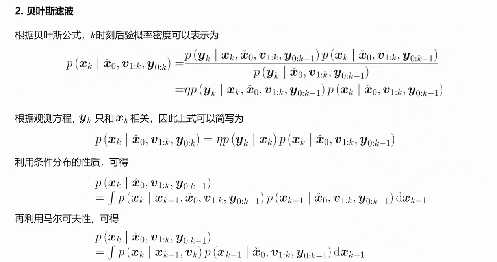
> 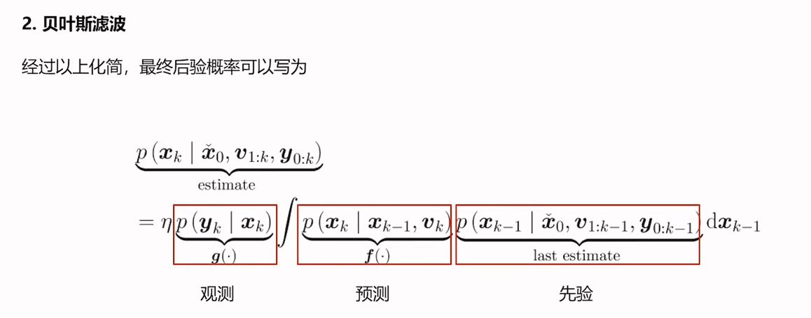
> 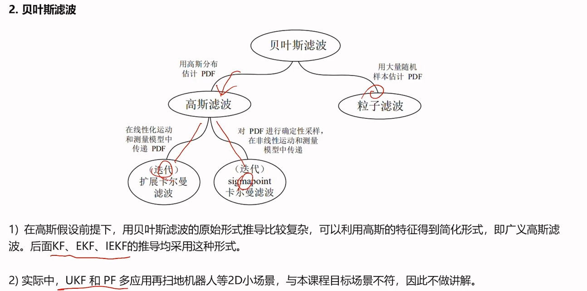
> 3 卡尔曼滤波（KF）推导
> 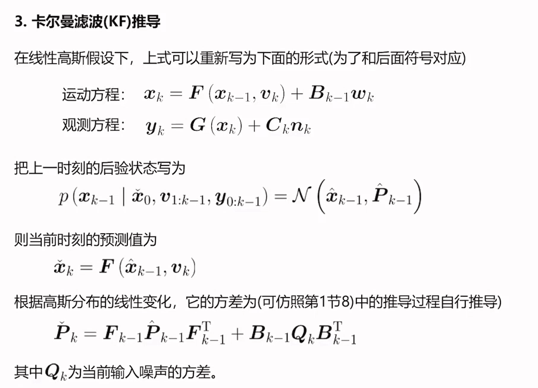
> 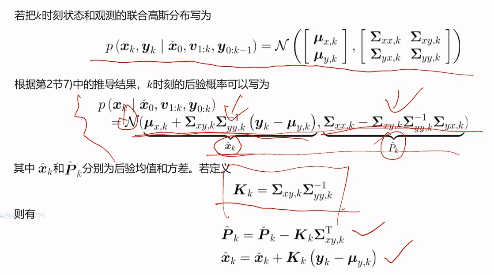
> 4 扩展卡尔曼滤波
> 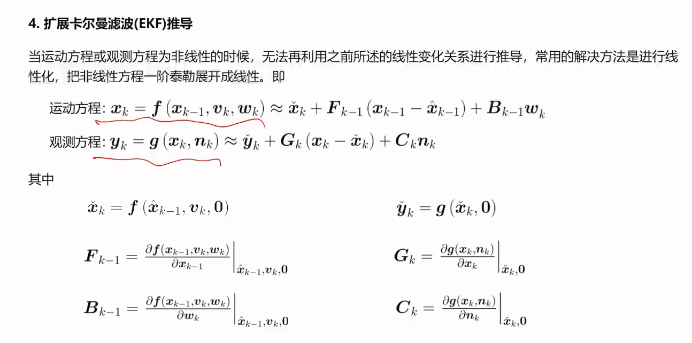
> 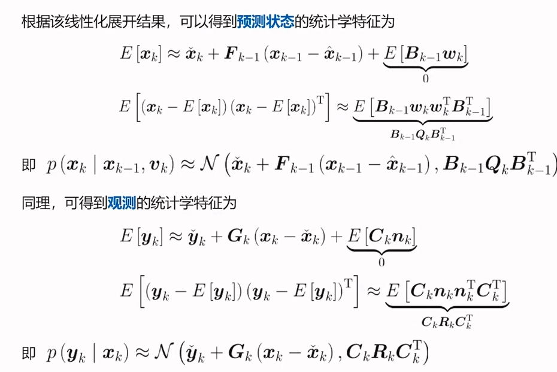
> 5 迭代扩展卡尔曼滤波（IEKF）推导
> 
> 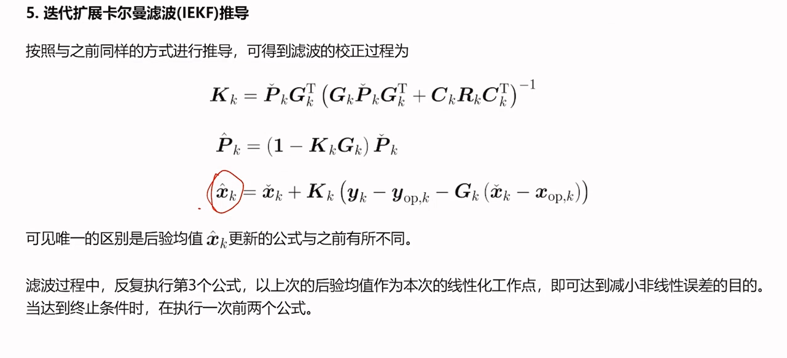
> 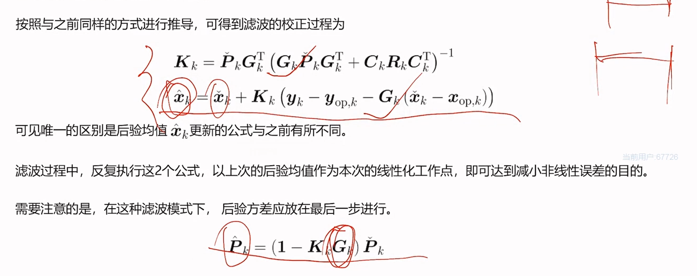

### 4 基于滤波器的融合
> 