## 基于滤波的融合方法2
### 目录
> 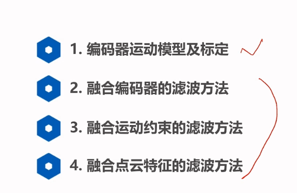

### 1 编码器运动模型及标定
> 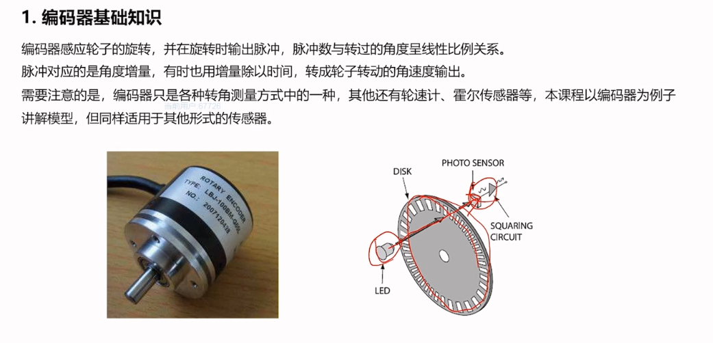
> 1 编码器基础知识
> 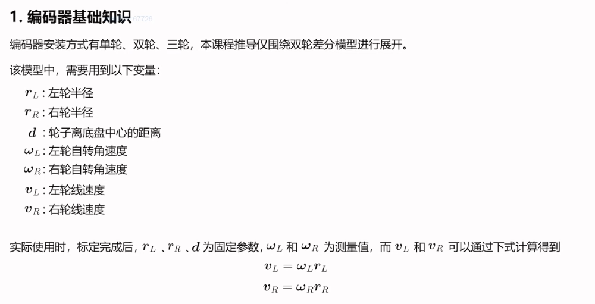
> 2 编码器运动模型
> 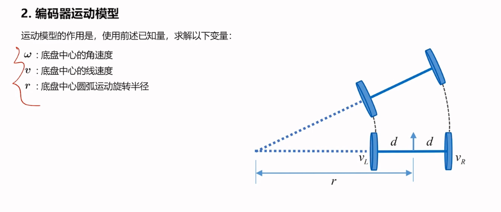
> 旋转半径求解
> 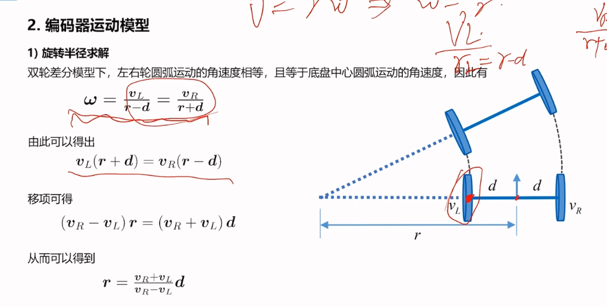
> 角速度 线速度求解
> 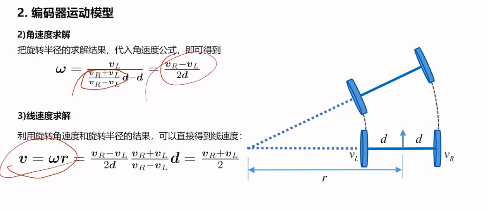
> 位姿求解
> 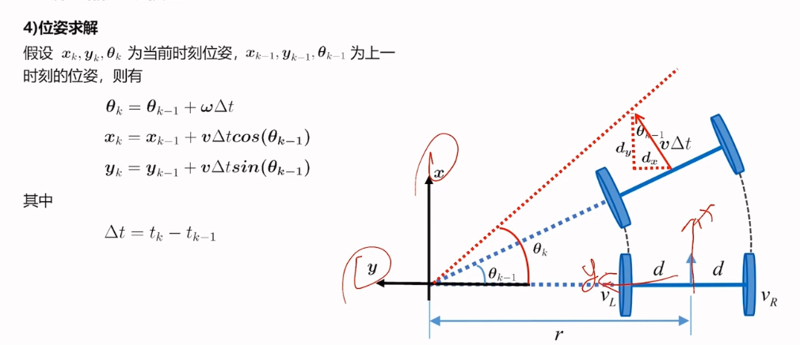
> 3 编码器的标定
> 半径标定
> 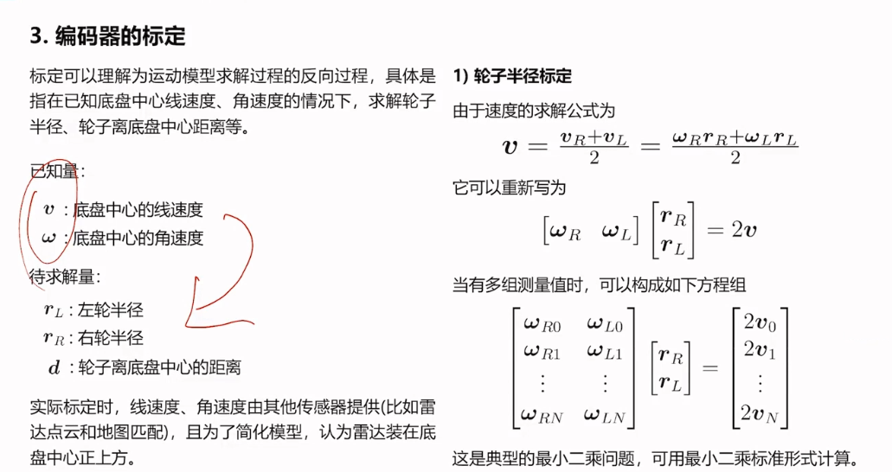
> 轮子和底盘中心距离标定
> 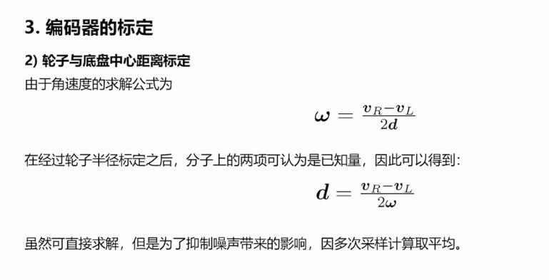
> 
### 2 融合编码器的滤波方法
> 1核心思路
> 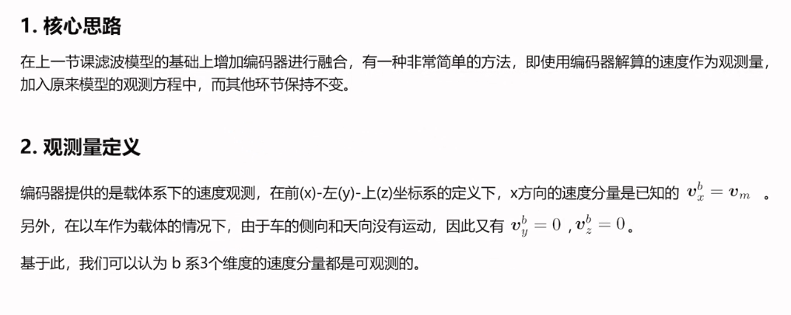
> 观测方程推导
> 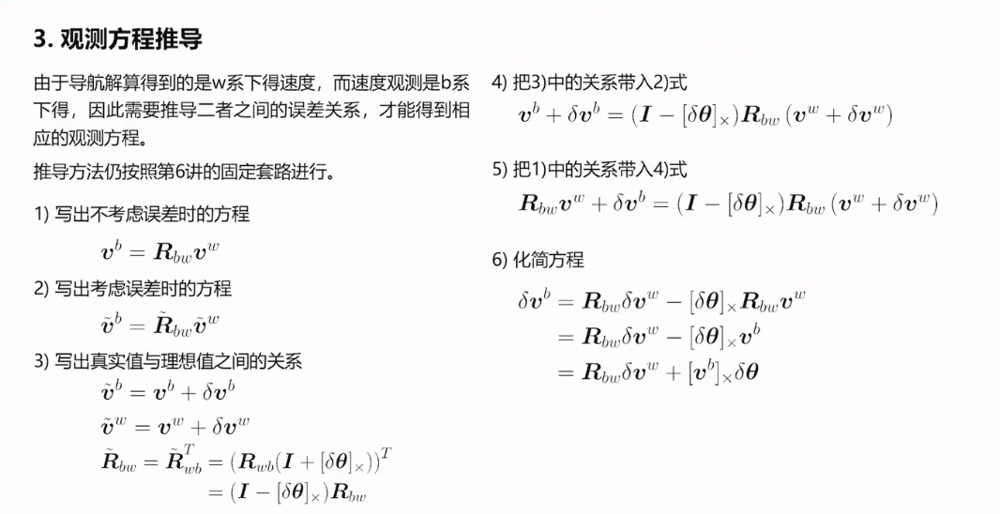
> 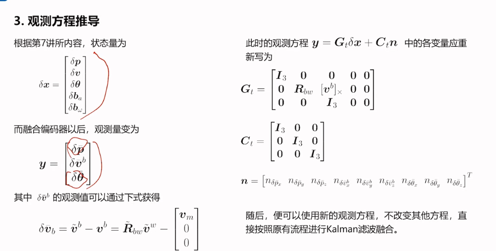

### 3 融合运动约束的滤波方法
> 带有约束的运动方程
> 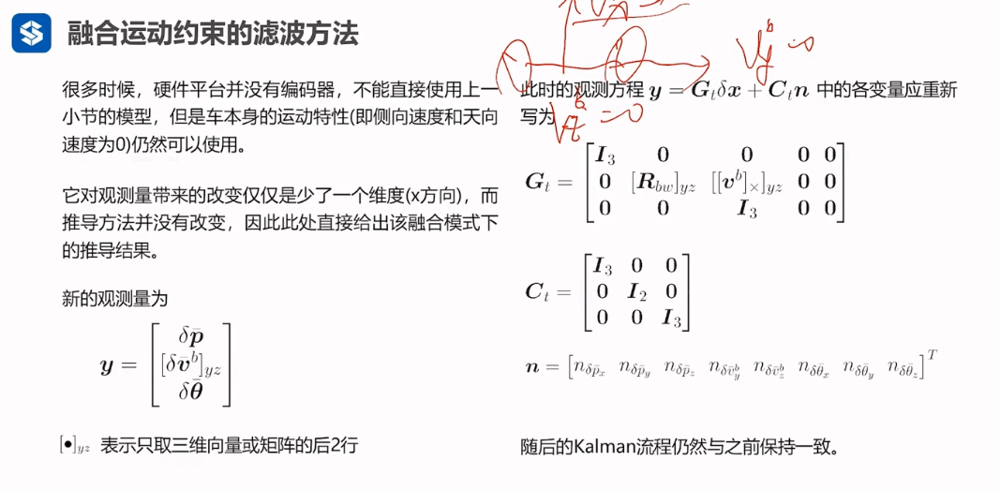
> 融合点云滤波 整体约束
> 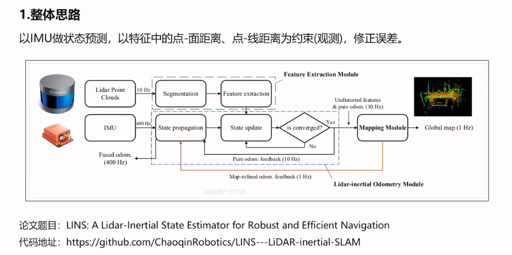
> 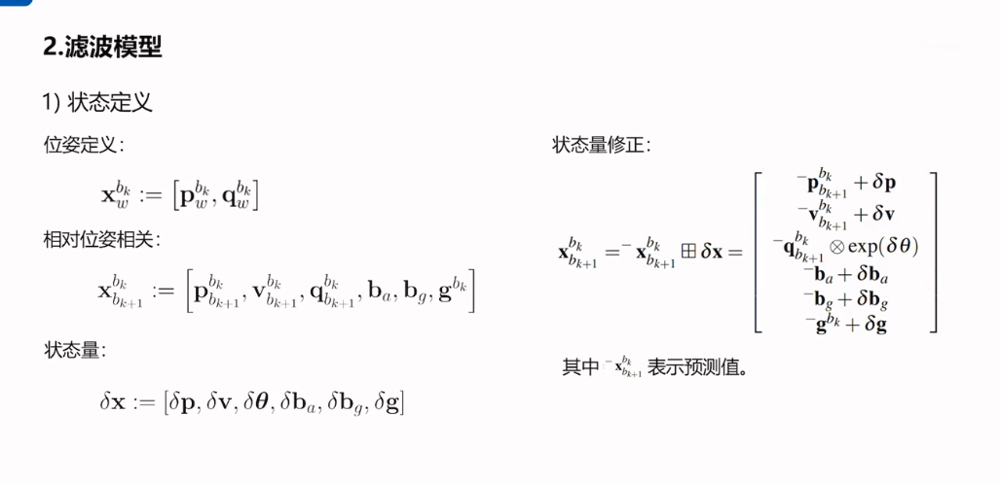
> 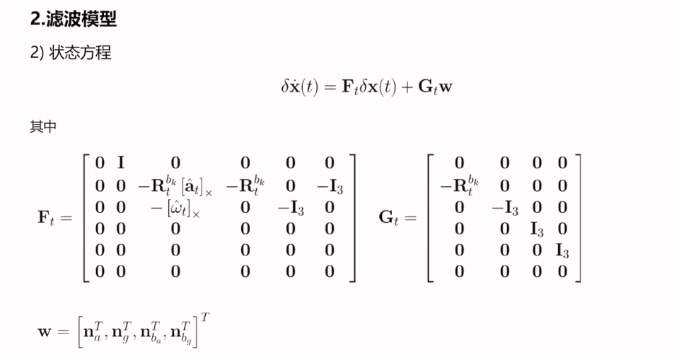
> 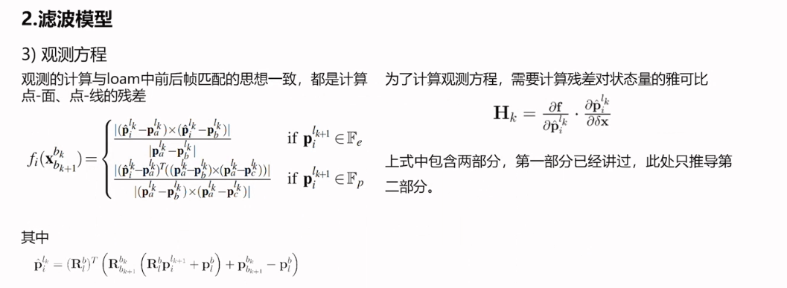
> 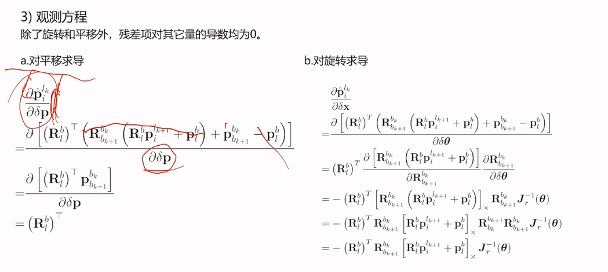
> 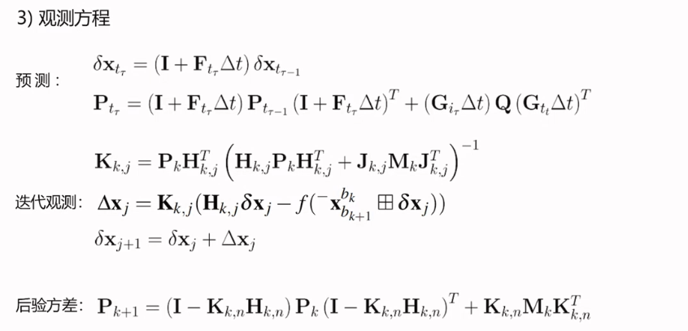
> 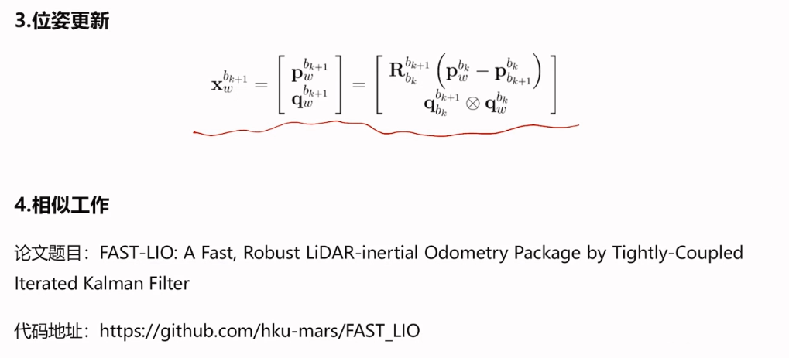