## kdtree
> 一种分割K维数据空间的数据结构，用于多维空间关键数据的搜索（范围搜索和最近邻搜索）。
> 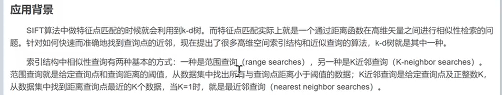
> 例子如下
> kd树算法要确定分割线
> 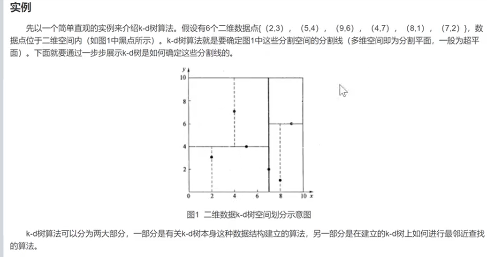
> kd树算法分为两个部分，一部分是有关k-d树本身这种数据结构建立的算法，另一部分在建立的kd树上进行最近邻查找。
> kd树算法（构造）
> 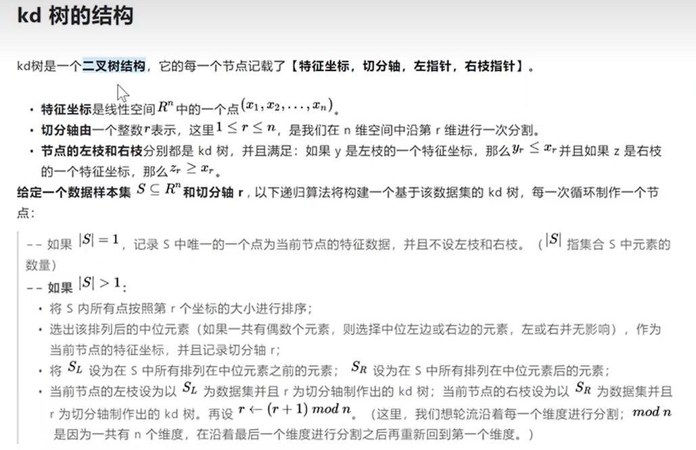
> kd树上的knn算法（搜索）
> 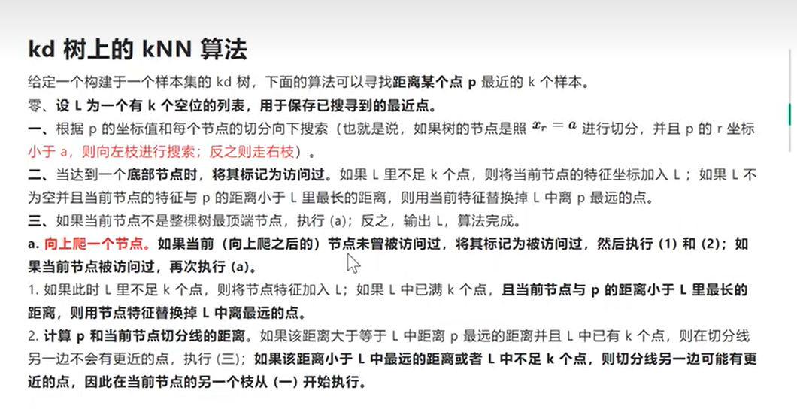
> 点云上的搜索
> 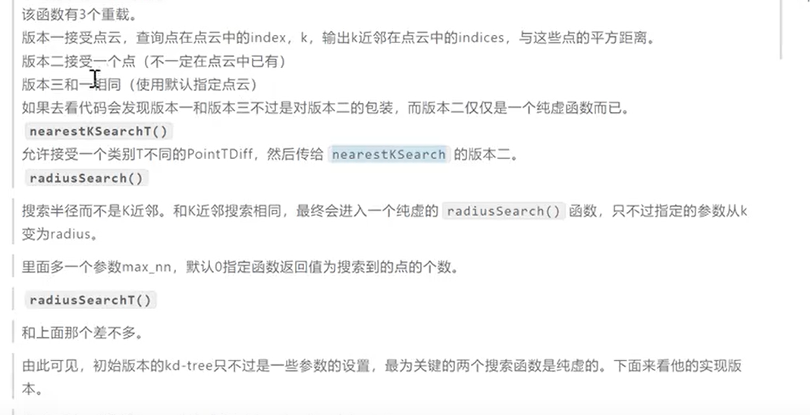
> pcl kdtree flann（快速最近邻搜索包）
> 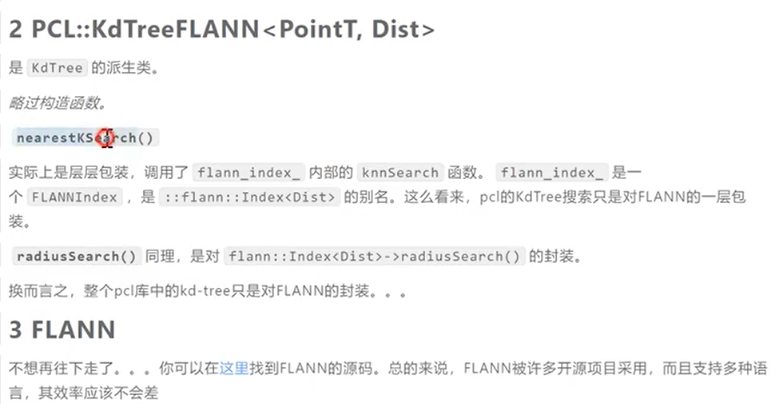
>
## kdtree代码部分
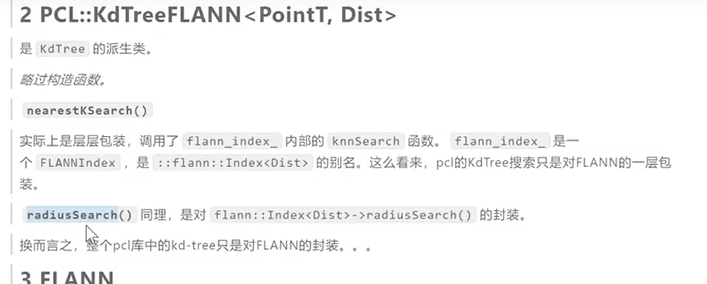
> 创建点云
> 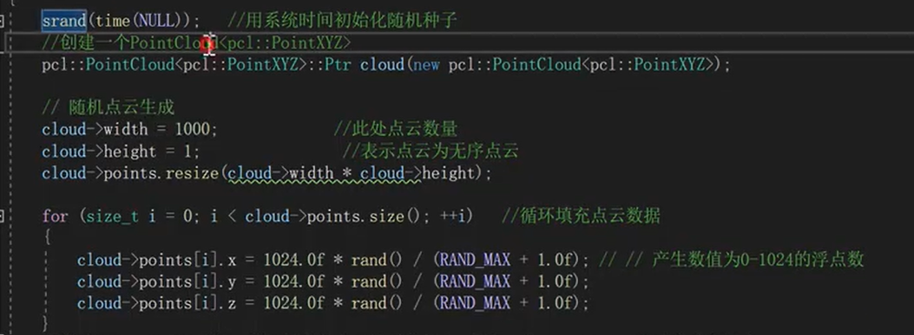
> 创建kdtree对象，并设置搜索点
> 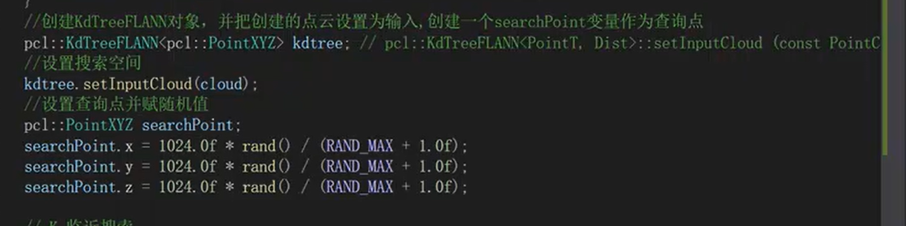
> k近邻搜索
> 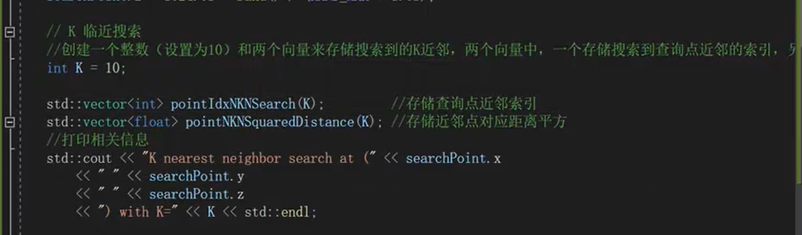
> 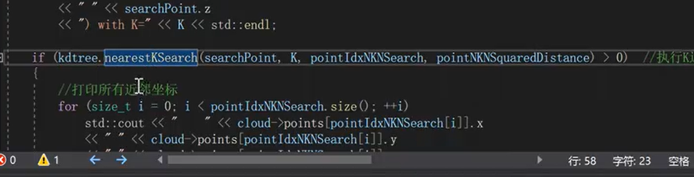
> 结果
> 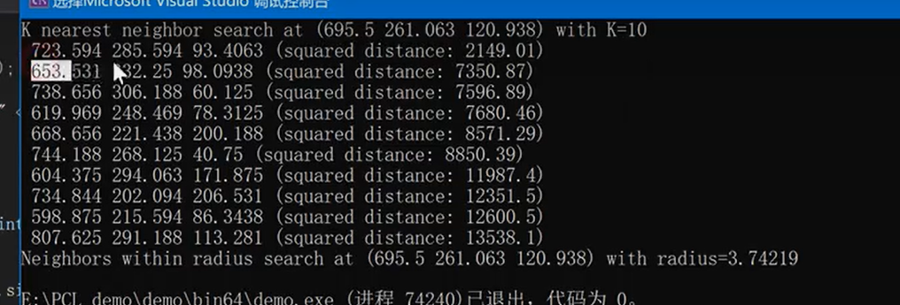
> 半径搜索
> 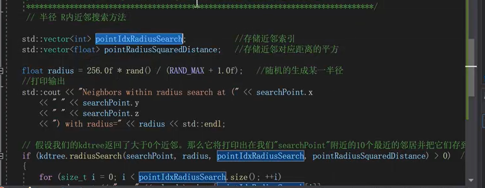