## slam的定义

## slam 分类
>静态地图和动态地图
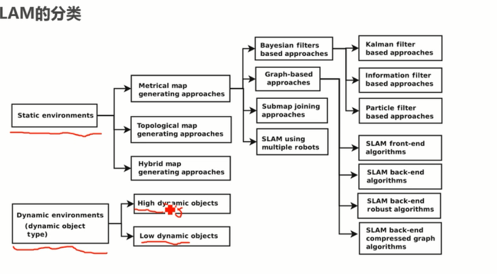
## 图优化
>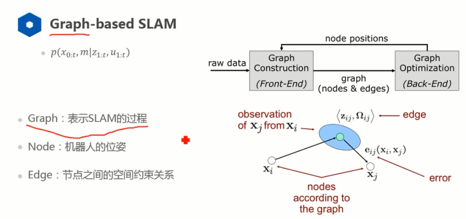
> 图优化结果
> 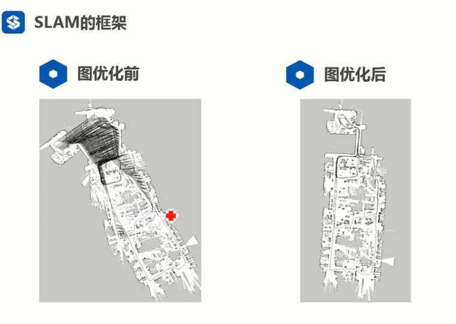
## 滤波方法
>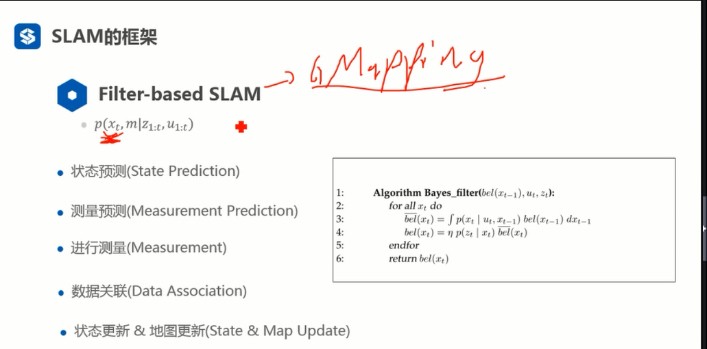
## 激光slam
> 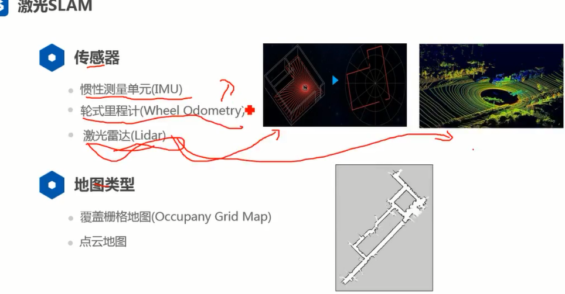
> 对应算法
> 

## 2D激光slam的介绍
>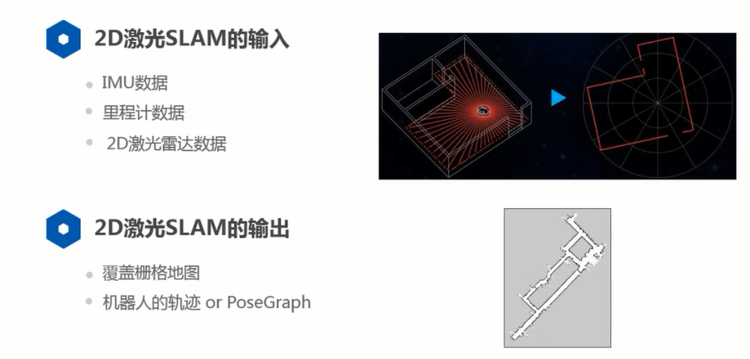
> 帧间匹配和回环检测
> 
> 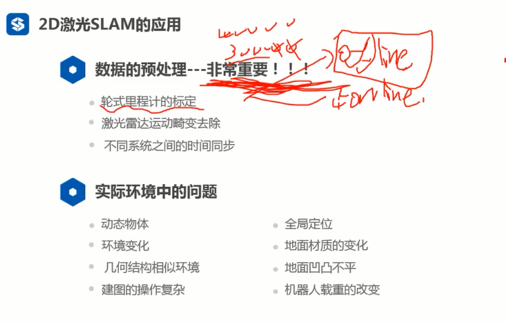
>

## 2D激光slam的趋势 与视觉进行融合
>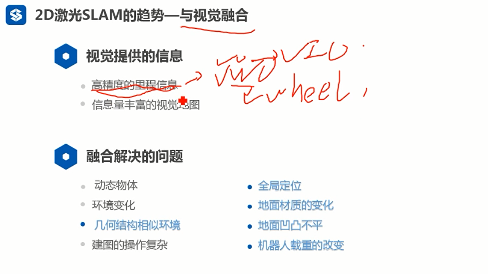

## 3D激光slam
>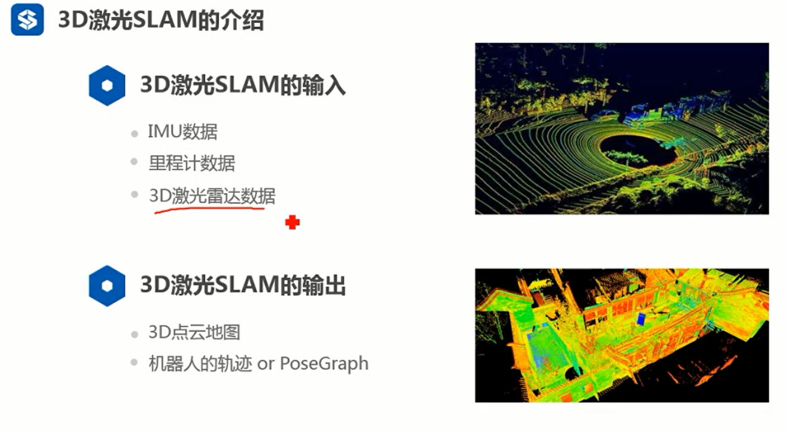
>帧间匹配与回环检测
>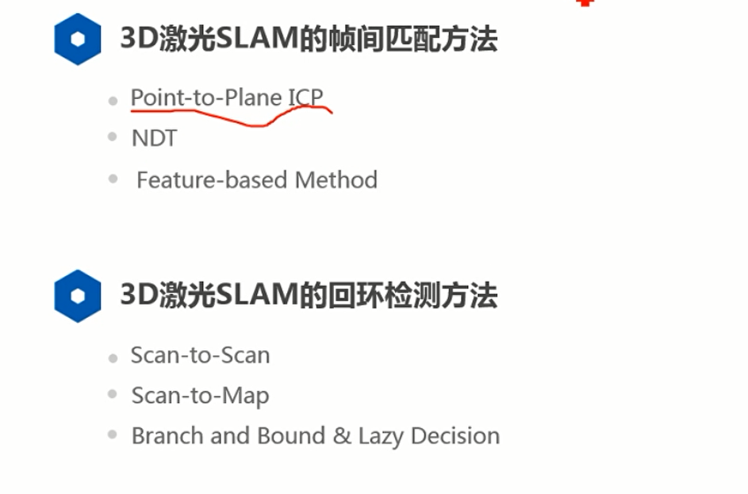
>激光架构
>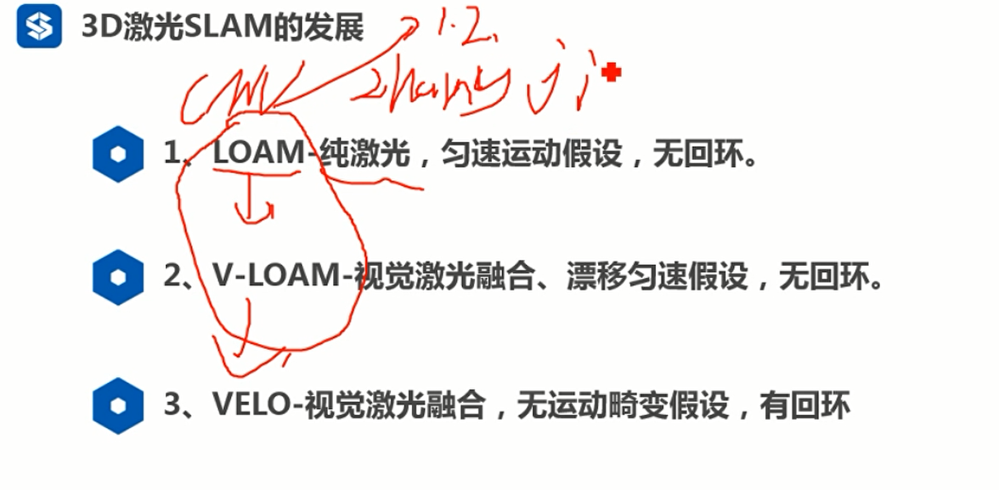
>应用
>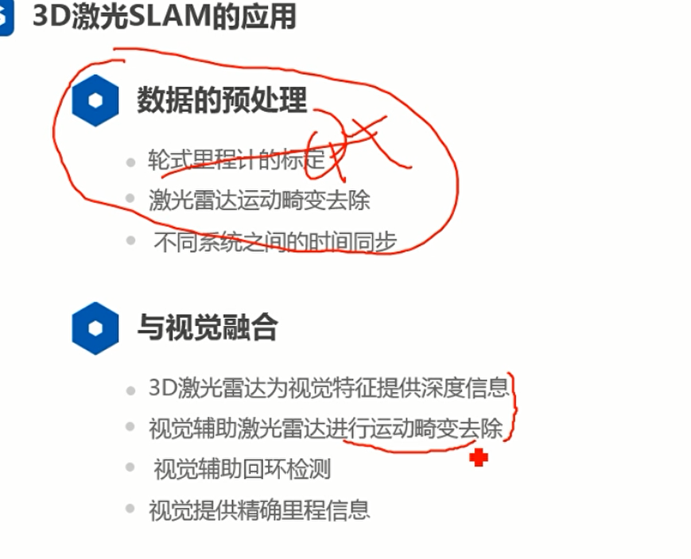
>激光slam的问题
>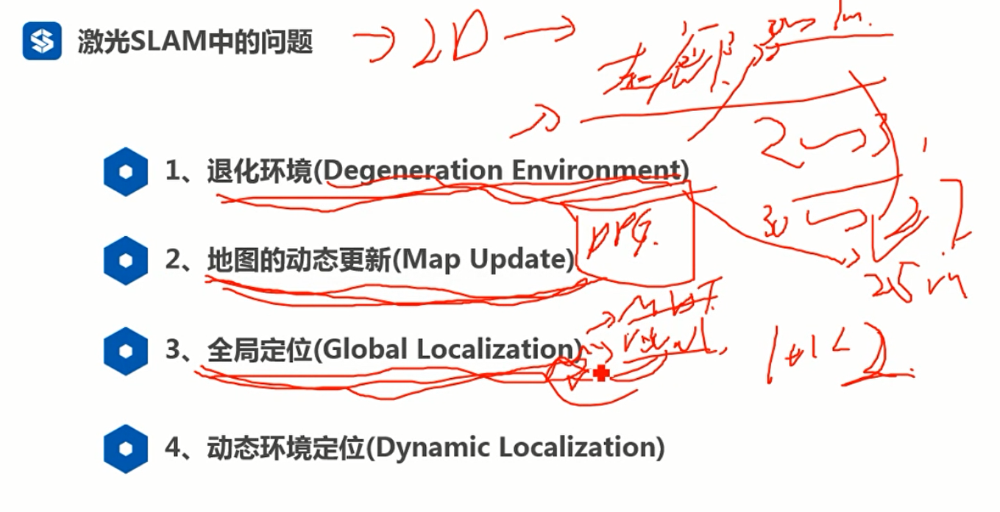