# 02 里程计运动模型与标定
> 课程内容
> 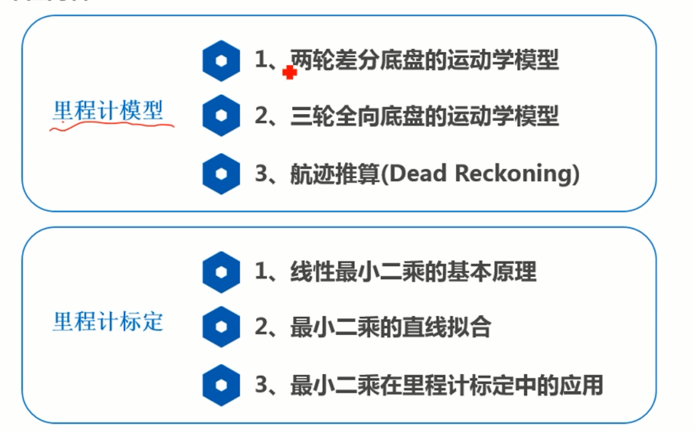

## 二轮差速底盘的运动学模型
>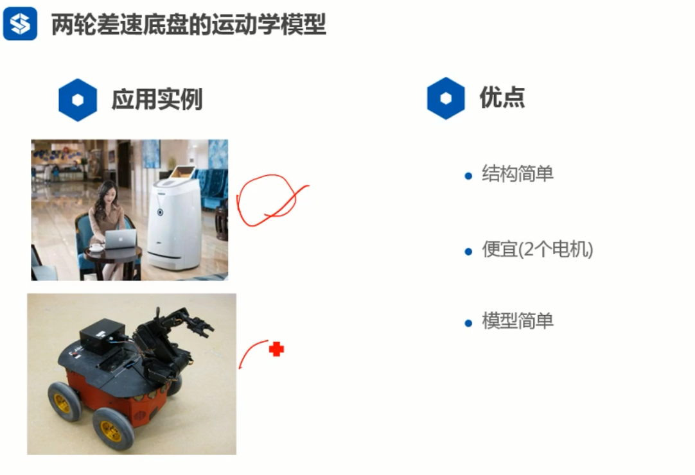
> 一个欠驱动模型，三个自由度，两个输入
> 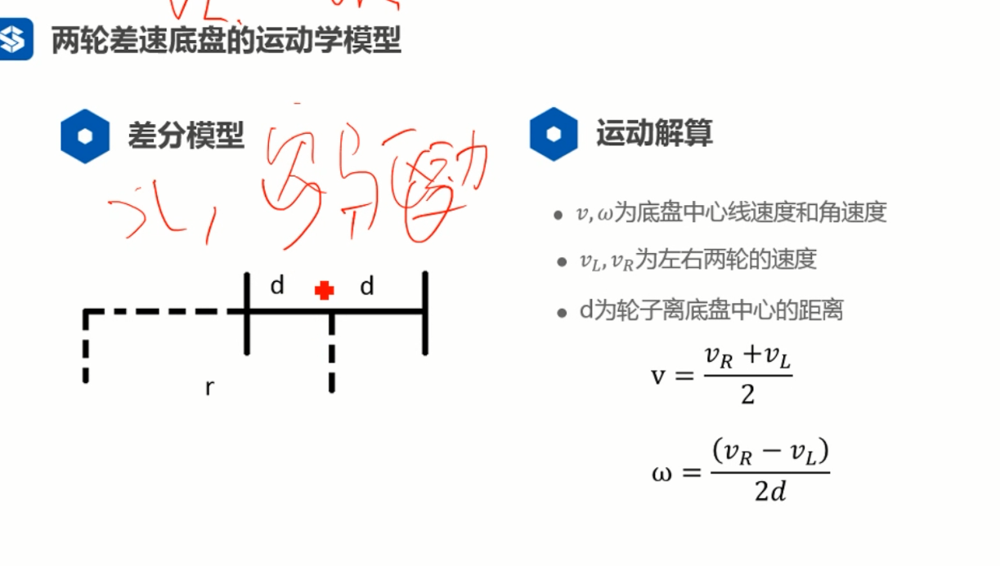
> 利用左右轮角速度相同进行推导
> 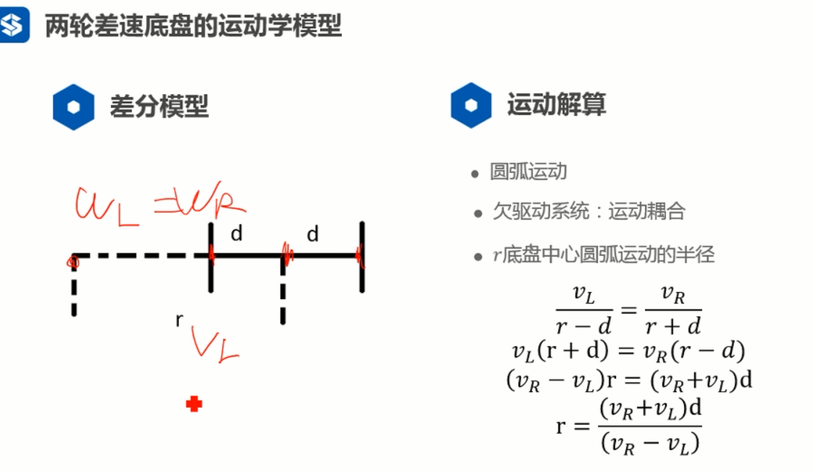
> 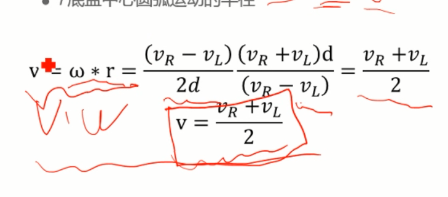

## 三轮全向底盘的运动学模型
>一个全驱动系统
>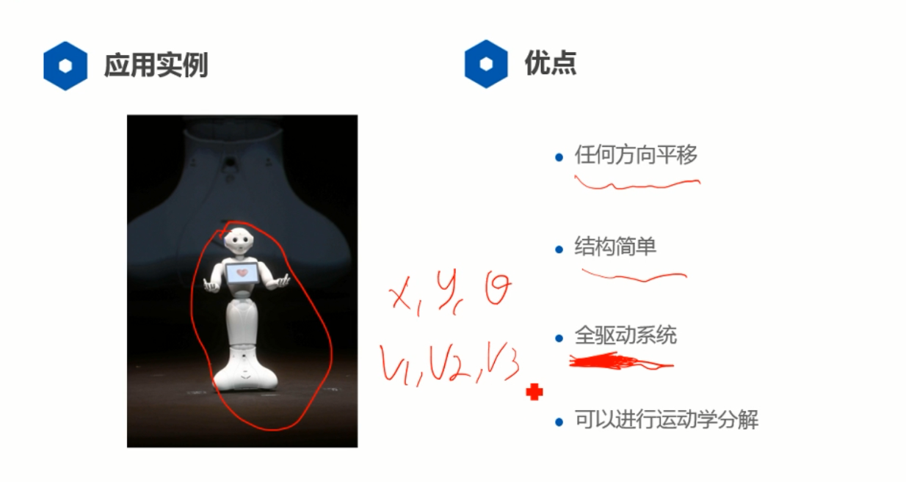
>对运动学x方向分解
>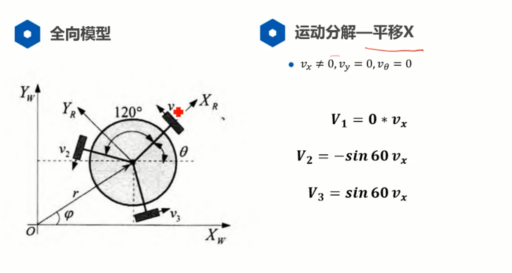
> 对运动学y方向分解
> 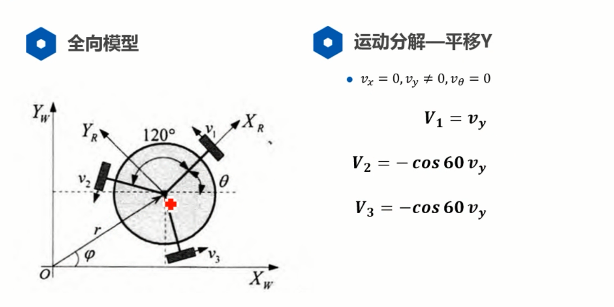
> 运动分解旋转
> 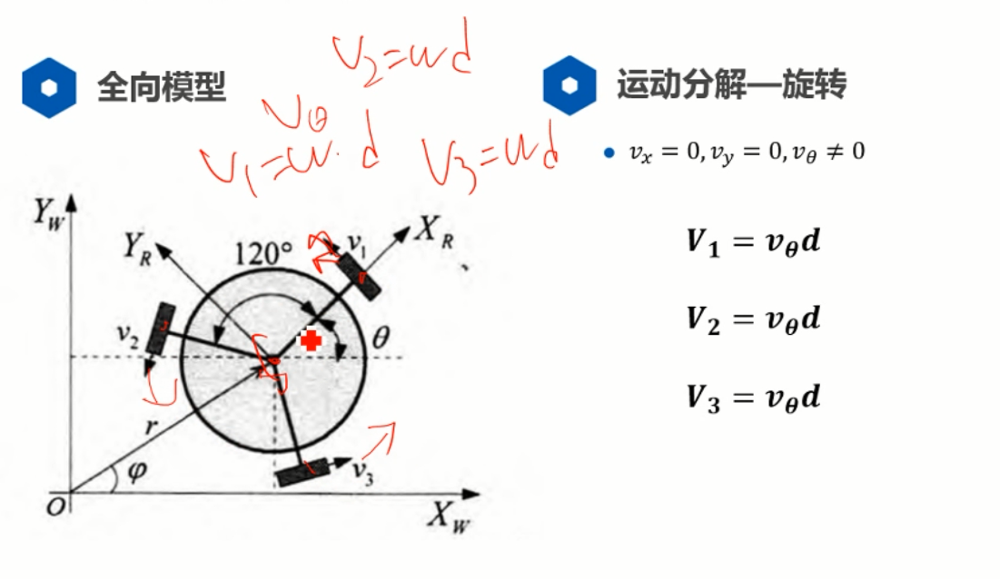
> 三轮全向底盘的运动合成
> 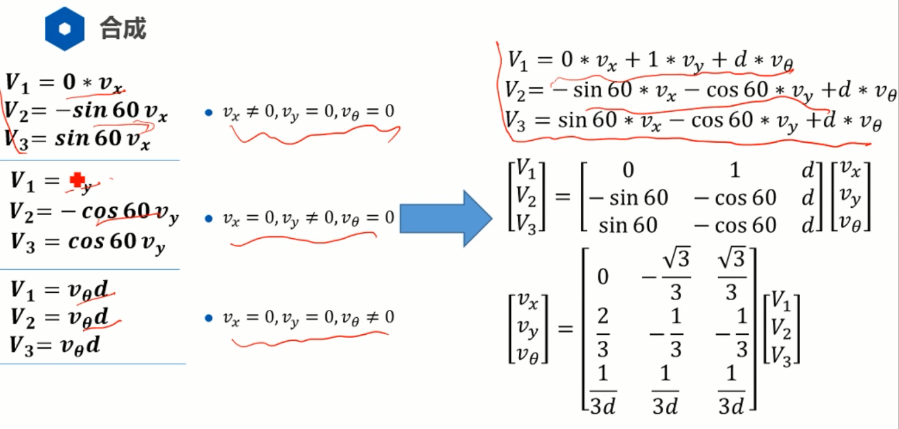

## 航迹推算
> 航迹推算公式
> 系统误差可以去除，随机误差无法去除
> 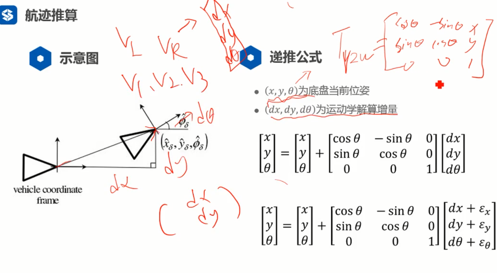

## 里程计标定-最小二乘原理
> 线性最小二乘法原理
> 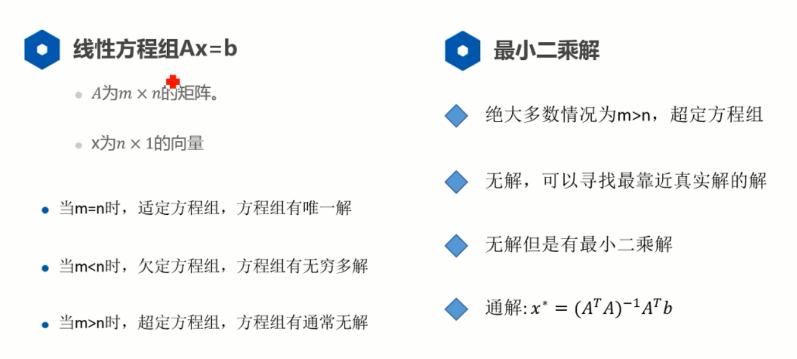
> 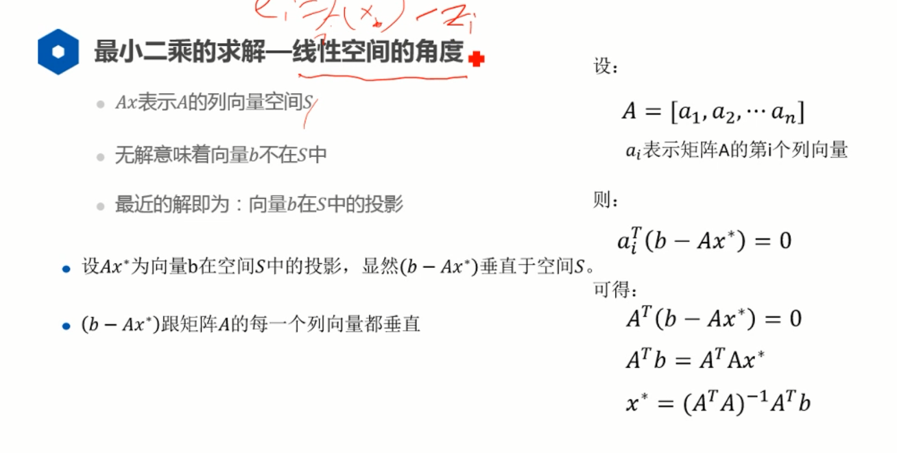

## 线性最小二乘的直线拟合
> 例子
> 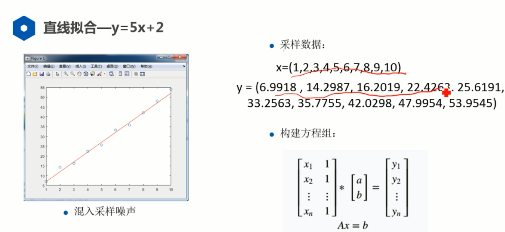
> 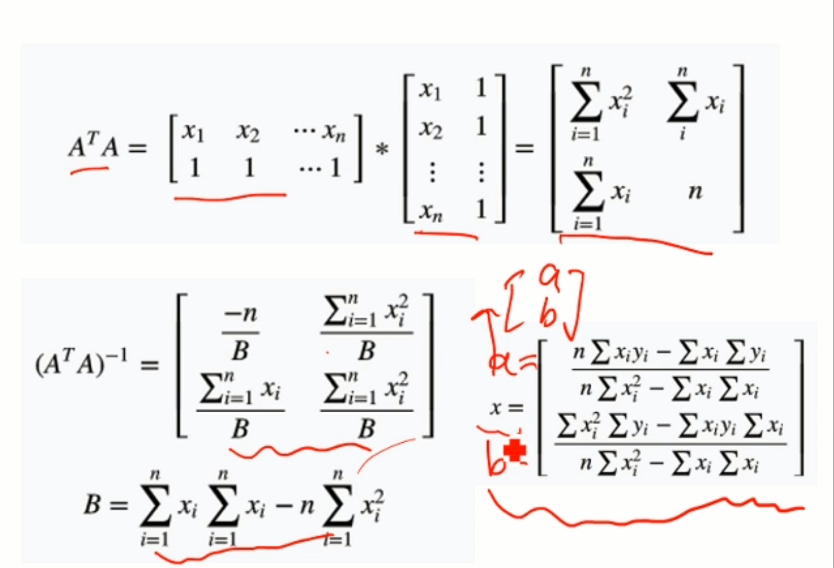
> 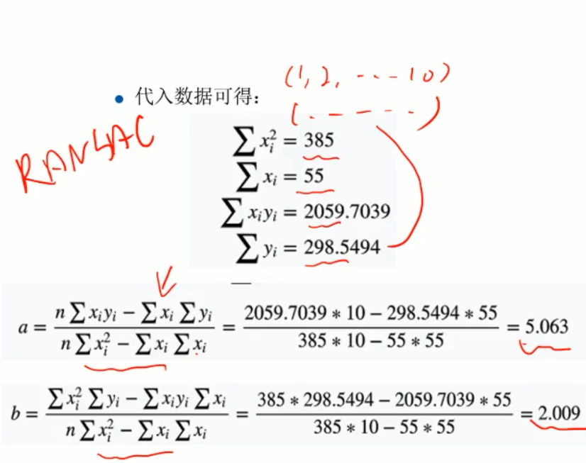

## 里程计标定方法
> 里程计标定方法
> 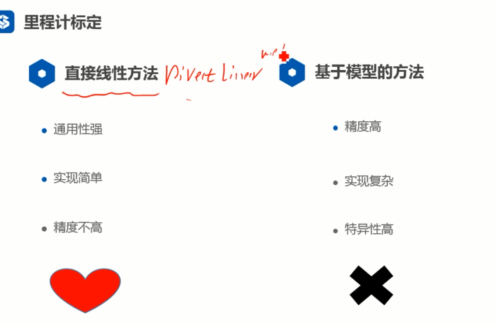
> 直接线性方法
> 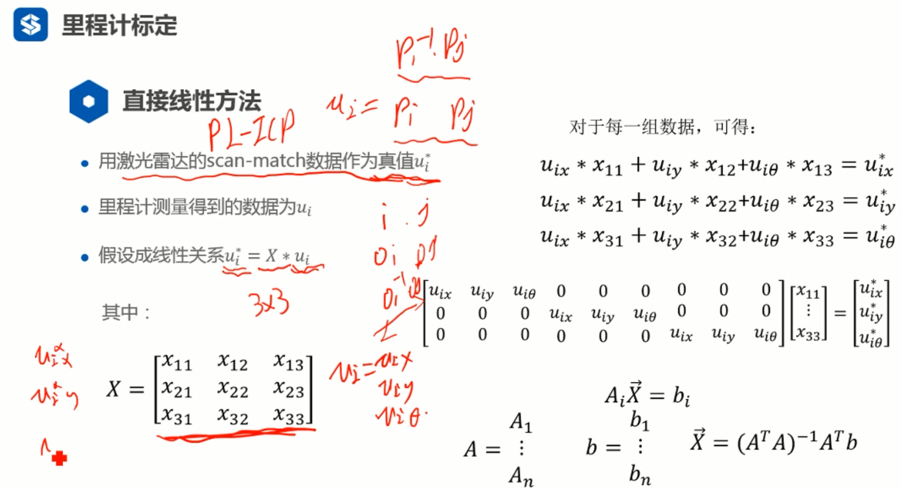
