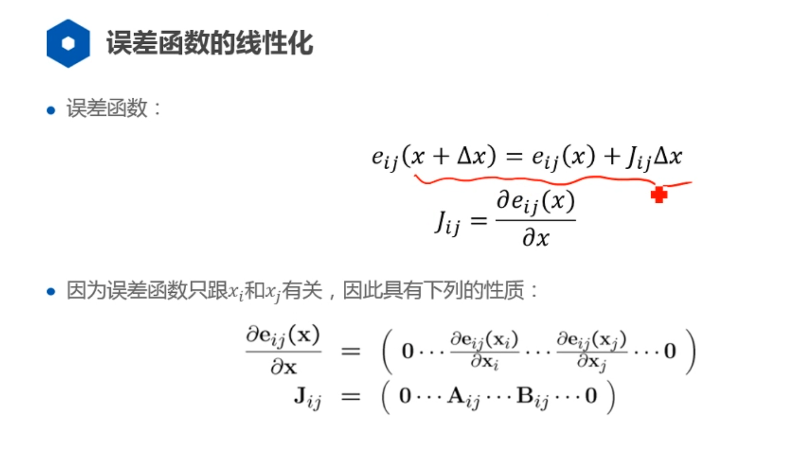

## 基于图优化的slam方法
> 基于滤波器的方法（只是估计当前状态）,只是估计xt
> 基于图优化的方法 (可以优化之前状态),可以估计x0-xt

### 课程内容
> 

### graph-based slam
> 图优化概念
> 

### 非线性最小二乘
> 解决问题
> 
> 
> 带有权重的误差 观测值的可靠性
> 加权最小二乘
> 
> 解决的问题
> 
> 线性化的过程
> 
> 
> 
> 求解
> 
> 流程
> 

### 非线性最小二乘在slam中的应用
> 图的构建
> 
> 误差定义
> 
> 误差函数
> 
> 误差函数线性化
> 
> 稀疏向量
> 
> 
> 固定坐标系 选择第一个位姿为0
> 额外的约束
> 
> 
> 构建线性系统
> 
> 

### cartographer 
> 