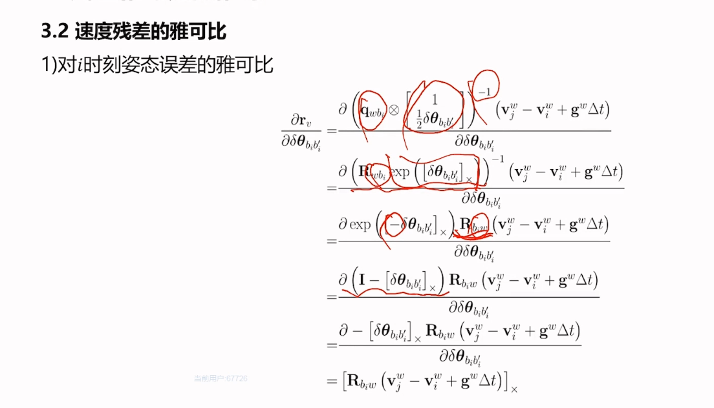

## 09 基于图优化的建图方法
### 目录
> 

### 1 基于预积分的融合方案流程
> 1 优化问题分析
> 
> 2 预积分的作用
> 
> 3 基于预积分的建图流程
> 

### 2 预积分模型设计
> 惯导的微分方程
> 
> 提取变量
> 
> 整理公式 离散形式
> 
> 公式整理
> 
> 但bais是变化的，因此需要带有bais的形式
> 

### 3 预积分在优化中的应用
> 1 使用方法
> 
> 2 残差设计
> 
> 
> 3 残差雅可比的推导
> 
> 
> 
> 
> 速度残差雅可比
> 
> 
> 4 预积分方差计算
> 
> 连续时间下的传递方程
> 
> 离散时间下的传递方程
> 
> 
> 
> 
> 
> 
> 5 预积分更新
> 

### 4 典型方案介绍
> 两个优化过程，激光里程计优化 预积分优化
> 
> lio-sam 介绍
> 

### 5 融合编码器的优化方案
> 整体思路
> 
> 预积分模型设计
> 
> 