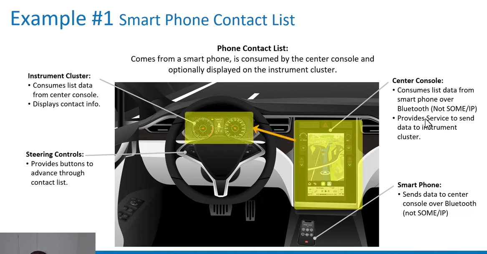

## someip learn
### basics 基础
> autosar not required 
> udp preferred
> 

### motivation
> 订阅或是取消订阅更加方便
> 

### architecture 
> central compute 中央计算 
> 

### example 1 smart phone contact list
> 
> 

### example 2 radar system
> 

### example 3 mirror service 
> 

### 123te