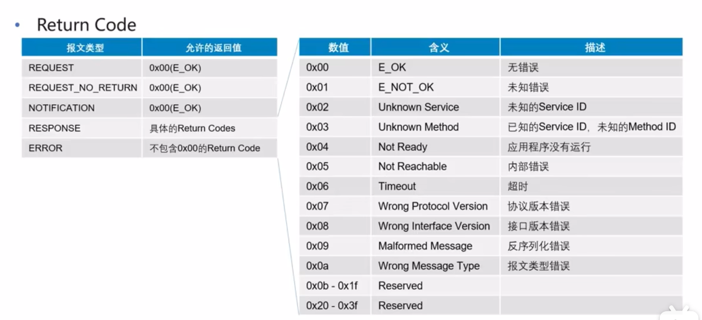

## someip 协议介绍
> 目录
> 
> SOA相关概念 soa与someip
> 
> 
### 1 概述
> 
> 背景
> 
> 
> 
> 
> 功能 序列化 RPC SD 订阅发布 UDP分段
> 
> 服务接口
> method 获取功能 发送请求
> property/field set/get方法操作成员变量
> event 事件 通知
> 
> method RR FF
> Request/Response
> Fire/Forget
> 
> Event 订阅服务 发布服务
> 
> Field(属性、状态)
> 
> 服务接口总结
> 
> 服务接口实例
> 
### 2 some/ip 报文
> 目录
> 
> someip报文格式
> 
> 报头 payload
> 
> 报文唯一标识符
> 
> length范围
> 
> request ID (client id \ session id)
> 
> 
> protocal version 协议版本
> 
> 接口版本 一致性检测
> 
> message type 重点
> 
> return code 
> 
> 

### 3 someip 序列化
> 序列化 反序列化
> 
> 
> 定义传输数据的字节序
> 
> 序列化规则
> 结构体序列化 顺序排布 也可以增加length field
> 
> 字符串序列化
> 
> 动态长度string 在前面加上length
> 
> Array 序列化
> 
> 变长数据序列化
> 
### > someip 报文示例
> 