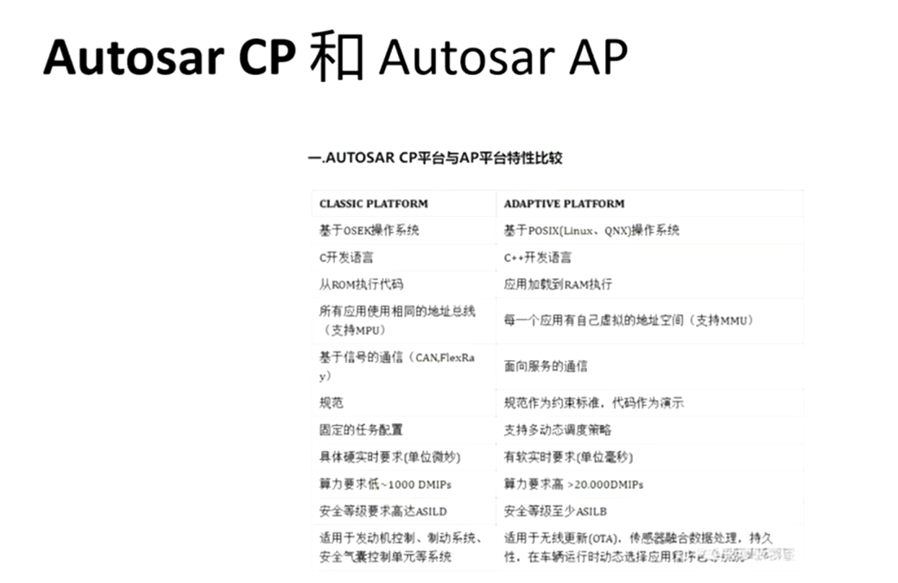
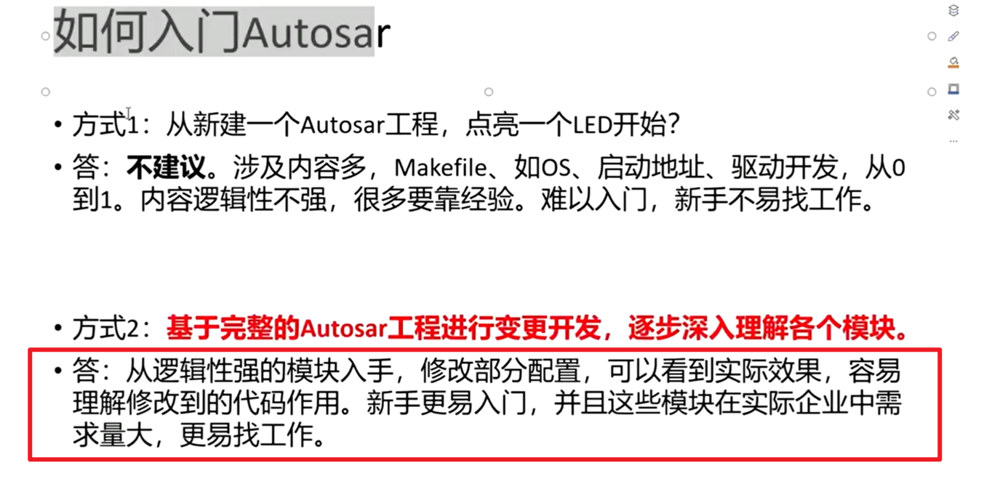

## autosar bsw开发 基础
> ### 01 背景
>目录
>
> autosar概念(软件架构，汽车电子软件开发)
> 
> 
> ap和cp异同点
> 
> 如何入门
> 建议从逻辑性强的模块入手，修改部分配置
> 
> 学习内容
> 
> 软件工具
> 
> 车辆can通信需求
> 
> 大致目录
> 
> 其他问题
> 
> ### 02 基础知识
> c语言要求
> 
> 
> 单片机软件开发
> 
> 英语阅读能力
> 
> can总线基础
> 
> 
> 
> ### 3 初步认识网络管理
> **目录**
> 
> 网络管理，无工作需求时需要进入低功耗模式，同睡，同启
> 实现同起同睡
> 
> 
> 网管报文
> 选择一段范围ID，指定为网管报文
> 
> 主动唤醒
> kl15 点火信号主动唤醒
> 
> 被动唤醒
> 网管唤醒
> 
> **网络管理的类别**
> 直接网络管理（网管报文）：autosar网络管理。
> 间接网络管理（应用报文）:osek间接网络管理
> 
> ### 4 标准文档的使用
> 
> 需求规范
> 
> 通信需求
> 
> davinci的description
> 
> 
> 代码包指导文档