> ## 1 应用报文开发 事件型报文开发
> 常见的报文类型
> 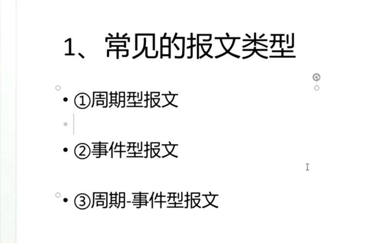
> 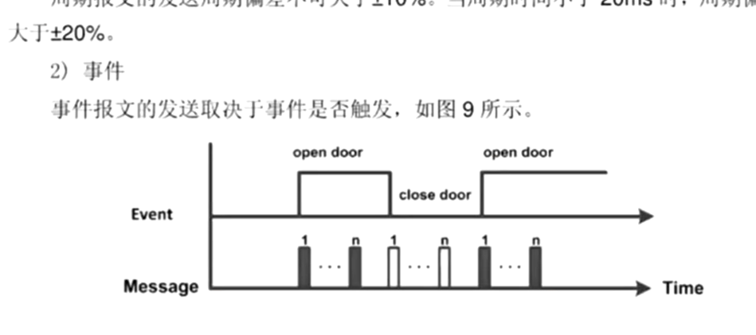
> **需求**
> 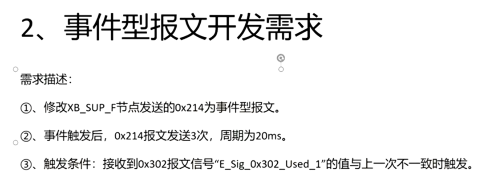
> **配置dbc报文 event 3次**
> 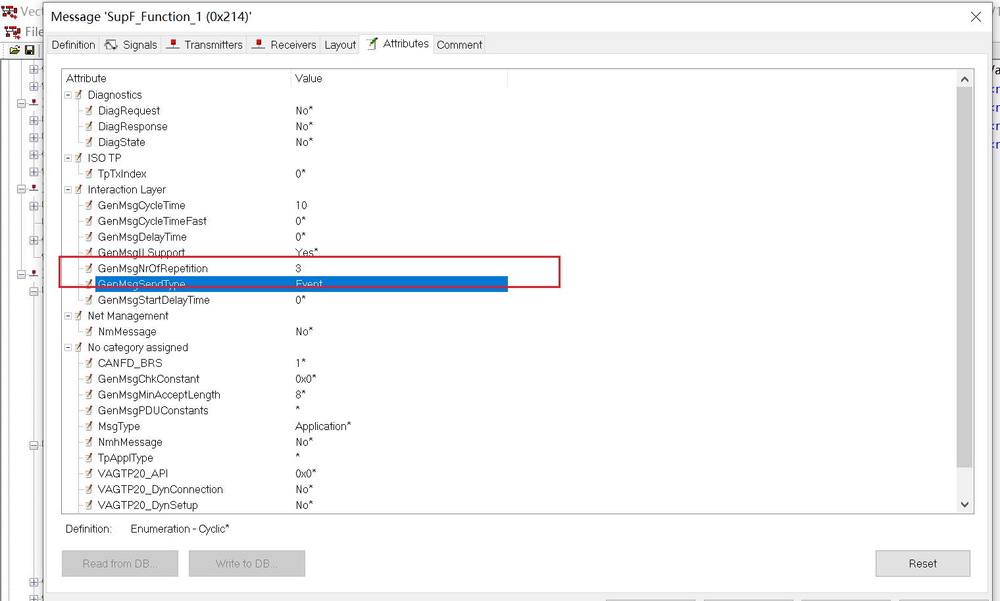
> update后beyond compare
> **比对代码后发现并无实质改变**
> 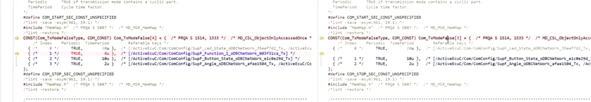
> **只是周期起作用了，但事件没有用**
> 应该配置成direct模式
> 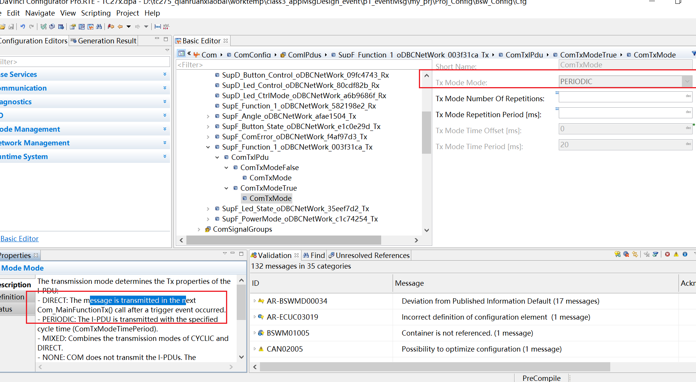
> 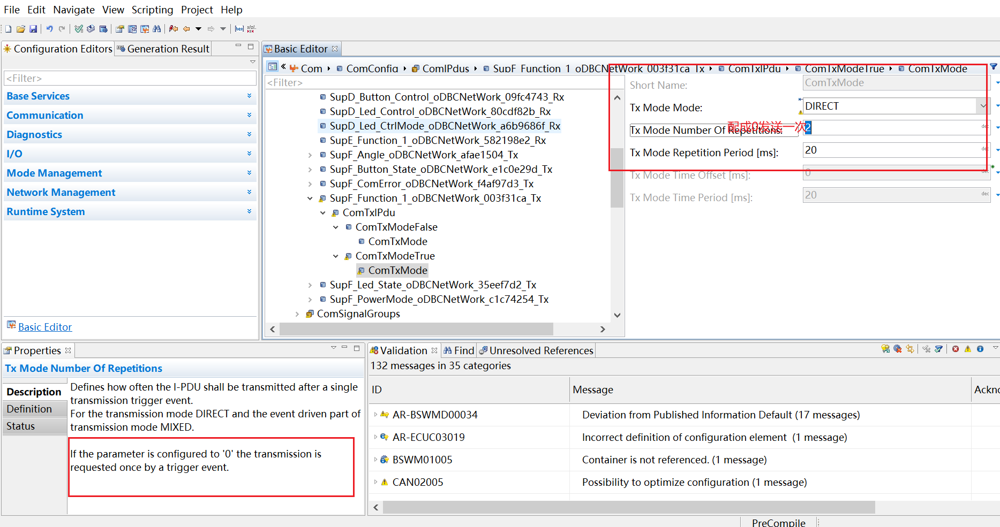
> **txmodefalse和txmodeTrue**
> 查看autosar规范
> comfilter认为是true是调用true
> 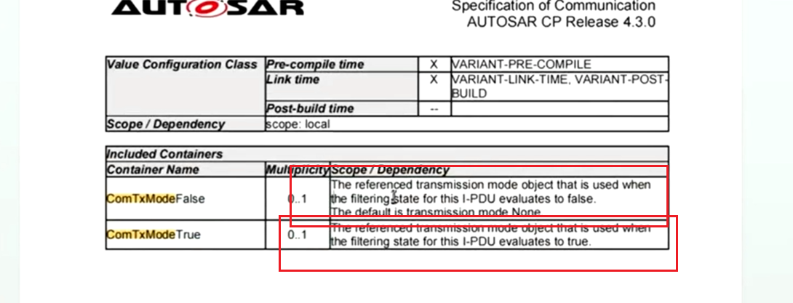
> sip中的文档
> 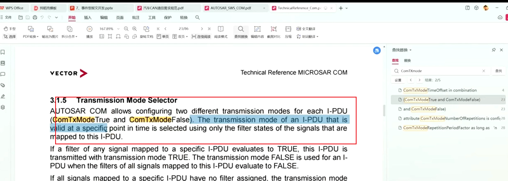
> 
> 有个comfilter
> 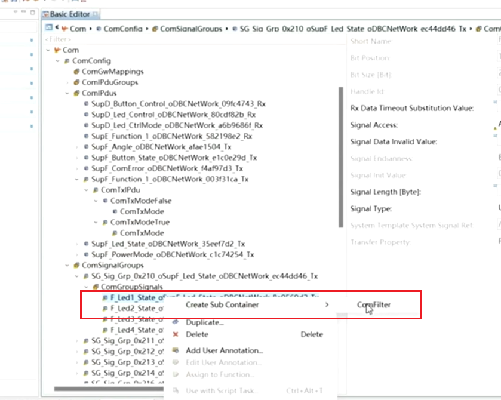
> 一般用的都是txmodeTrue
> **配置触发0x214报文**
> 如果传输模式是dIrect的话，pending不会触发一次传输
> 需要配置成triggered
> 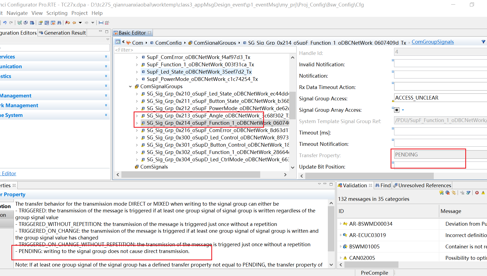
> 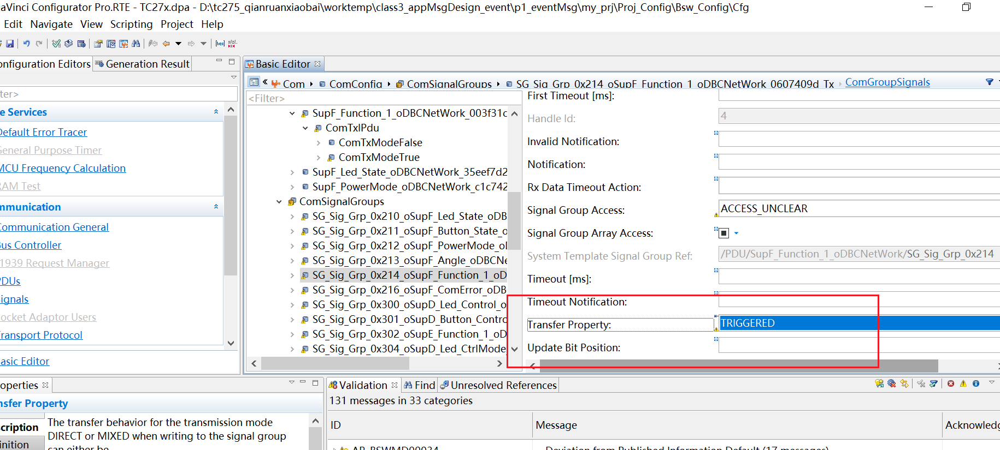
> **实现触发动作**
> 建立一个SR接口，用于两个swc之间传输数据
> 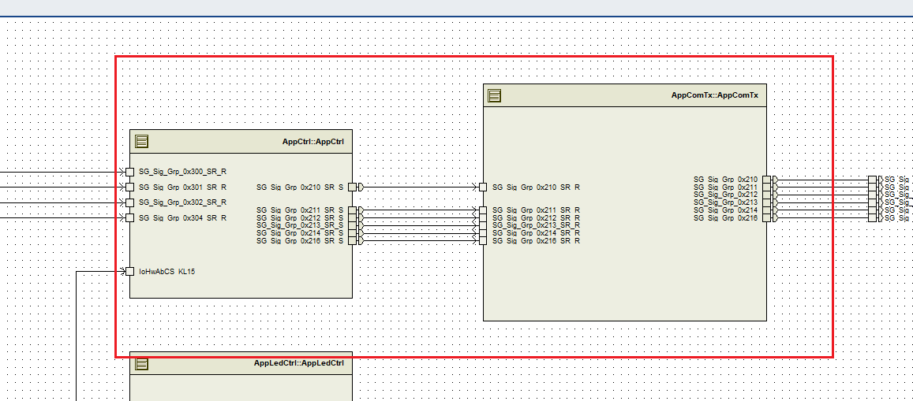
> 建立数据接口
> 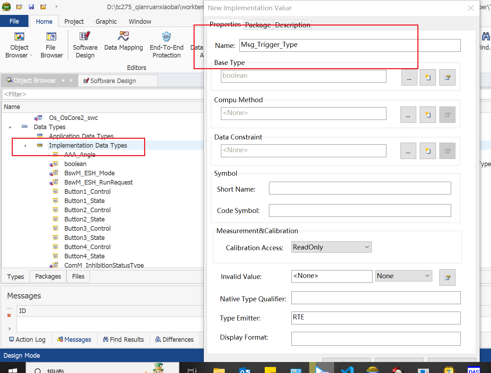
> 建立SR接口
> 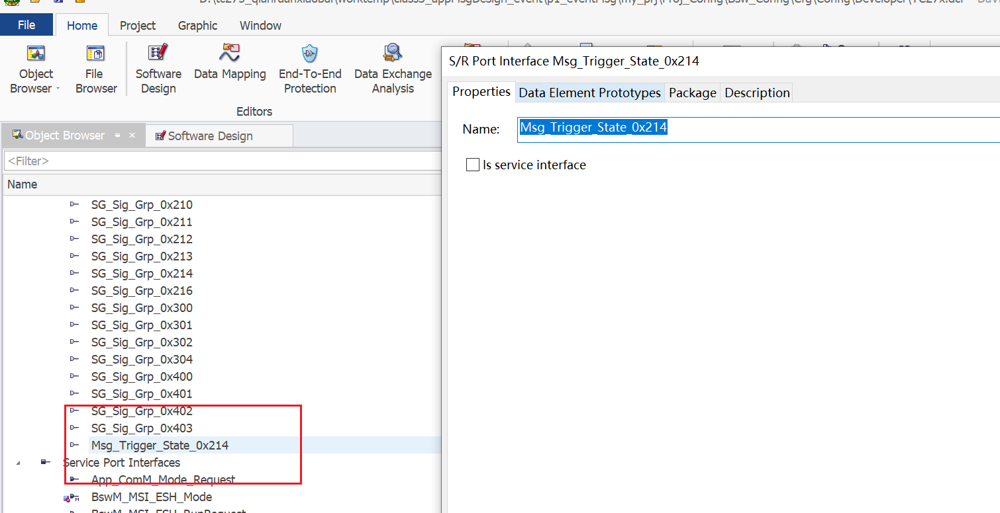
> 定义一个初始值
> 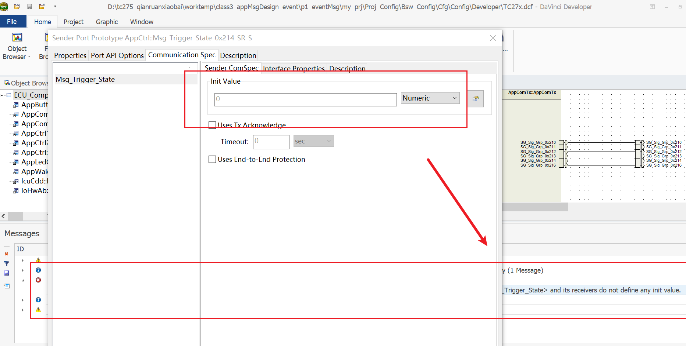
> **swc实现触发逻辑**
> appcomrx 透传
> 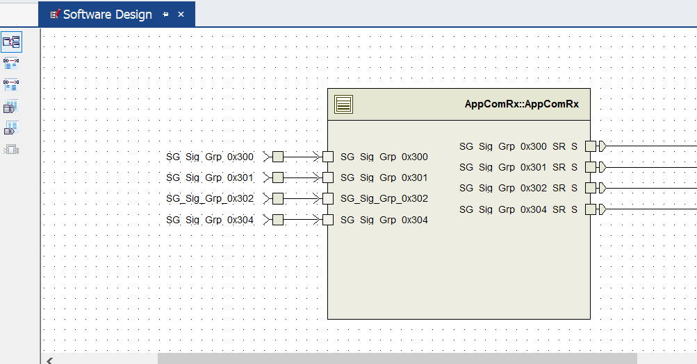
> 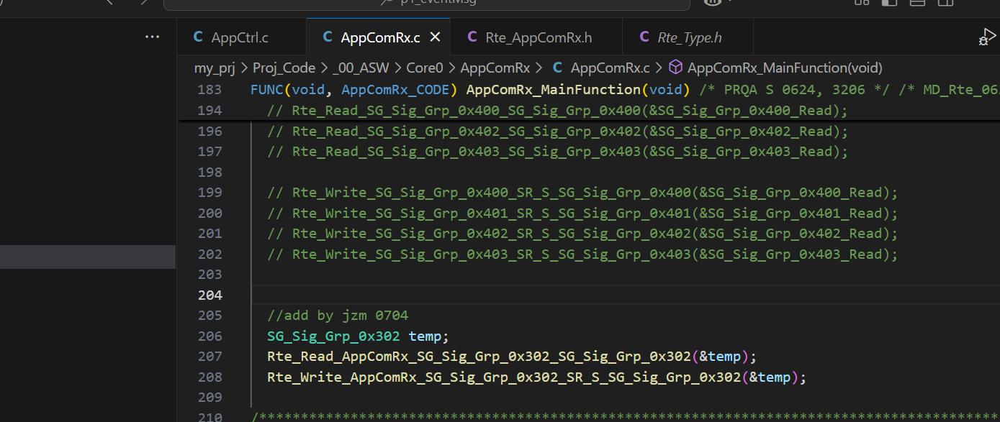
> appctrl 和 appcomtx 实现逻辑判断
> 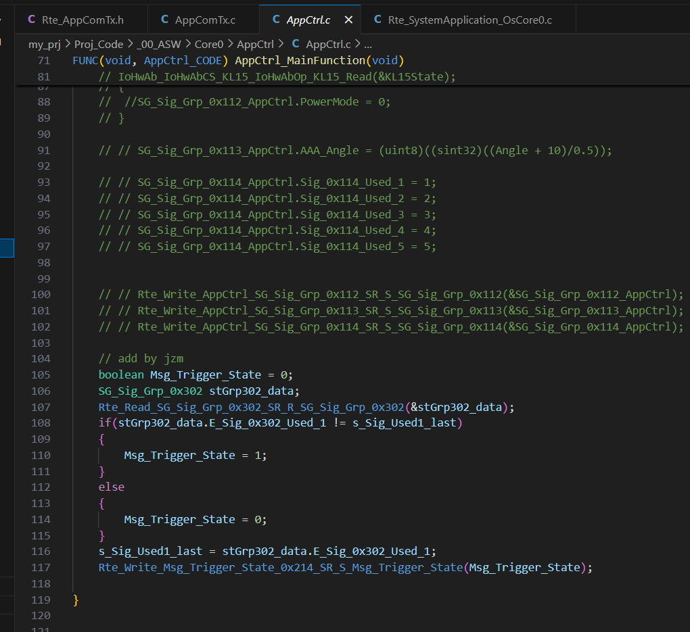
> 