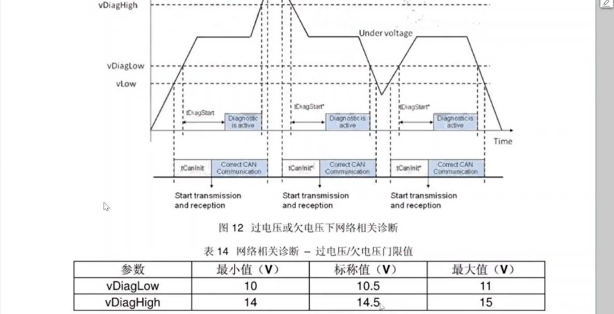
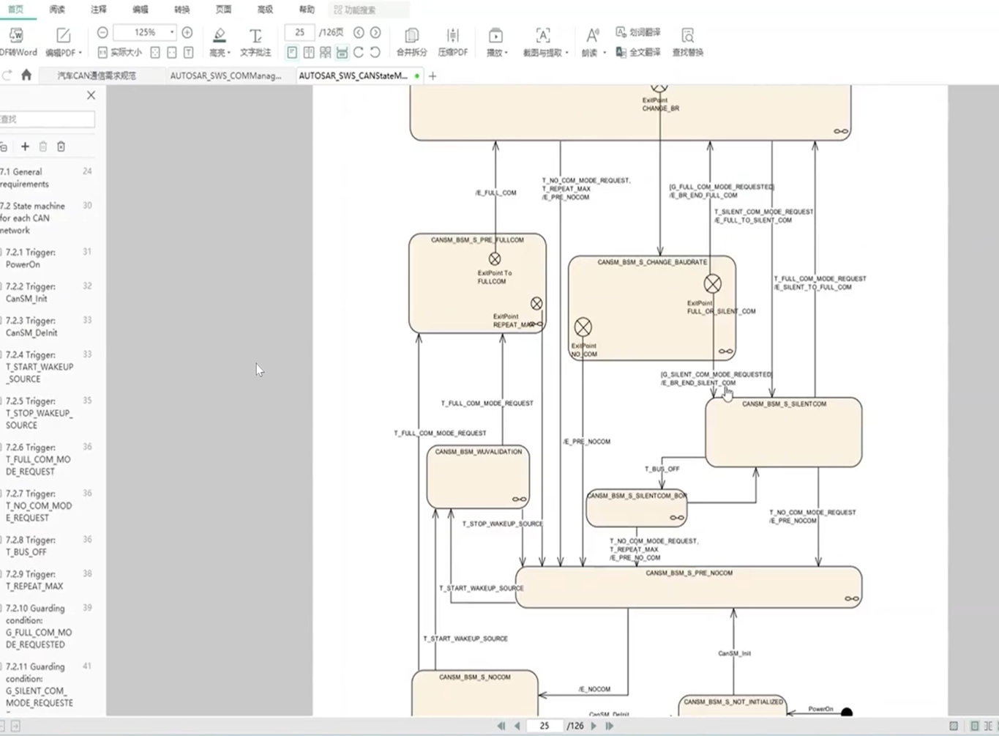

## 报文超时故障开发
> 超时需求
> 
> 故障前置条件
> 
> 网络相关诊断
> 上电1.5s内 ecu禁止网络相关诊断故障
> 
> 
> 故障恢复条件
> 
> 超时故障流程图
> 
> 可以通过工具链配置，也可以通过手写callout的形式配
> ### 配置过程
> 1）在 davinci工具中更新
> 这样就可以在swc中收到是否超时的状态位
> 
> 
> 实现报文超时是在com模块
> 
> 也可以在com模块中手动写timeout的回调
> 
> 配置swc后会自动生成timeout notification
> 
> first timeout配置选项
> 如果不配置，则超时纪录是在收到第一帧报文后记录
> 
> 前置条件配置（在bsw模块中配置）
> 
> **cansm 规范**
> 
> cansm的所有状态
> 
> comm的状态图
> 
> 调用comm_full_communication来打开通信
> 
> comm从no com 到full com 就经过了comsm的处理
> 
> cansm在fullcom下也会有两条路no_com_request和silent com请求
> silent com 类似于 nm中的prepare bus sleep
> 
> 控制的就是ipdu的com ipdu groups
> 
> 因此这个rules就可以类似前置条件
> 
> **超时故障开发**
> 方案就是新建一个signal group，配置rules action，使其满足前置后再enable 这个 signal group
> 一般来说需求容易变，需要应用层新建一个量传过来
>  declare一个变量 初始设置一个fail
> 
> 新建一个服务
> 
> 配置前置条件
> 
> 接口已经建完了，需要再develop中再进行配置
> 首先添加service port
> 
> 状态机条件已发生变化
> 
> 在ecuc中还需要把service port 服务添加 （从代码中看到并没有连接上）
> 
> 
> 
> **swc中实现功能**
> swc中开发功能
> **单超时配置**
> 
> 
> 超时故障的全局变量
> 
> **增加kl15为on后的前置条件**
> 首先分开不同的pdu group
> 
> ipdu选择 ipdu group
> 
> 在原有的规则中加入新建的group
> 
> 新建一条rule
> 注意rule init 一般为false,变为true时会触发true的action
> 
> action配置的时候有trigger选项和condition选项
> 属于触发执行或是持续执行
> 
> 新建epression
> 
> 新建action (enable disable掉之前配置的信号组)
> 
> 
> 新建actionlist
> 
> 基于新的actionlist配置rule
> 
> **后续部分与前半部分相同，配置service**
> 新建mode declare group和service
> 
> 
> swc中添加接口
> 
> 加入access point
> 
> bsw connect
> 
> 编写应用代码
> 
> ### 3 超时故障的上报
> 应用层使用超时故障
> 
> 通过dtc上报超时故障
> 新建的dtc故障
> 
> cdd文件中的c001001对应配置项中的401001
> c就代表了40
> 映射关系与dtc码的格式相关
> 
> 
> **最简单的方法直接代码中调用setEventStatus**
> 
> **另一种方法需要配置接口到swc层，通过RTE接口调用**
> 配置成应用层配置dtc 
> 
> develop中
> service中选择diagnosticMonitor
> 具体的可调用api getDTCofEvent setEventState..
> 
> 
> service连接到底层bsw层
> 
> 
> 
> swc中配置故障上报
> 