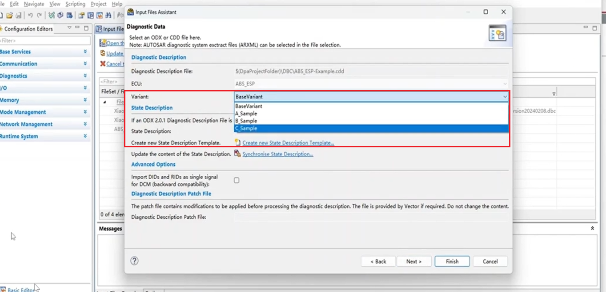

## UDS开发1419服务
> ### 19服务
> **具体目录**
> 
> ### 1 简单认识诊断cdd文件
> **ECU infomation**
> 物理请求，诊断id（已经在dbc中配置）
> cdd文件主要影响dcm和dem模块，因此id配错了也ok
> 
> 
> 一些tp层的参数
> 
> **fault memory**
> 主要是故障相关，针对19服务
> 故障快照，扩展服务，dtc码
> 
> **DID overview**
> did 22 21服务相关
> 
> **base variant 和 variants**
> 标签一样，variants分为a,b,c样
> 一个cdd文件包括了一辆车不同阶段的诊断文件
> 
> supported diagnostic classes
> 支持的诊断服务
> 
> 采用哪个是在configure中配置
> 
> **子服务**
> 子服务菜单
> 
> **data type**
> 主要应用于 22 21 服务和故障快照
> 
> **NRC 否定响应**
> 
> ### 2 fault memory开发
> 配置19服务主要是这两个地方
> 
> **DTC格式**
> 标准规范（主要应用3个字节的码）
> 
> 3个字节的dtc码也有两种形式 （都是同一个意思）
> 
> 转换关系 c02288->U002288
> 
> **19子服务**
> cdd文件中对应的子服务
> 
> 
> 02子服务 根据dtc状态掩码返回dtc
> 
> 0A子服务 返回全部dtc
> 
> 0406子服务 记录扩展数据，记录故障快照
> 
> **DTC状态位定义**
> 具体的状态位定义，一版用的是bit0 和bit 3
> 
> 不同位 都有testfail和pass
> 
> 
> cdd文件中配置的支持的DTC mask
> 
> bsw中对应的配置项
> 
> **14服务 清除DTC**
> 请求报文 14 ff ff ff
> 
> 后面的三个字节是DTCgroup
> 分成很多group 类似车身域，底盘域...
> 三个ff是所有的dtc组 
> 
> 肯定响应 返回0x54
> 
> **DEM模块 diagnostic event manager**
> DEM:诊断故障事件管理 （只是与故障相关 19服务）
> 
> dem模块下的did，不是22 21服务下的did，只是用于扩展数据的did
> 
> **DEM与DTC的关系**
> 相关配置项与相关接口
> 一个DTC事件索引了这个dtc class
> 
> 
>  一个dtc可以被多个事件使用，置位，但也一般不使用
> 
> 
> **operation cycle**
> 当setEvent时，一定是要在cycle state start与end之间，在cycle范围内 
> 
> 该事件设置的是power cycle，可以设置成很多不同的cycle
> 
> **模拟需求**
> DTC开发
> 
> fault memory这里很多的DTC,相当于DTC总表
> 
> base variant 下的诊断表格是项目使用的DTC table
> 
> ### 3 DTC 底软开发过程
> **修改cdd表格**
> 首先将DTC表格export出来，添加信号后再import
> 
> 导出excel如下
> 
> 新增excel dtc行
> 
> imPort excel
> 
> 
> 已在总表中创建索引，在base variants中添加索引
> 
> bsw中查看新增的DTC class和dtc event
> 
> 
> 对应的扩展数据和快照
> 
> **常见配置项**
> 
> **event kind**
> 配置成swc中，会增加一个RTE服务接口service到developer中
> 
> 配置成event，则可以直接调用setEventStatus接口
> 
> 可以选择bsw和swc
> 
> 2287dtc配置成swc,2288dtc配置成bsw
> **置dtc方法**
> software components中会多出2287的set event方法
> 
> 
> **develop中配置2287的接口**
> 在service ports中新建diagmonitor接口 invoke
> 
> 
> invoke接口和read write接口（cs与sr的区别）
> 
> 在mainfunc中调用服务接口set_dtcstatus
> 
> **底层索引上develop的service**
> 
> **swc中查看接口**
> 新增的两个DTC
> 
> 新增的RTE call service
> 
> ### 4 swc 应用开发过程
> 需求
> 
> 过压故障(rte 接口)
> 
> 欠压故障 dem_setEvent
> 