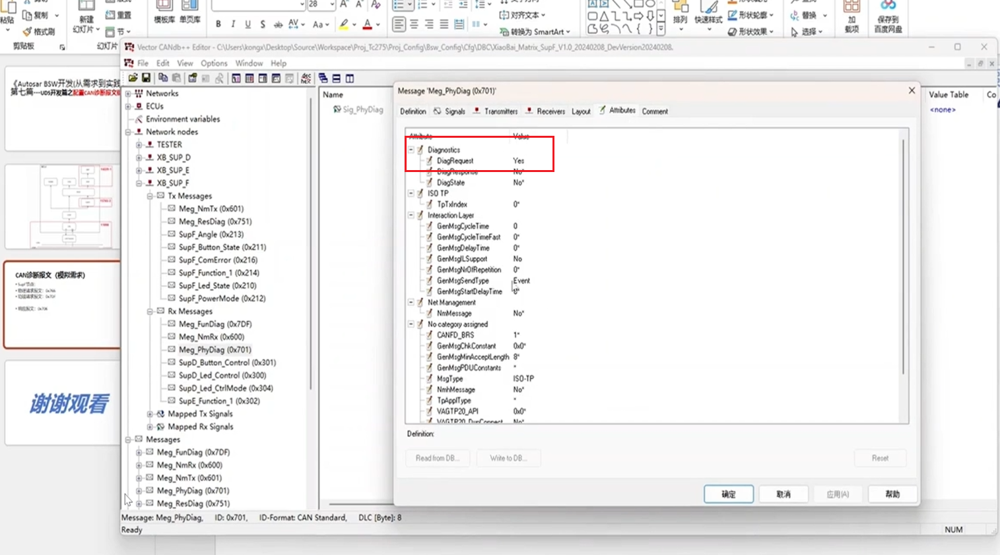

## BSW开发基础
### 1 基础
> 目录
> 
> 基本概念，university diagnostics system
> 
> 
> 诊断报文 （物理请求报文、功能请求报文、响应报文）
> 功能请求报文不支持多帧、NRC11\12\31\73\7F不反馈
> 
> 
> 
> UDS on Can(也可以用于以太网和lin)
> 
> 
> 
> UDS服务
> 
> UDS需求
> 需要车企提供，有很多定制化需求（比如车速<10km，才能reset）
> 
> 
> ### 2 配置CAN诊断报文链路
> 需求
> 
> 首先更新dbc，注意属性 diagRequest 物理诊断报文
> ISO-TP对应15765
> 
> 
> 先配置can canif
> 
> CANTP 参数配置（偏大无影响，偏小容易超时）
> 
> **配置链路注意点**
> CANIF indication UL->CANTP
> 
> 
> 对于周期应用报文，下一个周期会继续发送报文，与当前发送是否成功无关，因此不需要 TX Confirm
> 
> 对于诊断报文，涉及到多帧传输，需要诊断报文TxConfirm获取发送状态
> 
> 对于事件型报文，也需要Tx confirm
> 
> DCMdslbuffer（dem处理好后，填到dcm中），通过dcm发送出去
> 
> 